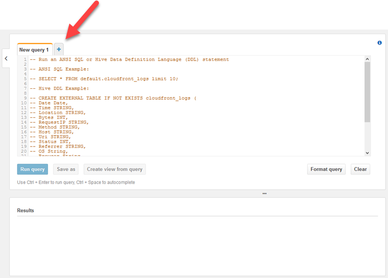
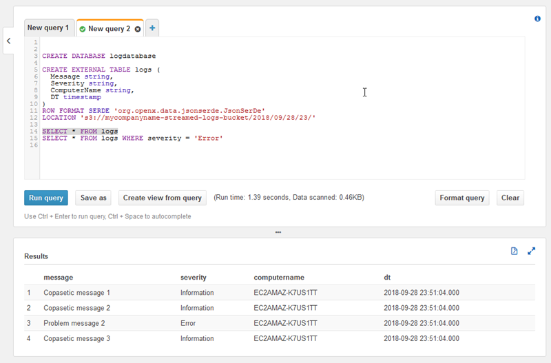
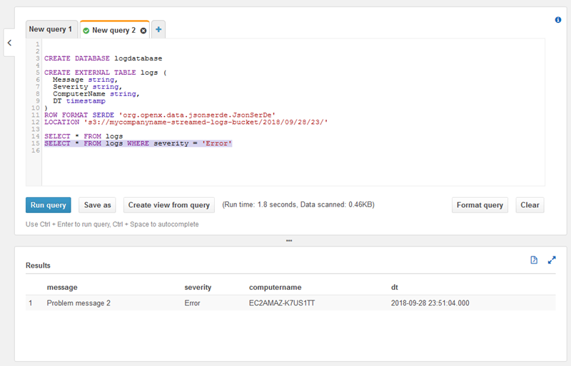

# Step 3: Query the Log Data in Amazon S3

In the final step of this Amazon Kinesis Agent for Microsoft Windows [tutorial](directory-source-to-s3-tutorial.md "directory-source-to-s3-tutorial.md"), you use Amazon Athena to query the log data stored in Amazon Simple Storage Service (Amazon S3).

1. Open the Athena console at
   [https://console.aws.amazon.com/athena/](https://console.aws.amazon.com/athena/home "https://console.aws.amazon.com/athena/home").
2. Choose the plus sign (**+**) in the Athena query window to create a new
   query window.

 3. Enter the following text into the query window:

```
CREATE DATABASE logdatabase

CREATE EXTERNAL TABLE logs (
  Message string,
  Severity string,
  ComputerName string,
  DT timestamp
)
ROW FORMAT SERDE 'org.openx.data.jsonserde.JsonSerDe'
LOCATION 's3://*bucket*/*year*/*month*/*day*/*hour*/'

SELECT * FROM logs
SELECT * FROM logs WHERE severity = 'Error'
```

Replace `bucket` with the name of the bucket that
you created in [Create the Amazon S3 Bucket](kaw-ds2s3-tutorial-step1.md#kaw-ds2s3-tutorial-step1.2 "kaw-ds2s3-tutorial-step1.md#kaw-ds2s3-tutorial-step1.2"). Replace
`year`,
`month`,
`day` and
`hour` with the year, month, day, and hour when
the Amazon S3 log file was created in UTC. 4. Select the text for the `CREATE DATABASE` statement, and then choose
**Run query**. This creates the log database in Athena. 5. Select the text for the `CREATE EXTERNAL TABLE` statement, and then choose
**Run query**. This creates an Athena table that references the S3 bucket with
the log data, mapping the schema for the JSON to the schema for the Athena table. 6. Select the text for the first `SELECT` statement, and then choose **Run
query**. This displays all the rows in the table.

 7. Select the text for the second `SELECT` statement, and then choose
**Run query**. This displays only the rows in the table that represent
log records with an `Error`-level severity. This kind of query finds
interesting log records from a potentially large set of log records.


