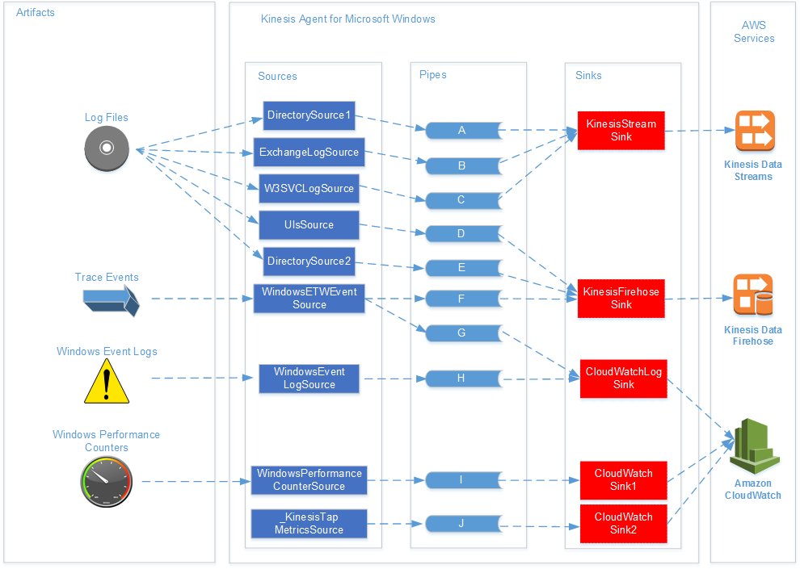

# Amazon Kinesis Agent for Microsoft Windows Concepts

Understanding the key concepts of Amazon Kinesis Agent for Microsoft Windows (Kinesis Agent for Windows) can make it easier for you to collect and
stream data on desktop and server fleets to the remainder of the data pipeline for
processing.

This diagram of a data pipeline illustrates the following components and processes:

Servers and desktops have artifacts like log files, events, and metrics that are gathered by
one or more Kinesis Agent for Windows _sources_. The data can be optionally
transformed from, for example, a flat file text format to an object.

The data (in either object or text form) can then flow into one or more Kinesis Agent for Windows _pipes_. A pipe connects one source to one Kinesis Agent for Windows _sink_. The pipe can optionally filter out unnecessary data.

A sink can optionally transform data parsed into objects into JSON or XML. The sink sends the
data to a specific AWS service, such as Kinesis Data Streams, Firehose, or Amazon CloudWatch.

Using multiple pipes, a single source can send the same data to multiple sinks (for example,
see pipes **F** and **G** in the
diagram). Using multiple pipes, different sources can stream data to a single sink (for example,
see pipes **A**, **B**, and **C** in the diagram). It is also possible to use multiple pipes to stream
data from multiple sinks to multiple sources. Sources, sinks, and pipes have types, and there can
be more than one source, sink, or pipe of the same type.

For examples of configuration files that declare sources, sinks, and pipes, see [Kinesis Agent for Windows Configuration Examples](configuring-kaw-examples.md "configuring-kaw-examples.md").

###### Topics

- [Data Pipelines](#data-pipeline-concept "#data-pipeline-concept")
- [Sources](#source-concept "#source-concept")
- [Sinks](#sink-concept "#sink-concept")
- [Pipes](#pipe-concept "#pipe-concept")

## Data Pipelines

A _data pipeline_ is used to gather, process, visualize, and possibly
generate alarms for applications and services. Kinesis Agent for Windows fits into data pipelines at the
start—where logs, events, and metrics are gathered from fleets of desktop computers or
servers. Kinesis Agent for Windows streams the collected data to the various AWS services that form the rest of the
data pipeline. A data pipeline has a purpose, such as visualizing the health of a particular
service in real time to help engineers more effectively operate that service. A service health
data pipeline can do any of the following:

- Alert engineers to problems before those problems affect the experience for customers of
  the services.
- Help engineers efficiently manage the cost of the service by showing resource usage
  trends. These trends enable them to adjust resource levels appropriately, or even implement
  automatic scaling scenarios.
- Provide insight into the root cause of problems that are reported by customers of the
  service. This speeds up the resolution of those problems and reduces support costs.

For a step-by-step example of constructing a data pipeline using Kinesis Agent for Windows, see [Tutorial: Stream JSON Log Files to Amazon S3 Using
Kinesis Agent for Windows](directory-source-to-s3-tutorial.md "directory-source-to-s3-tutorial.md").

## Sources

A Kinesis Agent for Windows _source_ gathers logs, events, or metrics. A source gathers a
particular kind of data from a particular producer of that data based on the type of the source.
For example, the `DirectorySource` type gathers log files from particular directories
in the file system. If the data isn't already structured (as with some kinds of log files), a
source can be useful in parsing the textual representation into some structured form. Each source
corresponds to a particular _source declaration_ in the Kinesis Agent for Windows
`appsettings.json` configuration file. The source declaration provides
essential details for configuring the source to tailor the source based on the specific data
gathering requirements. The kinds of details that can be configured vary by source type. For
example, the `DirectorySource` source type requires specification of the directory
where the log files reside.

For more details about source types and source declarations, see [Source Declarations](source-object-declarations.md "source-object-declarations.md").

## Sinks

A Kinesis Agent for Windows _sink_ takes data gathered by a Kinesis Agent for Windows source and streams that
data to one of several possible AWS services that form the rest of the data pipeline. Each sink
corresponds to a particular _sink declaration_ in the Kinesis Agent for Windows
`appsettings.json` configuration file. The sink declaration provides essential
details for configuring the sink to tailor the sink based on the specific data streaming
requirements. The kinds of details that can be configured vary by sink type. For example, some
sink types allow a sink declaration to specify a particular serialization `Format` for
the data provided to them. When this option is specified in the sink declaration, serialization
of the gathered data occurs before streaming the data to the AWS service that is associated with
the sink.

For more information about sink types and sink declarations, see [Sink Declarations](sink-object-declarations.md "sink-object-declarations.md").

## Pipes

A Kinesis Agent for Windows _pipe_ connects the output of a Kinesis Agent for Windows source to the input of a
Kinesis Agent for Windows sink. It optionally transforms the data as it flows through the pipe. Each pipe
corresponds to a particular pipe declaration in the Kinesis Agent for Windows
`appsettings.json` configuration file. The pipe declaration provides
essential details for configuring the sink, such as the source and sink for the pipe.

For more information about pipe types and pipe declarations, see [Pipe Declarations](pipe-object-declarations.md "pipe-object-declarations.md").
