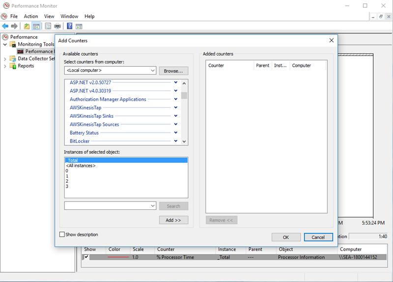
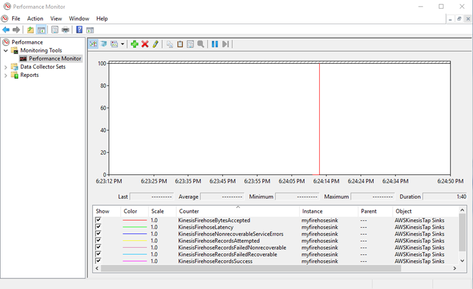

# Troubleshooting Amazon Kinesis Agent for Microsoft Windows

Use the following instructions to diagnose and correct issues when using Amazon Kinesis Agent for Microsoft Windows.

###### Topics

- [No Data Is Streaming from Desktops or Servers to
  Expected AWS services](#troubleshooting-no-data "#troubleshooting-no-data")
- [Expected Data Is Sometimes Missing](#troubleshooting-missing-data "#troubleshooting-missing-data")
- [Data Arrives in an Incorrect Format](#troubleshooting-bad-format "#troubleshooting-bad-format")
- [Performance Issues](#troubleshooting-poor-performance "#troubleshooting-poor-performance")
- [Out of Disk Space](#troubleshooting-out-of-disk-space "#troubleshooting-out-of-disk-space")
- [Troubleshooting Tools](#troubleshooting-tools "#troubleshooting-tools")

## No Data Is Streaming from Desktops or Servers to

Expected AWS services

### Symptoms

When you examine logs, events, and metrics hosted by various AWS services that are
configured to receive streams of data from Kinesis Agent for Windows, no data is being streamed by Kinesis Agent for Windows.

### Causes

There are several possible causes for this issue:

- A source, sink, or pipe is configured incorrectly.
- Authentication for Kinesis Agent for Windows is configured incorrectly.
- Authorization for Kinesis Agent for Windows is configured incorrectly.
- There is an error in a regular expression provided in a `DirectorySource` declaration.
- A nonexistent directory is specified for a `DirectorySource`
  declaration.
- Invalid values are being provided to AWS services, which then reject requests from
  Kinesis Agent for Windows.
- A sink is referencing a resource that doesn't exist in the specified or implicit AWS Region.
- An invalid query is specified for a `WindowsEventLogSource` declaration.
- An invalid value is specified for the `InitialPosition` key-value pair for a source.
- The `appsettings.json` configuration file does not comply with the JSON schema for that file.
- The data is streaming to a different Region than what is selected in the
  AWS Management Console.
- Kinesis Agent for Windows is not installed correctly or is not running.

### Resolutions

To resolve issues with data not streaming, perform the following steps:

1. Examine the Kinesis Agent for Windows logs in the `%PROGRAMDATA%\Amazon\AWSKinesisTap\logs` directory.
   Search for the string `ERROR`.
   1. If a source or sink did not load, do the following:
      1. Examine the error message, and find the `Id` of the source or sink.
      2. Check the source or sink declaration that corresponds to that `Id` in the
         `%PROGRAMFILES%\Amazon\AWSKinesisTap\appsettings.json` configuration file for
         any errors related to the error message found. For more details, see [Configuring Amazon Kinesis Agent for Microsoft Windows](configuring-kinesis-agent-windows.md "configuring-kinesis-agent-windows.md").
      3. Correct any configuration file issues related to the error.
      4. Stop and start the `AWSKinesisTap` service. Then check the most current log file to
         verify that the configuration issues have been resolved.

   2. If the error message indicates that a `SourceRef` or `SinkRef` was
      not found for a pipe, do the following:
      1. Note the pipe `Id`.
      2. Examine the pipe declaration in the
         `%PROGRAMFILES%\Amazon\AWSKinesisTap\appsettings.json` configuration file that
         corresponds to the noted `Id`. Ensure that the values of the
         `SourceRef` and `SinkRef` key-value pairs are correctly spelled
         `Id`s for the source and sink declarations that you intended to reference.
         Correct any typos or spelling errors. If a source or sink declaration is missing from the
         configuration file, add the declaration. For more information, see [Configuring Amazon Kinesis Agent for Microsoft Windows](configuring-kinesis-agent-windows.md "configuring-kinesis-agent-windows.md").
      3. Stop and start the `AWSKinesisTap` service. Then check the most current log file to
         verify that the configuration issues have been resolved.

   3. If the error message indicates that a particular IAM user or role is not authorized to
      perform certain operations, do the following:
      1. Ensure that the correct IAM user or role is being used by Kinesis Agent for Windows. If it is not,
         review [Sink Security
         Configuration](sink-object-declarations.md#configuring-kinesis-agent-windows-sink-security-configuration "sink-object-declarations.md#configuring-kinesis-agent-windows-sink-security-configuration"), and adjust how
         Kinesis Agent for Windows authenticates to ensure that the correct IAM user or role is being used.
      2. If the correct IAM user or role is being used, using the AWS Management Console, examine the
         policies that are associated with the user or role. Ensure that the user or role has all
         the permissions mentioned in the error message for all the AWS resources that Kinesis Agent for Windows
         accesses. For more information, see [Configuring Authorization](sink-object-declarations.md#configuring-kinesis-agent-windows-authorization "sink-object-declarations.md#configuring-kinesis-agent-windows-authorization").
      3. Stop and start the `AWSKinesisTap` service. Then check the most current log
         file to verify that the security issues have been resolved.

   4. If the error message indicates that there is an argument error when parsing a regular
      expression that is contained in the
      `%PROGRAMFILES%\Amazon\AWSKinesisTap\appsettings.json` configuration file, do
      the following:
      1. Examine the regular expression in the configuration file.
      2. Verify the syntax of the regular expression. There are several websites that you can
         use to verify regular expressions, or use the following command lines to check regular
         expressions for a `DirectorySource` source declaration:

      ```
      cd /D %PROGRAMFILES%\Amazon\AWSKinesisTap
      ktdiag.exe /r `sourceId`
      ```

      Replace `sourceId` with the value of the `Id` key-value pair of the
      `DirectorySource` source declaration with an incorrect regular
      expression. 3. Make any corrections necessary to the regular expression in the configuration file so that it is valid. 4. Stop and start the `AWSKinesisTap` service. Then check the most current log
      file to verify that the configuration issues have been resolved.

   5. If the error message indicates that there is an argument error when parsing a regular
      expression that is not contained in the
      `%PROGRAMFILES%\Amazon\AWSKinesisTap\appsettings.json` configuration file, and
      that is related to a particular sink, do the following:
      1. Locate the sink declaration in the configuration file.
      2. Verify that the key-value pairs that are specifically related to an AWS service are
         using names that comply with the validation rules for that service. For example, CloudWatch Logs
         group names must contain only a certain set of characters that is specified using the
         regular expression `[\.\-_/#A-Za-z0-9]+`.
      3. Correct any invalid names in the key-value pairs for the sink declaration, and ensure
         that those resources are properly configured in AWS.
      4. Stop and start the `AWSKinesisTap` service. Then check the most current log
         file to verify that the configuration issues have been resolved.

   6. If the error message indicates that a source or sink cannot load due to a null or
      missing parameter, do the following:
      1. Note the `Id` of the source or sink.
      2. Locate the source or sink declaration that matches the noted `Id` in the `%PROGRAMFILES%\Amazon\AWSKinesisTap\appsettings.json` configuration file.
      3. Review the key-value pairs that are provided in the source or sink declaration
         compared with the source or sink type requirements in the [Configuring Amazon Kinesis Agent for Microsoft Windows](configuring-kinesis-agent-windows.md "configuring-kinesis-agent-windows.md")
         documentation for the relevant sink type. Add any missing required key-value pairs to the
         source or sink declaration.
      4. Stop and start the `AWSKinesisTap` service. Then check the most current log
         file to verify that the configuration issues have been resolved.

   7. If the error message indicates that a directory name is invalid, do the
      following:
      1. Locate the invalid directory name in the `%PROGRAMFILES%\Amazon\AWSKinesisTap\appsettings.json` configuration file.
      2. Verify that this directory exists and contains the log files that should be streamed.
      3. Correct any typos or mistakes in the directory name specified in the configuration
         file.
      4. Stop and start the `AWSKinesisTap` service. Then check the most current log
         file to verify that the configuration issues have been resolved.

   8. If the error message indicates that a resource does not exist:
      1. Locate the resource reference for the resource that doesn't exist in a sink
         declaration in the `%PROGRAMFILES%\Amazon\AWSKinesisTap\appsettings.json`
         configuration file.
      2. Use the AWS Management Console to locate the resource in the correct AWS Region that should be used
         in the sink declaration. Compare it to what was specified in the configuration
         file.
      3. Change the sink declaration in the configuration file to have the correct resource
         name and the correct Region.
      4. Stop and start the `AWSKinesisTap` service. Then check the most current log
         file to verify that the configuration issues have been resolved.

   9. If the error message indicates that a query is invalid for a particular
      `WindowsEventLogSource`, do the following:
      1. In the `%PROGRAMFILES%\Amazon\AWSKinesisTap\appsettings.json` configuration
         file, locate the `WindowsEventLogSource` declaration with the same
         `Id` as in the error message.
      2. Verify that the value of the `Query` key-value pair in the source
         declaration complies with [Event queries and
         Event XML](<https://msdn.microsoft.com/en-us/library/bb399427(v=vs.90).aspx> "https://msdn.microsoft.com/en-us/library/bb399427(v=vs.90).aspx").
      3. Make any changes to the query to bring it into compliance.
      4. Stop and start the `AWSKinesisTap` service. Then check the most current log
         file to verify that the configuration issues have been resolved.

   10. If the error message indicates that there is an invalid initial position, do the
       following:
       1. In the `%PROGRAMFILES%\Amazon\AWSKinesisTap\appsettings.json` configuration
          file, locate the source declaration with the same `Id` as the error
          message.
       2. Change the value of the `InitialPosition` key-value pair in the source
          declaration to comply with the permitted values, as described in [Bookmark Configuration](source-object-declarations.md#advanced-source-configuration "source-object-declarations.md#advanced-source-configuration").
       3. Stop and start the `AWSKinesisTap` service. Then check the most current log
          file to verify that the configuration issues have been resolved.

2. Ensure that the `%PROGRAMFILES%\Amazon\AWSKinesisTap\appsettings.json`
   configuration file complies with the JSON schema.
   1. In a command prompt window, invoke the following lines:

   ```
   cd /D %PROGRAMFILES%\Amazon\AWSKinesisTap
   %PROGRAMFILES%\Amazon\AWSKinesisTap\ktdiag.exe /c
   ```

   2. Correct any issues detected with the `%PROGRAMFILES%\Amazon\AWSKinesisTap\appsettings.json` configuration file.
   3. Stop and start the `AWSKinesisTap` service. Then check the most current log
      file to verify that the configuration issues have been resolved.

3. Change the logging level to try to get more detailed logging information.
   1. Replace the `%PROGRAMFILES%\Amazon\AWSKinesisTap\nlog.xml` configuration file with the following content:

   ```
   <?xml version="1.0" encoding="utf-8" ?>
   <nlog xmlns="http://www.nlog-project.org/schemas/NLog.xsd"
         xmlns:xsi="http://www.w3.org/2001/XMLSchema-instance"
         xsi:schemaLocation="http://www.nlog-project.org/schemas/NLog.xsd NLog.xsd"
         autoReload="true"
         throwExceptions="false"
         internalLogLevel="Off" internalLogFile="c:\temp\nlog-internal.log" >

     <!--
     See https://github.com/nlog/nlog/wiki/Configuration-file
     for information on customizing logging rules and outputs.
      -->
     <targets>
       <!--
       add your targets here
       See https://github.com/nlog/NLog/wiki/Targets for possible targets.
       See https://github.com/nlog/NLog/wiki/Layout-Renderers for the possible layout renderers.
       -->

       <target name="logfile"
               xsi:type="File"
               layout="${longdate} ${logger} ${uppercase:${level}} ${message}"
               fileName="${specialfolder:folder=CommonApplicationData}/Amazon/KinesisTap/logs/KinesisTap.log"
   	    maxArchiveFiles="90"
   	    archiveFileName="${specialfolder:folder=CommonApplicationData}/Amazon/KinesisTap/logs/Archive-{################}.log"
   	    archiveNumbering="Date"
   	    archiveDateFormat="yyyy-MM-dd"
   	    archiveEvery="Day"
   	    />
     </targets>

     <rules>
       <logger name="*" minlevel="Debug" writeTo="logfile" />
     </rules>
   </nlog>
   ```

   2. Stop and start the `AWSKinesisTap` service. Then check the most current log
      file to see if there are additional messages in the log that could help diagnose and resolve
      the issue.

4. Verify that you are looking at resources in the correct Region in the AWS Management Console.
5. Verify that the Kinesis Agent for Windows agent is installed and running.
   1. In Windows, choose **Start**, and then navigate to **Control
      Panel**, **Administrative Tools**,
      **Services**.
   2. Find the **`AWSKinesisTap`** service.
   3. If the `AWSKinesisTap` service is not visible, install Kinesis Agent for Windows using the instructions in
      [Getting Started with Amazon Kinesis Agent for Microsoft Windows](getting-started.md "getting-started.md").
   4. If the service is visible, determine whether the service is running. If it is not
      running, open the context (right-click) menu for the service, and choose
      **Start**.
   5. Verify that the service has started by examining the latest log file in the
      `%PROGRAMDATA%\Amazon\AWSKinesisTap\logs` directory.

### Applies to

This information applies to Kinesis Agent for Windows version 1.0.0.115 and higher.

## Expected Data Is Sometimes Missing

### Symptoms

Kinesis Agent for Windows streams data successfully most of the time, but occasionally some data is missing.

### Causes

There are several possible causes for this issue:

- The bookmarking feature is not being used.
- Data rate limits for AWS services are exceeded based on the current configuration of those services.
- API call rates limits for AWS services are exceeded based on the current `appsettings.json` configuration file and the AWS account limits.

### Resolutions

To resolve issues with missing data, perform the following steps:

1. Consider using the bookmarking feature documented in [Bookmark Configuration](source-object-declarations.md#advanced-source-configuration "source-object-declarations.md#advanced-source-configuration"). It
   helps ensure that all data is eventually sent, even when Kinesis Agent for Windows stops and starts.
2. Use Kinesis Agent for Windows's built-in metrics to discover problems:
   1. Enable the streaming of Kinesis Agent for Windows metrics as described in [Configuring Kinesis Agent for Windows Metric Pipes](pipe-object-declarations.md#kinesis-agent-metric-pipe-configuration "pipe-object-declarations.md#kinesis-agent-metric-pipe-configuration").
   2. If there are a significant number of non-recoverable errors for one or more sinks,
      determine how many bytes or records are being sent per second. Then determine whether this
      is within the limits configured for those AWS services in the Region and account where the
      data is being streamed.
   3. When limits are exceeded, either reduce the rate or amount of data being sent, request
      limit increases, or increase sharding if applicable.
   4. After making adjustments, continue to monitor the Kinesis Agent for Windows built-in metrics to ensure that
      the situation has been resolved.

For more information on Kinesis Data Streams limits, see [Kinesis Data Streams
Limits](../../../streams/latest/dev/service-sizes-and-limits.md "../../../streams/latest/dev/service-sizes-and-limits.md") in the _Kinesis Data Streams Developer Guide_. For more information on Firehose limits, see
[Amazon Kinesis
Data Firehose Limits](../../../firehose/latest/dev/limits.md "../../../firehose/latest/dev/limits.md").

### Applies to

This information applies to Kinesis Agent for Windows version 1.0.0.115 and higher.

## Data Arrives in an Incorrect Format

### Symptoms

Data arrives at the AWS service in the incorrect format.

### Causes

There are several possible causes for this issue:

- The value for the `Format` key-value pair for a sink declaration in the `appsettings.json` configuration file is incorrect.
- The value for the `RecordParser` key-value pair in a `DirectorySource` declaration is incorrect.
- The regular expressions in a `DirectorySource` declaration that uses the
  `Regex` record parser are incorrect.

### Resolutions

To resolve issues with incorrect formatting, perform the following steps:

1.  Review the sink declarations in the `%PROGRAMFILES%\Amazon\AWSKinesisTap\appsettings.json` configuration file.
2.  Ensure that the correct value of the `Format` key-value pair is specified for
    each sink declaration. For more information, see [Sink Declarations](sink-object-declarations.md "sink-object-declarations.md").
3.  If sources with `DirectorySource` declarations are connected by pipes to sinks
    that specify `xml` or `json` values for the `Format`
    key-value pair, ensure that those sources specify one of the following values for the
    `RecordParser` key-value pair:

        * `SingleLineJson`
        * `Regex`
        * `SysLog`
        * `Delimited`

    Other record parsers are text-based only and do not work correctly with sinks that require
    XML or JSON formatting.

4.  If log records are not being correctly parsed by the `DirectorySource` source
    type, invoke the following lines in a command prompt window to verify the timestamp and
    regular expression key-value pairs specified in the `DirectorySource`
    declaration:

```
cd /D %PROGRAMFILES%\Amazon\AWSKinesisTap
ktdiag.exe /r `sourceID`
```

Replace `sourceID` with the value of the `Id`
key-value pair of the `DirectorySource` source declaration that does not appear to
be working correctly. Correct any problems reported by `ktdiag.exe`.

### Applies to

This information applies to Kinesis Agent for Windows version 1.0.0.115 and higher.

## Performance Issues

### Symptoms

Applications and services have increased latencies after Kinesis Agent for Windows is installed and started.

### Causes

There are several possible causes for this issue:

- The machine where Kinesis Agent for Windows runs does not have sufficient capacity to stream the amount of data desired.
- Unnecessary data is being streamed to one or more AWS services.
- Kinesis Agent for Windows is streaming data to AWS services that are not configured for such a high data
  rate.
- Kinesis Agent for Windows is invoking operations on AWS services in an account where the API call rate limit is too low.

### Resolutions

To resolve performance issues, perform the following steps:

1. Use the Windows resource monitor application to check memory, CPU, disk, and network
   usage. If you need to stream large quantities of data with Kinesis Agent for Windows, you might need to provision
   a machine with higher capacities in some of these areas, depending on configuration.
2. You might be able to reduce the amount of logged data using filtering:
   - See the `Query` key-value pair in [WindowsEventLogSource Configuration](source-object-declarations.md#window-event-source-configuration "source-object-declarations.md#window-event-source-configuration").
   - See pipeline filtering in [Configuring Pipes](pipe-object-declarations.md#kinesis-agent-pipe-configuration "pipe-object-declarations.md#kinesis-agent-pipe-configuration").
   - See Amazon CloudWatch metrics filtering in [CloudWatch Sink Configuration](sink-object-declarations.md#sink-object-declarations-cloud-watch "sink-object-declarations.md#sink-object-declarations-cloud-watch")).

3. Use the Windows performance monitor application to view Kinesis Agent for Windows metrics or stream those
   metrics to CloudWatch (see [Kinesis Agent for Windows Built-In Metrics Source](source-object-declarations.md#kinesis-agent-builin-metrics-source "source-object-declarations.md#kinesis-agent-builin-metrics-source")). In the Windows performance monitor
   application, you can add counters for Kinesis Agent for Windows sinks and sources. They are listed under the
   **`AWSKinesisTap Sinks`** and **`AWSKinesisTap Sources`**
   counter categories.



For example, to diagnose Firehose performance issues, add the **Kinesis Firehose Sink** performance counters.



If there are a large number of recoverable errors, inspect the latest Kinesis Agent for Windows logs in the
`%PROGRAMDATA%\Amazon\AWSKInesisTap\logs` directory. If throttling is
occurring for `KinesisStream` or `KinesisFirehose` sinks, do the
following:

    * If throttling occurs due to streaming data too quickly, consider raising the number of
     shards for the Kinesis data stream. For more information, see [Resharding,
     Scaling, and Parallel Processing](../../../streams/latest/dev/kinesis-record-processor-scaling.md "../../../streams/latest/dev/kinesis-record-processor-scaling.md") in the *Kinesis Data Streams Developer
     Guide*.
    * Consider raising the API call limit for Kinesis Data Streams, or increasing the buffer size for the
     sink if the API calls are being throttled. For more information, see [Kinesis Data Streams
     Limits](../../../streams/latest/dev/service-sizes-and-limits.md "../../../streams/latest/dev/service-sizes-and-limits.md") in the *Kinesis Data Streams Developer Guide*.
    * If data is streaming too quickly, consider requesting a rate limit increase for the Firehose
     delivery stream. Or if the API calls are being throttled, request an API call limit
     increase (see [Amazon Kinesis
     Data Firehose Limits](../../../firehose/latest/dev/limits.md "../../../firehose/latest/dev/limits.md")) or increase the buffer size for the sink.
    * After increasing the number of shards for a Kinesis Data Streams stream, or increasing the rate limit
     for a Firehose delivery stream, revise the Kinesis Agent for Windows `appsettings.json`
     configuration file to increase the records per second or bytes per second for the sink.
     Otherwise, Kinesis Agent for Windows cannot take advantage of the increased limits.

### Applies to

This information applies to Kinesis Agent for Windows version 1.0.0.115 and higher.

## Out of Disk Space

### Symptoms

Kinesis Agent for Windows is running on a machine that is very low on disk space on one or more disk
drives.

### Causes

There are several possible causes for this issue:

- The Kinesis Agent for Windows logging configuration file is incorrect.
- The Kinesis Agent for Windows persistent queue is configured incorrectly.
- Some other application or service is consuming disk space.

### Resolutions

To resolve disk space issues, perform the following steps:

- If the disk space is low on the disk that contains the Kinesis Agent for Windows log files, examine the log
  file directory (typically `%PROGRAMDATA%\Amazon\AWSKinesisTap\logs`).
  Ensure that a reasonable number of log files are being retained and that the log files are a
  reasonable size. You can control the location, retention, and verbosity of the Kinesis Agent for Windows logs by
  editing the `%PROGRAMFILES%\Amazon\AWSKinesisTap\Nlog.xml` configuration
  file.
- When the sink queuing feature is enabled, examine the sink declarations that use that
  feature. Ensure that the `QueuePath` key-value pair references a disk drive with
  sufficient space to contain the maximum number of batches specified using the
  `QueueMaxBatches` key-value pair. If this is not possible, then reduce the value
  of the `QueueMaxBatches` key-value pair so that the data easily fits in the
  remaining disk space for the specified disk drive.
- Use the Windows file explorer to locate the files consuming the disk space and either transfer or delete excess files. Change
  the configuration of the application or service consuming large amounts of disk space.

### Applies to

This information applies to Kinesis Agent for Windows version 1.0.0.115 and higher.

## Troubleshooting Tools

In addition to verifying the configuration file, you can use the
`ktdiag.exe` tool, which provides several other capabilities for diagnosing
and resolving problems when configuring and using Kinesis Agent for Windows. The `ktdiag.exe` tool
is located in the `%PROGRAMFILES%\Amazon\AWSKinesisTap` directory.

- If you think that log files with a certain file pattern are being written to a directory
  but are not being processed by Kinesis Agent for Windows, use the `/w` switch to verify that these
  changes are being detected. For example, suppose that you expect that log files with the
  `*.log` file name pattern are being written to the
  `c:\foo` directory. You can use the `/w` switch when executing
  the `ktdiag.exe` tool, specifying the directory and file pattern:

```
cd /D %PROGRAMFILES%\Amazon\AWSKinesisTap
ktdiag /w c:\foo *.log
```

If log files are being written, you can see output similar to the following:

```
Type any key to exit this program...
File: c:\foo\log1.log ChangeType: Created
File: c:\foo\log1.log ChangeType: Deleted
File: c:\foo\log1.log ChangeType: Created
File: c:\foo\log1.log ChangeType: Changed
File: c:\foo\log1.log ChangeType: Changed
File: c:\foo\log1.log ChangeType: Changed
File: c:\foo\log1.log ChangeType: Changed
```

If no such output is occurring, then there is an application or service issue in writing
the logs, or there is a security configuration issue rather than a problem with Kinesis Agent for Windows. If such
output is occurring but Kinesis Agent for Windows is still not apparently processing the logs, see [No Data Is Streaming from Desktops or Servers to
Expected AWS services](#troubleshooting-no-data "#troubleshooting-no-data").

- Sometimes logs are only occasionally written, but it would be useful to verify that Kinesis Agent for Windows
  is operating correctly. Use the `/log4net` switch to simulate an application writing
  logs using the `Log4net` library; for example:

```
cd /D %PROGRAMFILES%\Amazon\AWSKinesisTap
KTDiag.exe /log4net c:\foo\log2.log
```

This writes a `Log4net` style log file to the
`c:\foo\log2.log` log file and keeps adding new log entries until a key is
pressed. You can configure several options using additional switches that are optionally
specified after the file name:

Locking: `-lm`, `-li` or `-le`

You can specify one of the following locking switches that control how the log file is
locked:

`-lm`

The minimum amount of locking is used on the log file, enabling maximum access to the log file.

`-li`

Only threads within the same process can access the log at the same time.

`-le`

Only one thread at a time can access log. This is the default.

`-tn:``milliseconds`

Specifies the number of `milliseconds` between writing log entries. The default is 1000 milliseconds (1 second).

`-sm:``bytes`

Specifies the number of `bytes` for each log entry. The default is 1000 bytes.

`-bk:``number`

Specifies the `number` of log entries to write at a time. The default is 1.

- Sometimes it is useful to simulate an application that writes to the Windows event log.
  Use the `/e` switch to write log entries a Windows event log; for example:

```
cd /D %PROGRAMFILES%\Amazon\AWSKinesisTap
KTDiag.exe /e Application
```

This writes log entries to the Windows Application event log until a key is pressed. You
can optionally specify the following additional options after the name of the log:

`-tn:``milliseconds`

Specifies the number of `milliseconds` between writing log entries. The default is 1000 milliseconds (1 second).

`-sm:``bytes`

Specifies the number of `bytes` for each log entry. The default is 1000 bytes.

`-bk:``number`

Specifies the `number` of log entries to write at a time. The default is 1.
