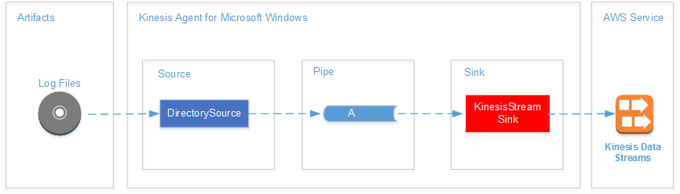
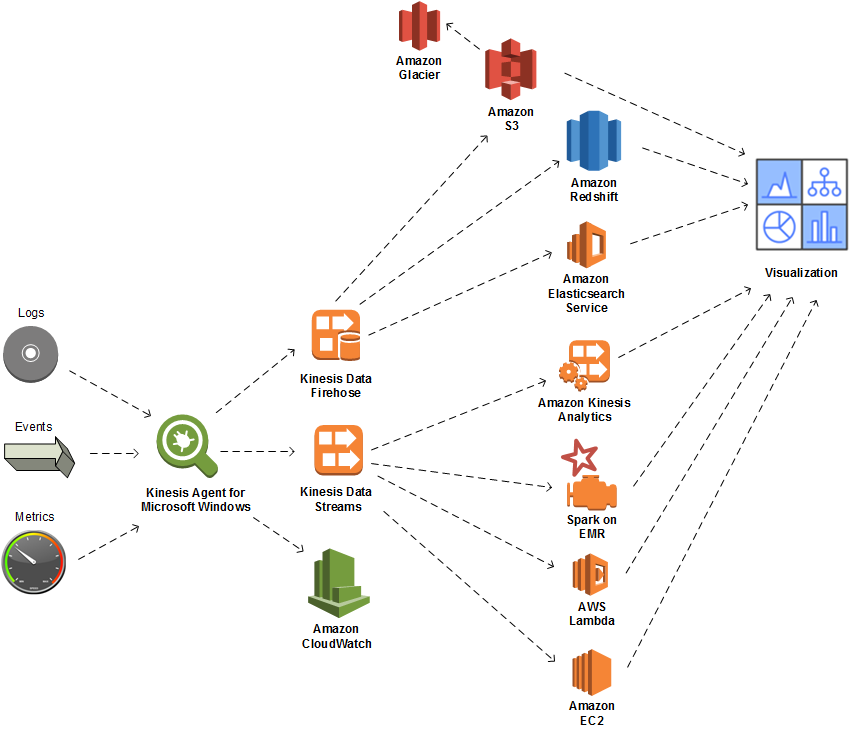
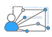
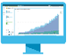

# What Is Amazon Kinesis Agent for Microsoft Windows?

Amazon Kinesis Agent for Microsoft Windows (Kinesis Agent for Windows) is a configurable and extensible agent. It runs on fleets of Windows
desktop computers and servers, either on-premises or in the AWS Cloud. Kinesis Agent for Windows efficiently and
reliably gathers, parses, transforms, and streams logs, events, and metrics to various AWS services, including [Kinesis Data Streams](../../../streams/latest/dev.md "../../../streams/latest/dev.md"), [Firehose](../../../firehose/latest/dev.md "../../../firehose/latest/dev.md"), [Amazon CloudWatch](../../../AmazonCloudWatch/latest/monitoring.md "../../../AmazonCloudWatch/latest/monitoring.md"), and [CloudWatch Logs](../../../AmazonCloudWatch/latest/logs.md "../../../AmazonCloudWatch/latest/logs.md").

From those services, you can then store, analyze, and visualize the data using a variety of
other AWS services, including the following:

- [Amazon Simple Storage Service (Amazon S3)](../../../AmazonS3/latest/userguide.md "../../../AmazonS3/latest/userguide.md")
- [Amazon Redshift](../../../redshift/latest/gsg.md "../../../redshift/latest/gsg.md")
- [Amazon OpenSearch Service (Amazon ES)](../../../opensearch-service/latest/developerguide.md "../../../opensearch-service/latest/developerguide.md")
- [Managed Service for Apache Flink](../../../kinesisanalytics/latest/dev.md "../../../kinesisanalytics/latest/dev.md")
- [Amazon Quick Suite](../../../quicksuite/latest/user.md "../../../quicksuite/latest/user.md")
- [Amazon Athena](../../../athena/latest/ug.md "../../../athena/latest/ug.md")
- [Kibana](https://aws.amazon.com/elasticsearch-service/kibana/ "https://aws.amazon.com/elasticsearch-service/kibana/")
  The following diagram illustrates a simple configuration of Kinesis Agent for Windows that streams log files to
  Kinesis Data Streams.

For more information about sources, pipes, and sinks, see [Amazon Kinesis Agent for Microsoft Windows Concepts](kinesis-agent-windows-concepts.md "kinesis-agent-windows-concepts.md").

The following diagram illustrates some of the ways you can build custom, real-time data
pipelines using stream-processing frameworks. These frameworks include Managed Service for Apache Flink, Apache Spark on
Amazon EMR, and AWS Lambda.

###### Topics

- [About AWS](#about-aws "#about-aws")
- [What Can You Do with Kinesis Agent for Windows?](#kinesis-agent-features "#kinesis-agent-features")
- [Benefits](#benefits "#benefits")
- [Getting Started with Kinesis Agent for Windows](#more-info "#more-info")

## About AWS

Amazon Web Services (AWS) is a collection of digital infrastructure services that you can use when
developing applications. The services include computing, storage, database, analytics, and
application synchronization (messaging and queuing). AWS uses a pay-as-you-go service model.
You are charged only for the services that you—or your applications—use. Also, to
make its services more approachable for prototyping and experimentation, AWS offers a free
usage tier. On this tier, services are free below a certain level of usage. For more information
about AWS costs and the _Free Tier_, see the [Getting Started Resource
Center](../../../FeaturedArticles/latest/TestDriveFreeTier.md "../../../FeaturedArticles/latest/TestDriveFreeTier.md"). To create an AWS account, open the [AWS home page](https://portal.aws.amazon.com/gp/aws/developer/registration/index.html "https://portal.aws.amazon.com/gp/aws/developer/registration/index.html") and
sign up.

## What Can You Do with Kinesis Agent for Windows?

Kinesis Agent for Windows provides the following features and capabilities:

###### Collect Logs, Events, and Metrics Data

Kinesis Agent for Windows collects, parses, transforms, and streams logs, events, and metrics from fleets of
servers and desktops to one or more AWS services. The payload received by the services can be
in a different format from the original source. For example, a log might be stored in a
particular textual format (such as syslog format) on a server. Kinesis Agent for Windows can collect and parse that
text and optionally transform it to JSON format, for example, before streaming to AWS. This
facilitates simpler processing by some AWS services that consume JSON. Data streamed to Kinesis Data Streams
can be continuously processed by Managed Service for Apache Flink to generate additional metrics and aggregated metrics,
which in turn can power live dashboards. You can store the data using a variety of AWS services
(such as Amazon S3) depending on how the data is used downstream in a data pipeline.

###### Integrate with AWS services

You can configure Kinesis Agent for Windows to send log files, events, and metrics to several different AWS services:

- [Firehose](../../../firehose/latest/dev.md "../../../firehose/latest/dev.md") — Easily store streamed data in Amazon S3, Amazon Redshift,
  OpenSearch Service, or [Splunk](https://aws.amazon.com/quickstart/architecture/splunk-enterprise/ "https://aws.amazon.com/quickstart/architecture/splunk-enterprise/")
  for further analysis.
- [Kinesis Data Streams](../../../streams/latest/dev.md "../../../streams/latest/dev.md") — Process streamed data using custom
  applications hosted in Managed Service for Apache Flink or Apache Spark on [Amazon EMR](../../../emr/latest/ManagementGuide.md "../../../emr/latest/ManagementGuide.md").
  Or use custom code running on [Amazon EC2](../../../AWSEC2/latest/GettingStartedGuide.md "../../../AWSEC2/latest/GettingStartedGuide.md") instances, or custom
  serverless functions running in [AWS Lambda](../../../lambda/latest/dg.md "../../../lambda/latest/dg.md").
- [CloudWatch](../../../AmazonCloudWatch/latest/monitoring.md "../../../AmazonCloudWatch/latest/monitoring.md") — View streamed metrics in graphs, which you can
  combine into dashboards. Then set CloudWatch alarms that are triggered by metric values that breach
  preset thresholds.
- [CloudWatch Logs](../../../AmazonCloudWatch/latest/logs.md "../../../AmazonCloudWatch/latest/logs.md") — Store streamed logs and events, and view and
  search them in the AWS Management Console, or process them further downstream in a data pipeline.

###### Install and Configure Quickly

You can install and configure Kinesis Agent for Windows in just a few steps. For more information, see [Installing Kinesis Agent for Windows](getting-started.md#getting-started-installation "getting-started.md#getting-started-installation") and [Configuring Amazon Kinesis Agent for Microsoft Windows](configuring-kinesis-agent-windows.md "configuring-kinesis-agent-windows.md"). A simple
declarative configuration file specifies the following:

- The sources and formats of logs, events, and metrics to gather.
- The transformations to apply to the gathered data. Additional data can be included, and
  existing data can be transformed and filtered.
- The destinations where the final data is streamed, and the buffering, sharding, and format
  for the streaming payloads.

Kinesis Agent for Windows comes with built-in parsers for log files generated by common Microsoft enterprise
services such as:

- Microsoft Exchange
- SharePoint
- Active Directory domain controllers
- DHCP servers

###### No Ongoing Administration

Kinesis Agent for Windows automatically adapts to various situations without losing any data. These include log
rotation, recovery after reboot, and temporary network or service interruptions. You can
configure Kinesis Agent for Windows to automatically update to new versions. No operator intervention is required in
any of these situations.

###### Extend Using Open Architecture

If the declarative capabilities and built-in plugins are insufficient for monitoring
server or desktop systems, you can extend Kinesis Agent for Windows by creating plugins. New plugins enable new
sources and destinations for logs, events, and metrics. The source code for Kinesis Agent for Windows is available at
[Kinesis Agent windows](https://github.com/awslabs/kinesis-agent-windows "https://github.com/awslabs/kinesis-agent-windows").

## Benefits

Kinesis Agent for Windows performs the initial data gathering, transformation, and streaming for logs, events,
and metrics for data pipelines. Building these data pipelines has numerous benefits:

###### Analysis and Visualization

The integration of Kinesis Agent for Windows with Firehose and its transformation capabilities make it easy to
integrate with several different analytic and visualization services:

- [Quick Suite](../../../quicksuite/latest/user.md "../../../quicksuite/latest/user.md") — A cloud-based BI service that can ingest
  from many different sources. Kinesis Agent for Windows can transform data and stream it to Amazon S3 and Amazon Redshift via Firehose.
  This process enables discovery of deep insights from the data using Quick Suite visualizations.
- [Athena](../../../athena/latest/ug.md "../../../athena/latest/ug.md") — An interactive query service that enables
  SQL-based querying of data. Kinesis Agent for Windows can transform and stream data to Amazon S3 via Firehose. Athena can
  then interactively execute SQL queries against that data to rapidly inspect and analyze logs
  and events.
- [Kibana](https://aws.amazon.com/elasticsearch-service/kibana/ "https://aws.amazon.com/elasticsearch-service/kibana/") — An
  open-source data visualization tool. Kinesis Agent for Windows can transform and stream data to OpenSearch Service via Firehose. You
  can then use Kibana to explore that data. Create and open different visualizations, including
  histograms, line graphs, pie charts, heat maps, and geospatial graphics.

###### Security

A log and event data analysis pipeline that includes Kinesis Agent for Windows can detect and alert on
security breaches in organizations, which can help you block or stop attacks.

###### Application Performance

Kinesis Agent for Windows can collect logs, events, and metric data about application or service performance.
A complete data pipeline can then analyze this data. This analysis helps you improve your
application and service performance and reliability by detecting and reporting on defects that
otherwise might not be apparent. For example, you can detect significant changes in the
execution times of service API calls. When correlated to a deployment, this capability helps you
locate and resolve new performance problems with services that you own.

###### Service Operations

A data pipeline can analyze the data collected to predict potential operational issues and
provide insight into how to avoid service outages. For example, you can analyze logs, events,
and metrics to determine current and projected capacity usage so that you can bring additional
capacity online before service users are affected. If a service outage occurs, you can analyze
the data to determine the impact on customers during the outage period.

###### Auditing

A data pipeline can process the logs, events, and metrics that Kinesis Agent for Windows collects and
transforms. You can then audit this processed data using various AWS services. For example,
Firehose could receive a data stream from Kinesis Agent for Windows, which stores the data in Amazon S3. You could then
audit this data by executing interactive SQL queries using Athena.

###### Archiving

Often the most important operational data is data that is recently collected. However,
analysis of data that is collected about applications and services over several years can also
be useful, for example, for long range planning. Keeping large amounts of data can be expensive.
Kinesis Agent for Windows can collect, transform, and store data in Amazon S3 via Firehose. Therefore, [Amazon Glacier](../../../amazonglacier/latest/dev.md "../../../amazonglacier/latest/dev.md") is available to reduce the costs of archiving older
data.

###### Alerting

Kinesis Agent for Windows streams metrics to CloudWatch. In turn, you can create CloudWatch alarms to send a notification
via [Amazon Simple Notification Service (Amazon SNS)](../../../sns/latest/gsg.md "../../../sns/latest/gsg.md") when a metric consistently violates a
specific threshold. This gives engineers a better awareness of the operational issues with their
applications and services.

## Getting Started with Kinesis Agent for Windows

To learn more about Kinesis Agent for Windows, we recommend that you start with the following
sections:

- [Amazon Kinesis Agent for Microsoft Windows Concepts](kinesis-agent-windows-concepts.md "kinesis-agent-windows-concepts.md")
- [Getting Started with Amazon Kinesis Agent for Microsoft Windows](getting-started.md "getting-started.md")
