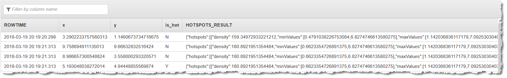

After careful consideration, we have decided to discontinue Amazon Kinesis
Data Analytics for SQL applications:

1. From **September 1, 2025**, we won't provide any bug fixes for Amazon Kinesis Data Analytics for SQL applications because we will have limited support for it, given the upcoming discontinuation.

2. From **October 15, 2025**, you will not be able to create new Kinesis Data Analytics for SQL
   applications.

3. We will delete your applications starting **January 27, 2026**. You will not be able to
   start or operate your Amazon Kinesis Data Analytics for SQL applications. Support will no longer
   be available for Amazon Kinesis Data Analytics for SQL from that time. For more information, see
   [Amazon Kinesis Data Analytics for SQL Applications discontinuation](discontinuation.md "discontinuation.md").

# Step 2: Create the Kinesis Data Analytics

Application

In this section of the [Hotspots
example](app-hotspots-detection.md "app-hotspots-detection.md"), you create an Kinesis Data Analytics application as
follows:

- Configure the application input to use the Kinesis data stream you created as
  the streaming source in [Step
  1](app-hotspots-prepare.md "app-hotspots-prepare.md").
- Use the provided application code in the AWS Management Console.

###### To create an application

1. Create a Kinesis Data Analytics application by following steps 1, 2, and 3 in
   the [Getting
   Started](get-started-exercise.md "get-started-exercise.md") exercise (see [Step 3.1: Create an Application](get-started-create-app.md "get-started-create-app.md")).

In the source configuration, do the following:

    * Specify the streaming source you created in [Step 1: Create the Input and Output
     Streams](app-hotspots-prepare.md "app-hotspots-prepare.md").
    * After the console infers the schema, edit the schema. Ensure that
     the `x` and `y` column types are set to
     `DOUBLE` and that the `IS_HOT` column type
     is set to `VARCHAR`.

2. Use the following application code (you can paste this code into the SQL
   editor):

```
CREATE OR REPLACE STREAM "DESTINATION_SQL_STREAM" (
    "x" DOUBLE,
    "y" DOUBLE,
    "is_hot" VARCHAR(4),
    HOTSPOTS_RESULT VARCHAR(10000)
);
CREATE OR REPLACE PUMP "STREAM_PUMP" AS
    INSERT INTO "DESTINATION_SQL_STREAM"
    SELECT "x", "y", "is_hot", "HOTSPOTS_RESULT"
    FROM TABLE (
        HOTSPOTS(
            CURSOR(SELECT STREAM "x", "y", "is_hot" FROM "SOURCE_SQL_STREAM_001"),
            1000,
            0.2,
            17)
    );

```

3. Run the SQL code and review the results.



###### Next Step

[Step 3: Configure
the Application Output](app-hotspots-create-ka-app-config-destination.md "app-hotspots-create-ka-app-config-destination.md")
