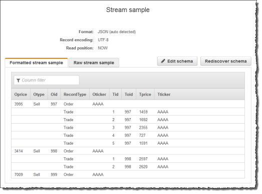
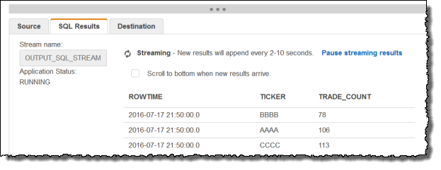

After careful consideration, we have decided to discontinue Amazon Kinesis
Data Analytics for SQL applications:

1. From **September 1, 2025**, we won't provide any bug fixes for Amazon Kinesis Data Analytics for SQL applications because we will have limited support for it, given the upcoming discontinuation.

2. From **October 15, 2025**, you will not be able to create new Kinesis Data Analytics for SQL
   applications.

3. We will delete your applications starting **January 27, 2026**. You will not be able to
   start or operate your Amazon Kinesis Data Analytics for SQL applications. Support will no longer
   be available for Amazon Kinesis Data Analytics for SQL from that time. For more information, see
   [Amazon Kinesis Data Analytics for SQL Applications discontinuation](discontinuation.md "discontinuation.md").

# Example: Transforming Multiple Data Types

A common requirement in extract, transform, and load (ETL) applications is to process
multiple record types on a streaming source. You can create Kinesis Data Analytics
applications to process these kinds of streaming sources. The process is as
follows:

1. First, you map the streaming source to an in-application input stream, similar
   to all other Kinesis Data Analytics applications.
2. Then, in your application code, you write SQL statements to retrieve rows of
   specific types from the in-application input stream. You then insert them into
   separate in-application streams. (You can create additional in-application
   streams in your application code.)
   In this exercise, you have a streaming source that receives records of two types
   (`Order` and `Trade`). These are stock orders and
   corresponding trades. For each order, there can be zero or more trades. Example records
   of each type are shown following:

**Order record**

```
{"RecordType": "Order", "Oprice": 9047, "Otype": "Sell", "Oid": 3811, "Oticker": "AAAA"}
```

**Trade record**

```
{"RecordType": "Trade", "Tid": 1, "Toid": 3812, "Tprice": 2089, "Tticker": "BBBB"}
```

When you create an application using the AWS Management Console, the console displays the following
inferred schema for the in-application input stream created. By default, the console
names this in-application stream `SOURCE_SQL_STREAM_001`.


When you save the configuration, Amazon Kinesis Data Analytics continuously reads data from the streaming
source and inserts rows in the in-application stream. You can now perform analytics on
data in the in-application stream.

In the application code in this example, you first create two additional
in-application streams, `Order_Stream` and `Trade_Stream`. You
then filter the rows from the `SOURCE_SQL_STREAM_001` stream based on the
record type and insert them in the newly created streams using pumps. For information
about this coding pattern, see [Application Code](how-it-works-app-code.md "how-it-works-app-code.md").

1. Filter order and trade rows into separate in-application streams:
   1. Filter the order records in the `SOURCE_SQL_STREAM_001`,
      and save the orders in the `Order_Stream`.

   ```
   --Create Order_Stream.
   CREATE OR REPLACE STREAM "Order_Stream"
              (
               order_id     integer,
               order_type   varchar(10),
               ticker       varchar(4),
               order_price  DOUBLE,
               record_type  varchar(10)
               );

   CREATE OR REPLACE PUMP "Order_Pump" AS
      INSERT INTO "Order_Stream"
         SELECT STREAM oid, otype,oticker, oprice, recordtype
         FROM   "SOURCE_SQL_STREAM_001"
         WHERE  recordtype = 'Order';
   ```

   2. Filter the trade records in the `SOURCE_SQL_STREAM_001`,
      and save the orders in the `Trade_Stream`.

   ```
   --Create Trade_Stream.
   CREATE OR REPLACE STREAM "Trade_Stream"
              (trade_id     integer,
               order_id     integer,
               trade_price  DOUBLE,
               ticker       varchar(4),
               record_type  varchar(10)
               );

   CREATE OR REPLACE PUMP "Trade_Pump" AS
      INSERT INTO "Trade_Stream"
         SELECT STREAM tid, toid, tprice, tticker, recordtype
         FROM   "SOURCE_SQL_STREAM_001"
         WHERE  recordtype = 'Trade';
   ```

2. Now you can perform additional analytics on these streams. In this example,
   you count the number of trades by the ticker in a one-minute [tumbling window](tumbling-window-concepts.md "tumbling-window-concepts.md") and
   save the results to yet another stream, `DESTINATION_SQL_STREAM`.

```
--do some analytics on the Trade_Stream and Order_Stream.
-- To see results in console you must write to OPUT_SQL_STREAM.

CREATE OR REPLACE STREAM "DESTINATION_SQL_STREAM" (
            ticker  varchar(4),
            trade_count   integer
            );

CREATE OR REPLACE PUMP "Output_Pump" AS
   INSERT INTO "DESTINATION_SQL_STREAM"
      SELECT STREAM ticker, count(*) as trade_count
      FROM   "Trade_Stream"
      GROUP BY ticker,
                FLOOR("Trade_Stream".ROWTIME TO MINUTE);
```

You see the result, as shown following:



###### Topics

- [Step 1: Prepare the Data](tworecordtypes-prepare.md "tworecordtypes-prepare.md")
- [Step 2: Create the Application](tworecordtypes-create-app.md "tworecordtypes-create-app.md")

###### Next Step

[Step 1: Prepare the Data](tworecordtypes-prepare.md "tworecordtypes-prepare.md")
