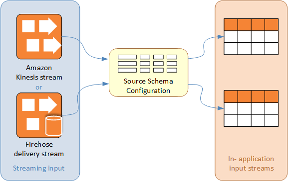
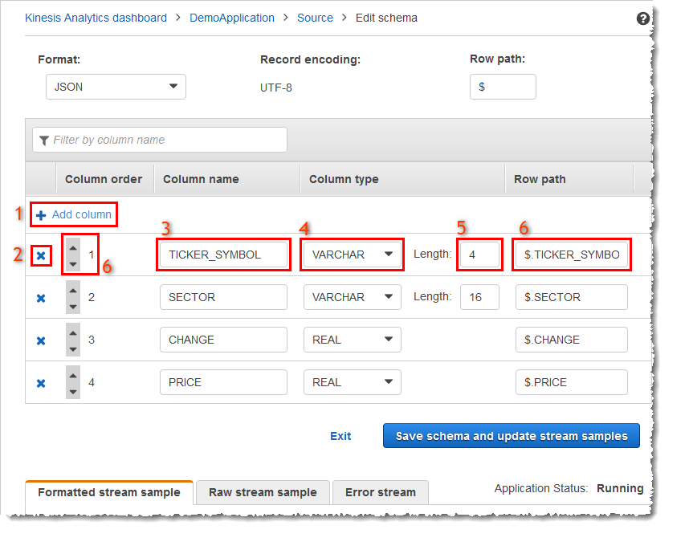
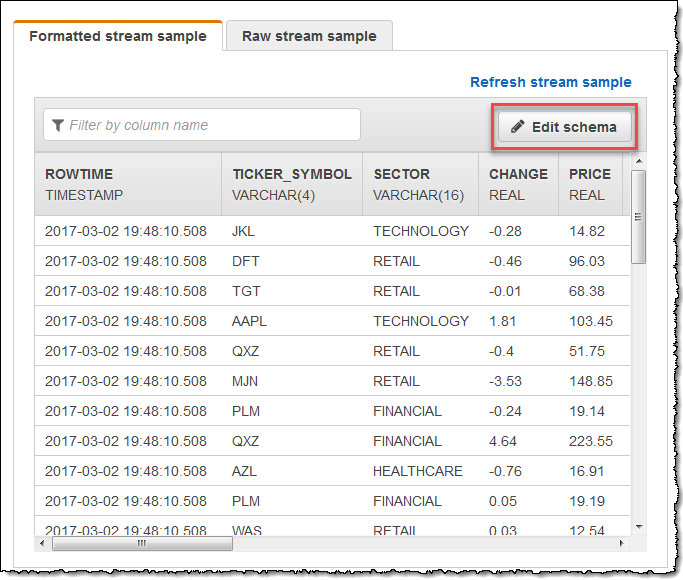
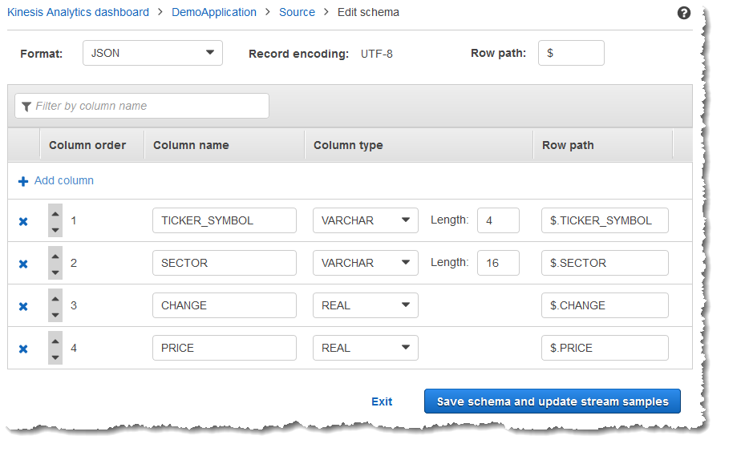
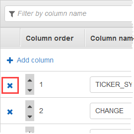
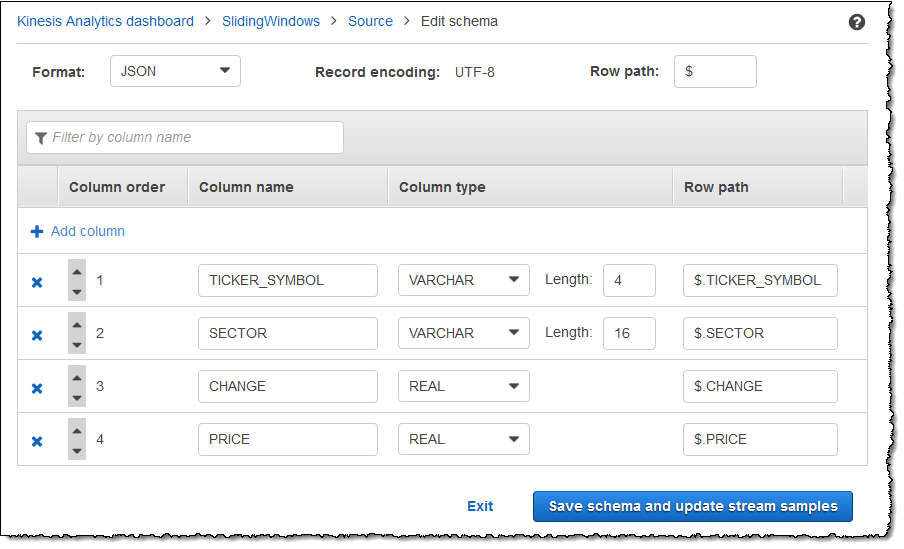
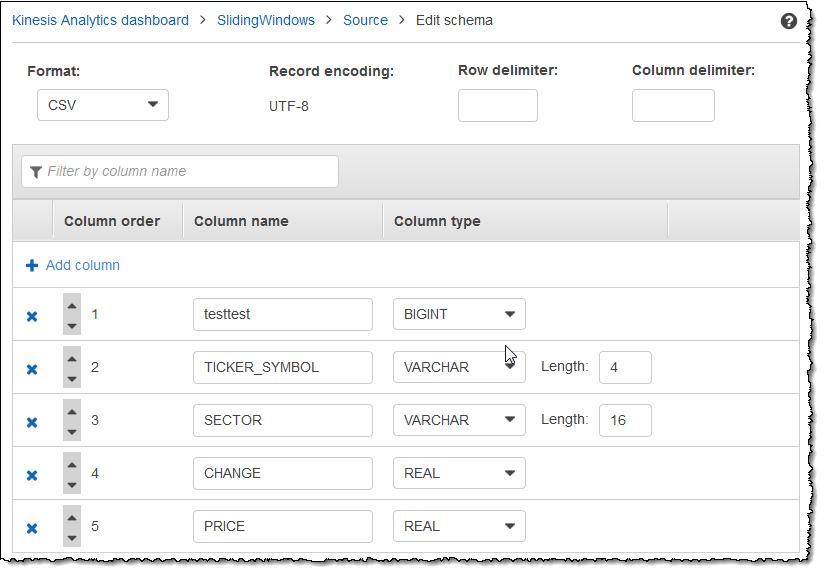

After careful consideration, we have decided to discontinue Amazon Kinesis
Data Analytics for SQL applications:

1. From **September 1, 2025**, we won't provide any bug fixes for Amazon Kinesis Data Analytics for SQL applications because we will have limited support for it, given the upcoming discontinuation.

2. From **October 15, 2025**, you will not be able to create new Kinesis Data Analytics for SQL
   applications.

3. We will delete your applications starting **January 27, 2026**. You will not be able to
   start or operate your Amazon Kinesis Data Analytics for SQL applications. Support will no longer
   be available for Amazon Kinesis Data Analytics for SQL from that time. For more information, see
   [Amazon Kinesis Data Analytics for SQL Applications discontinuation](discontinuation.md "discontinuation.md").

# Working with the Schema Editor

The schema for an Amazon Kinesis Data Analytics application's input stream defines how data from the
stream is made available to SQL queries in the application.

The schema contains selection criteria for determining what part of the streaming input is transformed into a data
column in the in-application input stream. This input can be one of the
following:

- A JSONPath expression for JSON input streams. JSONPath is a tool for querying JSON data.
- A column number for input streams in comma-separated values (CSV) format.
- A column name and a SQL data type for presenting the data in the in-application data stream.
  The data type also contains a length for character or binary data.
  The console attempts to generate the schema using [DiscoverInputSchema](API_DiscoverInputSchema.md "API_DiscoverInputSchema.md"). If
  schema discovery fails or returns an incorrect or incomplete schema, you must edit
  the schema manually by using the schema editor.

## Schema Editor Main Screen

The following screenshot shows the main screen for the Schema Editor.

You can apply the following edits to the schema:

- Add a column (1): You might need to add a data column if a data item is not detected
  automatically.
- Delete a column (2): You can exclude data from the source stream if your application doesn't
  require it. This exclusion doesn't affect the data in the source stream. If
  data is excluded, that data simply isn't made available to the
  application.
- Rename a column (3). A column name can't be blank, must be longer than a single character,
  and must not contain reserved SQL keywords. The name must also meet naming
  criteria for SQL ordinary identifiers: The name must start with a letter and
  contain only letters, underscore characters, and digits.
- Change the data type (4) or length (5) of a column: You can specify a compatible data type for
  a column. If you specify an incompatible data type, the column is either
  populated with NULL or the in-application stream is not populated at
  all. In the latter case, errors are written to the error stream. If you
  specify a length for a column that is too small, the incoming data is
  truncated.
- Change the selection criteria of a column (6): You can edit the JSONPath expression or CSV
  column order used to determine the source of the data in a column. To
  change the selection criteria for a JSON schema, enter a new value for
  the row path expression. A CSV schema uses the column order as selection
  criteria. To change the selection criteria for a CSV schema, change the
  order of the columns.

## Editing the Schema for a Streaming Source

If you need to edit a schema for a streaming source, follow these steps.

###### To edit the schema for a streaming source

1. On the **Source** page, choose **Edit schema**.

 2. On the **Edit schema** page, edit the source schema.

 3. For **Format**, choose **JSON** or **CSV**.
For JSON or CSV format, the supported encoding is ISO 8859-1.

For further information on editing the schema for JSON or CSV format, see the
procedures in the next sections.

### Editing a JSON Schema

You can edit a JSON schema by using the following steps.

###### To edit a JSON schema

1. In the schema editor, choose **Add column** to add a column.

A new column appears in the first column position. To change the
column order, choose the up and down arrows next to the column name.

For a new column, provide the following information:

    * For **Column name**, type a name.

    A column name cannot be blank, must be longer than a single
     character, and must not contain reserved SQL keywords. It must
     also meet naming criteria for SQL ordinary identifiers: It must
     start with a letter and contain only letters, underscore
     characters, and digits.
    * For **Column type**, type an SQL data type.

    A column type can be any supported SQL data type. If the new
     data type is CHAR, VARBINARY, or VARCHAR, specify a data length
     for **Length**. For more information, see
     [Data Types](../sqlref/sql-reference-data-types.md "../sqlref/sql-reference-data-types.md").
    * For **Row path**, provide a row path. A row path is a valid JSONPath
     expression that maps to a JSON element.

    ###### Note

    The base **Row path** value is the path to
     the top-level parent that contains the data to be
     imported. This value is **$** by
     default. For more information, see
     `RecordRowPath` in `JSONMappingParameters`.

2. To delete a column, choose the **x** icon next to the column number.

 3. To rename a column, enter a new name for **Column name**. The new column name
cannot be blank, must be longer than a single character, and must
not contain reserved SQL keywords. It must also meet naming criteria
for SQL ordinary identifiers: It must start with a letter and
contain only letters, underscore characters, and digits. 4. To change the data type of a column, choose a new data type for
**Column type**. If the new data type is
`CHAR`, `VARBINARY`, or
`VARCHAR`, specify a data length for
**Length**. For more information, see [Data
Types](../sqlref/sql-reference-data-types.md "../sqlref/sql-reference-data-types.md"). 5. Choose **Save schema and update stream** to save your changes.

The modified schema appears in the editor and looks similar to the
following.

If your schema has many rows, you can filter the rows using
**Filter by column name**. For example, to edit column
names that start with `P`, such as a `Price` column,
enter `P` in the **Filter by column name**
box.

### Editing a CSV Schema

You can edit a CSV schema by using the following steps.

###### To edit a CSV schema

1. In the schema editor, for **Row delimiter**, choose the delimiter used by
   your incoming data stream. This is the delimiter between records of data
   in your stream, such as a newline character.
2. For **Column delimiter**, choose the delimiter used by your incoming data
   stream. This is the delimiter between fields of data in your stream,
   such as a comma.
3. To add a column, choose **Add column**.

A new column appears in the first column position. To change the
column order, choose the up and down arrows next to the column name.

For a new column, provide the following information:

    * For **Column name**, enter a name.

    A column name cannot be blank, must be longer than a single
     character, and must not contain reserved SQL keywords. It must
     also meet naming criteria for SQL ordinary identifiers: It must
     start with a letter and contain only letters, underscore
     characters, and digits.
    * For **Column type**, enter a SQL data type.

    A column type can be any supported SQL data type. If the new
     data type is CHAR, VARBINARY, or VARCHAR, specify a data length
     for **Length**. For more information, see
     [Data Types](../sqlref/sql-reference-data-types.md "../sqlref/sql-reference-data-types.md").

4. To delete a column, choose the **x** icon next to the column number.

 5. To rename a column, enter a new name in **Column name**. The new column name
cannot be blank, must be longer than a single character, and must
not contain reserved SQL keywords. It must also meet naming criteria
for SQL ordinary identifiers: It must start with a letter and
contain only letters, underscore characters, and digits. 6. To change the data type of a column, choose a new data type for
**Column type**. If the new data type is CHAR,
VARBINARY, or VARCHAR, specify a data length for
**Length**. For more information, see [Data
Types](../sqlref/sql-reference-data-types.md "../sqlref/sql-reference-data-types.md"). 7. Choose **Save schema and update stream** to save your changes.

The modified schema appears in the editor and looks similar to the
following.

If your schema has many rows, you can filter the rows using **Filter
by column name**. For example, to edit column names that start
with `P`, such as a `Price` column, enter
`P` in the **Filter by column name**
box.
