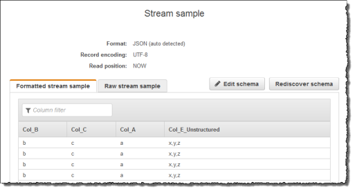
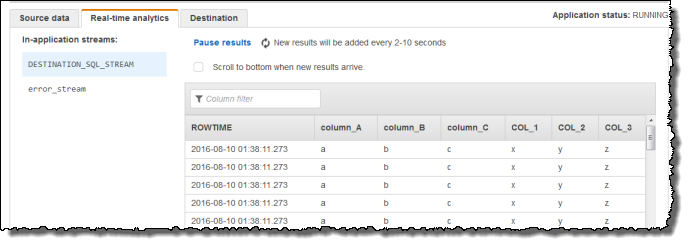

After careful consideration, we have decided to discontinue Amazon Kinesis
Data Analytics for SQL applications:

1. From **September 1, 2025**, we won't provide any bug fixes for Amazon Kinesis Data Analytics for SQL applications because we will have limited support for it, given the upcoming discontinuation.

2. From **October 15, 2025**, you will not be able to create new Kinesis Data Analytics for SQL
   applications.

3. We will delete your applications starting **January 27, 2026**. You will not be able to
   start or operate your Amazon Kinesis Data Analytics for SQL applications. Support will no longer
   be available for Amazon Kinesis Data Analytics for SQL from that time. For more information, see
   [Amazon Kinesis Data Analytics for SQL Applications discontinuation](discontinuation.md "discontinuation.md").

# Example: Split

Strings into Multiple Fields (VARIABLE_COLUMN_LOG_PARSE Function)

This example uses the `VARIABLE_COLUMN_LOG_PARSE` function to manipulate
strings in Kinesis Data Analytics. `VARIABLE_COLUMN_LOG_PARSE` splits an input string into
fields separated by a delimiter character or a delimiter string. For more information,
see [VARIABLE_COLUMN_LOG_PARSE](../sqlref/sql-reference-variable-column-log-parse.md "../sqlref/sql-reference-variable-column-log-parse.md") in the
_Amazon Managed Service for Apache Flink SQL Reference_.

In this example, you write semi-structured records to an Amazon Kinesis data stream. The
example records are as follows:

```
{ "Col_A" : "string",
  "Col_B" : "string",
  "Col_C" : "string",
  "Col_D_Unstructured" : "value,value,value,value"}
{ "Col_A" : "string",
  "Col_B" : "string",
  "Col_C" : "string",
  "Col_D_Unstructured" : "value,value,value,value"}
```

You then create an Kinesis Data Analytics application on the console, using the Kinesis
stream as the streaming source. The discovery process reads sample records on the
streaming source and infers an in-application schema with four columns, as shown
following:


Then, you use the application code with the `VARIABLE_COLUMN_LOG_PARSE`
function to parse the comma-separated values, and insert normalized rows in another
in-application stream, as shown following:



###### Topics

- [Step 1:
  Create a Kinesis Data Stream](#examples-transforming-strings-variablecolumnlogparse-1 "#examples-transforming-strings-variablecolumnlogparse-1")
- [Step 2:
  Create the Kinesis Data Analytics Application](#examples-transforming-strings-variablecolumnlogparse-2 "#examples-transforming-strings-variablecolumnlogparse-2")

## Step 1:

Create a Kinesis Data Stream

Create an Amazon Kinesis data stream and populate the log records as follows:

1. Sign in to the AWS Management Console and open the Kinesis console at
   [https://console.aws.amazon.com/kinesis](https://console.aws.amazon.com/kinesis "https://console.aws.amazon.com/kinesis").
2. Choose **Data Streams** in the navigation pane.
3. Choose **Create Kinesis stream**, and create a stream
   with one shard. For more information, see [Create a Stream](../../../streams/latest/dev/learning-kinesis-module-one-create-stream.md "../../../streams/latest/dev/learning-kinesis-module-one-create-stream.md") in the _Amazon Kinesis Data Streams Developer
   Guide_.
4. Run the following Python code to populate the sample log records. This
   simple code continuously writes the same log record to the stream.

```

import json
import boto3

STREAM_NAME = "ExampleInputStream"


def get_data():
    return {"Col_A": "a", "Col_B": "b", "Col_C": "c", "Col_E_Unstructured": "x,y,z"}


def generate(stream_name, kinesis_client):
    while True:
        data = get_data()
        print(data)
        kinesis_client.put_record(
            StreamName=stream_name, Data=json.dumps(data), PartitionKey="partitionkey"
        )


if __name__ == "__main__":
    generate(STREAM_NAME, boto3.client("kinesis"))

```

## Step 2:

Create the Kinesis Data Analytics Application

Create an Kinesis Data Analytics application as follows:

1. Open the Managed Service for Apache Flink console at
   [https://console.aws.amazon.com/kinesisanalytics](https://console.aws.amazon.com/kinesisanalytics "https://console.aws.amazon.com/kinesisanalytics").
2. Choose **Create application**, type an application name,
   and choose **Create application**.
3. On the application details page, choose **Connect streaming
   data**.
4. On the **Connect to source** page, do the
   following:
   1. Choose the stream that you created in the preceding
      section.
   2. Choose the option to create an IAM role.
   3. Choose **Discover schema**. Wait for the console
      to show the inferred schema and samples records used to infer the
      schema for the in-application stream created. Note that the inferred
      schema has only one column.
   4. Choose **Save and continue**.

5. On the application details page, choose **Go to SQL
   editor**. To start the application, choose **Yes, start
   application** in the dialog box that appears.
6. In the SQL editor, write application code, and verify the results:
   1. Copy the following application code and paste it into the
      editor:

   ```
   CREATE OR REPLACE STREAM "DESTINATION_SQL_STREAM"(
               "column_A" VARCHAR(16),
               "column_B" VARCHAR(16),
               "column_C" VARCHAR(16),
               "COL_1" VARCHAR(16),
               "COL_2" VARCHAR(16),
               "COL_3" VARCHAR(16));

   CREATE OR REPLACE PUMP "SECOND_STREAM_PUMP" AS
   INSERT INTO "DESTINATION_SQL_STREAM"
      SELECT STREAM  t."Col_A", t."Col_B", t."Col_C",
                     t.r."COL_1", t.r."COL_2", t.r."COL_3"
      FROM (SELECT STREAM
              "Col_A", "Col_B", "Col_C",
              VARIABLE_COLUMN_LOG_PARSE ("Col_E_Unstructured",
                                        'COL_1 TYPE VARCHAR(16), COL_2 TYPE VARCHAR(16), COL_3 TYPE VARCHAR(16)',
                                        ',') AS r
            FROM "SOURCE_SQL_STREAM_001") as t;
   ```

   2. Choose **Save and run SQL**. On the
      **Real-time analytics** tab, you can see all
      the in-application streams that the application created and verify
      the data.
