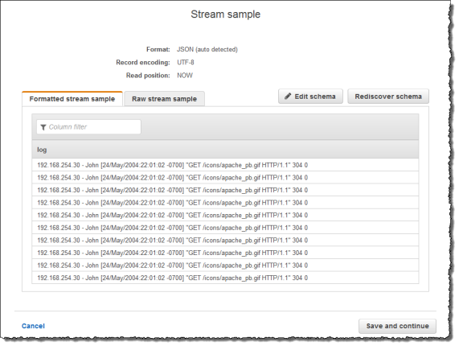
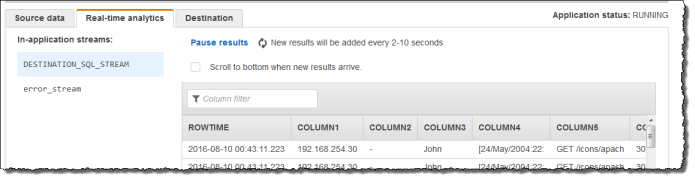

After careful consideration, we have decided to discontinue Amazon Kinesis
Data Analytics for SQL applications:

1. From **September 1, 2025**, we won't provide any bug fixes for Amazon Kinesis Data Analytics for SQL applications because we will have limited support for it, given the upcoming discontinuation.

2. From **October 15, 2025**, you will not be able to create new Kinesis Data Analytics for SQL
   applications.

3. We will delete your applications starting **January 27, 2026**. You will not be able to
   start or operate your Amazon Kinesis Data Analytics for SQL applications. Support will no longer
   be available for Amazon Kinesis Data Analytics for SQL from that time. For more information, see
   [Amazon Kinesis Data Analytics for SQL Applications discontinuation](discontinuation.md "discontinuation.md").

# Example: Parsing Web Logs

(W3C_LOG_PARSE Function)

This example uses the `W3C_LOG_PARSE` function to transform a string in
Amazon Kinesis Data Analytics. You can use `W3C_LOG_PARSE` to format Apache logs quickly. For
more information, see [W3C_LOG_PARSE](../sqlref/sql-reference-w3c-log-parse.md "../sqlref/sql-reference-w3c-log-parse.md") in the _Amazon Managed Service for Apache Flink SQL Reference_.

In this example, you write log records to an Amazon Kinesis data stream. Example logs are
shown following:

```
{"Log":"192.168.254.30 - John [24/May/2004:22:01:02 -0700] "GET /icons/apache_pba.gif HTTP/1.1" 304 0"}
{"Log":"192.168.254.30 - John [24/May/2004:22:01:03 -0700] "GET /icons/apache_pbb.gif HTTP/1.1" 304 0"}
{"Log":"192.168.254.30 - John [24/May/2004:22:01:04 -0700] "GET /icons/apache_pbc.gif HTTP/1.1" 304 0"}
...
```

You then create an Kinesis Data Analytics application on the console, with the Kinesis
data stream as the streaming source. The discovery process reads sample records on the
streaming source and infers an in-application schema with one column (log), as shown
following:


Then, you use the application code with the `W3C_LOG_PARSE` function to
parse the log, and create another in-application stream with various log fields in
separate columns, as shown following:



###### Topics

- [Step 1: Create a Kinesis
  Data Stream](#examples-transforming-strings-w3clogparse-1 "#examples-transforming-strings-w3clogparse-1")
- [Step 2: Create the
  Kinesis Data Analytics Application](#examples-transforming-strings-w3clogparse-2 "#examples-transforming-strings-w3clogparse-2")

## Step 1: Create a Kinesis

Data Stream

Create an Amazon Kinesis data stream, and populate the log records as follows:

1. Sign in to the AWS Management Console and open the Kinesis console at
   [https://console.aws.amazon.com/kinesis](https://console.aws.amazon.com/kinesis "https://console.aws.amazon.com/kinesis").
2. Choose **Data Streams** in the navigation pane.
3. Choose **Create Kinesis stream**, and create a stream
   with one shard. For more information, see [Create a Stream](../../../streams/latest/dev/learning-kinesis-module-one-create-stream.md "../../../streams/latest/dev/learning-kinesis-module-one-create-stream.md") in the _Amazon Kinesis Data Streams Developer
   Guide_.
4. Run the following Python code to populate the sample log records. This
   simple code continuously writes the same log record to the stream.

```

import json
import boto3

STREAM_NAME = "ExampleInputStream"


def get_data():
    return {
        "log": "192.168.254.30 - John [24/May/2004:22:01:02 -0700] "
        '"GET /icons/apache_pb.gif HTTP/1.1" 304 0'
    }


def generate(stream_name, kinesis_client):
    while True:
        data = get_data()
        print(data)
        kinesis_client.put_record(
            StreamName=stream_name, Data=json.dumps(data), PartitionKey="partitionkey"
        )


if __name__ == "__main__":
    generate(STREAM_NAME, boto3.client("kinesis"))

```

## Step 2: Create the

Kinesis Data Analytics Application

Create an Kinesis Data Analytics application as follows:

1. Open the Managed Service for Apache Flink console at
   [https://console.aws.amazon.com/kinesisanalytics](https://console.aws.amazon.com/kinesisanalytics "https://console.aws.amazon.com/kinesisanalytics").
2. Choose **Create application**, type an application name,
   and choose **Create application**.
3. On the application details page, choose **Connect streaming
   data**.
4. On the **Connect to source** page, do the
   following:
   1. Choose the stream that you created in the preceding section.
   2. Choose the option to create an IAM role.
   3. Choose **Discover schema**. Wait for the console
      to show the inferred schema and samples records used to infer the
      schema for the in-application stream created. The inferred schema
      has only one column.
   4. Choose **Save and continue**.

5. On the application details page, choose **Go to SQL
   editor**. To start the application, choose **Yes, start
   application** in the dialog box that appears.
6. In the SQL editor, write the application code, and verify the results as
   follows:
   1. Copy the following application code and paste it into the
      editor.

   ```
   CREATE OR REPLACE STREAM "DESTINATION_SQL_STREAM" (
   column1 VARCHAR(16),
   column2 VARCHAR(16),
   column3 VARCHAR(16),
   column4 VARCHAR(16),
   column5 VARCHAR(16),
   column6 VARCHAR(16),
   column7 VARCHAR(16));

   CREATE OR REPLACE PUMP "myPUMP" AS
   INSERT INTO "DESTINATION_SQL_STREAM"
           SELECT STREAM
               l.r.COLUMN1,
               l.r.COLUMN2,
               l.r.COLUMN3,
               l.r.COLUMN4,
               l.r.COLUMN5,
               l.r.COLUMN6,
               l.r.COLUMN7
           FROM (SELECT STREAM W3C_LOG_PARSE("log", 'COMMON')
                 FROM "SOURCE_SQL_STREAM_001") AS l(r);
   ```

   2. Choose **Save and run SQL**. On the
      **Real-time analytics** tab, you can see all
      the in-application streams that the application created and verify
      the data.
