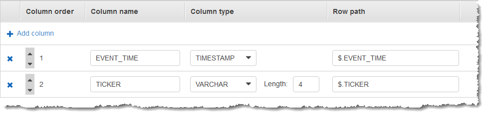
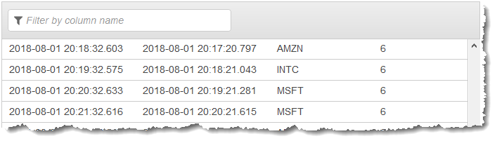

After careful consideration, we have decided to discontinue Amazon Kinesis
Data Analytics for SQL applications:

1. From **September 1, 2025**, we won't provide any bug fixes for Amazon Kinesis Data Analytics for SQL applications because we will have limited support for it, given the upcoming discontinuation.

2. From **October 15, 2025**, you will not be able to create new Kinesis Data Analytics for SQL
   applications.

3. We will delete your applications starting **January 27, 2026**. You will not be able to
   start or operate your Amazon Kinesis Data Analytics for SQL applications. Support will no longer
   be available for Amazon Kinesis Data Analytics for SQL from that time. For more information, see
   [Amazon Kinesis Data Analytics for SQL Applications discontinuation](discontinuation.md "discontinuation.md").

# Example: Stagger Window

When a windowed query processes separate windows for each unique partition key,
starting when data with the matching key arrives, the window is referred to as a
_stagger window_. For details, see [Stagger Windows](stagger-window-concepts.md "stagger-window-concepts.md"). This
Amazon Kinesis Data Analytics example uses the EVENT_TIME and TICKER columns to create stagger windows. The
source stream contains groups of six records with identical EVENT_TIME and TICKER values
that arrive within in a one-minute period, but not necessarily with the same minute
value (for example, `18:41:xx`).

In this example, you write the following records to a Kinesis data stream at the
following times. The script does not write the times to the stream, but the time that
the record is ingested by the application is written to the `ROWTIME`
field:

```
{"EVENT_TIME": "2018-08-01T20:17:20.797945", "TICKER": "AMZN"}   20:17:30
{"EVENT_TIME": "2018-08-01T20:17:20.797945", "TICKER": "AMZN"}   20:17:40
{"EVENT_TIME": "2018-08-01T20:17:20.797945", "TICKER": "AMZN"}   20:17:50
{"EVENT_TIME": "2018-08-01T20:17:20.797945", "TICKER": "AMZN"}   20:18:00
{"EVENT_TIME": "2018-08-01T20:17:20.797945", "TICKER": "AMZN"}   20:18:10
{"EVENT_TIME": "2018-08-01T20:17:20.797945", "TICKER": "AMZN"}   20:18:21
{"EVENT_TIME": "2018-08-01T20:18:21.043084", "TICKER": "INTC"}   20:18:31
{"EVENT_TIME": "2018-08-01T20:18:21.043084", "TICKER": "INTC"}   20:18:41
{"EVENT_TIME": "2018-08-01T20:18:21.043084", "TICKER": "INTC"}   20:18:51
{"EVENT_TIME": "2018-08-01T20:18:21.043084", "TICKER": "INTC"}   20:19:01
{"EVENT_TIME": "2018-08-01T20:18:21.043084", "TICKER": "INTC"}   20:19:11
{"EVENT_TIME": "2018-08-01T20:18:21.043084", "TICKER": "INTC"}   20:19:21
...
```

You then create a Kinesis Data Analytics application in the AWS Management Console, with the Kinesis data stream as the
streaming source. The discovery process reads sample records on the streaming source and
infers an in-application schema with two columns (`EVENT_TIME` and
`TICKER`) as shown following.


You use the application code with the `COUNT` function
to create a windowed aggregation of the data. Then you insert the resulting data into
another in-application stream, as shown in the following screenshot:


In the following procedure, you create a Kinesis Data Analytics application that aggregates values in
the input stream in a stagger window based on EVENT_TIME and TICKER.

###### Topics

- [Step 1: Create a Kinesis Data
  Stream](#examples-stagger-window-1 "#examples-stagger-window-1")
- [Step 2: Create the Kinesis Data Analytics
  Application](#examples-stagger-window-2 "#examples-stagger-window-2")

## Step 1: Create a Kinesis Data

Stream

Create an Amazon Kinesis data stream and populate the records as follows:

1. Sign in to the AWS Management Console and open the Kinesis console at
   [https://console.aws.amazon.com/kinesis](https://console.aws.amazon.com/kinesis "https://console.aws.amazon.com/kinesis").
2. Choose **Data Streams** in the navigation pane.
3. Choose **Create Kinesis stream**, and then create a
   stream with one shard. For more information, see [Create a Stream](../../../streams/latest/dev/learning-kinesis-module-one-create-stream.md "../../../streams/latest/dev/learning-kinesis-module-one-create-stream.md") in the _Amazon Kinesis Data Streams Developer
   Guide_.
4. To write records to a Kinesis data stream in a production environment, we
   recommend using either the [Kinesis Producer Library](../../../streams/latest/dev/developing-producers-with-kpl.md "../../../streams/latest/dev/developing-producers-with-kpl.md") or [Kinesis Data Streams API](../../../streams/latest/dev/developing-producers-with-sdk.md "../../../streams/latest/dev/developing-producers-with-sdk.md"). For simplicity, this example uses the
   following Python script to generate records. Run the code to populate the
   sample ticker records. This simple code continuously writes a group of six
   records with the same random `EVENT_TIME` and ticker symbol to
   the stream, over the course of one minute. Keep the script running so that
   you can generate the application schema in a later step.

```

import datetime
import json
import random
import time
import boto3

STREAM_NAME = "ExampleInputStream"


def get_data():
    event_time = datetime.datetime.utcnow() - datetime.timedelta(seconds=10)
    return {
        "EVENT_TIME": event_time.isoformat(),
        "TICKER": random.choice(["AAPL", "AMZN", "MSFT", "INTC", "TBV"]),
    }


def generate(stream_name, kinesis_client):
    while True:
        data = get_data()
        # Send six records, ten seconds apart, with the same event time and ticker
        for _ in range(6):
            print(data)
            kinesis_client.put_record(
                StreamName=stream_name,
                Data=json.dumps(data),
                PartitionKey="partitionkey",
            )
            time.sleep(10)


if __name__ == "__main__":
    generate(STREAM_NAME, boto3.client("kinesis"))

```

## Step 2: Create the Kinesis Data Analytics

Application

Create a Kinesis Data Analytics application as follows:

1. Open the Managed Service for Apache Flink console at
   [https://console.aws.amazon.com/kinesisanalytics](https://console.aws.amazon.com/kinesisanalytics "https://console.aws.amazon.com/kinesisanalytics").
2. Choose **Create application**, type an application name,
   and choose **Create application**.
3. On the application details page, choose **Connect streaming
   data** to connect to the source.
4. On the **Connect to source** page, do the
   following:
   1. Choose the stream that you created in the preceding section.
   2. Choose **Discover Schema**. Wait for the console to show the inferred schema and samples
      records that are used to infer the schema for the in-application
      stream created. The inferred schema has two columns.
   3. Choose **Edit Schema**. Change the
      **Column type** of the
      **EVENT_TIME** column to
      `TIMESTAMP`.
   4. Choose **Save schema and update stream samples**.
      After the console saves the schema, choose
      **Exit**.
   5. Choose **Save and continue**.

5. On the application details page, choose **Go to SQL
   editor**. To start the application, choose **Yes, start
   application** in the dialog box that appears.
6. In the SQL editor, write the application code, and verify the results as
   follows:
   1. Copy the following application code and paste it into the
      editor.

   ```
   CREATE OR REPLACE STREAM "DESTINATION_SQL_STREAM" (
       event_time TIMESTAMP,
       ticker_symbol    VARCHAR(4),
       ticker_count     INTEGER);

   CREATE OR REPLACE PUMP "STREAM_PUMP" AS
     INSERT INTO "DESTINATION_SQL_STREAM"
       SELECT STREAM
           EVENT_TIME,
           TICKER,
           COUNT(TICKER) AS ticker_count
       FROM "SOURCE_SQL_STREAM_001"
       WINDOWED BY STAGGER (
               PARTITION BY TICKER, EVENT_TIME RANGE INTERVAL '1' MINUTE);
   ```

   2. Choose **Save and run SQL**.

   On the **Real-time analytics** tab, you can see
   all the in-application streams that the application created and
   verify the data.
