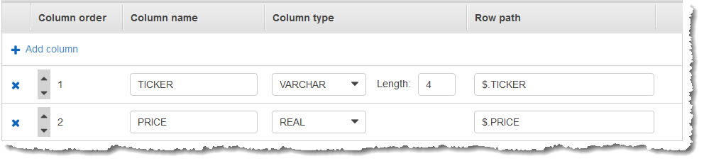
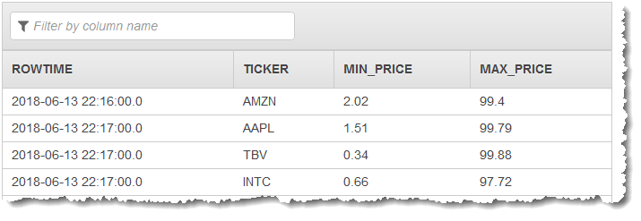

After careful consideration, we have decided to discontinue Amazon Kinesis
Data Analytics for SQL applications:

1. From **September 1, 2025**, we won't provide any bug fixes for Amazon Kinesis Data Analytics for SQL applications because we will have limited support for it, given the upcoming discontinuation.

2. From **October 15, 2025**, you will not be able to create new Kinesis Data Analytics for SQL
   applications.

3. We will delete your applications starting **January 27, 2026**. You will not be able to
   start or operate your Amazon Kinesis Data Analytics for SQL applications. Support will no longer
   be available for Amazon Kinesis Data Analytics for SQL from that time. For more information, see
   [Amazon Kinesis Data Analytics for SQL Applications discontinuation](discontinuation.md "discontinuation.md").

# Example: Tumbling Window Using

ROWTIME

When a windowed query processes each window in a non-overlapping manner, the window is
referred to as a _tumbling window_. For details, see [Tumbling Windows (Aggregations Using
GROUP BY)](tumbling-window-concepts.md "tumbling-window-concepts.md"). This
Amazon Kinesis Data Analytics example uses the `ROWTIME` column to create tumbling windows. The
`ROWTIME` column represents the time the record was read by the
application.

In this example, you write the following records to a Kinesis data stream.

```
{"TICKER": "TBV", "PRICE": 33.11}
{"TICKER": "INTC", "PRICE": 62.04}
{"TICKER": "MSFT", "PRICE": 40.97}
{"TICKER": "AMZN", "PRICE": 27.9}
...
```

You then create a Kinesis Data Analytics application in the AWS Management Console, with the Kinesis data stream as the
streaming source. The discovery process reads sample records on the streaming source and
infers an in-application schema with two columns (`TICKER` and
`PRICE`) as shown following.


You use the application code with the `MIN` and `MAX` functions
to create a windowed aggregation of the data. Then you insert the resulting data into
another in-application stream, as shown in the following screenshot:


In the following procedure, you create a Kinesis Data Analytics application that aggregates values in
the input stream in a tumbling window based on ROWTIME.

###### Topics

- [Step 1: Create a Kinesis Data
  Stream](#examples-tumbling-window-1 "#examples-tumbling-window-1")
- [Step 2: Create the Kinesis Data Analytics
  Application](#examples-tumbling-window-2 "#examples-tumbling-window-2")

## Step 1: Create a Kinesis Data

Stream

Create an Amazon Kinesis data stream and populate the records as follows:

1. Sign in to the AWS Management Console and open the Kinesis console at
   [https://console.aws.amazon.com/kinesis](https://console.aws.amazon.com/kinesis "https://console.aws.amazon.com/kinesis").
2. Choose **Data Streams** in the navigation pane.
3. Choose **Create Kinesis stream**, and then create a
   stream with one shard. For more information, see [Create a Stream](../../../streams/latest/dev/learning-kinesis-module-one-create-stream.md "../../../streams/latest/dev/learning-kinesis-module-one-create-stream.md") in the _Amazon Kinesis Data Streams Developer
   Guide_.
4. To write records to a Kinesis data stream in a production environment, we
   recommend using either the [Kinesis Client Library](../../../streams/latest/dev/developing-producers-with-kpl.md "../../../streams/latest/dev/developing-producers-with-kpl.md") or [Kinesis Data Streams API](../../../streams/latest/dev/developing-producers-with-sdk.md "../../../streams/latest/dev/developing-producers-with-sdk.md"). For simplicity, this example uses the
   following Python script to generate records. Run the code to populate the
   sample ticker records. This simple code continuously writes a random ticker
   record to the stream. Keep the script running so that you can generate the
   application schema in a later step.

```

import datetime
import json
import random
import boto3

STREAM_NAME = "ExampleInputStream"


def get_data():
    return {
        "EVENT_TIME": datetime.datetime.now().isoformat(),
        "TICKER": random.choice(["AAPL", "AMZN", "MSFT", "INTC", "TBV"]),
        "PRICE": round(random.random() * 100, 2),
    }


def generate(stream_name, kinesis_client):
    while True:
        data = get_data()
        print(data)
        kinesis_client.put_record(
            StreamName=stream_name, Data=json.dumps(data), PartitionKey="partitionkey"
        )


if __name__ == "__main__":
    generate(STREAM_NAME, boto3.client("kinesis"))

```

## Step 2: Create the Kinesis Data Analytics

Application

Create a Kinesis Data Analytics application as follows:

1. Open the Managed Service for Apache Flink console at
   [https://console.aws.amazon.com/kinesisanalytics](https://console.aws.amazon.com/kinesisanalytics "https://console.aws.amazon.com/kinesisanalytics").
2. Choose **Create application**, enter an application name,
   and choose **Create application**.
3. On the application details page, choose **Connect streaming
   data** to connect to the source.
4. On the **Connect to source** page, do the
   following:
   1. Choose the stream that you created in the preceding section.
   2. Choose **Discover Schema**. Wait for the console to show the inferred schema and samples
      records that are used to infer the schema for the in-application
      stream created. The inferred schema has two columns.
   3. Choose **Save schema and update stream samples**.
      After the console saves the schema, choose
      **Exit**.
   4. Choose **Save and continue**.

5. On the application details page, choose **Go to SQL
   editor**. To start the application, choose **Yes, start
   application** in the dialog box that appears.
6. In the SQL editor, write the application code, and verify the results as
   follows:
   1. Copy the following application code and paste it into the
      editor.

   ```
   CREATE OR REPLACE STREAM "DESTINATION_SQL_STREAM" (TICKER VARCHAR(4), MIN_PRICE REAL, MAX_PRICE REAL);

   CREATE OR REPLACE PUMP "STREAM_PUMP" AS INSERT INTO "DESTINATION_SQL_STREAM"
       SELECT STREAM TICKER, MIN(PRICE), MAX(PRICE)
           FROM "SOURCE_SQL_STREAM_001"
           GROUP BY TICKER,
               STEP("SOURCE_SQL_STREAM_001".ROWTIME BY INTERVAL '60' SECOND);
   ```

   2. Choose **Save and run SQL**.

   On the **Real-time analytics** tab, you can see
   all the in-application streams that the application created and
   verify the data.
