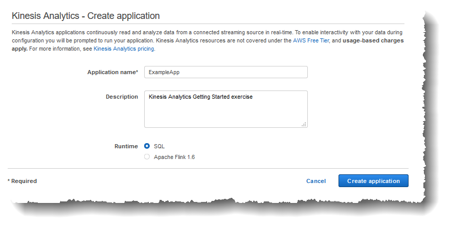

After careful consideration, we have decided to discontinue Amazon Kinesis
Data Analytics for SQL applications:

1. From **September 1, 2025**, we won't provide any bug fixes for Amazon Kinesis Data Analytics for SQL applications because we will have limited support for it, given the upcoming discontinuation.

2. From **October 15, 2025**, you will not be able to create new Kinesis Data Analytics for SQL
   applications.

3. We will delete your applications starting **January 27, 2026**. You will not be able to
   start or operate your Amazon Kinesis Data Analytics for SQL applications. Support will no longer
   be available for Amazon Kinesis Data Analytics for SQL from that time. For more information, see
   [Amazon Kinesis Data Analytics for SQL Applications discontinuation](discontinuation.md "discontinuation.md").

# Step 3.1: Create an Application

In this section, you create an Amazon Kinesis Data Analytics application. You configure
application input in the next step.

###### To create a data analytics application

1. Sign in to the AWS Management Console and open the Managed Service for Apache Flink console at
   [https://console.aws.amazon.com/kinesisanalytics](https://console.aws.amazon.com/kinesisanalytics "https://console.aws.amazon.com/kinesisanalytics").
2. Choose **Create application**.
3. On the **Create application** page, type an application name, type a
   description, choose **SQL** for the application's **Runtime** setting, and then choose **Create application**.

Doing this creates a Kinesis Data Analytics application with a status of
READY. The console shows the application hub where you can configure input
and output.

###### Note

To create an application, the [CreateApplication](API_CreateApplication.md "API_CreateApplication.md") operation requires only the
application name. You can add input and output configuration after
you create an application in the console.

In the next step, you configure input for the application. In the input
configuration, you add a streaming data source to the application and
discover a schema for an in-application input stream by sampling data on the
streaming source.

###### Next Step

[Step 3.2: Configure Input](get-started-configure-input.md "get-started-configure-input.md")
