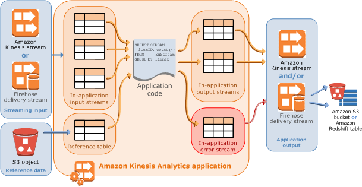

After careful consideration, we have decided to discontinue Amazon Kinesis
Data Analytics for SQL applications:

1. From **September 1, 2025**, we won't provide any bug fixes for Amazon Kinesis Data Analytics for SQL applications because we will have limited support for it, given the upcoming discontinuation.

2. From **October 15, 2025**, you will not be able to create new Kinesis Data Analytics for SQL
   applications.

3. We will delete your applications starting **January 27, 2026**. You will not be able to
   start or operate your Amazon Kinesis Data Analytics for SQL applications. Support will no longer
   be available for Amazon Kinesis Data Analytics for SQL from that time. For more information, see
   [Amazon Kinesis Data Analytics for SQL Applications discontinuation](discontinuation.md "discontinuation.md").

# Amazon Kinesis Data Analytics for SQL Applications: How It Works

###### Note

After September 12, 2023, you will not able to create new applications using Kinesis Data Firehose as a source if you do not already use Kinesis Data Analytics for SQL. For more information, see [Limits](limits.md "limits.md").

An _application_ is the primary resource in Amazon Kinesis Data Analytics that you can
create in your account. You can create and manage applications using the AWS Management Console or the
Kinesis Data Analytics API. Kinesis Data Analytics provides API operations to manage applications. For a list of API
operations, see [Actions](API_Operations.md "API_Operations.md").

Kinesis Data Analytics applications continuously read and process streaming data in real time. You write
application code using SQL to process the incoming streaming data and produce output. Then,
Kinesis Data Analytics writes the output to a configured destination. The following diagram illustrates a
typical application architecture.

Each application has a name, description, version ID, and status. Amazon Kinesis Data Analytics assigns a
version ID when you first create an application. This version ID is updated when you update
any application configuration. For example, if you add an input configuration, add or delete
a reference data source, add or delete an output configuration, or update application code,
Kinesis Data Analytics updates the current application version ID. Kinesis Data Analytics also maintains timestamps for when
an application was created and last updated.

In addition to these basic properties, each application consists of the
following:

- **Input** – The streaming source for your
  application. You can select either a Kinesis data stream or a Firehose data delivery
  stream as the streaming source. In the input configuration, you map the streaming
  source to an in-application input stream. The in-application stream is like a
  continuously updating table upon which you can perform the `SELECT` and
  `INSERT SQL` operations. In your application code, you can create
  additional in-application streams to store intermediate query results.

 

You can optionally partition a single streaming source in multiple
in-application input streams to improve the throughput. For more information,
see [Limits](limits.md "limits.md") and
[Configuring Application Input](how-it-works-input.md "how-it-works-input.md").

 

Amazon Kinesis Data Analytics provides a timestamp column in each application stream called [Timestamps and the ROWTIME Column](timestamps-rowtime-concepts.md "timestamps-rowtime-concepts.md"). You can use this column in
time-based windowed queries. For more information, see [Windowed Queries](windowed-sql.md "windowed-sql.md").

 

You can optionally configure a reference data source to enrich your input data
stream within the application. It results in an in-application reference table. You
must store your reference data as an object in your S3 bucket. When the application
starts, Amazon Kinesis Data Analytics reads the Amazon S3 object and creates an in-application table. For
more information, see [Configuring Application Input](how-it-works-input.md "how-it-works-input.md").

- **Application code** – A series of SQL
  statements that process input and produce output. You can write SQL statements
  against in-application streams and reference tables. You can also write JOIN queries
  to combine data from both of these sources.

 

For information about the SQL language elements that are supported by Kinesis Data Analytics,
see [Amazon Kinesis Data Analytics SQL
Reference](../sqlref/analytics-sql-reference.md "../sqlref/analytics-sql-reference.md").

 

In its simplest form, application code can be a single SQL statement that
selects from a streaming input and inserts results into a streaming output. It can
also be a series of SQL statements where output of one feeds into the input of the
next SQL statement. Further, you can write application code to split an input stream
into multiple streams. You can then apply additional queries to process these
streams. For more information, see [Application Code](how-it-works-app-code.md "how-it-works-app-code.md").

- **Output** – In application code, query
  results go to in-application streams. In your application code, you can create one
  or more in-application streams to hold intermediate results. You can then optionally
  configure the application output to persist data in the in-application streams that
  hold your application output (also referred to as in-application output streams) to
  external destinations. External destinations can be a Firehose delivery stream or a
  Kinesis data stream. Note the following about these destinations:

      + You can configure a Firehose delivery stream to write results to
       Amazon S3, Amazon Redshift, or Amazon OpenSearch Service (OpenSearch Service).
      + You can also write application output to a custom destination
       instead of Amazon S3 or Amazon Redshift. To do that, you specify a Kinesis data stream as the
       destination in your output configuration. Then, you configure AWS Lambda to
       poll the stream and invoke your Lambda function. Your Lambda function code
       receives stream data as input. In your Lambda function code, you can write
       the incoming data to your custom destination. For more information, see
       [Using AWS Lambda with
       Amazon Kinesis Data Analytics](../../../lambda/latest/dg/with-kinesis.md "../../../lambda/latest/dg/with-kinesis.md").

  For more information, see [Configuring Application Output](how-it-works-output.md "how-it-works-output.md").
  In addition, note the following:

- Amazon Kinesis Data Analytics needs permissions to read records from a streaming
  source and write application output to the external destinations. You use IAM
  roles to grant these permissions.
- Kinesis Data Analytics automatically provides an in-application error stream for each
  application. If your application has issues while processing certain records (for
  example, because of a type mismatch or late arrival), that record is written to the
  error stream. You can configure application output to direct Kinesis Data Analytics to persist the
  error stream data to an external destination for further evaluation. For more
  information, see [Error Handling](error-handling.md "error-handling.md").
- Amazon Kinesis Data Analytics ensures that your application output records are written to the
  configured destination. It uses an "at least once" processing and delivery model,
  even if you experience an application interruption. For more information, see [Delivery Model for Persisting Application Output to an
  External Destination](failover-checkpoint.md "failover-checkpoint.md").

######

- [Configuring Application Input](how-it-works-input.md "how-it-works-input.md")
- [Application Code](how-it-works-app-code.md "how-it-works-app-code.md")
- [Configuring Application Output](how-it-works-output.md "how-it-works-output.md")
- [Error Handling](error-handling.md "error-handling.md")
- [Automatically Scaling Applications to Increase
  Throughput](how-it-works-autoscaling.md "how-it-works-autoscaling.md")
- [Using Tagging](how-tagging.md "how-tagging.md")
