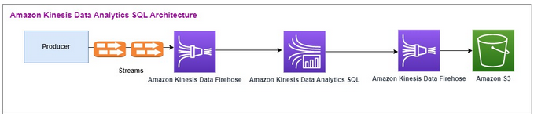
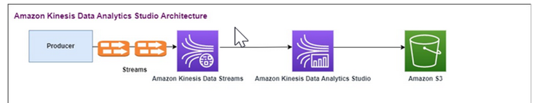
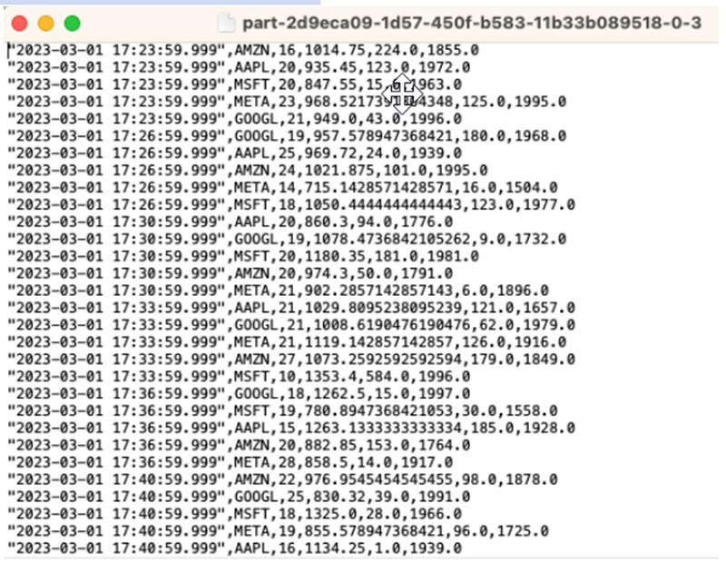
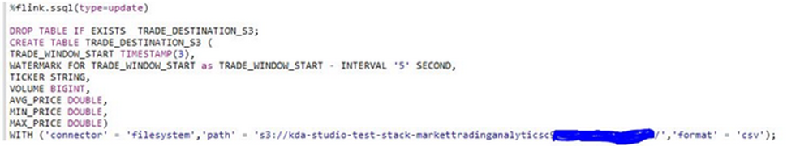
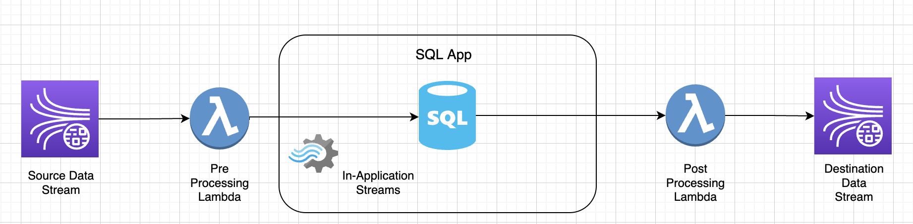
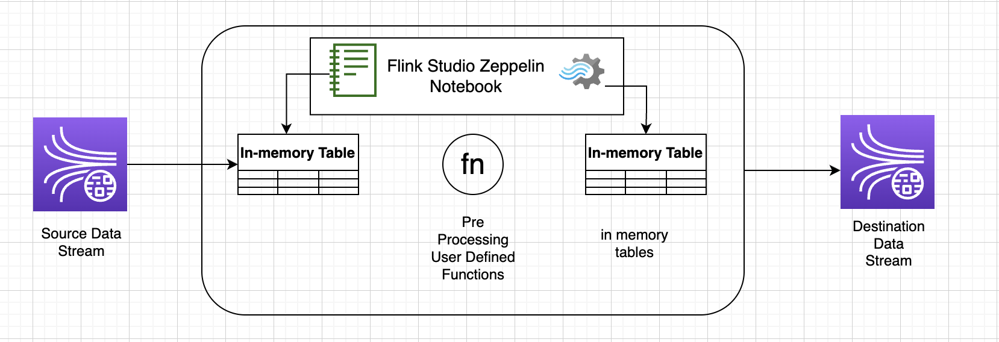

After careful consideration, we have decided to discontinue Amazon Kinesis
Data Analytics for SQL applications:

1. From **September 1, 2025**, we won't provide any bug fixes for Amazon Kinesis Data Analytics for SQL applications because we will have limited support for it, given the upcoming discontinuation.

2. From **October 15, 2025**, you will not be able to create new Kinesis Data Analytics for SQL
   applications.

3. We will delete your applications starting **January 27, 2026**. You will not be able to
   start or operate your Amazon Kinesis Data Analytics for SQL applications. Support will no longer
   be available for Amazon Kinesis Data Analytics for SQL from that time. For more information, see
   [Amazon Kinesis Data Analytics for SQL Applications discontinuation](discontinuation.md "discontinuation.md").

# Migrating to Managed Service for Apache

Flink Studio Examples

After careful consideration, we have made the decision to discontinue Amazon Kinesis Data Analytics for SQL applications. To help you plan and migrate away from Amazon Kinesis Data Analytics for SQL applications, we will discontinue the offering gradually over 15 months. These are important dates to note, **September 1, 2025**, **October 15, 2025**, and **January 27, 2026**.

1. From **September 1, 2025**, we won't provide any bug fixes for Amazon Kinesis Data Analytics for SQL applications because we will have limited support for it, given the upcoming discontinuation.
2. From **October 15, 2025**, you will not be able to create new Amazon Kinesis Data Analytics for SQL applications.
3. We will delete your applications starting **January 27, 2026**. You will not be able to start or operate your Amazon Kinesis Data Analytics for SQL applications. Support will no longer be available for Amazon Kinesis Data Analytics for SQL applications from that time. To learn more, see [Amazon Kinesis Data Analytics for SQL Applications discontinuation](discontinuation.md "discontinuation.md").
   We recommend that you use [Amazon Managed Service for Apache Flink](../../../managed-flink/latest/java/what-is.md "../../../managed-flink/latest/java/what-is.md"). It combines ease of
   use with advanced analytical capabilities, letting you build stream processing applications in
   minutes.

This section provides code and architecture examples to help you move your Amazon Kinesis Data Analytics
for SQL applications workloads to Managed Service for Apache Flink.

For additional information, also see this [AWS blog post: Migrate from Amazon Kinesis Data Analytics for SQL Applications to Managed Service for Apache Flink
Studio](https://aws.amazon.com/blogs/big-data/migrate-from-amazon-kinesis-data-analytics-for-sql-applications-to-amazon-managed-service-for-apache-flink-studio/ "https://aws.amazon.com/blogs/big-data/migrate-from-amazon-kinesis-data-analytics-for-sql-applications-to-amazon-managed-service-for-apache-flink-studio/").

To migrate your workloads to Managed Service for Apache Flink Studio or Managed Service
for Apache Flink, this section provides query translations you can use for common use
cases.

Before you explore these examples, we recommend you first review [Using a Studio
notebook with a Managed Service for Apache Flink](../../../managed-flink/latest/java/how-notebook.md "../../../managed-flink/latest/java/how-notebook.md").

### Re-creating Kinesis Data Analytics for SQL queries in

Managed Service for Apache Flink Studio

The following options provide translations of common SQL-based Kinesis Data Analytics application queries to
Managed Service for Apache Flink Studio.

SQL-based Kinesis Data Analytics application

```
CREATE
OR REPLACE STREAM "IN_APP_STREAM_001" (
   ingest_time TIMESTAMP,
   ticker_symbol VARCHAR(4),
   sector VARCHAR(16), price REAL, change REAL);
CREATE
OR REPLACE PUMP "STREAM_PUMP_001" AS
INSERT INTO
   "IN_APP_STREAM_001"
   SELECT
      STREAM APPROXIMATE_ARRIVAL_TIME,
      ticker_symbol,
      sector,
      price,
      change FROM "SOURCE_SQL_STREAM_001";
-- Second in-app stream and pump
CREATE
OR REPLACE STREAM "IN_APP_STREAM_02" (ingest_time TIMESTAMP,
   ticker_symbol VARCHAR(4),
   sector VARCHAR(16),
   price REAL,
   change REAL);
CREATE
OR REPLACE PUMP "STREAM_PUMP_02" AS
INSERT INTO
   "IN_APP_STREAM_02"
   SELECT
      STREAM ingest_time,
      ticker_symbol,
      sector,
      price,
      change FROM "IN_APP_STREAM_001";
-- Destination in-app stream and third pump
CREATE
OR REPLACE STREAM "DESTINATION_SQL_STREAM" (ingest_time TIMESTAMP,
   ticker_symbol VARCHAR(4),
   sector VARCHAR(16),
   price REAL,
   change REAL);
CREATE
OR REPLACE PUMP "STREAM_PUMP_03" AS
INSERT INTO
   "DESTINATION_SQL_STREAM"
   SELECT
      STREAM ingest_time,
      ticker_symbol,
      sector,
      price,
      change FROM "IN_APP_STREAM_02";
```

Managed Service for Apache Flink Studio

```
Query 1 - % flink.ssql DROP TABLE IF EXISTS SOURCE_SQL_STREAM_001;

CREATE TABLE SOURCE_SQL_STREAM_001 (TICKER_SYMBOL VARCHAR(4),
   SECTOR VARCHAR(16),
   PRICE DOUBLE,
   CHANGE DOUBLE,
   APPROXIMATE_ARRIVAL_TIME TIMESTAMP(3) METADATA

FROM
   'timestamp' VIRTUAL,
   WATERMARK FOR APPROXIMATE_ARRIVAL_TIME AS APPROXIMATE_ARRIVAL_TIME - INTERVAL '1' SECOND )
   PARTITIONED BY (TICKER_SYMBOL) WITH (
      'connector' = 'kinesis',
      'stream' = 'kinesis-analytics-demo-stream',
      'aws.region' = 'us-east-1',
      'scan.stream.initpos' = 'LATEST',
      'format' = 'json',
      'json.timestamp-format.standard' = 'ISO-8601');
DROP TABLE IF EXISTS IN_APP_STREAM_001;

CREATE TABLE IN_APP_STREAM_001 (
   INGEST_TIME TIMESTAMP,
   TICKER_SYMBOL VARCHAR(4),
   SECTOR VARCHAR(16),
   PRICE DOUBLE,
   CHANGE DOUBLE )
PARTITIONED BY (TICKER_SYMBOL) WITH (
      'connector' = 'kinesis',
      'stream' = 'IN_APP_STREAM_001',
      'aws.region' = 'us-east-1',
      'scan.stream.initpos' = 'LATEST',
      'format' = 'json',
      'json.timestamp-format.standard' = 'ISO-8601');

DROP TABLE IF EXISTS IN_APP_STREAM_02;

CREATE TABLE IN_APP_STREAM_02 (
   INGEST_TIME TIMESTAMP,
   TICKER_SYMBOL VARCHAR(4),
   SECTOR VARCHAR(16),
   PRICE DOUBLE,
   CHANGE DOUBLE )
PARTITIONED BY (TICKER_SYMBOL) WITH (
   'connector' = 'kinesis',
   'stream' = 'IN_APP_STREAM_02',
   'aws.region' = 'us-east-1',
   'scan.stream.initpos' = 'LATEST',
   'format' = 'json',
   'json.timestamp-format.standard' = 'ISO-8601');

DROP TABLE IF EXISTS DESTINATION_SQL_STREAM;

CREATE TABLE DESTINATION_SQL_STREAM (
   INGEST_TIME TIMESTAMP, TICKER_SYMBOL VARCHAR(4), SECTOR VARCHAR(16),
   PRICE DOUBLE, CHANGE DOUBLE )
PARTITIONED BY (TICKER_SYMBOL) WITH (
   'connector' = 'kinesis',
   'stream' = 'DESTINATION_SQL_STREAM',
   'aws.region' = 'us-east-1',
   'scan.stream.initpos' = 'LATEST',
   'format' = 'json',
   'json.timestamp-format.standard' = 'ISO-8601');


Query 2 - % flink.ssql(type =
update
)
   INSERT INTO
      IN_APP_STREAM_001
      SELECT
         APPROXIMATE_ARRIVAL_TIME AS INGEST_TIME,
         TICKER_SYMBOL,
         SECTOR,
         PRICE,
         CHANGE
      FROM
         SOURCE_SQL_STREAM_001;


Query 3 - % flink.ssql(type =
update
)
   INSERT INTO
      IN_APP_STREAM_02
      SELECT
         INGEST_TIME,
         TICKER_SYMBOL,
         SECTOR,
         PRICE,
         CHANGE
      FROM
         IN_APP_STREAM_001;


Query 4 - % flink.ssql(type =
update
)
   INSERT INTO
      DESTINATION_SQL_STREAM
      SELECT
         INGEST_TIME,
         TICKER_SYMBOL,
         SECTOR,
         PRICE,
         CHANGE
      FROM
         IN_APP_STREAM_02;
```

SQL-based Kinesis Data Analytics application

```
CREATE
OR REPLACE STREAM "DESTINATION_SQL_STREAM" (
   TICKER VARCHAR(4),
   event_time TIMESTAMP,
   five_minutes_before TIMESTAMP,
   event_unix_timestamp BIGINT,
   event_timestamp_as_char VARCHAR(50),
   event_second INTEGER);

CREATE
OR REPLACE PUMP "STREAM_PUMP" AS
INSERT INTO
   "DESTINATION_SQL_STREAM"
   SELECT
      STREAM TICKER,
      EVENT_TIME,
      EVENT_TIME - INTERVAL '5' MINUTE,
      UNIX_TIMESTAMP(EVENT_TIME),
      TIMESTAMP_TO_CHAR('yyyy-MM-dd hh:mm:ss', EVENT_TIME),
      EXTRACT(SECOND
   FROM
      EVENT_TIME)
   FROM
      "SOURCE_SQL_STREAM_001"
```

Managed Service for Apache Flink Studio

```
Query 1 - % flink.ssql(type =
update
) CREATE TABLE DESTINATION_SQL_STREAM (
   TICKER VARCHAR(4),
   EVENT_TIME TIMESTAMP(3),
   FIVE_MINUTES_BEFORE TIMESTAMP(3),
   EVENT_UNIX_TIMESTAMP INT,
   EVENT_TIMESTAMP_AS_CHAR VARCHAR(50),
   EVENT_SECOND INT)

PARTITIONED BY (TICKER) WITH (
   'connector' = 'kinesis', 'stream' = 'kinesis-analytics-demo-stream',
   'aws.region' = 'us-east-1',
   'scan.stream.initpos' = 'LATEST',
   'format' = 'json',
   'json.timestamp-format.standard' = 'ISO-8601')

Query 2 - % flink.ssql(type =
   update
)
      SELECT
         TICKER,
         EVENT_TIME,
         EVENT_TIME - INTERVAL '5' MINUTE AS FIVE_MINUTES_BEFORE,
         UNIX_TIMESTAMP() AS EVENT_UNIX_TIMESTAMP,
         DATE_FORMAT(EVENT_TIME, 'yyyy-MM-dd hh:mm:ss') AS EVENT_TIMESTAMP_AS_CHAR,
         EXTRACT(SECOND
      FROM
         EVENT_TIME) AS EVENT_SECOND
      FROM
         DESTINATION_SQL_STREAM;
```

SQL-based Kinesis Data Analytics application

```
CREATE
OR REPLACE STREAM "DESTINATION_SQL_STREAM"(
   ticker_symbol VARCHAR(4),
   sector VARCHAR(12),
   change DOUBLE,
   price DOUBLE);

CREATE
OR REPLACE PUMP "STREAM_PUMP" AS INSERT INTO "DESTINATION_SQL_STREAM"
SELECT
   STREAM ticker_symbol,
   sector,
   change,
   price
FROM
   "SOURCE_SQL_STREAM_001"
WHERE
   (
      ABS(Change / (Price - Change)) * 100
   )
   > 1
```

Managed Service for Apache Flink Studio

```
Query 1 - % flink.ssql(type =
update
) DROP TABLE IF EXISTS DESTINATION_SQL_STREAM;

CREATE TABLE DESTINATION_SQL_STREAM (
   TICKER_SYMBOL VARCHAR(4),
   SECTOR VARCHAR(4),
   CHANGE DOUBLE,
   PRICE DOUBLE )
PARTITIONED BY (TICKER_SYMBOL) WITH (
   'connector' = 'kinesis',
   'stream' = 'kinesis-analytics-demo-stream',
   'aws.region' = 'us-east-1',
   'scan.stream.initpos' = 'LATEST',
   'format' = 'json',
   'json.timestamp-format.standard' = 'ISO-8601');

Query 2 - % flink.ssql(type =
update
)
   SELECT
      TICKER_SYMBOL,
      SECTOR,
      CHANGE,
      PRICE
   FROM
      DESTINATION_SQL_STREAM
   WHERE
      (
         ABS(CHANGE / (PRICE - CHANGE)) * 100
      )
      > 1;
```

SQL-based Kinesis Data Analytics application

```
CREATE
OR REPLACE STREAM "CHANGE_STREAM"(
   ticker_symbol VARCHAR(4),
   sector VARCHAR(12),
   change DOUBLE,
   price DOUBLE);

CREATE
OR REPLACE PUMP "change_pump" AS INSERT INTO "CHANGE_STREAM"
SELECT
   STREAM ticker_symbol,
   sector,
   change,
   price
FROM "SOURCE_SQL_STREAM_001"
WHERE
   (
      ABS(Change / (Price - Change)) * 100
   )
   > 1;
-- ** Trigger Count and Limit **
-- Counts "triggers" or those values that evaluated true against the previous where clause
-- Then provides its own limit on the number of triggers per hour per ticker symbol to what is specified in the WHERE clause

CREATE
OR REPLACE STREAM TRIGGER_COUNT_STREAM (
   ticker_symbol VARCHAR(4),
   change REAL,
   trigger_count INTEGER);

CREATE
OR REPLACE PUMP trigger_count_pump AS
INSERT INTO
   TRIGGER_COUNT_STREAMSELECT STREAM ticker_symbol,
   change,
   trigger_count
FROM
   (
      SELECT
         STREAM ticker_symbol,
         change,
         COUNT(*) OVER W1 as trigger_countFROM "CHANGE_STREAM" --window to perform aggregations over last minute to keep track of triggers
         WINDOW W1 AS
         (
            PARTITION BY ticker_symbol RANGE INTERVAL '1' MINUTE PRECEDING
         )
   )
WHERE
   trigger_count >= 1;
```

Managed Service for Apache Flink Studio

```
Query 1 - % flink.ssql(type =
update
) DROP TABLE IF EXISTS DESTINATION_SQL_STREAM;

CREATE TABLE DESTINATION_SQL_STREAM (
   TICKER_SYMBOL VARCHAR(4),
   SECTOR VARCHAR(4),
   CHANGE DOUBLE, PRICE DOUBLE,
   EVENT_TIME AS PROCTIME())
PARTITIONED BY (TICKER_SYMBOL)
WITH (
   'connector' = 'kinesis',
   'stream' = 'kinesis-analytics-demo-stream',
   'aws.region' = 'us-east-1',
   'scan.stream.initpos' = 'LATEST',
   'format' = 'json',
   'json.timestamp-format.standard' = 'ISO-8601');
DROP TABLE IF EXISTS TRIGGER_COUNT_STREAM;
CREATE TABLE TRIGGER_COUNT_STREAM (
   TICKER_SYMBOL VARCHAR(4),
   CHANGE DOUBLE,
   TRIGGER_COUNT INT)
PARTITIONED BY (TICKER_SYMBOL);

Query 2 - % flink.ssql(type =
update
)
   SELECT
      TICKER_SYMBOL,
      SECTOR,
      CHANGE,
      PRICE
   FROM
      DESTINATION_SQL_STREAM
   WHERE
      (
         ABS(CHANGE / (PRICE - CHANGE)) * 100
      )
      > 1;

Query 3 - % flink.ssql(type =
update
)
   SELECT *
   FROM(
         SELECT
            TICKER_SYMBOL,
            CHANGE,
            COUNT(*) AS TRIGGER_COUNT
         FROM
            DESTINATION_SQL_STREAM
         GROUP BY
            TUMBLE(EVENT_TIME, INTERVAL '1' MINUTE),
            TICKER_SYMBOL,
            CHANGE
      )
   WHERE
      TRIGGER_COUNT > 1;
```

SQL-based Kinesis Data Analytics application

```
CREATE
OR REPLACE STREAM "CALC_COUNT_SQL_STREAM"(
   TICKER VARCHAR(4),
   TRADETIME TIMESTAMP,
   TICKERCOUNT DOUBLE);

CREATE
OR REPLACE STREAM "DESTINATION_SQL_STREAM"(
   TICKER VARCHAR(4),
   TRADETIME TIMESTAMP,
   TICKERCOUNT DOUBLE);

CREATE PUMP "CALC_COUNT_SQL_PUMP_001" AS
INSERT INTO
   "CALC_COUNT_SQL_STREAM"(
   "TICKER",
   "TRADETIME",
   "TICKERCOUNT")
   SELECT
      STREAM "TICKER_SYMBOL",
      STEP("SOURCE_SQL_STREAM_001",
      "ROWTIME" BY INTERVAL '1' MINUTE) as "TradeTime",
      COUNT(*) AS "TickerCount "
   FROM
      "SOURCE_SQL_STREAM_001"
   GROUP BY
      STEP("SOURCE_SQL_STREAM_001". ROWTIME BY INTERVAL '1' MINUTE),
      STEP("SOURCE_SQL_STREAM_001"." APPROXIMATE_ARRIVAL_TIME" BY INTERVAL '1' MINUTE),
      TICKER_SYMBOL;
CREATE PUMP "AGGREGATED_SQL_PUMP" AS
INSERT INTO
   "DESTINATION_SQL_STREAM" (
   "TICKER",
   "TRADETIME",
   "TICKERCOUNT")
   SELECT
      STREAM "TICKER",
      "TRADETIME",
      SUM("TICKERCOUNT") OVER W1 AS "TICKERCOUNT"
   FROM
      "CALC_COUNT_SQL_STREAM" WINDOW W1 AS
      (
         PARTITION BY "TRADETIME" RANGE INTERVAL '10' MINUTE PRECEDING
      )
;
```

Managed Service for Apache Flink Studio

```
Query 1 - % flink.ssql(type =
update
) DROP TABLE IF EXISTS SOURCE_SQL_STREAM_001;
CREATE TABLE SOURCE_SQL_STREAM_001 (
   TICKER_SYMBOL VARCHAR(4),
   TRADETIME AS PROCTIME(),
   APPROXIMATE_ARRIVAL_TIME TIMESTAMP(3) METADATA
FROM
   'timestamp' VIRTUAL,
   WATERMARK FOR APPROXIMATE_ARRIVAL_TIME AS APPROXIMATE_ARRIVAL_TIME - INTERVAL '1' SECOND)
PARTITIONED BY (TICKER_SYMBOL) WITH (
   'connector' = 'kinesis',
   'stream' = 'kinesis-analytics-demo-stream',
   'aws.region' = 'us-east-1',
   'scan.stream.initpos' = 'LATEST',
   'format' = 'json',
   'json.timestamp-format.standard' = 'ISO-8601');
DROP TABLE IF EXISTS CALC_COUNT_SQL_STREAM;
CREATE TABLE CALC_COUNT_SQL_STREAM (
   TICKER VARCHAR(4),
   TRADETIME TIMESTAMP(3),
   WATERMARK FOR TRADETIME AS TRADETIME - INTERVAL '1' SECOND,
   TICKERCOUNT BIGINT NOT NULL ) PARTITIONED BY (TICKER) WITH (
      'connector' = 'kinesis',
      'stream' = 'CALC_COUNT_SQL_STREAM',
      'aws.region' = 'us-east-1',
      'scan.stream.initpos' = 'LATEST',
      'format' = 'csv');
DROP TABLE IF EXISTS DESTINATION_SQL_STREAM;
CREATE TABLE DESTINATION_SQL_STREAM (
   TICKER VARCHAR(4),
   TRADETIME TIMESTAMP(3),
   WATERMARK FOR TRADETIME AS TRADETIME - INTERVAL '1' SECOND,
   TICKERCOUNT BIGINT NOT NULL )
   PARTITIONED BY (TICKER) WITH ('connector' = 'kinesis',
      'stream' = 'DESTINATION_SQL_STREAM',
      'aws.region' = 'us-east-1',
      'scan.stream.initpos' = 'LATEST',
      'format' = 'csv');

Query 2 - % flink.ssql(type =
update
)
   INSERT INTO
      CALC_COUNT_SQL_STREAM
      SELECT
         TICKER,
         TO_TIMESTAMP(TRADETIME, 'yyyy-MM-dd HH:mm:ss') AS TRADETIME,
         TICKERCOUNT
      FROM
         (
            SELECT
               TICKER_SYMBOL AS TICKER,
               DATE_FORMAT(TRADETIME, 'yyyy-MM-dd HH:mm:00') AS TRADETIME,
               COUNT(*) AS TICKERCOUNT
            FROM
               SOURCE_SQL_STREAM_001
            GROUP BY
               TUMBLE(TRADETIME, INTERVAL '1' MINUTE),
               DATE_FORMAT(TRADETIME, 'yyyy-MM-dd HH:mm:00'),
               DATE_FORMAT(APPROXIMATE_ARRIVAL_TIME, 'yyyy-MM-dd HH:mm:00'),
               TICKER_SYMBOL
         )
;

Query 3 - % flink.ssql(type =
update
)
   SELECT
      *
   FROM
      CALC_COUNT_SQL_STREAM;

Query 4 - % flink.ssql(type =
update
)
   INSERT INTO
      DESTINATION_SQL_STREAM
      SELECT
         TICKER,
         TRADETIME,
         SUM(TICKERCOUNT) OVER W1 AS TICKERCOUNT
      FROM
         CALC_COUNT_SQL_STREAM WINDOW W1 AS
         (
            PARTITION BY TICKER
         ORDER BY
            TRADETIME RANGE INTERVAL '10' MINUTE PRECEDING
         )
;

Query 5 - % flink.ssql(type =
update
)
   SELECT
      *
   FROM
      DESTINATION_SQL_STREAM;
```

SQL-based Kinesis Data Analytics application

```
CREATE
OR REPLACE STREAM for cleaned up referrerCREATE
OR REPLACE STREAM "DESTINATION_SQL_STREAM" ( "ingest_time" TIMESTAMP, "referrer" VARCHAR(32));
CREATE
OR REPLACE PUMP "myPUMP" AS INSERT INTO "DESTINATION_SQL_STREAM"
SELECT
   STREAM "APPROXIMATE_ARRIVAL_TIME",
   SUBSTRING("referrer", 12,
   (
      POSITION('.com' IN "referrer") - POSITION('www.' IN "referrer") - 4
   )
)
FROM
   "SOURCE_SQL_STREAM_001";
```

Managed Service for Apache Flink Studio

```
Query 1 - % flink.ssql(type =
update
) CREATE TABLE DESTINATION_SQL_STREAM (
   referrer VARCHAR(32),
   ingest_time AS PROCTIME() ) PARTITIONED BY (referrer)
WITH (
   'connector' = 'kinesis',
   'stream' = 'kinesis-analytics-demo-stream',
   'aws.region' = 'us-east-1',
   'scan.stream.initpos' = 'LATEST',
   'format' = 'json',
   'json.timestamp-format.standard' = 'ISO-8601')

Query 2 - % flink.ssql(type =
   update
)
      SELECT
         ingest_time,
         substring(referrer, 12, 6) as referrer
      FROM
         DESTINATION_SQL_STREAM;
```

SQL-based Kinesis Data Analytics application

```
CREATE
OR REPLACE STREAM for cleaned up referrerCREATE
OR REPLACE STREAM "DESTINATION_SQL_STREAM" ( "ingest_time" TIMESTAMP, "referrer" VARCHAR(32));
CREATE
OR REPLACE PUMP "myPUMP" AS INSERT INTO "DESTINATION_SQL_STREAM"
SELECT
   STREAM "APPROXIMATE_ARRIVAL_TIME",
   REGEX_REPLACE("REFERRER", 'http://', 'https://', 1, 0)
FROM
   "SOURCE_SQL_STREAM_001";
```

Managed Service for Apache Flink Studio

```
Query 1 - % flink.ssql(type =
update
) CREATE TABLE DESTINATION_SQL_STREAM (
   referrer VARCHAR(32),
   ingest_time AS PROCTIME())
PARTITIONED BY (referrer) WITH (
   'connector' = 'kinesis',
   'stream' = 'kinesis-analytics-demo-stream',
   'aws.region' = 'us-east-1',
   'scan.stream.initpos' = 'LATEST',
   'format' = 'json',
   'json.timestamp-format.standard' = 'ISO-8601')

Query 2 - % flink.ssql(type =
   update
)
      SELECT
         ingest_time,
         REGEXP_REPLACE(referrer, 'http', 'https') as referrer
      FROM
         DESTINATION_SQL_STREAM;
```

SQL-based Kinesis Data Analytics application

```
CREATE
OR REPLACE STREAM "DESTINATION_SQL_STREAM"(
   sector VARCHAR(24),
   match1 VARCHAR(24),
   match2 VARCHAR(24));
CREATE
OR REPLACE PUMP "STREAM_PUMP" AS
INSERT INTO
   "DESTINATION_SQL_STREAM"
   SELECT
      STREAM T.SECTOR,
      T.REC.COLUMN1,
      T.REC.COLUMN2
   FROM
      (
         SELECT
            STREAM SECTOR,
            REGEX_LOG_PARSE(SECTOR, '.*([E].).*([R].*)') AS REC
         FROM
            SOURCE_SQL_STREAM_001
      )
      AS T;
```

Managed Service for Apache Flink Studio

```
Query 1 - % flink.ssql(type =
update
) CREATE TABLE DESTINATION_SQL_STREAM (
   CHANGE DOUBLE, PRICE DOUBLE,
   TICKER_SYMBOL VARCHAR(4),
   SECTOR VARCHAR(16))
PARTITIONED BY (SECTOR) WITH (
   'connector' = 'kinesis',
   'stream' = 'kinesis-analytics-demo-stream',
   'aws.region' = 'us-east-1',
   'scan.stream.initpos' = 'LATEST',
   'format' = 'json',
   'json.timestamp-format.standard' = 'ISO-8601')

Query 2 - % flink.ssql(type =
   update
)
SELECT
   *
FROM
   (
      SELECT
         SECTOR,
         REGEXP_EXTRACT(SECTOR, '.([E].).([R].)', 1) AS MATCH1,
         REGEXP_EXTRACT(SECTOR, '.([E].).([R].)', 2) AS MATCH2
      FROM
         DESTINATION_SQL_STREAM
   )
WHERE
   MATCH1 IS NOT NULL
   AND MATCH2 IS NOT NULL;
```

SQL-based Kinesis Data Analytics application

```
CREATE
OR REPLACE STREAM "DESTINATION_SQL_STREAM" (
   TICKER VARCHAR(4),
   event_time TIMESTAMP,
   five_minutes_before TIMESTAMP,
   event_unix_timestamp BIGINT,
   event_timestamp_as_char VARCHAR(50),
   event_second INTEGER);
CREATE
OR REPLACE PUMP "STREAM_PUMP" AS
INSERT INTO
   "DESTINATION_SQL_STREAM"
   SELECT
      STREAM TICKER,
      EVENT_TIME,
      EVENT_TIME - INTERVAL '5' MINUTE,
      UNIX_TIMESTAMP(EVENT_TIME),
      TIMESTAMP_TO_CHAR('yyyy-MM-dd hh:mm:ss', EVENT_TIME),
      EXTRACT(SECOND
   FROM
      EVENT_TIME)
   FROM
      "SOURCE_SQL_STREAM_001"
```

Managed Service for Apache Flink Studio

```
Query 1 - % flink.ssql(type =
update
) CREATE TABLE DESTINATION_SQL_STREAM (
   TICKER VARCHAR(4),
   EVENT_TIME TIMESTAMP(3),
   FIVE_MINUTES_BEFORE TIMESTAMP(3),
   EVENT_UNIX_TIMESTAMP INT,
   EVENT_TIMESTAMP_AS_CHAR VARCHAR(50),
   EVENT_SECOND INT) PARTITIONED BY (TICKER)
WITH (
   'connector' = 'kinesis',
   'stream' = 'kinesis-analytics-demo-stream',
   'aws.region' = 'us-east-1',
   'scan.stream.initpos' = 'LATEST',
   'format' = 'json',
   'json.timestamp-format.standard' = 'ISO-8601')

Query 2 - % flink.ssql(type =
   update
)
      SELECT
         TICKER,
         EVENT_TIME,
         EVENT_TIME - INTERVAL '5' MINUTE AS FIVE_MINUTES_BEFORE,
         UNIX_TIMESTAMP() AS EVENT_UNIX_TIMESTAMP,
         DATE_FORMAT(EVENT_TIME, 'yyyy-MM-dd hh:mm:ss') AS EVENT_TIMESTAMP_AS_CHAR,
         EXTRACT(SECOND
      FROM
         EVENT_TIME) AS EVENT_SECOND
      FROM
         DESTINATION_SQL_STREAM;
```

SQL-based Kinesis Data Analytics application

```
CREATE
OR REPLACE STREAM "DESTINATION_SQL_STREAM" (
   event_time TIMESTAMP,
   ticker_symbol VARCHAR(4),
   ticker_count INTEGER);
CREATE
OR REPLACE PUMP "STREAM_PUMP" AS
INSERT INTO
   "DESTINATION_SQL_STREAM"
   SELECT
      STREAM EVENT_TIME,
      TICKER,
      COUNT(TICKER) AS ticker_count
   FROM
      "SOURCE_SQL_STREAM_001" WINDOWED BY STAGGER ( PARTITION BY
         TICKER,
         EVENT_TIME RANGE INTERVAL '1' MINUTE);
```

Managed Service for Apache Flink Studio

```
Query 1 - % flink.ssql(type =
update
) CREATE TABLE DESTINATION_SQL_STREAM (
   EVENT_TIME TIMESTAMP(3),
   WATERMARK FOR EVENT_TIME AS EVENT_TIME - INTERVAL '60' SECOND,
   TICKER VARCHAR(4),
   TICKER_COUNT INT) PARTITIONED BY (TICKER)
WITH (
   'connector' = 'kinesis',
   'stream' = 'kinesis-analytics-demo-stream',
   'aws.region' = 'us-east-1',
   'scan.stream.initpos' = 'LATEST',
   'format' = 'json'

Query 2 - % flink.ssql(type =
   update
)
      SELECT
         EVENT_TIME,
         TICKER, COUNT(TICKER) AS ticker_count
      FROM
         DESTINATION_SQL_STREAM
      GROUP BY
         TUMBLE(EVENT_TIME,
         INTERVAL '60' second),
         EVENT_TIME, TICKER;
```

SQL-based Kinesis Data Analytics application

```
CREATE
OR REPLACE STREAM "DESTINATION_SQL_STREAM"(
   TICKER VARCHAR(4),
   MIN_PRICE REAL,
   MAX_PRICE REAL);
CREATE
OR REPLACE PUMP "STREAM_PUMP" AS
INSERT INTO
   "DESTINATION_SQL_STREAM"
   SELECT
      STREAM TICKER,
      MIN(PRICE),
      MAX(PRICE)
   FROM
      "SOURCE_SQL_STREAM_001"
   GROUP BY
      TICKER,
      STEP("SOURCE_SQL_STREAM_001".
            ROWTIME BY INTERVAL '60' SECOND);
```

Managed Service for Apache Flink Studio

```
Query 1 - % flink.ssql(type =
update
) CREATE TABLE DESTINATION_SQL_STREAM (
   ticker VARCHAR(4),
   price DOUBLE,
   event_time VARCHAR(32),
   processing_time AS PROCTIME())
PARTITIONED BY (ticker) WITH (
   'connector' = 'kinesis',
   'stream' = 'kinesis-analytics-demo-stream',
   'aws.region' = 'us-east-1',
   'scan.stream.initpos' = 'LATEST',
   'format' = 'json',
   'json.timestamp-format.standard' = 'ISO-8601')

Query 2 - % flink.ssql(type =
   update
)
      SELECT
         ticker,
         min(price) AS MIN_PRICE,
         max(price) AS MAX_PRICE
      FROM
         DESTINATION_SQL_STREAM
      GROUP BY
         TUMBLE(processing_time, INTERVAL '60' second),
         ticker;
```

SQL-based Kinesis Data Analytics application

```
CREATE
OR REPLACE STREAM "CALC_COUNT_SQL_STREAM"(TICKER VARCHAR(4),
   TRADETIME TIMESTAMP,
   TICKERCOUNT DOUBLE);
CREATE
OR REPLACE STREAM "DESTINATION_SQL_STREAM"(
   TICKER VARCHAR(4),
   TRADETIME TIMESTAMP,
   TICKERCOUNT DOUBLE);
CREATE PUMP "CALC_COUNT_SQL_PUMP_001" AS INSERT INTO "CALC_COUNT_SQL_STREAM" (
   "TICKER",
   "TRADETIME",
   "TICKERCOUNT")
SELECT
   STREAM"TICKER_SYMBOL",
   STEP("SOURCE_SQL_STREAM_001"."ROWTIME" BY INTERVAL '1' MINUTE) as "TradeTime",
   COUNT(*) AS "TickerCount"
FROM
   "SOURCE_SQL_STREAM_001"
GROUP BY STEP("SOURCE_SQL_STREAM_001".
   ROWTIME BY INTERVAL '1' MINUTE),
   STEP("SOURCE_SQL_STREAM_001".
      "APPROXIMATE_ARRIVAL_TIME" BY INTERVAL '1' MINUTE),
   TICKER_SYMBOL;
CREATE PUMP "AGGREGATED_SQL_PUMP" AS INSERT INTO "DESTINATION_SQL_STREAM" (
   "TICKER",
   "TRADETIME",
   "TICKERCOUNT")
SELECT
   STREAM "TICKER",
   "TRADETIME",
   SUM("TICKERCOUNT") OVER W1 AS "TICKERCOUNT"
FROM
   "CALC_COUNT_SQL_STREAM" WINDOW W1 AS
   (
      PARTITION BY "TRADETIME" RANGE INTERVAL '10' MINUTE PRECEDING
   )
;
```

Managed Service for Apache Flink Studio

```
Query 1 - % flink.ssql(type =
update
) DROP TABLE IF EXISTS DESTINATION_SQL_STREAM;
CREATE TABLE DESTINATION_SQL_STREAM (
   TICKER VARCHAR(4),
   EVENT_TIME TIMESTAMP(3),
   WATERMARK FOR EVENT_TIME AS EVENT_TIME - INTERVAL '1' SECONDS )
PARTITIONED BY (TICKER) WITH (
   'connector' = 'kinesis', 'stream' = 'kinesis-analytics-demo-stream',
   'aws.region' = 'us-east-1',
   'scan.stream.initpos' = 'LATEST',
   'format' = 'json',
   'json.timestamp-format.standard' = 'ISO-8601');

Query 2 - % flink.ssql(type =
update
)
   SELECT
      *
   FROM
      (
         SELECT
            TICKER,
            COUNT(*) as MOST_FREQUENT_VALUES,
            ROW_NUMBER() OVER (PARTITION BY TICKER
         ORDER BY
            TICKER DESC) AS row_num
         FROM
            DESTINATION_SQL_STREAM
         GROUP BY
            TUMBLE(EVENT_TIME, INTERVAL '1' MINUTE),
            TICKER
      )
   WHERE
      row_num <= 5;
```

SQL-based Kinesis Data Analytics application

```
CREATE
OR REPLACE STREAM "DESTINATION_SQL_STREAM" (ITEM VARCHAR(1024), ITEM_COUNT DOUBLE);
CREATE
OR REPLACE PUMP "STREAM_PUMP" AS
INSERT INTO
   "DESTINATION_SQL_STREAM"
   SELECT
      STREAM ITEM,
      ITEM_COUNT
   FROM
      TABLE(TOP_K_ITEMS_TUMBLING(CURSOR(
      SELECT
         STREAM *
      FROM
         "SOURCE_SQL_STREAM_001"), 'column1', -- name of column in single quotes10, -- number of top items60 -- tumbling window size in seconds));


```

Managed Service for Apache Flink Studio

```
%flinkssql
DROP TABLE IF EXISTS SOURCE_SQL_STREAM_001
CREATE TABLE SOURCE_SQL_STREAM_001 ( TS TIMESTAMP(3), WATERMARK FOR TS as TS - INTERVAL '5' SECOND, ITEM VARCHAR(1024),
PRICE DOUBLE)
   WITH ( 'connector' = 'kinesis', 'stream' = 'SOURCE_SQL_STREAM_001',
'aws.region' = 'us-east-1', 'scan.stream.initpos' = 'LATEST', 'format' = 'json',
'json.timestamp-format.standard' = 'ISO-8601');


%flink.ssql(type=update)
SELECT
   *
FROM
   (
      SELECT
         *,
         ROW_NUMBER() OVER (PARTITION BY AGG_WINDOW
      ORDER BY
         ITEM_COUNT DESC) as rownum
      FROM
         (
            select
               AGG_WINDOW,
               ITEM,
               ITEM_COUNT
            from
               (
                  select
                     TUMBLE_ROWTIME(TS, INTERVAL '60' SECONDS) as AGG_WINDOW,
                     ITEM,
                     count(*) as ITEM_COUNT
                  FROM
                     SOURCE_SQL_STREAM_001
                  GROUP BY
                     TUMBLE(TS, INTERVAL '60' SECONDS),
                     ITEM
               )
         )
   )
where
   rownum <= 3
```

SQL-based Kinesis Data Analytics application

```
CREATE
OR REPLACE STREAM "DESTINATION_SQL_STREAM" ( column1 VARCHAR(16),
   column2 VARCHAR(16),
   column3 VARCHAR(16),
   column4 VARCHAR(16),
   column5 VARCHAR(16),
   column6 VARCHAR(16),
   column7 VARCHAR(16));
CREATE
OR REPLACE PUMP "myPUMP" ASINSERT INTO "DESTINATION_SQL_STREAM"
SELECT
   STREAM l.r.COLUMN1,
   l.r.COLUMN2,
   l.r.COLUMN3,
   l.r.COLUMN4,
   l.r.COLUMN5,
   l.r.COLUMN6,
   l.r.COLUMN7
FROM
   (
      SELECT
         STREAM W3C_LOG_PARSE("log", 'COMMON')
      FROM
         "SOURCE_SQL_STREAM_001"
   )
   AS l(r);
```

Managed Service for Apache Flink Studio

```
%flink.ssql(type=update)
DROP TABLE IF EXISTS SOURCE_SQL_STREAM_001 CREATE TABLE SOURCE_SQL_STREAM_001 ( log VARCHAR(1024))
   WITH ( 'connector' = 'kinesis',
          'stream' = 'SOURCE_SQL_STREAM_001',
          'aws.region' = 'us-east-1',
          'scan.stream.initpos' = 'LATEST',
          'format' = 'json',
          'json.timestamp-format.standard' = 'ISO-8601');

% flink.ssql(type=update)
   select
      SPLIT_INDEX(log, ' ', 0),
      SPLIT_INDEX(log, ' ', 1),
      SPLIT_INDEX(log, ' ', 2),
      SPLIT_INDEX(log, ' ', 3),
      SPLIT_INDEX(log, ' ', 4),
      SPLIT_INDEX(log, ' ', 5),
      SPLIT_INDEX(log, ' ', 6)
   from
      SOURCE_SQL_STREAM_001;
```

SQL-based Kinesis Data Analytics application

```
CREATE
OR REPLACE STREAM "DESTINATION_SQL_STREAM"( "column_A" VARCHAR(16),
   "column_B" VARCHAR(16),
   "column_C" VARCHAR(16),
   "COL_1" VARCHAR(16),
   "COL_2" VARCHAR(16),
   "COL_3" VARCHAR(16));
CREATE
OR REPLACE PUMP "SECOND_STREAM_PUMP" AS INSERT INTO "DESTINATION_SQL_STREAM"
SELECT
   STREAM t."Col_A",
   t."Col_B",
   t."Col_C",
   t.r."COL_1",
   t.r."COL_2",
   t.r."COL_3"
FROM
   (
      SELECT
         STREAM "Col_A",
         "Col_B",
         "Col_C",
         VARIABLE_COLUMN_LOG_PARSE ("Col_E_Unstructured",
         'COL_1 TYPE VARCHAR(16),
         COL_2 TYPE VARCHAR(16),
         COL_3 TYPE VARCHAR(16)', ',') AS r
      FROM
         "SOURCE_SQL_STREAM_001"
   )
   as t;
```

Managed Service for Apache Flink Studio

```
%flink.ssql(type=update)
DROP TABLE IF EXISTS SOURCE_SQL_STREAM_001 CREATE TABLE SOURCE_SQL_STREAM_001 ( log VARCHAR(1024))
   WITH ( 'connector' = 'kinesis',
          'stream' = 'SOURCE_SQL_STREAM_001',
          'aws.region' = 'us-east-1',
          'scan.stream.initpos' = 'LATEST',
          'format' = 'json',
          'json.timestamp-format.standard' = 'ISO-8601');

% flink.ssql(type=update)
   select
      SPLIT_INDEX(log, ' ', 0),
      SPLIT_INDEX(log, ' ', 1),
      SPLIT_INDEX(log, ' ', 2),
      SPLIT_INDEX(log, ' ', 3),
      SPLIT_INDEX(log, ' ', 4),
      SPLIT_INDEX(log, ' ', 5)
)
from
   SOURCE_SQL_STREAM_001;
```

SQL-based Kinesis Data Analytics application

```
CREATE
OR REPLACE STREAM "DESTINATION_SQL_STREAM" (
   ticker_symbol VARCHAR(4),
   "Company" varchar(20),
   sector VARCHAR(12),
   change DOUBLE,
   price DOUBLE);
CREATE
OR REPLACE PUMP "STREAM_PUMP" AS
INSERT INTO
   "DESTINATION_SQL_STREAM"
   SELECT
      STREAM ticker_symbol,
      "c"."Company",
      sector,
      change,
      priceFROM "SOURCE_SQL_STREAM_001"
      LEFT JOIN
         "CompanyName" as "c"
         ON "SOURCE_SQL_STREAM_001".ticker_symbol = "c"."Ticker";
```

Managed Service for Apache Flink Studio

```
Query 1 - % flink.ssql(type =
update
) CREATE TABLE DESTINATION_SQL_STREAM (
   TICKER_SYMBOL VARCHAR(4),
   SECTOR VARCHAR(12),
   CHANGE INT,
   PRICE DOUBLE )
PARTITIONED BY (TICKER_SYMBOL) WITH (
   'connector' = 'kinesis',
   'stream' = 'kinesis-analytics-demo-stream',
   'aws.region' = 'us-east-1',
   'scan.stream.initpos' = 'LATEST',
   'format' = 'json',
   'json.timestamp-format.standard' = 'ISO-8601');

Query 2 - CREATE TABLE CompanyName (
   Ticker VARCHAR(4),
   Company VARCHAR(4)) WITH (
      'connector' = 'filesystem',
      'path' = 's3://kda-demo-sample/TickerReference.csv',
      'format' = 'csv' );

Query 3 - % flink.ssql(type =
update
)
   SELECT
      TICKER_SYMBOL,
      c.Company,
      SECTOR,
      CHANGE,
      PRICE
   FROM
      DESTINATION_SQL_STREAM
      LEFT JOIN
         CompanyName as c
         ON DESTINATION_SQL_STREAM.TICKER_SYMBOL = c.Ticker;
```

SQL-based Kinesis Data Analytics application

```
SELECT
   STREAM ticker_symbol,
   sector,
   change,
   (
      price / 0
   )
   as ProblemColumnFROM "SOURCE_SQL_STREAM_001"
WHERE
   sector SIMILAR TO '%TECH%';
```

Managed Service for Apache Flink Studio

```
Query 1 - % flink.ssql(type =
update
) DROP TABLE IF EXISTS DESTINATION_SQL_STREAM;
CREATE TABLE DESTINATION_SQL_STREAM (
   TICKER_SYMBOL VARCHAR(4),
   SECTOR VARCHAR(16),
   CHANGE DOUBLE,
   PRICE DOUBLE )
PARTITIONED BY (TICKER_SYMBOL) WITH (
   'connector' = 'kinesis',
   'stream' = 'kinesis-analytics-demo-stream',
   'aws.region' = 'us-east-1',
   'scan.stream.initpos' = 'LATEST',
   'format' = 'json',
   'json.timestamp-format.standard' = 'ISO-8601');

Query 2 - % flink.pyflink @udf(input_types = [DataTypes.BIGINT()],
   result_type = DataTypes.BIGINT()) def DivideByZero(price): try: price / 0
except
: return - 1 st_env.register_function("DivideByZero",
   DivideByZero)

   Query 3 - % flink.ssql(type =
update
)
   SELECT
      CURRENT_TIMESTAMP AS ERROR_TIME,
      *
   FROM
      (
         SELECT
            TICKER_SYMBOL,
            SECTOR,
            CHANGE,
            DivideByZero(PRICE) as ErrorColumn
         FROM
            DESTINATION_SQL_STREAM
         WHERE
            SECTOR SIMILAR TO '%TECH%'
      )
      AS ERROR_STREAM;
```

If you are looking to move workloads that use Random Cut Forest from Kinesis Analytics
for SQL to Managed Service for Apache Flink, this [AWS blog post](https://aws.amazon.com/blogs/big-data/real-time-anomaly-detection-via-random-cut-forest-in-amazon-kinesis-data-analytics/ "https://aws.amazon.com/blogs/big-data/real-time-anomaly-detection-via-random-cut-forest-in-amazon-kinesis-data-analytics/") demonstrates how to use Managed Service for Apache Flink to run
an online RCF algorithm for anomaly detection.

See [Converting-KDASQL-KDAStudio/](https://github.com/aws-samples/amazon-kinesis-data-analytics-examples/tree/master/Converting-KDASQL-KDAStudio "https://github.com/aws-samples/amazon-kinesis-data-analytics-examples/tree/master/Converting-KDASQL-KDAStudio") for a full tutorial.

In the following exercise, you will change your data flow to use Amazon Managed Service
for Apache Flink Studio. This will also mean switching from Amazon Kinesis Data Firehose to
Amazon Kinesis Data Streams.

First we share a typical KDA-SQL architecture, before showing how you can replace this
using Amazon Managed Service for Apache Flink Studio and Amazon Kinesis Data Streams.
Alternatively you can launch the CloudFormation template [here](https://github.com/aws-samples/amazon-kinesis-data-analytics-examples/blob/master/Converting-KDASQL-KDAStudio/environmentStackCfn/KdaStudioStack.template.yaml "https://github.com/aws-samples/amazon-kinesis-data-analytics-examples/blob/master/Converting-KDASQL-KDAStudio/environmentStackCfn/KdaStudioStack.template.yaml"):

### Amazon Kinesis Data Analytics-SQL and Amazon Kinesis

Data Firehose

Here is the Amazon Kinesis Data Analytics SQL architectural flow:



We first examine the setup of a legacy Amazon Kinesis Data Analytics-SQL and Amazon Kinesis Data
Firehose. The use case is a trading market where trading data, including stock ticker
and price, streams from external sources to Amazon Kinesis systems. Amazon Kinesis Data Analytics for
SQL uses the input stream to execute Windowed queries like Tumbling window to determine
the trade volume and the `min`, `max`, and `average`
trade price over a one-minute window for each stock ticker. 

Amazon Kinesis Data Analytics-SQL is set up to ingest data from the Amazon Kinesis Data Firehose
API. After processing, Amazon Kinesis Data Analytics-SQL sends the processed data to another Amazon
Kinesis Data Firehose, which then saves the output in an Amazon S3 bucket.

In this case, you use Amazon Kinesis Data Generator. Amazon Kinesis Data Generator
allows you to send test data to your Amazon Kinesis Data Streams or Amazon Kinesis Data
Firehose delivery streams. To get started, follow the instructions [here](https://awslabs.github.io/amazon-kinesis-data-generator/web/help.html "https://awslabs.github.io/amazon-kinesis-data-generator/web/help.html"). Use the CloudFormation template [here](https://github.com/aws-samples/amazon-kinesis-data-analytics-examples/blob/master/Converting-KDASQL-KDAStudio/environmentStackCfn/KdaStudioStack.template.yaml "https://github.com/aws-samples/amazon-kinesis-data-analytics-examples/blob/master/Converting-KDASQL-KDAStudio/environmentStackCfn/KdaStudioStack.template.yaml") in place of the one provided in the [instructions:](https://awslabs.github.io/amazon-kinesis-data-generator/web/help.html "https://awslabs.github.io/amazon-kinesis-data-generator/web/help.html").

Once you run the CloudFormation template, the output section will provide the Amazon Kinesis
Data Generator url. Log in to the portal using the Cognito user id and password you
set up [here](https://awslabs.github.io/amazon-kinesis-data-generator/web/help.html "https://awslabs.github.io/amazon-kinesis-data-generator/web/help.html"). Select the Region and the target stream name. For current state,
choose the Amazon Kinesis Data Firehose Delivery streams. For the new state, choose
the Amazon Kinesis Data Firehose Streams name. You can create multiple templates,
depending on your requirements, and test the template using the **Test
template** button before sending it to the target stream.

Following is a sample payload using Amazon Kinesis Data Generator. The data generator
targets the input Amazon Kinesis Firehose Streams to stream the data continuously. The
Amazon Kinesis SDK client can send data from other producers as well. 

```
2023-02-17 09:28:07.763,"AAPL",5032023-02-17 09:28:07.763,
"AMZN",3352023-02-17 09:28:07.763,
"GOOGL",1852023-02-17 09:28:07.763,
"AAPL",11162023-02-17 09:28:07.763,
"GOOGL",1582

```

The following JSON is used to generate a random series of trade time and date, stock
ticker, and stock price:

```
date.now(YYYY-MM-DD HH:mm:ss.SSS),
"random.arrayElement(["AAPL","AMZN","MSFT","META","GOOGL"])",
random.number(2000)

```

Once you choose **Send data**, the generator will start sending mock
data.

External systems stream the data to Amazon Kinesis Data Firehose. Using Amazon
Kinesis Data Analytics for SQL Applications, you can analyze streaming data using standard SQL. The
service enables you to author and run SQL code against streaming sources to perform
time-series analytics, feed real-time dashboards, and create real-time metrics. Amazon
Kinesis Data Analytics for SQL Applications could create a destination stream from SQL queries on the
input stream and send the destination stream to another Amazon Kinesis Data Firehose.
The destination Amazon Kinesis Data Firehose could send the analytical data to Amazon S3 as
the final state.

Amazon Kinesis Data Analytics-SQL legacy code is based on an extension of SQL Standard.

You use the following query in Amazon Kinesis Data Analytics-SQL. You first create a destination
stream for the query output. Then, you would use `PUMP`, which is an Amazon
Kinesis Data Analytics Repository Object (an extension of the SQL Standard) that provides a
continuously running `INSERT INTO stream SELECT ... FROM` query
functionality, thereby enabling the results of a query to be continuously entered into a
named stream. 

```
CREATE
OR REPLACE STREAM "DESTINATION_SQL_STREAM" (EVENT_TIME TIMESTAMP,
INGEST_TIME TIMESTAMP,
TICKER VARCHAR(16),
VOLUME BIGINT,
AVG_PRICE DOUBLE,
MIN_PRICE DOUBLE,
MAX_PRICE DOUBLE);

CREATE
OR REPLACE PUMP "STREAM_PUMP" AS
INSERT INTO
   "DESTINATION_SQL_STREAM"
   SELECT
      STREAM STEP("SOURCE_SQL_STREAM_001"."tradeTimestamp" BY INTERVAL '60' SECOND) AS EVENT_TIME,
      STEP("SOURCE_SQL_STREAM_001".ROWTIME BY INTERVAL '60' SECOND) AS "STREAM_INGEST_TIME",
      "ticker",
       COUNT(*) AS VOLUME,
      AVG("tradePrice") AS AVG_PRICE,
      MIN("tradePrice") AS MIN_PRICE,
      MAX("tradePrice") AS MAX_PRICEFROM "SOURCE_SQL_STREAM_001"
   GROUP BY
      "ticker",
      STEP("SOURCE_SQL_STREAM_001".ROWTIME BY INTERVAL '60' SECOND),
      STEP("SOURCE_SQL_STREAM_001"."tradeTimestamp" BY INTERVAL '60' SECOND);
```

The preceding SQL uses two time windows – `tradeTimestamp` that
comes from the incoming stream payload and `ROWTIME.tradeTimestamp` is
also called `Event Time` or `client-side time`. It is often
desirable to use this time in analytics because it is the time when an event
occurred. However, many event sources, such as mobile phones and web clients, do not
have reliable clocks, which can lead to inaccurate times. In addition, connectivity
issues can lead to records appearing on a stream not in the same order the events
occurred. 

In-application streams also include a special column called `ROWTIME`. It
stores a timestamp when Amazon Kinesis Data Analytics inserts a row in the first in-application
stream. `ROWTIME` reflects the timestamp at which Amazon Kinesis Data Analytics inserted a
record into the first in-application stream after reading from the streaming source.
This `ROWTIME` value is then maintained throughout your application. 

The SQL determines the count of ticker as `volume`, `min`,
`max`, and `average` price over a 60-second
interval. 

Using each of these times in windowed queries that are time-based has advantages and
disadvantages. Choose one or more of these times, and a strategy to deal with the
relevant disadvantages based on your use case scenario. 

A two-window strategy uses two time-based, both `ROWTIME` and one of the
other times like the event time.

- Use `ROWTIME` as the first window, which controls how frequently the
  query emits the results, as shown in the following example. It is not used as a
  logical time.
- Use one of the other times that is the logical time that you want to associate
  with your analytics. This time represents when the event occurred. In the
  following example, the analytics goal is to group the records and return count by
  ticker.

### Amazon Managed Service for Apache Flink

Studio

In the updated architecture, you replace Amazon Kinesis Data Firehose with Amazon
Kinesis Data Streams. Amazon Kinesis Data Analytics for SQL Applications are replaced by Amazon
Managed Service for Apache Flink Studio. Apache Flink code is run interactively within
an Apache Zeppelin Notebook. Amazon Managed Service for Apache Flink Studio sends the
aggregated trade data to an Amazon S3 bucket for storage. The steps are shown
following:

Here is the Amazon Managed Service for Apache Flink Studio architectural flow:



#### Create a Kinesis Data

Stream

###### To create a data stream using the console

1. Sign in to the AWS Management Console and open the Kinesis console at
   [https://console.aws.amazon.com/kinesis](https://console.aws.amazon.com/kinesis "https://console.aws.amazon.com/kinesis").
2. In the navigation bar, expand the Region selector and choose a
   Region.
3. Choose **Create data stream**.
4. On the **Create Kinesis stream** page, enter a name for
   your data stream and accept the default **On-demand** capacity
   mode.

With the **On-demand** mode, you can then choose
**Create Kinesis stream** to create your data stream.

On the **Kinesis streams** page, your stream's
**Status** is **Creating** while the
stream is being created. When the stream is ready to use, the
**Status** changes to **Active**. 5. Choose the name of your stream. The **Stream Details** page
displays a summary of your stream configuration, along with monitoring
information. 6. In the Amazon Kinesis Data Generator, change the Stream/delivery stream to
the new Amazon Kinesis Data Streams:
**TRADE_SOURCE_STREAM**.

JSON and Payload will be the same as you used for Amazon Kinesis Data Analytics-SQL. Use
the Amazon Kinesis Data Generator to produce some sample trading payload data
and target the **TRADE_SOURCE_STREAM** Data Stream for this
exercise:

```
{{date.now(YYYY-MM-DD HH:mm:ss.SSS)}},
"{{random.arrayElement(["AAPL","AMZN","MSFT","META","GOOGL"])}}",
{{random.number(2000)}}
```

7. On the AWS Management Console go to Managed Service for Apache Flink and then choose
   **Create application**.
8. On the left navigation pane, choose **Studio notebooks**
   and then choose **Create studio notebook**.
9. Enter a name for the studio notebook.
10. Under **AWS Glue database**, provide an existing AWS Glue
    database that will define the metadata for your sources and destinations. If
    you don’t have an AWS Glue database, choose **Create** and do
    the following:
    1. In the AWS Glue console, choose **Databases** under
       **Data catalog** from the left-hand menu.
    2. Choose **Create database**
    3. In the **Create database** page, enter a name for the
       database. In the **Location - optional** section, choose
       **Browse Amazon S3** and select the Amazon S3 bucket. If
       you don't have an Amazon S3 bucket already set up, you can skip this step and
       come back to it later.
    4. (Optional). Enter a description for the database.
    5. Choose **Create database**.

11. Choose **Create notebook**
12. Once your notebook is created, choose **Run**.
13. Once the notebook has been successfully started, launch a Zeppelin notebook
    by choosing **Open in Apache Zeppelin**.
14. On the Zeppelin Notebook page, choose **Create new note**
    and name it _MarketDataFeed_.

The Flink SQL code is explained following, but first [this is what a Zeppelin notebook screen looks like](https://github.com/aws-samples/amazon-kinesis-data-analytics-examples/blob/master/Converting-KDASQL-KDAStudio/environmentStackCfn/open-Zeppelin-notebook.jpg "https://github.com/aws-samples/amazon-kinesis-data-analytics-examples/blob/master/Converting-KDASQL-KDAStudio/environmentStackCfn/open-Zeppelin-notebook.jpg"). Each window within
the notebook is a separate code block, and they can be run one at a time.

##### Amazon Managed Service for Apache Flink

Studio Code

Amazon Managed Service for Apache Flink Studio uses Zeppelin Notebooks to run
the code. Mapping is done for this example to ssql code based on Apache Flink
1.13. The code in the Zeppelin Notebook is shown following, one block at a
time. 

Before running any code in your Zeppelin Notebook, Flink configuration commands
must be run. If you need to change any configuration setting after running code
(ssql, Python, or Scala), you must stop and restart your notebook. In this
example, you must set checkpointing. Checkpointing is required so that you can
stream data to a file in Amazon S3. This allows data streaming to Amazon S3 to be flushed
to a file. The following statement sets the interval to 5000 milliseconds. 

```
%flink.conf
execution.checkpointing.interval 5000
```

`%flink.conf` indicates that this block is configuration statements.
For more information about Flink configuration including checkpointing, see
[Apache Flink Checkpointing](https://nightlies.apache.org/flink/flink-docs-release-1.15/docs/ops/state/checkpoints/ "https://nightlies.apache.org/flink/flink-docs-release-1.15/docs/ops/state/checkpoints/"). 

The input table for the source Amazon Kinesis Data Streams is created with the
following Flink ssql code. Note that the `TRADE_TIME` field stores
the date/time created by the data generator.

```
%flink.ssql

DROP TABLE IF EXISTS TRADE_SOURCE_STREAM;
CREATE TABLE TRADE_SOURCE_STREAM (--`arrival_time` TIMESTAMP(3) METADATA FROM 'timestamp' VIRTUAL,
TRADE_TIME TIMESTAMP(3),
WATERMARK FOR TRADE_TIME as TRADE_TIME - INTERVAL '5' SECOND,TICKER STRING,PRICE DOUBLE,
STATUS STRING)WITH ('connector' = 'kinesis','stream' = 'TRADE_SOURCE_STREAM',
'aws.region' = 'us-east-1','scan.stream.initpos' = 'LATEST','format' = 'csv');
```

You can view the input stream with this statement:

```
%flink.ssql(type=update)-- testing the source stream

select * from TRADE_SOURCE_STREAM;
```

Before sending the aggregate data to Amazon S3, you can view it directly in
Amazon Managed Service for Apache Flink Studio with a tumbling window select
query. This aggregates the trading data in a one-minute time window. Note that
the %flink.ssql statement must have a (type=update) designation:

```
%flink.ssql(type=update)

select TUMBLE_ROWTIME(TRADE_TIME,
INTERVAL '1' MINUTE) as TRADE_WINDOW,
TICKER, COUNT(*) as VOLUME,
AVG(PRICE) as AVG_PRICE,
MIN(PRICE) as MIN_PRICE,
MAX(PRICE) as MAX_PRICE FROM TRADE_SOURCE_STREAMGROUP BY TUMBLE(TRADE_TIME, INTERVAL '1' MINUTE), TICKER;
```

You can then create a table for the destination in Amazon S3. You must use a
watermark. A watermark is a progress metric that indicates a point in time when
you are confident that no more delayed events will arrive. The reason for the
watermark is to account for late arrivals. The interval `‘5’ Second`
allows trades to enter the Amazon Kinesis Data Stream 5 seconds late and still
be included if they have a timestamp within the window. For more information,
see [Generating Watermarks](https://nightlies.apache.org/flink/flink-docs-master/docs/dev/datastream/event-time/generating_watermarks/ "https://nightlies.apache.org/flink/flink-docs-master/docs/dev/datastream/event-time/generating_watermarks/").   

```
%flink.ssql(type=update)

DROP TABLE IF EXISTS TRADE_DESTINATION_S3;
CREATE TABLE TRADE_DESTINATION_S3 (
TRADE_WINDOW_START TIMESTAMP(3),
WATERMARK FOR TRADE_WINDOW_START as TRADE_WINDOW_START - INTERVAL '5' SECOND,
TICKER STRING, 
VOLUME BIGINT,
AVG_PRICE DOUBLE,
MIN_PRICE DOUBLE,
MAX_PRICE DOUBLE)
WITH ('connector' = 'filesystem','path' = 's3://trade-destination/','format' = 'csv');

```

This statement inserts the data into the `TRADE_DESTINATION_S3`.
`TUMPLE_ROWTIME` is the timestamp of the inclusive upper bound of
the tumbling window.

```
%flink.ssql(type=update)

insert into TRADE_DESTINATION_S3
select TUMBLE_ROWTIME(TRADE_TIME,
INTERVAL '1' MINUTE),
TICKER, COUNT(*) as VOLUME,
AVG(PRICE) as AVG_PRICE,
MIN(PRICE) as MIN_PRICE,
MAX(PRICE) as MAX_PRICE FROM TRADE_SOURCE_STREAM
GROUP BY TUMBLE(TRADE_TIME, INTERVAL '1' MINUTE), TICKER;
```

Let your statement run for 10 to 20 minutes to accumulate some data in Amazon S3.
Then abort your statement.

This closes the file in Amazon S3 so that it is viewable.

Here is what the contents looks like:



You can use the [CloudFormation template](https://github.com/aws-samples/amazon-kinesis-data-analytics-examples/blob/master/Converting-KDASQL-KDAStudio/environmentStackCfn/KdaStudioStack.template.yaml "https://github.com/aws-samples/amazon-kinesis-data-analytics-examples/blob/master/Converting-KDASQL-KDAStudio/environmentStackCfn/KdaStudioStack.template.yaml") to create the infrastructure.

CloudFormation will create the following resources in your AWS account:

- Amazon Kinesis Data Streams
- Amazon Managed Service for Apache Flink Studio
- AWS Glue database
- Amazon S3 bucket
- IAM roles and policies for Amazon Managed Service for Apache Flink
  Studio to access appropriate resources

Import the notebook and change the Amazon S3 bucket name with the new Amazon S3 bucket
created by CloudFormation.



##### See more

Here are some additional resources that you can use to learn more about using
Managed Service for Apache Flink Studio:

- [Managed Service for
  Apache Flink Studio Notebooks Developers Guide](../../../managed-flink/latest/java/how-notebook.md "../../../managed-flink/latest/java/how-notebook.md")
- [Apache Flink 1.13 Documentation](https://nightlies.apache.org/flink/flink-docs-release-1.13/ "https://nightlies.apache.org/flink/flink-docs-release-1.13/")
- [Managed Service for Apache Flink Studio Workshop](https://catalog.us-east-1.prod.workshops.aws/workshops/c342c6d1-2baf-4827-ba42-52ef9eb173f6/en-US/flink-on-kda-studio "https://catalog.us-east-1.prod.workshops.aws/workshops/c342c6d1-2baf-4827-ba42-52ef9eb173f6/en-US/flink-on-kda-studio")
- [Apache Flink Windowing](https://nightlies.apache.org/flink/flink-docs-master/docs/dev/table/sql/queries/window-tvf/ "https://nightlies.apache.org/flink/flink-docs-master/docs/dev/table/sql/queries/window-tvf/")
- [Amazon Kinesis Data Analytics
  Developer Guide – Writing from a Kinesis Data Analytics Stream to an S3 Bucket](../../../managed-flink/latest/java/examples-s3.md "../../../managed-flink/latest/java/examples-s3.md")

The purpose of the pattern is to demonstrate how to leverage UDFs in Kinesis Data Analytics-Studio
Zeppelin notebooks for processing data in the Kinesis stream. Managed Service for Apache
Flink Studio uses Apache Flink to provide advanced analytical capabilities, including
exactly once processing semantics, event-time windows, extensibility using user defined
functions and customer integrations, imperative language support, durable application
state, horizontal scaling, support for multiple data sources, extensible integrations,
and more. These are critical for ensuring accuracy, completeness, consistency, and
reliability of data streams processing and are not available with Amazon Kinesis Data Analytics for
SQL.

In this sample application, we will demonstrate how to leverage UDFs in KDA-Studio
Zeppelin notebook for processing data in the Kinesis stream. Studio notebooks for Kinesis Data Analytics
allows you to interactively query data streams in real time, and easily build and run
stream processing applications using standard SQL, Python, and Scala. With a few clicks in
the AWS Management Console, you can launch a serverless notebook to query data streams and get
results in seconds. For more information, see [Using a Studio notebook with Kinesis Data Analytics
for Apache Flink](../../../managed-flink/latest/java/how-notebook.md "../../../managed-flink/latest/java/how-notebook.md").

Lambda functions used for pre/post processing of data in KDA-SQL applications:


User-defined functions for pre/post processing of data using KDA-Studio Zeppelin
notebooks



## User-defined functions

(UDFs)

To reuse common business logic into an operator, it can be useful to reference a
user-defined function to transform your data stream. This can be done either within the
Managed Service for Apache Flink Studio notebook, or as an externally referenced
application jar file. Utilizing User-defined functions can simplify the transformations
or data enrichments that you might perform over streaming data.

In your notebook, you will be referencing a simple Java application jar that has
functionality to anonymize personal phone numbers. You can also write Python or Scala
UDFs for use within the notebook. We chose a Java application jar to highlight the
functionality of importing an application jar into a Pyflink notebook.

## Environment setup

To follow this guide and interact with your streaming data, you will use an AWS CloudFormation
script to launch the following resources:

- Source and target Kinesis Data Streams
- Glue Database
- IAM role
- Managed Service for Apache Flink Studio Application
- Lambda Function to start Managed Service for Apache Flink Studio
  Application
- Lambda Role to execute the preceding Lambda function
- Custom resource to invoke the Lambda function

Download the CloudFormation template [here](https://github.com/aws-samples/amazon-kinesis-data-analytics-examples/blob/master/kda-udf-sample/cfn/kda-flink-udf.yml "https://github.com/aws-samples/amazon-kinesis-data-analytics-examples/blob/master/kda-udf-sample/cfn/kda-flink-udf.yml").

###### Create the CloudFormation stack

1. Go to the AWS Management Console and choose **CloudFormation** under
   the list of services.
2. On the **CloudFormation** page, choose
   **Stacks** and then choose **Create Stack with new
   resources (standard)**.
3. On the **Create stack** page, choose **Upload a
   Template File**, and then choose the
   `kda-flink-udf.yml` that you downloaded previously. Upload
   the file and then choose **Next**.
4. Give the template a name, such as `kinesis-UDF` so that it
   is easy to remember, and update input Parameters such as input-stream if you want
   a different name. Choose **Next**.
5. On the **Configure stack options** page, add
   **Tags** if you want and then choose
   **Next**.
6. On the **Review** page, check the boxes allowing for the
   creation of IAM resources and then choose **Submit**.

The CloudFormation stack may take 10 to 15 minutes to launch depending on the Region you are
launching in. Once you see `CREATE_COMPLETE` status for the entire stack, you
are ready to continue.

## Working with Managed Service

for Apache Flink Studio notebook

Studio notebooks for Kinesis Data Analytics allow you to interactively query data streams in real
time, and easily build and run stream processing applications using standard SQL,
Python, and Scala. With a few clicks in the AWS Management Console, you can launch a serverless
notebook to query data streams and get results in seconds.

A notebook is a web-based development environment. With notebooks, you get a simple
interactive development experience combined with the advanced data stream processing
capabilities provided by Apache Flink. Studio notebooks use notebooks powered by
Apache Zeppelin, and uses Apache Flink as the stream processing engine. Studio
notebooks seamlessly combine these technologies to make advanced analytics on data
streams accessible to developers of all skill sets.

Apache Zeppelin provides your Studio notebooks with a complete suite of analytics
tools, including the following:

- Data Visualization
- Exporting data to files
- Controlling the output format for easier analysis

###### Using the notebook

1. Go to the AWS Management Console and choose **Amazon Kinesis** under
   the list of services.
2. On the left-hand navigation page, choose **Analytics
   applications** and then choose **Studio
   notebooks**.
3. Verify that the **KinesisDataAnalyticsStudio** notebook is
   running.
4. Choose the notebook and then choose **Open in Apache
   Zeppelin**.
5. Download the [Data Producer Zeppelin Notebook](https://github.com/aws-samples/amazon-kinesis-data-analytics-examples/blob/master/kda-udf-sample/notebooks/Data%20Producer.zpln "https://github.com/aws-samples/amazon-kinesis-data-analytics-examples/blob/master/kda-udf-sample/notebooks/Data%20Producer.zpln") file which you will use to read and
   load data into the Kinesis Stream.
6. Import the `Data Producer` Zeppelin Notebook. Make sure to
   modify input `STREAM_NAME` and `REGION` in the notebook
   code. The input stream name can be found in the [CloudFormation stack output](https://github.com/aws-samples/amazon-kinesis-data-analytics-examples/blob/master/kda-udf-sample/cfn/kda-flink-udf.yml "https://github.com/aws-samples/amazon-kinesis-data-analytics-examples/blob/master/kda-udf-sample/cfn/kda-flink-udf.yml").
7. Execute **Data Producer** notebook by choosing the
   **Run this paragraph** button to insert sample data into the
   input Kinesis Data Stream.
8. While the sample data loads, download [MaskPhoneNumber-Interactive notebook](https://github.com/aws-samples/amazon-kinesis-data-analytics-examples/blob/master/kda-udf-sample/notebooks/MaskPhoneNumber-interactive.zpln "https://github.com/aws-samples/amazon-kinesis-data-analytics-examples/blob/master/kda-udf-sample/notebooks/MaskPhoneNumber-interactive.zpln"), which will read input data,
   anonymize phone numbers from the input stream and store anonymized data into the
   output stream.
9. Import the `MaskPhoneNumber-interactive` Zeppelin notebook.
10. Execute each paragraph in the notebook.
    1. In paragraph 1, you import a User Defined Function to anonymize phone
       numbers.

    ```
    %flink(parallelism=1)
    import com.mycompany.app.MaskPhoneNumber
    stenv.registerFunction("MaskPhoneNumber", new MaskPhoneNumber())
    ```

    2. In the next paragraph, you create an in-memory table to read input stream
       data. Make sure the stream name and AWS Region are correct.

    ```
    %flink.ssql(type=update)

    DROP TABLE IF EXISTS customer_reviews;

    CREATE TABLE customer_reviews (
    customer_id VARCHAR,
    product VARCHAR,
    review VARCHAR,
    phone VARCHAR
    )
    WITH (
    'connector' = 'kinesis',
    'stream' = 'KinesisUDFSampleInputStream',
    'aws.region' = 'us-east-1',
    'scan.stream.initpos' = 'LATEST',
    'format' = 'json');
    ```

    3. Check if data is loaded into the in-memory table.

    ```
    %flink.ssql(type=update)
    select * from customer_reviews
    ```

    4. Invoke the user defined function to anonymize the phone number.

    ```
    %flink.ssql(type=update)
    select customer_id, product, review, MaskPhoneNumber('mask_phone', phone) as phoneNumber from customer_reviews
    ```

    5. Now that the phone numbers are masked, create a view with a masked
       number.

    ```
    %flink.ssql(type=update)

    DROP VIEW IF EXISTS sentiments_view;

    CREATE VIEW
        sentiments_view
    AS
      select customer_id, product, review, MaskPhoneNumber('mask_phone', phone) as phoneNumber from customer_reviews
    ```

    6. Verify the data.

    ```
    %flink.ssql(type=update)
    select * from sentiments_view
    ```

    7. Create in-memory table for the output Kinesis Stream. Make sure stream
       name and AWS Region are correct.

    ```
    %flink.ssql(type=update)

    DROP TABLE IF EXISTS customer_reviews_stream_table;

    CREATE TABLE customer_reviews_stream_table (
    customer_id VARCHAR,
    product VARCHAR,
    review VARCHAR,
    phoneNumber varchar
    )
    WITH (
    'connector' = 'kinesis',
    'stream' = 'KinesisUDFSampleOutputStream',
    'aws.region' = 'us-east-1',
    'scan.stream.initpos' = 'TRIM_HORIZON',
    'format' = 'json');

    ```

    8. Insert updated records in the target Kinesis Stream.

    ```
    %flink.ssql(type=update)
    INSERT INTO customer_reviews_stream_table
    SELECT customer_id, product, review, phoneNumber
    FROM sentiments_view

    ```

    9. View and verify data from the target Kinesis Stream.

    ```
    %flink.ssql(type=update)
    select * from customer_reviews_stream_table
    ```

## Promoting a

notebook as an application

Now that you have tested your notebook code interactively, you will deploy the code
as a streaming application with durable state. You will need to first modify Application
configuration to specify a location for your code in Amazon S3.

1. On the AWS Management Console, choose your notebook and in **Deploy as application
   configuration - optional**, choose **Edit**.
2. Under **Destination for code in Amazon S3**, choose the Amazon S3
   bucket that was created by the [CloudFormation scripts](https://github.com/aws-samples/amazon-kinesis-data-analytics-examples/blob/master/kda-udf-sample/cfn/kda-flink-udf.yml "https://github.com/aws-samples/amazon-kinesis-data-analytics-examples/blob/master/kda-udf-sample/cfn/kda-flink-udf.yml"). The process may take a few minutes.
3. You won't be able to promote the note as is. If you try, you will an error as
   `Select` statements are not supported. To avert this issue, download
   the [MaskPhoneNumber-Streaming Zeppelin Notebook](https://github.com/aws-samples/amazon-kinesis-data-analytics-examples/blob/master/kda-udf-sample/notebooks/MaskPhoneNumber-Streaming.zpln "https://github.com/aws-samples/amazon-kinesis-data-analytics-examples/blob/master/kda-udf-sample/notebooks/MaskPhoneNumber-Streaming.zpln").
4. Import `MaskPhoneNumber-streaming` Zeppelin Notebook.
5. Open the note and choose **Actions for
   KinesisDataAnalyticsStudio**.
6. Choose **Build MaskPhoneNumber-Streaming and export to S3**.
   Make sure to rename **Application Name** and include no special
   characters.
7. Choose **Build and Export**. This will take few minutes to
   setup Streaming Application.
8. Once the build is complete, choose **Deploy using AWS
   console**.
9. On the next page, review settings and make sure to choose the correct IAM
   role. Next, choose **Create streaming application**.
10. After few minutes, you would see message that the streaming application was
    created successfully.

For more information on deploying applications with durable state and limits, see
[Deploying as an application with durable state](../../../managed-flink/latest/java/how-notebook-durable.md "../../../managed-flink/latest/java/how-notebook-durable.md").

## Cleanup

Optionally, you can now [uninstall the
CloudFormation stack](../../../AWSCloudFormation/latest/UserGuide/cfn-console-delete-stack.md "../../../AWSCloudFormation/latest/UserGuide/cfn-console-delete-stack.md"). This will remove all the services which you set up in
previously.
