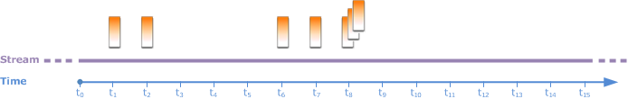
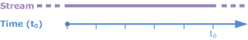
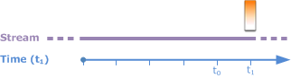
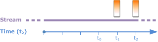
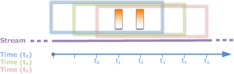
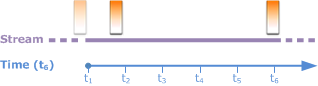
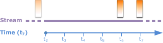
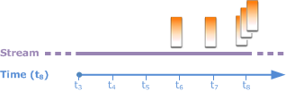

After careful consideration, we have decided to discontinue Amazon Kinesis
Data Analytics for SQL applications:

1. From **September 1, 2025**, we won't provide any bug fixes for Amazon Kinesis Data Analytics for SQL applications because we will have limited support for it, given the upcoming discontinuation.

2. From **October 15, 2025**, you will not be able to create new Kinesis Data Analytics for SQL
   applications.

3. We will delete your applications starting **January 27, 2026**. You will not be able to
   start or operate your Amazon Kinesis Data Analytics for SQL applications. Support will no longer
   be available for Amazon Kinesis Data Analytics for SQL from that time. For more information, see
   [Amazon Kinesis Data Analytics for SQL Applications discontinuation](discontinuation.md "discontinuation.md").

# Sliding Windows

Instead of grouping records using `GROUP BY`, you can define a time-based
or row-based window. You do this by adding an explicit `WINDOW` clause.

In this case, as the window slides with time, Amazon Kinesis Data Analytics emits an output when new
records appear on the stream. Kinesis Data Analytics emits this output by processing rows in the window.
Windows can overlap in this type of processing, and a record can be part of multiple
windows and be processed with each window. The following example illustrates a sliding
window.

Consider a simple query that counts records on the stream. This example assumes a
5-second window. In the following example stream, new records arrive at time
t1, t2, t6, and
t7, and three records arrive at time t8
seconds.


Keep the following in mind:

- The example assumes a 5-second window. The 5-second window slides
  continuously with time.
- For every row that enters a window, an output row is emitted by the sliding
  window. Soon after the application starts, you see the query emit output for every
  new record that appears on the stream, even though a 5-second window hasn't passed
  yet. For example, the query emits output when a record appears in the first second
  and second second. Later, the query processes records in the 5-second
  window.
- The windows slide with time. If an old record on the stream falls out of the
  window, the query doesn't emit output unless there is also a new record on the
  stream that falls within that 5-second window.
  Suppose that the query starts executing at t0. Then the
  following occurs:

1. At the time t0, the query starts. The query doesn't emit
   output (count value) because there are no records at this time.

 2. At time t1, a new record appears on the stream, and the
query emits count value 1.

 3. At time t2, another record appears, and the query emits count 2.

 4. The 5-second window slides with time:

    * At t3, the sliding window
     t3 to t0
    * At t4 (sliding window t4 to
     t0)
    * At t5 the sliding window
     t5–t0

At all of these times, the 5-second window has the same records—there
are no new records. Therefore, the query doesn't emit any output.

 5. At time t6, the 5-second window is
(t6 to t1). The query detects one
new record at t6 so it emits output 2. The record at
t1 is no longer in the window and doesn't count.

 6. At time t7, the 5-second window is
t7 to t2. The query detects one
new record at t7 so it emits output 2. The record at
t2 is no longer in the 5-second window, and therefore
isn't counted.

 7. At time t8, the 5-second window is
t8 to t3. The query detects three
new records, and therefore emits record count 5.


In summary, the window is a fixed size and slides with time. The query emits output
when new records appear.

###### Note

We recommend that you use a sliding window no longer than one hour. If you use a longer
window, the application takes longer to restart after regular system maintenance.
This is because the source data must be read from the stream again.

The following example queries use the `WINDOW` clause to define windows
and perform aggregates. Because the queries don't specify `GROUP BY`, the
query uses the sliding window approach to process records on the stream.

## Example 1: Process a Stream Using a 1-Minute Sliding Window

Consider the demo stream in the Getting Started exercise that populates the
in-application stream, `SOURCE_SQL_STREAM_001`. The following is the
schema.

```
(TICKER_SYMBOL VARCHAR(4),
 SECTOR varchar(16),
 CHANGE REAL,
 PRICE REAL)
```

Suppose that you want your application to compute aggregates using a sliding
1-minute window. That is, for each new record that appears on the stream, you want
the application to emit an output by applying aggregates on records in the preceding
1-minute window.

You can use the following time-based windowed query. The query uses the
`WINDOW` clause to define the 1-minute range interval. The
`PARTITION BY` in the `WINDOW` clause groups records by
ticker values within the sliding window.

```
SELECT STREAM ticker_symbol,
              MIN(Price) OVER W1 AS Min_Price,
              MAX(Price) OVER W1 AS Max_Price,
              AVG(Price) OVER W1 AS Avg_Price
FROM   "SOURCE_SQL_STREAM_001"
WINDOW W1 AS (
   PARTITION BY ticker_symbol
   RANGE INTERVAL '1' MINUTE PRECEDING);
```

###### To test the query

1. Set up an application by following the [Getting Started Exercise](get-started-exercise.md "get-started-exercise.md").
2. Replace the `SELECT` statement in the application code with the
   preceding `SELECT` query. The resulting application code is the
   following.

```
CREATE OR REPLACE STREAM "DESTINATION_SQL_STREAM" (
                         ticker_symbol VARCHAR(10),
                         Min_Price     double,
                         Max_Price     double,
                         Avg_Price     double);
CREATE OR REPLACE PUMP "STREAM_PUMP" AS
   INSERT INTO "DESTINATION_SQL_STREAM"
     SELECT STREAM ticker_symbol,
                   MIN(Price) OVER W1 AS Min_Price,
                   MAX(Price) OVER W1 AS Max_Price,
                   AVG(Price) OVER W1 AS Avg_Price
     FROM   "SOURCE_SQL_STREAM_001"
     WINDOW W1 AS (
        PARTITION BY ticker_symbol
        RANGE INTERVAL '1' MINUTE PRECEDING);
```

## Example 2: Query Applying Aggregates on a Sliding

Window

The following query on the demo stream returns the average of the percent change
in the price of each ticker in a 10-second window.

```
SELECT STREAM Ticker_Symbol,
              AVG(Change / (Price - Change)) over W1 as Avg_Percent_Change
FROM "SOURCE_SQL_STREAM_001"
WINDOW W1 AS (
        PARTITION BY ticker_symbol
        RANGE INTERVAL '10' SECOND PRECEDING);
```

###### To test the query

1. Set up an application by following the [Getting Started Exercise](get-started-exercise.md "get-started-exercise.md").
2. Replace the `SELECT` statement in the application code with the
   preceding `SELECT` query. The resulting application code is the
   following.

```
CREATE OR REPLACE STREAM "DESTINATION_SQL_STREAM" (
                            ticker_symbol VARCHAR(10),
                            Avg_Percent_Change double);
CREATE OR REPLACE PUMP "STREAM_PUMP" AS
   INSERT INTO "DESTINATION_SQL_STREAM"
      SELECT STREAM Ticker_Symbol,
                    AVG(Change / (Price - Change)) over W1 as Avg_Percent_Change
      FROM "SOURCE_SQL_STREAM_001"
      WINDOW W1 AS (
              PARTITION BY ticker_symbol
              RANGE INTERVAL '10' SECOND PRECEDING);
```

## Example 3: Query Data from Multiple Sliding Windows on the

Same Stream

You can write queries to emit output in which each column value is calculated
using different sliding windows defined over the same stream.

In the following example, the query emits the output ticker, price, a2, and a10.
It emits output for ticker symbols whose two-row moving average crosses the ten-row
moving average. The `a2` and `a10` column values are derived
from two-row and ten-row sliding windows.

```
CREATE OR REPLACE STREAM "DESTINATION_SQL_STREAM" (
                           ticker_symbol      VARCHAR(12),
                           price              double,
                           average_last2rows  double,
                           average_last10rows double);

CREATE OR REPLACE PUMP "myPump" AS INSERT INTO "DESTINATION_SQL_STREAM"
SELECT STREAM ticker_symbol,
              price,
              avg(price) over last2rows,
              avg(price) over last10rows
FROM SOURCE_SQL_STREAM_001
WINDOW
    last2rows AS (PARTITION BY ticker_symbol ROWS 2 PRECEDING),
    last10rows AS (PARTITION BY ticker_symbol ROWS 10 PRECEDING);
```

To test this query against the demo stream, follow the test procedure described in
[Example 1](#sliding-ex1 "#sliding-ex1").
