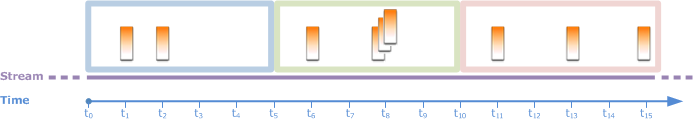

After careful consideration, we have decided to discontinue Amazon Kinesis
Data Analytics for SQL applications:

1. From **September 1, 2025**, we won't provide any bug fixes for Amazon Kinesis Data Analytics for SQL applications because we will have limited support for it, given the upcoming discontinuation.

2. From **October 15, 2025**, you will not be able to create new Kinesis Data Analytics for SQL
   applications.

3. We will delete your applications starting **January 27, 2026**. You will not be able to
   start or operate your Amazon Kinesis Data Analytics for SQL applications. Support will no longer
   be available for Amazon Kinesis Data Analytics for SQL from that time. For more information, see
   [Amazon Kinesis Data Analytics for SQL Applications discontinuation](discontinuation.md "discontinuation.md").

# Tumbling Windows (Aggregations Using

GROUP BY)

When a windowed query processes each window in a non-overlapping manner, the window
is referred to as a _tumbling window_. In this case, each record on
an in-application stream belongs to a specific window. It is processed only once (when
the query processes the window to which the record belongs).


For example, an aggregation query using a `GROUP BY` clause processes rows
in a tumbling window. The demo stream in the [getting started exercise](get-started-exercise.md "get-started-exercise.md")
receives stock price data that is mapped to the in-application stream
`SOURCE_SQL_STREAM_001` in your application. This stream has the following
schema.

```
(TICKER_SYMBOL VARCHAR(4),
 SECTOR varchar(16),
 CHANGE REAL,
 PRICE REAL)

```

In your application code, suppose that you want to find aggregate (min, max) prices
for each ticker over a one-minute window. You can use the following query.

```
SELECT STREAM ROWTIME,
              Ticker_Symbol,
              MIN(Price) AS Price,
              MAX(Price) AS Price
FROM     "SOURCE_SQL_STREAM_001"
GROUP BY Ticker_Symbol,
         STEP("SOURCE_SQL_STREAM_001".ROWTIME BY INTERVAL '60' SECOND);
```

The preceding is an example of a windowed query that is time-based. The query groups
records by `ROWTIME` values. For reporting on a per-minute basis, the
`STEP` function rounds down the `ROWTIME` values to the nearest
minute.

###### Note

You can also use the `FLOOR` function to group records into windows. However,
`FLOOR` can only round time values down to a whole time unit (hour,
minute, second, and so on). `STEP` is recommended for grouping records
into tumbling windows because it can round values down to an arbitrary interval, for
example, 30 seconds.

This query is an example of a nonoverlapping (tumbling) window. The `GROUP
 BY` clause groups records in a one-minute window, and each record belongs to a
specific window (no overlapping). The query emits one output record per minute,
providing the min/max ticker price recorded at the specific minute. This type of query
is useful for generating periodic reports from the input data stream. In this example,
reports are generated each minute.

###### To test the query

1. Set up an application by following the [getting started
   exercise](get-started-exercise.md "get-started-exercise.md").
2. Replace the `SELECT` statement in the application code by the preceding `SELECT`
   query. The resulting application code is shown following:

```
CREATE OR REPLACE STREAM "DESTINATION_SQL_STREAM" (
                                   ticker_symbol VARCHAR(4),
                                   Min_Price     DOUBLE,
                                   Max_Price     DOUBLE);
-- CREATE OR REPLACE PUMP to insert into output
CREATE OR REPLACE PUMP "STREAM_PUMP" AS
  INSERT INTO "DESTINATION_SQL_STREAM"
    SELECT STREAM Ticker_Symbol,
                  MIN(Price) AS Min_Price,
                  MAX(Price) AS Max_Price
    FROM    "SOURCE_SQL_STREAM_001"
    GROUP BY Ticker_Symbol,
             STEP("SOURCE_SQL_STREAM_001".ROWTIME BY INTERVAL '60' SECOND);
```
