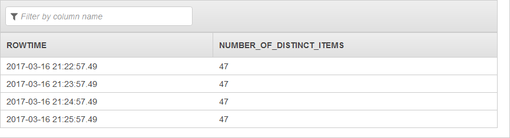

# COUNT_DISTINCT_ITEMS_TUMBLING Function

Returns a count of the number of distinct items in the specified in-application stream
column over a tumbling window. The resulting count is approximate; the function uses the
HyperLogLog algorithm.

For more information, see [HyperLogLog](https://en.wikipedia.org/wiki/HyperLogLog "https://en.wikipedia.org/wiki/HyperLogLog").

When you use `COUNT_DISTINCT_ITEMS_TUMBLING`, be aware of the following:

- When there are less than or equal to 10,000 items in the window, the function returns
  an exact count.
- Getting an exact count of the number of distinct items can be inefficient and costly.
  Therefore, this function approximates the count. For example, if there are 100,000 distinct
  items, the algorithm may return 99,700. If cost and efficiency is not a consideration, you
  can write your own SELECT statement to get the exact count.

The following example demonstrates how to get an exact count of distinct rows for each ticker symbol in a five second tumbling window. The SELECT statement uses all of the columns (except
ROWTIME) in determining the uniqueness.

```
CREATE OR REPLACE STREAM output_stream (ticker_symbol VARCHAR(4), unique_count BIGINT);


CREATE OR REPLACE PUMP stream_pump AS
INSERT INTO output_stream
SELECT STREAM TICKER_SYMBOL, COUNT(distinct_stream.price) AS unique_count
  FROM (
    SELECT STREAM DISTINCT rowtime as window_time,

      TICKER_SYMBOL,
      CHANGE,
      PRICE,
      STEP((SOURCE_SQL_STREAM_001.rowtime) BY INTERVAL '5' SECOND)

      FROM SOURCE_SQL_STREAM_001) as distinct_stream
  GROUP BY TICKER_SYMBOL,
      STEP((distinct_stream.window_time) BY INTERVAL '5' SECOND);


```

The function operates on a [tumbling window](../dev/tumbling-window-concepts.md "../dev/tumbling-window-concepts.md"). You specify the size of the tumbling window as
a parameter.

## Syntax

```
COUNT_DISTINCT_ITEMS_TUMBLING (

      in-application-streamPointer,
      '`columnName`',     
      windowSize
   )
```

## Parameters

The following sections describe the parameters.

### in-application-streamPointer

Using this parameter, you provide a pointer to an
in-application stream. You can set a pointer using the `CURSOR` function. For
example, the following statement sets a pointer to `InputStream`.

```
CURSOR(SELECT STREAM * FROM InputStream)
```

### columnName

Column name in your in-application stream that you want the function to use to
count distinct values. Note the following about the column name:

- Must appear in single quotation marks ('). For example,
  `'column1'`.

### windowSize

Size of the tumbling window in seconds. The size should be at
least 1 second and should not exceed 1 hour = 3600 seconds.

## Examples

### Example Dataset

The examples following are based on the sample stock dataset that is part of [Getting Started](../dev/get-started-exercise.md "../dev/get-started-exercise.md") in the

_Amazon Kinesis Analytics Developer Guide_. To run each example, you
need an Amazon Kinesis Analytics application that has the sample stock ticker input stream. To learn
how to create an Analytics application and configure the sample stock ticker input
stream, see [Getting Started](../dev/get-started-exercise.md "../dev/get-started-exercise.md") in the _Amazon Kinesis Analytics Developer Guide_.

The sample stock dataset has the schema following.

```

(ticker_symbol  VARCHAR(4),
sector          VARCHAR(16),
change          REAL,
price           REAL)

```

### Example 1: Approximate the number of distinct values in a column

The following example demonstrates how to use the
`COUNT_DISTINCT_ITEMS_TUMBLING` function to approximate the number of distinct
`TICKER_SYMBOL` values in the current tumbling window of the in-application
stream. For more information about tumbling windows, see [Tumbling Windows](../dev/tumbling-window-concepts.md "../dev/tumbling-window-concepts.md").

```
CREATE OR REPLACE STREAM DESTINATION_SQL_STREAM (
    NUMBER_OF_DISTINCT_ITEMS BIGINT);

CREATE OR REPLACE PUMP "STREAM_PUMP" AS
   INSERT INTO "DESTINATION_SQL_STREAM"
      SELECT STREAM *
      FROM TABLE(COUNT_DISTINCT_ITEMS_TUMBLING(
          CURSOR(SELECT STREAM * FROM "SOURCE_SQL_STREAM_001"),  -- pointer to the data stream
            'TICKER_SYMBOL',                                     -- name of column in single quotes
            60                                                   -- tumbling window size in seconds
      )
);

```

The preceding example outputs a stream similar to the following:


