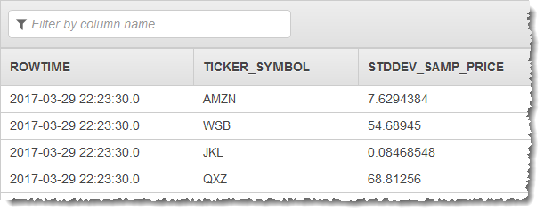
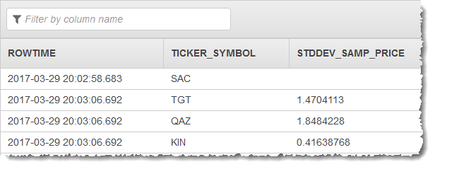

# STDDEV_SAMP

Returns the statistical standard deviation of all values in <number-expression>, evaluated for
each row remaining in the group and defined as the square root of the [VAR_SAMP](sql-reference-VARSAMP.md "sql-reference-VARSAMP.md").

When you use `STDDEV_SAMP`, be aware of the following:

- When the input set has no non-null data, `STDDEV_SAMP` returns `NULL`.
- If you don't use the `OVER` clause, `STDDEV_SAMP` is calculated as an aggregate function. In this case,
  the aggregate query must contain a [GROUP BY clause](sql-reference-group-by-clause.md "sql-reference-group-by-clause.md") on a monotonic expression based on `ROWTIME` that
  groups the stream into finite rows. Otherwise,
  the group is the infinite stream, and the query will never complete and no rows will be emitted. For more information, see [Aggregate Functions](sql-reference-aggregate-functions.md "sql-reference-aggregate-functions.md").
- A windowed query that uses a GROUP BY clause processes rows in a tumbling window. For more information, see
  [Tumbling Windows (Aggregations Using GROUP BY)](../dev/tumbling-window-concepts.md "../dev/tumbling-window-concepts.md").
- If you use the `OVER` clause, `STDDEV_SAMP` is calculated as an analytic function. For more information, see
  [Analytic Functions](sql-reference-analytic-functions.md "sql-reference-analytic-functions.md").
- A windowed query that uses an OVER clause processes rows in a sliding window. For more information, see
  [Sliding Windows](../dev/sliding-window-concepts.md "../dev/sliding-window-concepts.md")
- `STD_DEV` is an alias of `STDDEV_SAMP`.

## Syntax

```
 STDDEV_SAMP ( [DISTINCT | ALL] number-expression )
```

## Parameters

### ALL

Includes duplicate values in the input set. `ALL` is the default.

### DISTINCT

Excludes duplicate values in the input set.

## Examples

### Example Dataset

The examples following are based on the sample stock dataset that is part of the [Getting Started Exercise](../dev/get-started-exercise.md "../dev/get-started-exercise.md") in the

_Amazon Kinesis Analytics Developer Guide_. To run each example, you
need an Amazon Kinesis Analytics application that has the sample stock ticker input stream. To learn
how to create an Analytics application and configure the sample stock ticker input
stream, see [Getting Started](../dev/get-started-exercise.md "../dev/get-started-exercise.md") in the _Amazon Kinesis Analytics Developer Guide_.

The sample stock dataset has the schema following.

```

(ticker_symbol  VARCHAR(4),
sector          VARCHAR(16),
change          REAL,
price           REAL)

```

### Example 1: Determine the statistical standard deviation of the values in a column in a tumbling window query

The following example demonstrates how to use the `STDDEV_SAMP` function to determine the standard deviation of the values
in a tumbling window of the PRICE column of the example dataset. `DISTINCT` is not specified, so duplicate values are included
in the calculation.

```
CREATE OR REPLACE STREAM "DESTINATION_SQL_STREAM" (ticker_symbol VARCHAR(4), stddev_samp_price REAL);

CREATE OR REPLACE  PUMP "STREAM_PUMP" AS INSERT INTO "DESTINATION_SQL_STREAM"

SELECT STREAM ticker_symbol, STDDEV_SAMP(price) AS stddev_samp_price
    FROM "SOURCE_SQL_STREAM_001"
    GROUP BY ticker_symbol, FLOOR(("SOURCE_SQL_STREAM_001".ROWTIME - TIMESTAMP '1970-01-01 00:00:00') SECOND / 10 TO SECOND);

```

### Results

The preceding examples output a stream similar to the following:



### Example 2: Determine the statistical standard deviation of the values in a columm in a sliding window query

The following example demonstrates how to use the `STDDEV_SAMP` function to determine the standard deviation of the values in a sliding
window of the PRICE column of the example dataset. `DISTINCT` is not specified, so duplicate values are included
in the calculation.

```
CREATE OR REPLACE STREAM "DESTINATION_SQL_STREAM" (ticker_symbol VARCHAR(4), stddev_samp_price REAL);

CREATE OR REPLACE PUMP "STREAM_PUMP" AS INSERT INTO "DESTINATION_SQL_STREAM"

SELECT STREAM ticker_symbol, STDDEV_SAMP(price) OVER TEN_SECOND_SLIDING_WINDOW AS stddev_samp_price
FROM "SOURCE_SQL_STREAM_001"

WINDOW TEN_SECOND_SLIDING_WINDOW AS (
  PARTITION BY ticker_symbol
  RANGE INTERVAL '10' SECOND PRECEDING);

```

The preceding example outputs a stream similar to the following:



## See Also

- Population standard deviation: [STDDEV_POP](sql-reference-STDDEVPOP.md "sql-reference-STDDEVPOP.md")
- Sample variance: [VAR_SAMP](sql-reference-VARSAMP.md "sql-reference-VARSAMP.md")
- Population variance: [VAR_POP](sql-reference-VARPOP.md "sql-reference-VARPOP.md")
