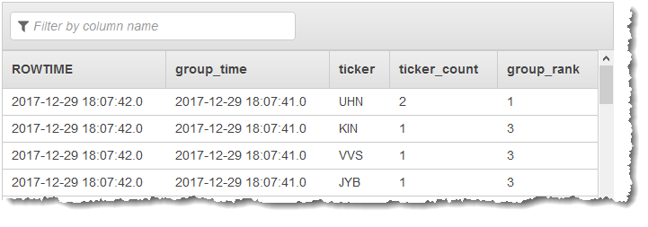

# Group Rank

This function applies a `RANK()` function to logical groups of rows and
optionally delivers the group in sorted order.

Applications of
`group_rank`
include the following:

- To sort results of a streaming `GROUP BY`.
- To determine a relationship within the results of a group.
  Group Rank can do the following actions:

- Apply rank to a specified input column.
- Supply either sorted or unsorted output.
- Enable the user to specify a period of inactivity for data flush.

## SQL Declarations

The functional attributes and DDL are described in the sections that follow.

###### Functional Attributes for

Group_Rank

This function acts as follows:

- Gathers rows until either a rowtime change is detected or a specified idle-time limit
  is exceeded.
- Accepts any streaming rowset.
- Uses any column with a basic SQL data type of `INTEGER`, `CHAR`,
  `VARCHAR` as the column by which to do the ranking.
- Orders the output rows either in the order received or in ascending or descending
  order of values in the selected column.

### DDL for Group_Rank

```
  group_rank(c cursor, rankByColumnName VARCHAR(128),
    rankOutColumnName VARCHAR(128), sortOrder VARCHAR(10), outputOrder VARCHAR(10),
    maxIdle INTEGER, outputMax INTEGER)
  returns table(c.*, "groupRank" INTEGER)
```

The parameters to the function are listed in the following table.

| Parameter           | Description                                                                                                                                                                            |
| ------------------- | -------------------------------------------------------------------------------------------------------------------------------------------------------------------------------------- |
| `c`                 | CURSOR to Streaming Result Set                                                                                                                                                         |
| `rankByColumnName`  | String naming the column to use for ranking the group.                                                                                                                                 |
| `rankOutColumnName` | String naming the column to use for returning the rank.<br>This string must match the name of the `groupRank` column in the<br>`RETURNS` clause of the `CREATE FUNCTION`<br>statement. |
| `sortOrder`         | Controls ordering of rows for rank assignment.<br>Valid values are as follows:<br>• 'asc' - Ascending based on the rank.<br>• 'desc' - Descending based on the rank.                   |
| `outputOrder`       | Controls ordering of output. Valid values are as follows:<br>• 'asc' - Ascending based on the rank.<br>• 'desc' - Descending based on the rank.                                        |
| `maxIdle`           | Time limit in milliseconds for holding a group for ranking.<br>When `maxIdle` expires, the current group is released to the stream.<br>A value of zero indicates no idle timeout.      |
| `outputMax`         | Maximum number of rows the function outputs in a given group.<br>A value of 0 indicates no limit.                                                                                      |

## Example

### Example Dataset

The following example is based on the sample stock dataset that is part of the
[Getting Started Exercise](../dev/get-started-exercise.md "../dev/get-started-exercise.md") in
the _Amazon Kinesis Data Analytics Developer Guide_. To run each example, you need an
Amazon Kinesis Data Analytics application that has the sample stock ticker input stream. To learn how to create
an analytics application and configure the sample stock ticker input stream, see [Getting Started](../dev/get-started-exercise.md "../dev/get-started-exercise.md") in the
_Amazon Kinesis Data Analytics Developer Guide_.

The sample stock dataset has the following schema:

```

(ticker_symbol  VARCHAR(4),
sector          VARCHAR(16),
change          REAL,
price           REAL)

```

### Example 1: Sort the Results of a GROUP BY

Clause

In this example, the aggregate query has a `GROUP BY` clause on `ROWTIME` that groups the stream into finite rows.
The `GROUP_RANK` function then sorts the rows returned by the `GROUP BY` clause.

```
CREATE OR REPLACE STREAM "ticker_grouped" (
    "group_time" TIMESTAMP,
    "ticker" VARCHAR(65520),
    "ticker_count" INTEGER);

CREATE OR REPLACE STREAM "destination_sql_stream" (
    "group_time" TIMESTAMP,
    "ticker" VARCHAR(65520),
    "ticker_count" INTEGER,
    "group_rank" INTEGER);

CREATE OR REPLACE PUMP "ticker_pump" AS
    INSERT INTO "ticker_grouped"
    SELECT STREAM
        FLOOR(SOURCE_SQL_STREAM_001.ROWTIME TO SECOND),
        "TICKER_SYMBOL",
        COUNT(TICKER_SYMBOL)
    FROM SOURCE_SQL_STREAM_001
    GROUP BY FLOOR(SOURCE_SQL_STREAM_001.ROWTIME TO SECOND), TICKER_SYMBOL;

CREATE OR REPLACE PUMP DESTINATION_SQL_STREAM_PUMP AS
    INSERT INTO "destination_sql_stream"
    SELECT STREAM
        "group_time",
        "ticker",
        "ticker_count",
        "groupRank"
    FROM TABLE(
        GROUP_RANK(
            CURSOR(SELECT STREAM * FROM "ticker_grouped"),
            'ticker_count',
            'groupRank',
            'desc',
            'asc',
            5,
            0));

```

### Results

The preceding examples output a stream similar to the following.



## Operational Overview

Rows are buffered from the input cursor for each group (that is, rows with the same
rowtimes). Ranking of the rows is done either after the arrival of a row with a different
rowtime (or when the idle timeout occurs). Rows continue to be read while ranking is performed
on the group of rows with the same rowtime.

The `outputMax` parameter specifies the maximum number of rows to be returned
for each group after ranks are assigned.

By default, `group_rank` supports column pass through, as the example
illustrates by using `c.*` as the standard shortcut directing pass through of all
input columns in the order presented. You can, instead, name a subset using the notation
"`c.columName`", allowing you to reorder the columns. However, using specific
column names ties the UDX to a specific input set, whereas using the `c.*` notation
allows the UDX to handle any input set.

The `rankOutColumnName` parameter specifies the output column used to return
ranks. This column name must match the column name specified in the `RETURNS`
clause of the `CREATE FUNCTION` statement.
