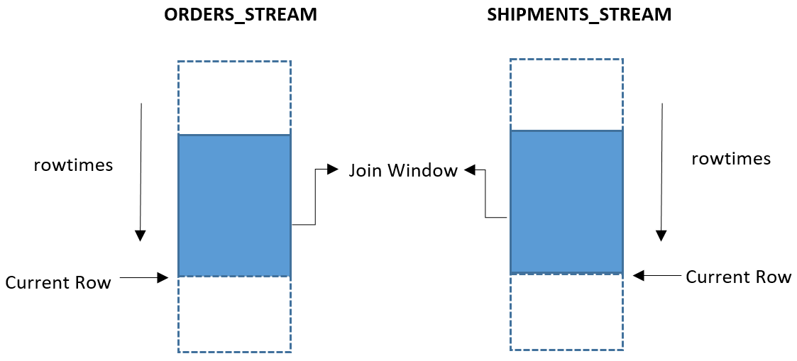
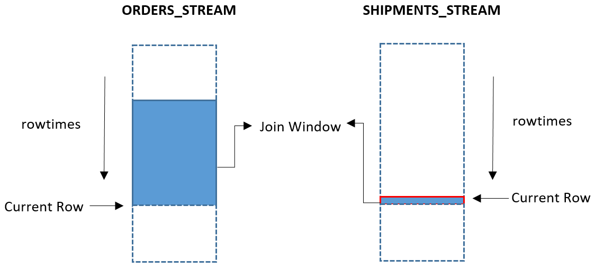
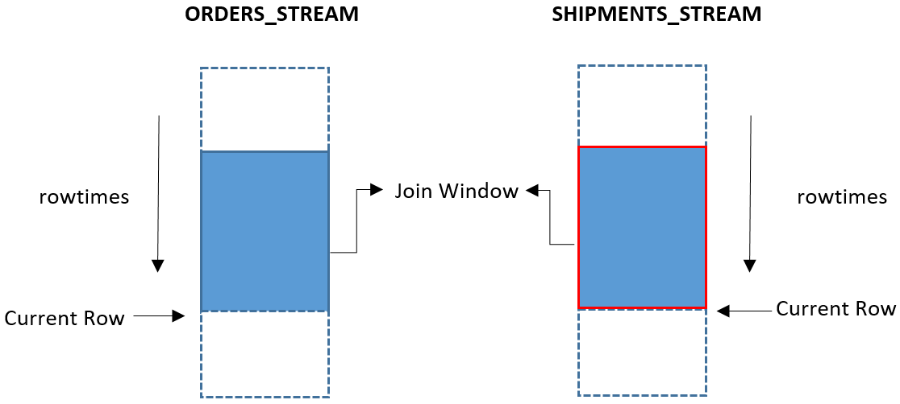
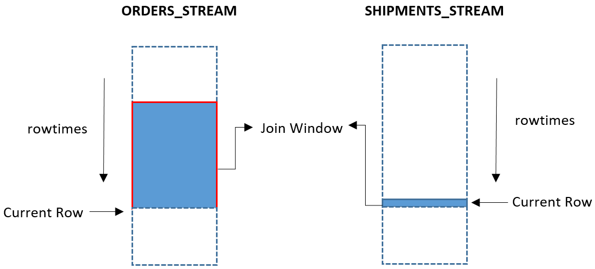
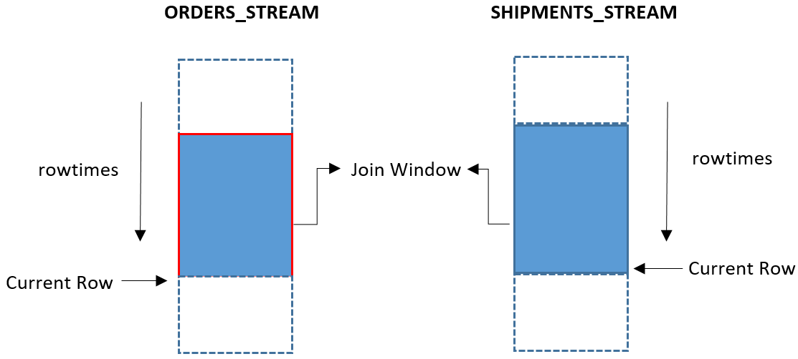

# JOIN clause

The JOIN clause in a SELECT statement combines columns from one or more streams or reference tables.

###### Topics

- [Stream-to-Stream Joins](#sqlrf-join-stream "#sqlrf-join-stream")
- [Stream-to-Table Joins](#sqlrf-join-stream-to-table "#sqlrf-join-stream-to-table")

## Stream-to-Stream Joins

Amazon Kinesis Data Analytics supports joining an in-application stream with another in-application stream using SQL, bringing this important traditional database functionality into the streaming context.

This section describes the types of joins that Kinesis Data Analytics supports, including time-based and
row-based window joins, and the details about streaming joins.

### Join Types

There are five types of joins:

|                                       |                                                                                                                                                                         |
| ------------------------------------- | ----------------------------------------------------------------------------------------------------------------------------------------------------------------------- |
| INNER JOIN (or just JOIN)             | Returns all pairs of rows from the left and from the right for which the join<br>condition evaluates to TRUE.                                                           |
| LEFT OUTER JOIN (or just LEFT JOIN)   | As INNER JOIN, but rows from the left are kept even if they don't match any rows<br>on the right. NULL values are generated on the right.                               |
| RIGHT OUTER JOIN (or just RIGHT JOIN) | As INNER JOIN, but rows from the right are kept even if they don't match any<br>rows on the left. NULL values are generated on the left for these rows.                 |
| FULL OUTER JOIN (or just FULL JOIN)   | As INNER JOIN, but rows from both sides are kept even if they don't match any<br>rows on the other side. NULL values are generated on the other side for these<br>rows. |
| CROSS JOIN                            | Returns the Cartesian product of the inputs: Every row from the left is paired<br>with every row from the right.                                                        |

### Time-Based Window vs. Row-Based Window Joins

It isn't practical to join the entire history of the left stream to the entire history
of the right. Therefore, you must restrict at least one stream to a time window by using an
OVER clause. The OVER clause defines a window of rows that are to be considered for joining
at a given time.

The window can be time-based or row-based:

- A time-based window uses the RANGE keyword. It defines the window as the set of rows
  whose ROWTIME column falls within a particular time interval of the query's current
  time.

For example, the following clause specifies that the window contains all rows whose ROWTIMEs are within the hour preceding the stream's current time:

```
OVER (RANGE INTERVAL '1' HOUR PRECEDING)
```

- A row-based window uses the ROWS keyword. It defines the window as a given count of
  rows before or after the row with the current time stamp.

For example, the following clause specifies that only the latest 10 rows be included
in the window:

```
OVER (ROWS 10 PRECEDING)
```

###### Note

If no time window or row-based window is specified on the side of a join, then only the
current row from that side participates in the join evaluation.

### Examples of Stream-to-Stream Joins

The following examples demonstrate how an in-application stream-to-stream join works,
when the results of the join are returned, and what the row times of the join results
are.

###### Topics

- [Example Dataset](#sqlrf-join-stream-examples-dataset "#sqlrf-join-stream-examples-dataset")
- [Example 1: Time Window on One Side of a JOIN (INNER JOIN)](#sqlrf-join-stream-examples-1 "#sqlrf-join-stream-examples-1")
- [Example 2: Time Windows on Both Sides of a JOIN (INNER JOIN)](#sqlrf-join-stream-examples-2 "#sqlrf-join-stream-examples-2")
- [Example 3: Time Window on One Side of a RIGHT JOIN (RIGHT OUTER JOIN)](#sqlrf-join-stream-examples-3 "#sqlrf-join-stream-examples-3")
- [Example 4: Time Windows on Both Sides of a RIGHT JOIN (RIGHT OUTER JOIN)](#sqlrf-join-stream-examples-4 "#sqlrf-join-stream-examples-4")
- [Example 5: Time Window on One Side of a LEFT JOIN (LEFT OUTER JOIN)](#sqlrf-join-stream-examples-5 "#sqlrf-join-stream-examples-5")
- [Example 6: Time Windows on Both Sides of a LEFT JOIN (LEFT OUTER JOIN)](#sqlrf-join-stream-examples-6 "#sqlrf-join-stream-examples-6")
- [Summary](#sqlrf-join-stream-examples-summary "#sqlrf-join-stream-examples-summary")

#### Example Dataset

The examples in this section are based on the following datasets and stream
definitions:

##### Sample of Orders Data

```
{
   "orderid":"101",
   "orders":"1"
}

```

##### Sample of Shipments Data

```
{
   "orderid":"101",
   "shipments":"2"
}

```

##### Creating the ORDERS_STREAM

In-Application Stream

```
CREATE OR REPLACE STREAM "ORDERS_STREAM" ("orderid" int, "orderrowtime" timestamp);
CREATE OR REPLACE PUMP "ORDERS_STREAM_PUMP" AS INSERT INTO "ORDERS_STREAM"
SELECT STREAM "orderid", "ROWTIME"
FROM "SOURCE_SQL_STREAM_001" WHERE "orders" = 1;

```

##### Creating the SHIPMENTS_STREAM

In-Application Stream

```
CREATE OR REPLACE STREAM "SHIPMENTS_STREAM" ("orderid" int, "shipmentrowtime" timestamp);
CREATE OR REPLACE PUMP "SHIPMENTS_STREAM_PUMP" AS INSERT INTO "SHIPMENTS_STREAM"
SELECT STREAM "orderid", "ROWTIME"
FROM "SOURCE_SQL_STREAM_001" WHERE "shipments" = 2;

```

#### Example 1: Time Window on One Side of a JOIN (INNER JOIN)

This example demonstrates a query that returns all orders with shipments that executed
in the last minute.

##### Join Query

```
CREATE OR REPLACE STREAM "OUTPUT_STREAM" ("resultrowtime" timestamp, "orderid" int, "shipmenttime" timestamp, "ordertime" timestamp);
CREATE OR REPLACE PUMP "OUTPUT_STREAM_PUMP" AS
INSERT INTO "OUTPUT_STREAM"
  SELECT STREAM ROWTIME as "resultrowtime", s."orderid", s.rowtime as "shipmenttime", o.ROWTIME as "ordertime"
    FROM ORDERS_STREAM OVER (RANGE INTERVAL '1' MINUTE PRECEDING) AS o
      JOIN SHIPMENTS_STREAM AS s
        ON o."orderid" = s."orderid";

```

##### Query Results

| ORDERS_STREAM | SHIPMENTS_STREAM | OUTPUT_STREAM |
| ------------- | ---------------- | ------------- | ------- | ------------- | ------- | ------------ | --------- |
| ROWTIME       | orderid          | ROWTIME       | orderid | resultrowtime | orderid | shipmenttime | OrderTime |
| 10:00:00      | 101              | 10:00:00      | 100     |               |         |              |           |
| 10:00:20      | 102              |               |         |               |         |              |           |
| 10:00:30      | 103              |               |         |               |         |              |           |
| 10:00:40      | 104              |               |         |               |         |              |           |
|               |                  | 10:00:45      | 104     |               |         |              |
| 10:00:45      | 100\*            |               |         | 10:00:45      | 104     | 10:00:45     | 10:00:40  |
|               |                  | 10:00:50      | 105     |               |         |              |           |

\* - Record with orderid = 100 is a late event in the Orders stream.

##### Visual Representation of the

Join

The following diagram represents a query that returns all orders with shipments that
executed in the last minute.


##### Triggering of Results

The following describes the events that trigger results from the query.

- Because no time or row window is specified on the Shipments stream, only the current row of
  the Shipments stream participates in the join.
- Because the query on the Orders stream specifies a one-minute preceding window, the rows in
  the Orders stream with a ROWTIME in the last minute participate in the join.
- When the record in the Shipments stream arrived at 10:00:45 for orderid 104, the JOIN result
  was triggered because there is a match on orderid in the Orders stream in the
  preceding minute.
- The record in the Orders stream with orderid 100 arrived late, so the corresponding record in
  the Shipments stream was not the latest record. Because no window was specified on
  the Shipments stream, only the current row of the Shipments stream participates in
  the join. As a result, no records are returned by the JOIN statement for orderid

100.  For information about including late rows in a JOIN statement, see [Example 2](#sqlrf-join-stream-examples-2 "#sqlrf-join-stream-examples-2").

- Because there is no matching record in the Shipments stream for orderid 105, no results are
  emitted, and the record is ignored.

##### ROWTIMES of Results

- The ROWTIME of the record in the output stream is the later of the ROWTIMEs of the rows that
  matched the join.

#### Example 2: Time Windows on Both Sides of a JOIN (INNER JOIN)

This example demonstrates a query that returns all orders that executed in the last
minute, with shipments that executed in the last minute.

##### Join Query

```
CREATE OR REPLACE STREAM "OUTPUT_STREAM" ("resultrowtime" timestamp, "orderid" int, "shipmenttime" timestamp, "ordertime" timestamp);
CREATE OR REPLACE PUMP "OUTPUT_STREAM_PUMP" AS INSERT INTO "OUTPUT_STREAM"
  SELECT STREAM ROWTIME as "resultrowtime", s."orderid", s.rowtime as "shipmenttime", o.ROWTIME as "ordertime"
    FROM ORDERS_STREAM OVER (RANGE INTERVAL '1' MINUTE PRECEDING) AS o
      JOIN SHIPMENTS_STREAM OVER (RANGE INTERVAL '1' MINUTE PRECEDING) AS s
        ON o."orderid" = s."orderid";

```

##### Query Results

| ORDERS_STREAM | SHIPMENTS_STREAM | OUTPUT_STREAM |
| ------------- | ---------------- | ------------- | ------- | ------------- | ------- | ------------ | --------- |
| ROWTIME       | orderid          | ROWTIME       | orderid | resultrowtime | orderid | shipmenttime | OrderTime |
| 10:00:00      | 101              | 10:00:00      | 100     |               |         |              |           |
| 10:00:20      | 102              |               |         |               |         |              |           |
| 10:00:30      | 103              |               |         |               |         |              |           |
| 10:00:40      | 104              |               |         |               |         |              |           |
|               |                  | 10:00:45      | 104     |               |         |              |           |
| 10:00:45      | 100\*            |               |         | 10:00:45      | 104     | 10:00:45     | 10:00:40  |
|               |                  |               |         | 10:00:45      | 100     | 10:00:00     | 10:00:45  |
|               |                  | 10:00:50      | 105     |               |         |              |           |

\* - Record with orderid = 100 is a late event in the Orders stream.

##### Visual Representation of the

Join

The following diagram represents a query that returns all orders that executed in
the last minute, with shipments that executed in the last minute.



##### Triggering of Results

The following describes the events that trigger results from the query.

- Windows are specified on both sides of the join. So all the rows in the minute preceding the
  current row of both the Orders stream and the Shipments stream participate in the
  join.
- When the record in the Shipments stream for orderid 104 arrived, the corresponding record in
  the Orders stream was within the one-minute window. So a record was returned to the
  Output stream.
- Even though the order event for orderid 100 arrived late in the Orders stream, the join result
  was returned. This is because the window in the Shipments stream includes the past
  minute of orders, which includes the corresponding record.
- Having a window on both sides of the join is helpful for including late-arriving records on
  either side of the join; for example, if an order or shipment record is received
  late or out of order.

##### ROWTIMEs of Results

- The ROWTIME of the record in the output stream is the later of the ROWTIMEs of the rows that
  matched the join.

#### Example 3: Time Window on One Side of a RIGHT JOIN (RIGHT OUTER JOIN)

This example demonstrates a query that returns all shipments that executed in the last
minute, whether or not there are corresponding orders in the last minute.

##### Join Query

```
CREATE OR REPLACE STREAM "OUTPUT_STREAM" ("resultrowtime" timestamp, "orderid" int, "ordertime" timestamp);
CREATE OR REPLACE PUMP "OUTPUT_STREAM_PUMP" AS INSERT INTO "OUTPUT_STREAM"
  SELECT STREAM ROWTIME as "resultrowtime", s."orderid", o.ROWTIME as "ordertime"
    FROM ORDERS_STREAM OVER (RANGE INTERVAL '1' MINUTE PRECEDING) AS o
      RIGHT JOIN SHIPMENTS_STREAM AS s
        ON o."orderid" = s."orderid";


```

##### Query Results

| ORDERS_STREAM | SHIPMENTS_STREAM | OUTPUT_STREAM |
| ------------- | ---------------- | ------------- | ------- | ------------- | ------- | --------- |
| ROWTIME       | orderid          | ROWTIME       | orderid | resultrowtime | orderid | OrderTime |
| 10:00:00      | 101              | 10:00:00      | 100     |               |         |           |
|               |                  |               |         | 10:00:00      | 100     | null      |
| 10:00:20      | 102              |               |         |               |         |           |
| 10:00:30      | 103              |               |         |               |         |           |
| 10:00:40      | 104              |               |         |               |         |           |
|               |                  | 10:00:45      | 104     |               |         |           |
| 10:00:45      | 100\*            |               |         | 10:00:45      | 104     | 10:00:40  |
|               |                  | 10:00:50      | 105     |               |         |           |
|               |                  |               |         | 10:00:50      | 105     | null      |

\* - Record with orderid = 100 is a late event in the Orders stream.

##### Visual Representation of the

Join

The following diagram represents a query that returns all shipments that executed in
the last minute, whether or not there are corresponding orders in the last
minute.



##### Triggering of Results

The following describes the events that trigger results from the query.

- When a record in the Shipments stream arrived for orderid 104, a result in the Output stream
  was emitted.
- As soon as the record in the Shipments stream arrived for orderid 105, a record was emitted in
  the Output stream. However, there is no matching record in the Orders stream, so the
  OrderTime value is null.

##### ROWTIMEs of Results

- The ROWTIME of the record in the output stream is the later of the ROWTIMEs of the rows that
  matched the join.
- Because the right side of the join (the Shipments stream) has no window, the ROWTIME of the
  result with an unmatched join is the ROWTIME of the unmatched row.

#### Example 4: Time Windows on Both Sides of a RIGHT JOIN (RIGHT OUTER JOIN)

This example demonstrates a query that returns all shipments that executed in the last
minute, whether or not they have corresponding orders.

##### Join Query

```
CREATE OR REPLACE STREAM "OUTPUT_STREAM" ("resultrowtime" timestamp, "orderid" int, "shipmenttime" timestamp, "ordertime" timestamp);
CREATE OR REPLACE PUMP "OUTPUT_STREAM_PUMP" AS INSERT INTO "OUTPUT_STREAM"
  SELECT STREAM ROWTIME as "resultrowtime", s."orderid", s.ROWTIME as "shipmenttime", o.ROWTIME as "ordertime"
    FROM ORDERS_STREAM OVER (RANGE INTERVAL '1' MINUTE PRECEDING) AS o
      RIGHT JOIN SHIPMENTS_STREAM OVER (RANGE INTERVAL '1' MINUTE PRECEDING) AS s
        ON o."orderid" = s."orderid";


```

##### Query Results

| ORDERS_STREAM | SHIPMENTS_STREAM | OUTPUT_STREAM |
| ------------- | ---------------- | ------------- | ------- | ------------- | ------- | ------------ | --------- |
| ROWTIME       | orderid          | ROWTIME       | orderid | resultrowtime | orderid | shipmenttime | OrderTime |
| 10:00:00      | 101              | 10:00:00      | 100     |               |         |              |           |
| 10:00:20      | 102              |               |         |               |         |              |           |
| 10:00:30      | 103              |               |         |               |         |              |           |
| 10:00:40      | 104              |               |         |               |         |              |           |
|               |                  | 10:00:45      | 104     |               |         |              |           |
| 10:00:45      | 100\*            |               |         | 10:00:45      | 104     | 10:00:40     | 10:00:45  |
|               |                  |               |         | 10:00:45      | 100     | 10:00:45     | 10:00:00  |
|               |                  | 10:00:50      | 105     |               |         |              |           |
|               |                  |               |         |               |         |              |           |
|               |                  |               |         | 10:01:50      | 105     | 10:00:50     | null      |

\* - Record with orderid = 100 is a late event in the Orders stream.

##### Visual Representation of the

Join

The following diagram represents a query that returns all shipments that executed in
the last minute, whether or not they have corresponding orders.



##### Triggering of Results

The following describes the events that trigger results from the query.

- When a record in the Shipments stream arrived for orderid 104, a result in the Output stream
  was emitted.
- Even though the order event for orderid 100 arrived late in the Orders stream, the join result
  is returned. This is because the window in the Shipments stream includes the past
  minute of orders, which includes the corresponding record.
- For the shipment for which the order is not found (for orderid 105), the result is not emitted
  to the Output stream until the end of the one-minute window on the Shipments
  stream.

##### ROWTIMEs of Results

- The ROWTIME of the record in the output stream is the later of the ROWTIMEs of the rows that
  matched the join.
- For shipment records with no matching order record, the ROWTIME of the result is the ROWTIME
  of the end of the window. This is because the right side of the join (from the
  Shipments stream) is now a one-minute window of events, and the service is waiting
  for the end of the window to determine whether any matching records arrive. When the
  window ends and no matching records are found, the result is emitted with a ROWTIME
  corresponding to the end of the window.

#### Example 5: Time Window on One Side of a LEFT JOIN (LEFT OUTER JOIN)

This example demonstrates a query that returns all orders that executed in the last
minute, whether or not there are corresponding shipments in the last minute.

##### Join Query

```
CREATE OR REPLACE STREAM "OUTPUT_STREAM" ("resultrowtime" timestamp, "orderid" int, "ordertime" timestamp);
CREATE OR REPLACE PUMP "OUTPUT_STREAM_PUMP" AS INSERT INTO "OUTPUT_STREAM"
  SELECT STREAM ROWTIME as "resultrowtime", o."orderid", o.ROWTIME as "ordertime"
    FROM ORDERS_STREAM OVER (RANGE INTERVAL '1' MINUTE PRECEDING) AS o
      LEFT JOIN SHIPMENTS_STREAM AS s
        ON o."orderid" = s."orderid";

```

##### Query Results

| ORDERS_STREAM | SHIPMENTS_STREAM | OUTPUT_STREAM |
| ------------- | ---------------- | ------------- | ------- | ------------- | ------- | --------- |
| ROWTIME       | orderid          | ROWTIME       | orderid | resultrowtime | orderid | OrderTime |
| 10:00:00      | 101              | 10:00:00      | 100     |               |         |           |
| 10:00:20      | 102              |               |         |               |         |           |
| 10:00:30      | 103              |               |         |               |         |           |
| 10:00:40      | 104              |               |         |               |         |           |
|               |                  | 10:00:45      | 104     |               |         |           |
| 10:00:45      | 100\*            |               |         | 10:00:45      | 104     | 10:00:40  |
|               |                  | 10:00:50      | 105     |               |         |           |
|               |                  |               |         |               |         |           |
|               |                  |               |         | 10:01:00      | 101     | 10:00:00  |
|               |                  |               |         | 10:01:20      | 102     | 10:00:20  |
|               |                  |               |         | 10:01:30      | 103     | 10:00:30  |
|               |                  |               |         | 10:01:40      | 104     | 10:00:40  |
|               |                  |               |         | 10:01:45      | 100     | 10:00:45  |

\* - Record with orderid = 100 is a late event in the Orders stream.

##### Visual Representation of the

Join

The following diagram represents a query that returns all orders that executed in
the last minute, whether or not there are corresponding shipments in the last
minute.



##### Triggering of Results

The following describes the events that trigger results from the query.

- When a record in the Shipments stream arrived for orderid 104, a result in the Output stream
  is emitted.
- For records in the Orders stream with no corresponding record in the Shipments stream, records
  are not emitted to the Output stream until the end of the one-minute window. This is
  because the service is waiting until the end of the window for matching
  records.

##### ROWTIMEs of Results

- The ROWTIME of the record in the output stream is the later of the ROWTIMEs of the rows that
  matched the join.
- For records in the Orders stream with no corresponding record in the Shipments stream, the
  ROWTIMEs of the results are the ROWTIMEs of the end of the current window.

#### Example 6: Time Windows on Both Sides of a LEFT JOIN (LEFT OUTER JOIN)

This example demonstrates a query that returns all orders that executed in the last
minute, whether or not they have corresponding shipments.

##### Join Query

```
CREATE OR REPLACE STREAM "OUTPUT_STREAM" ("resultrowtime" timestamp, "orderid" int, "shipmenttime" timestamp, "ordertime" timestamp);
CREATE OR REPLACE PUMP "OUTPUT_STREAM_PUMP" AS INSERT INTO "OUTPUT_STREAM"
  SELECT STREAM ROWTIME as "resultrowtime", s."orderid", s.ROWTIME as "shipmenttime", o.ROWTIME as "ordertime"
    FROM ORDERS_STREAM OVER (RANGE INTERVAL '1' MINUTE PRECEDING) AS o
      LEFT JOIN SHIPMENTS_STREAM OVER (RANGE INTERVAL '1' MINUTE PRECEDING) AS s
        ON o."orderid" = s."orderid";

```

##### Query Results

| ORDERS_STREAM | SHIPMENTS_STREAM | OUTPUT_STREAM |
| ------------- | ---------------- | ------------- | ------- | ------------- | ------- | ------------ | --------- |
| ROWTIME       | orderid          | ROWTIME       | orderid | resultrowtime | orderid | shipmenttime | OrderTime |
| 10:00:00      | 101              | 10:00:00      | 100     |               |         |              |           |
| 10:00:20      | 102              |               |         |               |         |              |           |
| 10:00:30      | 103              |               |         |               |         |              |           |
| 10:00:40      | 104              |               |         |               |         |              |           |
|               |                  | 10:00:45      | 104     |               |         |              |           |
| 10:00:45      | 100\*            |               |         | 10:00:45      | 104     | 10:00:40     | 10:00:45  |
|               |                  | 10:00:50      | 105     | 10:00:45      | 100     | 10:00:00     | 10:00:45  |
|               |                  |               |         |               |         |              |           |
|               |                  |               |         | 10:01:00      | 101     | null         | 10:00:00  |
|               |                  |               |         | 10:01:20      | 102     | null         | 10:00:20  |
|               |                  |               |         | 10:01:30      | 103     | null         | 10:00:30  |
|               |                  |               |         | 10:01:40      | 104     | null         | 10:00:40  |
|               |                  |               |         | 10:01:45      | 100     | null         | 10:00:45  |

\* - Record with orderid = 100 is a late event in the Orders stream.

##### Visual Representation of the

Join

The following diagram represents a query that returns all orders that executed in
the last minute, whether or not they have corresponding shipments.



##### Triggering of Results

The following describes the events that trigger results from the query.

- When a record in the Shipments stream arrived for orderids 104 and 100, a result in the Output
  stream was emitted. This occurred even though the record in the Orders stream for
  orderid 100 arrived late.
- Records in the Orders stream with no corresponding record in the Shipments stream are emitted
  in the
  Output
  stream at the end of the one-minute window. This is because the
  service waits until the end of the window for corresponding records in the Shipments
  stream.

##### ROWTIMEs of Results

- The ROWTIME of the record in the Output stream is the later of the ROWTIMEs of the rows that
  matched the join.
- For records in the Orders stream with no corresponding record in the Shipments stream, the
  ROWTIMEs of the orders is the ROWTIME corresponding to the end of the window.

#### Summary

- Kinesis Data Analytics always returns rows from joins in ascending order of ROWTIME.
- For an inner join, the ROWTIME of an output row is the later of the ROWTIMEs of the two input
  rows. This is also true for an outer join for which matching input rows are
  found.
- For outer joins for which a match is not found, the ROWTIME of an output row is the later of
  the following two times:
  - The ROWTIME of the input row for which a match was not found.
  - The later bound of the window of the other input stream at the point any possible
    match could have been found.

## Stream-to-Table Joins

If one of the relations is a stream and the other is a finite relation, it is referred to
as a stream-table join. For each row in the stream, the query looks up the row or rows in the
table that match the join condition.

For example, Orders is a stream and PriceList is a table. The effect of the join is to add
price list information to the order.

For information about creating a reference data source and joining a stream to a reference
table, see [Example: Add Reference Data
Source](../dev/app-add-reference-data.md "../dev/app-add-reference-data.md") in the _Amazon Kinesis Data Analytics Developer Guide_.
