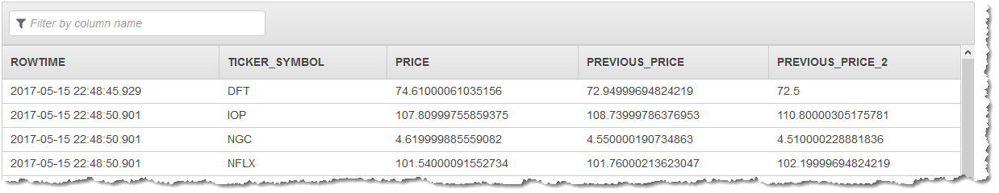

# LAG

LAG returns the evaluation of the expression (such as the name of a column) for the record
that is N records before the current record in a given window. Both offset and default are
evaluated with respect to the current record. If there is no such record, LAG instead returns a
specified default expression. LAG returns a value of the same type as the expression.

## Syntax

```
LAG(expr [ , N [ , defaultExpr]]) [ IGNORE NULLS | RESPECT NULLS ] OVER [ window-definition ]
```

## Parameters

_expr_

An expression that is evaluated on a record.

_N_

The number of records before the current record to query. The default is `1`.

_defaultExpr_

An expression of the same type as _expr_ that is returned if the record queried (_n_ before the current record)
falls outside the window. If not specified,
_null_ is returned for values that fall outside the window.

###### Note

The _defaultExpr_ expression doesn't replace actual
_null_ values returned from the source stream.

IGNORE NULLS

A clause that specifies that null values are not counted when determining the offset. For
example, suppose that `LAG(expr, 1)` is queried, and the previous record has a null
value for _expr_. Then the second record previous is queried, and so
on.

RESPECT NULLS

A clause that specifies that null values are counted when determining the offset. This
behavior is the default.

OVER _window-specification_

A clause that divides records in a stream partitioned by the time range interval or the
number of records. A window specification defines how records in the stream are partitioned,
whether by the time range interval or the number of records.

## Example

### Example Dataset

The examples following are based on the sample stock dataset that is part of [Getting Started Exercise](../dev/get-started-exercise.md "../dev/get-started-exercise.md") in the
_Amazon Kinesis Analytics Developer Guide_. To run each example, you
need an Amazon Kinesis Analytics application that has the input stream for the sample stock
ticker. To learn how to create an Analytics application and configure the input stream for
the sample stock ticker, see [Getting
Started Exercise](../dev/get-started-exercise.md "../dev/get-started-exercise.md") in the _Amazon Kinesis Analytics Developer
Guide_.

The sample stock dataset has the schema following.

```

(ticker_symbol  VARCHAR(4),
sector          VARCHAR(16),
change          REAL,
price           REAL)

```

### Example 1: Return Values from Previous Records in an OVER Clause

In this example, the OVER clause divides records in a stream partitioned by the time
range interval of '1' minute preceding. The LAG function then retrieves price values from
the two previous records that contain the given ticker symbol, skipping records if
`price` is null.

```
CREATE OR REPLACE STREAM "DESTINATION_SQL_STREAM" (
    ticker_symbol VARCHAR(4),
    price     DOUBLE,
    previous_price DOUBLE,
    previous_price_2 DOUBLE);
CREATE OR REPLACE PUMP "STREAM_PUMP" AS
    INSERT INTO "DESTINATION_SQL_STREAM"
    SELECT STREAM ticker_symbol,
         price,
         LAG(price, 1, 0) IGNORE NULLS OVER (
            PARTITION BY ticker_symbol
            RANGE INTERVAL '1' MINUTE PRECEDING),
         LAG(price, 2, 0) IGNORE NULLS OVER (
            PARTITION BY ticker_symbol
            RANGE INTERVAL '1' MINUTE PRECEDING)
    FROM "SOURCE_SQL_STREAM_001"

```

The preceding example outputs a stream similar to the following.



## Notes

LAG is not part of the SQL:2008 standard. It is an Amazon Kinesis Data Analytics streaming SQL
extension.
