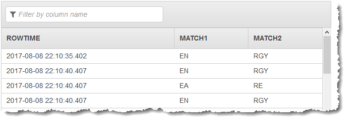
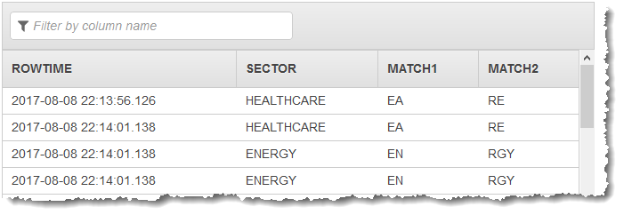

# REGEX_LOG_PARSE

```
REGEX_LOG_PARSE (<character-expression>,<regex-pattern>,<columns>)<regex-pattern> := <character-expression>[OBJECT] <columns> := <columnname> [ <datatype> ] {, <columnname> <datatype> }*
```

Parses a character string based on Java Regular Expression patterns as defined in [java.util.regex.pattern](http://docs.oracle.com/javase/1.5.0/docs/api/java/util/regex/Pattern.html "http://docs.oracle.com/javase/1.5.0/docs/api/java/util/regex/Pattern.html").

Columns are based on match groups defined in the regex-pattern. Each group defines a column,
and the groups are processed from left to right. Failure to match produces a NULL value result:
If the regular expression does not match the string passed as the first parameter, NULL is
returned.

The columns returned will be COLUMN1 through COLUMNn, where n is the number of groups in the
regular expression. The columns will be of type varchar(1024).

## Examples

### Example Dataset

The examples following are based on the sample stock dataset that is part of the [Getting Started Exercise](../dev/get-started-exercise.md "../dev/get-started-exercise.md") in the
_Amazon Kinesis Analytics Developer Guide_. To run each example, you
need an Amazon Kinesis Analytics application that has the sample stock ticker input stream. To learn
how to create an Analytics application and configure the sample stock ticker input
stream, see the [Getting Started
Exercise](../dev/get-started-exercise.md "../dev/get-started-exercise.md") in the _Amazon Kinesis Analytics Developer Guide_.

The sample stock dataset has the schema following.

```

(ticker_symbol  VARCHAR(4),
sector          VARCHAR(16),
change          REAL,
price           REAL)

```

### Example 1: Return results from two capture groups

The following code example searches the contents of the `sector` field for a letter `E` and the character that follows it, and
then searches for a letter R, and returns it and all characters following it:

```
CREATE OR REPLACE STREAM "DESTINATION_SQL_STREAM" (match1 VARCHAR(1024), match2 VARCHAR(1024));

CREATE OR REPLACE PUMP "STREAM_PUMP" AS INSERT INTO "DESTINATION_SQL_STREAM"
    SELECT STREAM T.REC.COLUMN1, T.REC.COLUMN2
    FROM
         (SELECT STREAM SECTOR,
             REGEX_LOG_PARSE(SECTOR, '.*([E].).*([R].*)') AS REC
             FROM SOURCE_SQL_STREAM_001) AS T;

```

The preceding code example produces results similar to the following:



### Example 2: Return a stream field and results from two capture groups

The following code example returns the `sector` field, and searches the contents of the `sector` field for a letter `E` and returns it and the character that follows it, and
then searches for a letter R, and returns it and all characters following it:

```
CREATE OR REPLACE STREAM "DESTINATION_SQL_STREAM" (sector VARCHAR(24), match1 VARCHAR(24), match2 VARCHAR(24));

CREATE OR REPLACE PUMP "STREAM_PUMP" AS INSERT INTO "DESTINATION_SQL_STREAM"
    SELECT STREAM T.SECTOR, T.REC.COLUMN1, T.REC.COLUMN2
    FROM
         (SELECT STREAM SECTOR,
             REGEX_LOG_PARSE(SECTOR, '.*([E].).*([R].*)') AS REC
             FROM SOURCE_SQL_STREAM_001) AS T;

```

The preceding code example produces results similar to the following:



##

For more information, see [FAST_REGEX_LOG_PARSER](sql-reference-fast-regex-log-parser.md "sql-reference-fast-regex-log-parser.md").

## Quick Regex Reference

For full details on Regex, see [java.util.regex.pattern](http://docs.oracle.com/javase/1.5.0/docs/api/java/util/regex/Pattern.html "http://docs.oracle.com/javase/1.5.0/docs/api/java/util/regex/Pattern.html")

|                                                                                                                                                                                                                                                                                                                                                                                                                                            |                                                                                                                                                                   |
| ------------------------------------------------------------------------------------------------------------------------------------------------------------------------------------------------------------------------------------------------------------------------------------------------------------------------------------------------------------------------------------------------------------------------------------------ | ----------------------------------------------------------------------------------------------------------------------------------------------------------------- | ------------------------------------------------------------------------------------------------------------------------------------------------------------------------------------------------------------------------------------------------------------------------------------------------------------------------------------------------------------------------------------------------------------------------------------------------------------------------------------------------------------------ |
| [xyz] Find single character of: x, y or z<br>[^abc] Find any single character except: x, y, or z<br>[r-z] Find any single character between r-z<br>[r-zR-Z] Find any single character between r-z or R-Z<br>^ Start of line<br>$ End of line<br>\A Start of string<br>\z End of string<br>. Any single character<br>\s Find any whitespace character<br>\S Find any non-whitespace character<br>\d Find any digit<br>\D Find any non-digit | \w Find any word character (letter, number, underscore)<br>\W Find any non-word character<br>\b Find any word boundary<br>(...) Capture everything enclosed<br>(x | y) Find x or y (also works with symbols such as \d or \s)<br>x? Find zero or one of x (also works with symbols such as \d or \s)<br>x\<br>• Find zero or more of x (also works with symbols such as \d or \s)<br>x+ Find one or more of x (also works with symbols such as \d or \s)<br>x{3} Find exactly 3 of x (also works with symbols such as \d or \s)<br>x{3,} Find 3 or more of x (also works with symbols such as \d or \s)<br>x{3,6} Find between 3 and 6 of x (also works with symbols such as \d or \s) |
