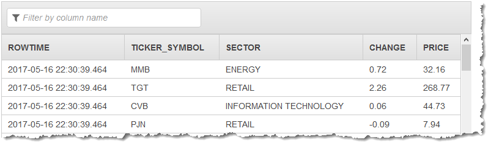

# REGEX_REPLACE

REGEX_REPLACE replaces a substring with an alternative substring. It returns the value of
the following Java expression.

```
java.lang.String.replaceAll(regex, replacement)
```

## Syntax

```
REGEX_REPLACE(original VARCHAR(65535), regex VARCHAR(65535), replacement VARCHAR(65535), startPosition int, occurence int)

RETURNS VARCHAR(65535)
```

## Parameters

_original_

The string on which to execute the regex operation.

_regex_

The
[regular expression](https://en.wikipedia.org/wiki/Regular_expression "https://en.wikipedia.org/wiki/Regular_expression")

to match. If the encoding for _regex_ doesn't match
the encoding for _original_, an error is written to the error
stream.

_replacement_

The string to replace _regex_ matches in the
_original_ string. If the encoding for _replacement_
doesn't match the encoding for _original_ or _regex_, an
error is written to the error stream.

_startPosition_

The first character in the _original_ string to search. If
_startPosition_ is less than 1, an error is written to the error stream.
If _startPosition_ is greater than the length of
_original_, then _original_ is returned.

_occurence_

The occurrence of the string that matches the _regex_ expression to
replace. If _occurence_ is 0, all substrings matching
_regex_ are replaced. If _occurence_ is less than 0,
an error is written to the error stream.

## Example

### Example Dataset

The examples following are based on the sample stock dataset that is part of [Getting Started Exercise](../dev/get-started-exercise.md "../dev/get-started-exercise.md") in the
_Amazon Kinesis Analytics Developer Guide_.

To run each example, you need an Amazon Kinesis Analytics application that has the input
stream for the sample stock ticker. To learn how to create an Analytics application and
configure the input stream for the sample stock ticker, see [Getting Started Exercise](../dev/get-started-exercise.md "../dev/get-started-exercise.md") in the
_Amazon Kinesis Analytics Developer Guide_.

The sample stock dataset has the schema following.

```

(ticker_symbol  VARCHAR(4),
sector          VARCHAR(16),
change          REAL,
price           REAL)

```

### Example 1: Replace All String Values in a Source String with a New Value

In this example, all character strings in the `sector` field are replaced if they match a regular expression.

```
CREATE OR REPLACE STREAM "DESTINATION_SQL_STREAM" (
        ticker_symbol VARCHAR(4),
        SECTOR VARCHAR(24),
        CHANGE REAL,
        PRICE REAL);

CREATE OR REPLACE PUMP "STREAM_PUMP" AS INSERT INTO "DESTINATION_SQL_STREAM"

SELECT STREAM   TICKER_SYMBOL,
                REGEX_REPLACE(SECTOR, 'TECHNOLOGY', 'INFORMATION TECHNOLOGY', 1, 0);
                CHANGE,
                PRICE
FROM "SOURCE_SQL_STREAM_001"

```

The preceding example outputs a stream similar to the following.



## Notes

REGEX_REPLACE is not part of the SQL:2008 standard. It is an Amazon Kinesis Data Analytics streaming SQL
extension.

REGEX_REPLACE returns `null` if any parameters are `null`.
