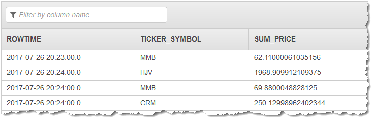
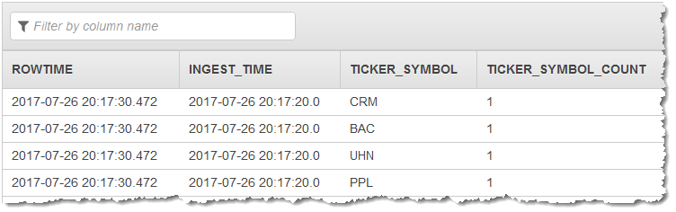

# STEP

```
STEP ( <time-unit> BY INTERVAL '<integer-literal>' <interval-literal> )
STEP ( <integer-expression> BY <integer-literal> )
```

STEP rounds down the input value (<time-unit> or <integer-expression>) to the nearest multiple of <integer-literal>.

The STEP function works on datetime data types or integer types. STEP is a scalar function
that performs an operation similar to [FLOOR](sql-reference-floor.md "sql-reference-floor.md"). However, by using STEP you can specify an arbitrary time or
integer interval for rounding down the first argument.

STEP returns null if any input argument is null.

## STEP with an Integer Argument

When called with an integer argument, STEP returns the largest integer multiple of the <interval-literal> argument equal to or smaller
than the <integer-expression> argument. For example, `STEP(23 BY 5)` returns `20`, because 20 is the greatest multiple
of 5 that is less than 23.

`STEP ( <integer-expression > BY <integer-literal> )` is equivalent
to the following.

```
( <integer-expression> / <integer-literal> ) * <integer-literal>
```

### Examples

In the following examples, the return value is the largest multiple of <integer-literal> that is equal to or less than <integer-expression>.

| Function       | Result |
| -------------- | ------ |
| STEP(23 BY 5)  | 20     |
| STEP(30 BY 10) | 30     |

## STEP with a Date Type Argument

When called with a date, time, or timestamp argument, STEP returns the largest value
equal to or smaller than the input, subject to the precision specified by <time
 unit>.

`STEP(<datetimeExpression> BY <intervalLiteral>)` is equivalent to
the following.

```
(<datetimeExpression> - timestamp '1970-01-01 00:00:00')  /  <intervalLiteral> )  * <intervalLiteral> + timestamp '1970-01-01 00:00:00'
```

<intervalLiteral> can be one of the following:

- YEAR
- MONTH
- DAY
- HOUR
- MINUTE
- SECOND

### Examples

In the following examples, the return value is the latest multiple of <integer-literal> of the unit specified by <intervalLiteral> that is equal to or earlier than <datetime-expression>.

| Function                                                               | Result                  |
| ---------------------------------------------------------------------- | ----------------------- |
| STEP(CAST('2004-09-30 13:48:23' as TIMESTAMP) BY INTERVAL '10' SECOND) | '2004-09-30 13:48:20'   |
| STEP(CAST('2004-09-30 13:48:23' as TIMESTAMP) BY INTERVAL '2' HOUR)    | '2004-09-30 12:00:00'   |
| STEP(CAST('2004-09-30 13:48:23' as TIMESTAMP) BY INTERVAL '5' MINUTE)  | '2004-09-30 13:45:00'   |
| STEP(CAST('2004-09-27 13:48:23' as TIMESTAMP) BY INTERVAL '5' DAY)     | '2004-09-25 00:00:00.0' |
| STEP(CAST('2004-09-30 13:48:23' as TIMESTAMP) BY INTERVAL '1' YEAR)    | '2004-01-01 00:00:00.0' |

## STEP in a GROUP BY clause (tumbling window)

In this example, an aggregate query has a `GROUP BY` clause with `STEP` applied to `ROWTIME` that groups the stream into finite rows.

```

CREATE OR REPLACE STREAM "DESTINATION_SQL_STREAM" (
    ticker_symbol VARCHAR(4),
    sum_price     DOUBLE);
-- CREATE OR REPLACE PUMP to insert into output
CREATE OR REPLACE PUMP "STREAM_PUMP" AS
  INSERT INTO "DESTINATION_SQL_STREAM"
    SELECT STREAM
        ticker_symbol,
        SUM(price) AS sum_price
    FROM "SOURCE_SQL_STREAM_001"
     GROUP BY ticker_symbol, STEP("SOURCE_SQL_STREAM_001".ROWTIME BY INTERVAL '60' SECOND);

```

### Results

The preceding example outputs a stream similar to the following.



## STEP in an OVER clause (sliding window)

```
CREATE OR REPLACE STREAM "DESTINATION_SQL_STREAM" (
    ingest_time TIMESTAMP,
    ticker_symbol VARCHAR(4),
    ticker_symbol_count integer);

--Create pump data into output
CREATE OR REPLACE PUMP "STREAM_PUMP" AS
INSERT INTO "DESTINATION_SQL_STREAM"
-- select the ingest time used in the GROUP BY clause
SELECT STREAM STEP(source_sql_stream_001.approximate_arrival_time BY INTERVAL '10' SECOND) as ingest_time,
    ticker_symbol,
   count(*) over w1 as ticker_symbol_count
FROM source_sql_stream_001
WINDOW w1 AS (
    PARTITION BY ticker_symbol,
   -- aggregate records based upon ingest time
       STEP(source_sql_stream_001.approximate_arrival_time BY INTERVAL '10' SECOND)
   -- use process time as a trigger, which can be different time window as the aggregate
   RANGE INTERVAL '10' SECOND PRECEDING);

```

### Results

The preceding example outputs a stream similar to the following.



## Notes

STEP ( <datetime expression> BY <literal expression> ) is an Amazon Kinesis Data Analytics
extension.

You can use STEP to aggregate results using tumbling windows. For more information on
tumbling windows, see [Tumbling Window
Concepts](../dev/tumbling-window-concepts.md "../dev/tumbling-window-concepts.md").
