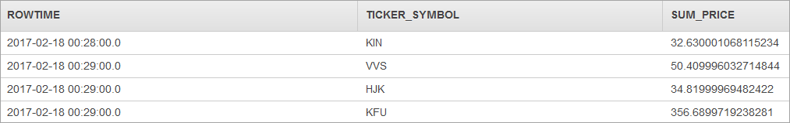

# SUM

Returns the sum of a group of values from a windowed query. A windowed query is defined in terms of time or rows.
For information about windowed queries, see [Windowed Queries](../dev/windowed-sql.md "../dev/windowed-sql.md").

When you use SUM, be aware of the following:

- If you don't use the `OVER` clause, `SUM` is calculated as an aggregate function. In this case,
  the aggregate query must contain a [GROUP BY clause](sql-reference-group-by-clause.md "sql-reference-group-by-clause.md") on a monotonic expression based on `ROWTIME` that
  groups the stream into finite rows. Otherwise,
  the group is the infinite stream, and the query will never complete and no rows will be emitted. For more information, see [Aggregate Functions](sql-reference-aggregate-functions.md "sql-reference-aggregate-functions.md").
- A windowed query that uses a GROUP BY clause processes rows in a tumbling window. For more information, see
  [Tumbling Windows (Aggregations Using GROUP BY)](../dev/tumbling-window-concepts.md "../dev/tumbling-window-concepts.md").
- If you use the `OVER` clause, `SUM` is calculated as an analytic function. For more information, see
  [Analytic Functions](sql-reference-analytic-functions.md "sql-reference-analytic-functions.md").
- A windowed query that uses an OVER clause processes rows in a sliding window. For more information, see
  [Sliding Windows](../dev/sliding-window-concepts.md "../dev/sliding-window-concepts.md")

## Syntax

### Tumbling Windowed Query

```

SUM(*number-expression*) ... GROUP BY *monotonic-expression* | *time-based-expression*

```

### Sliding Windowed Query

```

SUM([DISTINCT | ALL] *number-expression*) OVER *window-specification*

```

## Parameters

DISTINCT

Counts only distinct values.

ALL

Counts all rows. `ALL` is the default.

_number-expression_

Specifies the value expressions evaluated for each row in the aggregation.

OVER _window-specification_

Divides records in a stream partitioned by the time range interval or the number of rows.
A window specification defines how records in the stream are partitioned by the time range interval or the number of rows.

GROUP BY _monotonic-expression_ | _time-based-expression_

Groups records based on the value of the grouping expression returning a single summary row for each group of rows that has identical values in all columns.

## Examples

### Example Dataset

The examples following are based on the sample stock dataset that is part of the
[Getting Started Exercise](../dev/get-started-exercise.md "../dev/get-started-exercise.md") in the

_Amazon Kinesis Analytics Developer Guide_. To run each example, you need an Amazon Kinesis Analytics application that has the sample stock ticker input stream.
To learn how to create an Analytics application and configure the sample stock ticker input stream,
see [Getting Started](../dev/get-started-exercise.md "../dev/get-started-exercise.md") in the _Amazon Kinesis Analytics Developer Guide_.

The sample stock dataset has the schema following.

```

(ticker_symbol  VARCHAR(4),
sector          VARCHAR(16),
change          REAL,
price           REAL)

```

### Example 1: Return the Sum of Values Using the GROUP BY Clause

In this example, the aggregate query has a `GROUP BY` clause on `ROWTIME` that groups the stream into finite rows.
The `SUM` function is then calculated from the rows returned by the `GROUP BY` clause.

#### Using STEP (Recommended)

```

CREATE OR REPLACE STREAM "DESTINATION_SQL_STREAM" (
    ticker_symbol VARCHAR(4),
    sum_price     DOUBLE);

CREATE OR REPLACE PUMP "STREAM_PUMP" AS
  INSERT INTO "DESTINATION_SQL_STREAM"
    SELECT STREAM
        ticker_symbol,
        SUM(price) AS sum_price
    FROM "SOURCE_SQL_STREAM_001"
     GROUP BY ticker_symbol, STEP("SOURCE_SQL_STREAM_001".ROWTIME BY INTERVAL '60' SECOND);

```

#### Using FLOOR

```

CREATE OR REPLACE STREAM "DESTINATION_SQL_STREAM" (
    ticker_symbol VARCHAR(4),
    sum_price     DOUBLE);
-- CREATE OR REPLACE PUMP to insert into output
CREATE OR REPLACE PUMP "STREAM_PUMP" AS
  INSERT INTO "DESTINATION_SQL_STREAM"
    SELECT STREAM
        ticker_symbol,
        SUM(price) AS sum_price
    FROM "SOURCE_SQL_STREAM_001"
    GROUP BY ticker_symbol, FLOOR("SOURCE_SQL_STREAM_001".ROWTIME TO MINUTE);

```

#### Results

The preceding examples output a stream similar to the following.



## Usage Notes

Amazon Kinesis Analytics doesn't support `SUM` applied to interval types. This functionality is a departure from the SQL:2008 standard.

`SUM` ignores null values from the set of values or a numeric expression. For example, each of the following return the value of 6:

- SUM(1, 2, 3) = 6
- SUM(1,null, 2, null, 3, null) = 6

## Related Topics

- [Windowed Queries](../dev/windowed-sql.md "../dev/windowed-sql.md")
- [Aggregate Functions](sql-reference-aggregate-functions.md "sql-reference-aggregate-functions.md")
- [GROUP BY clause](sql-reference-group-by-clause.md "sql-reference-group-by-clause.md")
- [Analytic Functions](sql-reference-analytic-functions.md "sql-reference-analytic-functions.md")
- [Getting Started Exercise](../dev/get-started-exercise.md "../dev/get-started-exercise.md")
- [WINDOW Clause (Sliding Windows)](sql-reference-window-clause.md "sql-reference-window-clause.md")
