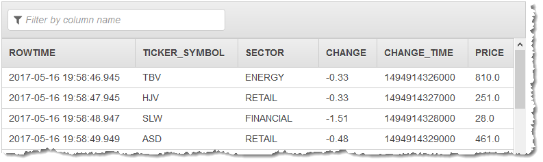

# UNIX_TIMESTAMP

Converts a SQL timestamp to a Unix timestamp that is expressed in milliseconds since
'1970-01-01 00:00:00' UTC and that is a BIGINT.

## Syntax

```
UNIX_TIMESTAMP(timeStampExpr)
```

## Parameters

_timeStampExpr_

A SQL TIMESTAMP value.

## Example

### Example Dataset

The examples following are based on the sample stock dataset that is part of
[Getting Started
Exercise](../dev/get-started-exercise.md "../dev/get-started-exercise.md") in the _Amazon Kinesis Analytics Developer
Guide_.

###### Note

The sample dataset has been modified to include a Timestamp value (CHANGE_TIME).

To run each example, you need an Amazon Kinesis Analytics application that has the
input stream for the sample stock ticker. To learn how to create an Analytics
application and configure the input stream for the sample stock ticker, see [Getting Started Exercise](../dev/get-started-exercise.md "../dev/get-started-exercise.md") in
the _Amazon Kinesis Analytics Developer Guide_.

The sample stock dataset has the schema following.

```

(ticker_symbol  VARCHAR(4),
sector          VARCHAR(16),
change          REAL,
change_time     TIMESTAMP,    --The timestamp value to convert
price           REAL)

```

### Example 1: Convert a Timestamp to a UNIX Timestamp

In this example, the `change_time` value in the source stream is converted to a TIMESTAMP value in the in-application stream.

```
CREATE OR REPLACE STREAM "DESTINATION_SQL_STREAM" (
        ticker_symbol VARCHAR(4),
        SECTOR VARCHAR(16),
        CHANGE REAL,
        CHANGE_TIME BIGINT,
        PRICE REAL);

CREATE OR REPLACE PUMP "STREAM_PUMP" AS INSERT INTO "DESTINATION_SQL_STREAM"

SELECT STREAM   TICKER_SYMBOL,
                SECTOR,
                CHANGE,
                UNIX_TIMESTAMP(CHANGE_TIME),
                PRICE
FROM "SOURCE_SQL_STREAM_001"

```

The preceding example outputs a stream similar to the following.



## Notes

UNIX_TIMESTAMP is not part of the SQL:2008 standard. It is an Amazon Kinesis Data Analytics streaming SQL
extension.
