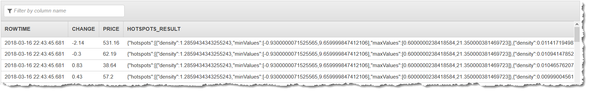

# HOTSPOTS

Detects _hotspots_, or regions of activity that is significantly
higher than the norm, in your data stream. A hotspot is defined as a small region of space that
is relatively dense with data points.

Using the `HOTSPOTS` function, you can use a simple SQL function to identify
relatively dense regions in your data without having to explicitly build and train complicated
machine learning models. You can then identify subsections of your data that need attention so
that you can take immediate action.

For example, hotspots in your data might indicate a collection of overheated servers in
a data center, a high concentration of vehicles indicating a traffic bottleneck, ride share
rides in a certain area indicating a high-traffic event, or increased sales of products in a
category that share similar features.

###### Note

The ability of the `HOTSPOTS` function to detect frequent data points is
application-dependent. To cast your business problem so that it can be solved with this
function requires domain expertise. For example, you might want to determine which combination
of columns in your input stream to pass to the function, and how to normalize the data if
necessary.

The algorithm accepts the `DOUBLE`, `INTEGER`, `FLOAT`,
`TINYINT`, `SMALLINT`, `REAL`, and `BIGINT` data
types. DECIMAL is not a supported type. Use DOUBLE instead.

###### Note

The `HOTSPOT` function does not return the records that make up a hotspot.
You can use the `ROWTIME` column to determine which records belong to a given
hotspot.

## Syntax

```
HOTSPOTS (inputStream,    
  windowSize,
  scanRadius,
  minimumNumberOfPointsInAHotspot)

```

## Parameters

The following sections describe `HOTSPOT` function parameters.

### inputStream

Pointer to your input stream. You set a pointer using the `CURSOR`
function. For example, the following statements set a pointer to
`InputStream`:

```

--Select all columns from input stream
CURSOR(SELECT STREAM * FROM InputStream)
--Select specific columns from input stream
CURSOR(SELECT STREAM PRICE, CHANGE FROM InputStream)
-– Normalize the column X value.
CURSOR(SELECT STREAM IntegerColumnX / 100, IntegerColumnY FROM InputStream)
–- Combine columns before passing to the function.
CURSOR(SELECT STREAM IntegerColumnX - IntegerColumnY FROM InputStream)

```

###### Note

Only numeric columns from the input stream will be analyzed for hotspots. The `HOTSPOTS` function ignores other columns included in the cursor.

### windowSize

Specifies the number of records that are considered for each timestep by the sliding
window over the stream.

You can set this value between 100 and 1000

inclusive.

By increasing the window size, you can get a better estimate
of hotspot position and density (relevance), but this also increases the running time.

### scanRadius

Specifies the typical distance between a hotspot point and its nearest neighbors.

This parameter is analogous to the **ε** value in the
[DBSCAN](https://en.wikipedia.org/wiki/DBSCAN "https://en.wikipedia.org/wiki/DBSCAN")

algorithm.

Set this parameter to a value that is smaller than the typical distance between
points that are not in a hotspot, but large enough so that points in a hotspot have
neighbors within this distance.

You can set this value to any double value greater than zero. The lower the value
for `scanRadius`, the more similar any two records belonging to the same hotspot
are. However, low values for `scanRadius` also increase running time. Lower
values of `scanRadius` result in hotspots that are smaller but more
numerous.

### minimumNumberOfPointsInAHotspot

Specifies the number of records that are required for the records to form a hotspot.

###### Note

This parameter should be set in consideration with [windowSize](#hotspots-windowsize "#hotspots-windowsize"). It is best to think of
`minimumNumberOfPointsInAHotspot` as some fraction of
`windowSize`. The exact fraction is discoverable through experimentation.

You can set this value between 2 and your configured value for window size
inclusive. Choose a value that best models the problem you are solving in light of your
chosen value for window size.

## Output

The output of the HOTSPOTS function is a table object that has the same schema as the
input, with the following additional column:

### HOTSPOT_RESULTS

A JSON string describing all the hotspots found around the record. The function returns all potential hotspots; you can filter out hotspots below a certain `density` threshold in your application. The field has the following nodes, with
values for each of the input columns:

- `density`: The number of records in the hotspot divided by the hotspot size. You can use this value to determine the relative relevance of the hotspot.
- `maxValues`: The maximum values for the records in the hotspot for each data column.
- `minValues`: The minimum values for the records in the hotspot for each data column.

Data type: VARCHAR.

###### Note

The trends that machine learning functions use to determine analysis scores are infrequently reset
when the Kinesis Data Analytics service performs service maintenance. You might unexpectedly see analysis
scores of 0 after service maintenance occurs. We recommend you set up filters or other mechanisms to treat
these values appropriately as they occur.

## Example

The following example executes the `HOTSPOTS` function on the demo stream,
which contains random data without meaningful hotspots. For an example that executes the
`HOTSPOTS` function on a custom data stream with meaningful data hotspots, see
[Example: Detect
Hotspots](../dev/app-hotspots-detection.md "../dev/app-hotspots-detection.md").

### Example Dataset

The example following is based on the sample stock dataset that is part of the [Getting Started Exercise](../dev/get-started-exercise.md "../dev/get-started-exercise.md") in the
_Amazon Kinesis Data Analytics Developer Guide_. To run the example, you need an Kinesis Data Analytics
application that has the sample stock ticker input stream. To learn how to create a Kinesis Data Analytics
application and configure the sample stock ticker input stream, see [Getting Started](../dev/get-started-exercise.md "../dev/get-started-exercise.md") in the
_Amazon Kinesis Data Analytics Developer Guide_.

The sample stock dataset has the following schema:

```

(ticker_symbol  VARCHAR(4),
sector          VARCHAR(16),
change          REAL,
price           REAL)

```

### Example 1: Return Hotspots on the Sample Data

Stream

In this example, a destination stream is created for the output of the HOTSPOTS
function. A pump is then created that runs the HOTSPOTS function on the specified values in
the sample data stream.

```

CREATE OR REPLACE STREAM "DESTINATION_SQL_STREAM"(
    CHANGE REAL,
    PRICE REAL,
    HOTSPOTS_RESULT VARCHAR(10000));

CREATE OR REPLACE PUMP "STREAM_PUMP" AS
    INSERT INTO "DESTINATION_SQL_STREAM"
        SELECT
            "CHANGE",
            "PRICE",
            "HOTSPOTS_RESULT"
        FROM TABLE (
            HOTSPOTS(
                CURSOR(SELECT STREAM "CHANGE", "PRICE" FROM "SOURCE_SQL_STREAM_001"),
                100,
                0.013,
                20)
            );

```

#### Results

This example outputs a stream similar to the following.


