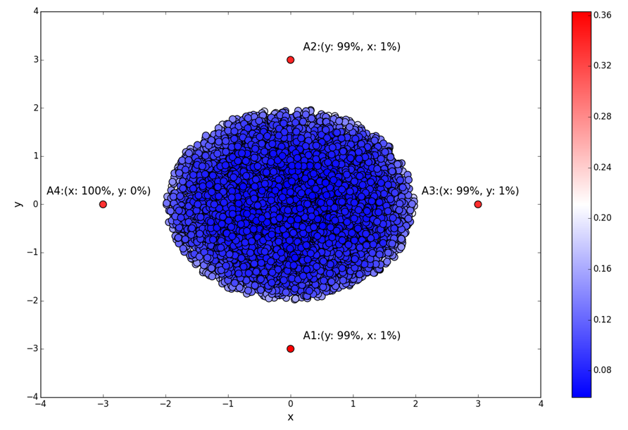
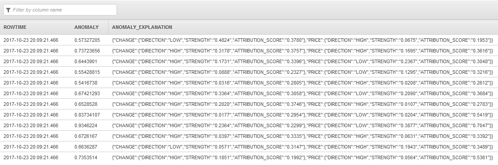
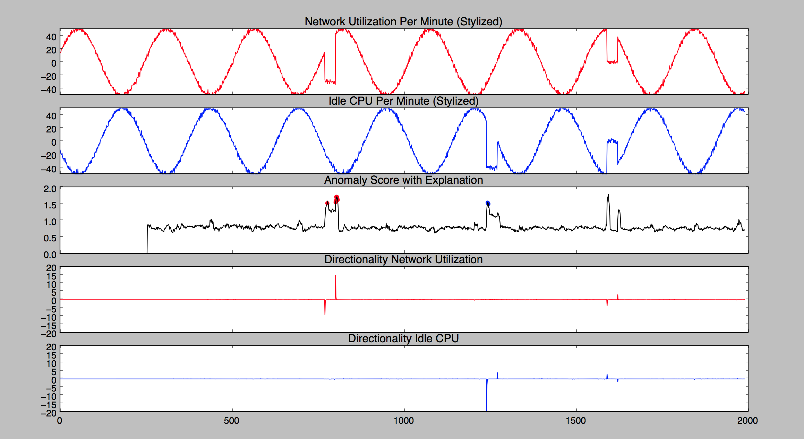

# RANDOM_CUT_FOREST_WITH_EXPLANATION

Computes an anomaly score and explains it for each record in your data stream. The anomaly
score for a record indicates how different it is from the trends that have recently been
observed for your stream. The function also returns an attribution score for each column in a
record, based on how anomalous the data in that column is. For each record, the sum of the
attribution scores of all columns is equal to the anomaly score.

You also have the option of getting information about the direction in which a given column
is anomalous (whether it's high or low relative to the recently observed data trends for that
column in the stream).

For example, in e-commerce applications, you might want to know when there's a change in the
recently observed pattern of transactions. You also might want to know how much of the change is
due to a change in the number of purchases made per hour, and how much is due to a change in the
number of carts abandoned per hour—information that is represented by the attribution
scores. You also might want to look at directionality to know whether you're being notified of
the change due to an increase or a decrease in each of those values.

###### Note

The `RANDOM_CUT_FOREST_WITH_EXPLANATION` function's ability to detect anomalies
is application-dependent. Casting your business problem so that it can be solved with this
function requires domain expertise. For example, you may need to determine which combination
of columns in your input stream to pass to the function, and you may potentially benefit from
normalizing the data. For more information, see [inputStream](#random-cut-forest-with-explanation-input-view "#random-cut-forest-with-explanation-input-view").

A stream record can have non-numeric columns, but the function uses only numeric columns to
assign an anomaly score. A record can have one or more numeric columns. The algorithm uses all
the numeric data in computing an anomaly score. 

The algorithm starts developing the machine learning model using current records in the stream when
you start the application.
The algorithm does not use older records in the stream for machine learning, nor does it use
statistics from previous executions of the application.

The algorithm accepts the `DOUBLE`, `INTEGER`, `FLOAT`,
`TINYINT`, `SMALLINT`, `REAL`, and `BIGINT` data
types.

###### Note

`DECIMAL` is not a supported type. Use `DOUBLE` instead.

The following is a simple visual example of anomaly detection with different attribution
scores in two-dimensional space. The diagram shows a cluster of blue data points and four
outliers shown as red points. The red points have similar anomaly scores, but these four points
are anomalous for different reasons. For points A1 and A2, most of the anomaly is attributable
to their outlying y-values. In the case of A3 and A4, you can attribute most of the anomaly to
their outlying x-values. Directionality is LOW for the y-value of A1, HIGH for the y-value of
A2, HIGH for the x-value of A3, and LOW for the x-value of A4.



## Syntax

```
RANDOM_CUT_FOREST_WITH_EXPLANATION (inputStream,    
                   numberOfTrees,
                   subSampleSize,
                   timeDecay,
                   shingleSize,
                   withDirectionality
)
```

## Parameters

The following sections describe the parameters of the
`RANDOM_CUT_FOREST_WITH_EXPLANATION` function.

### inputStream

Pointer to your input stream. You set a pointer using the `CURSOR` function.
For example, the following statements set a pointer to `InputStream`.

```
CURSOR(SELECT STREAM * FROM InputStream)
CURSOR(SELECT STREAM IntegerColumnX, IntegerColumnY FROM InputStream)
-– Perhaps normalize the column X value.
CURSOR(SELECT STREAM IntegerColumnX / 100, IntegerColumnY FROM InputStream)
–- Combine columns before passing to the function.
CURSOR(SELECT STREAM IntegerColumnX - IntegerColumnY FROM InputStream)

```

The `CURSOR` function is the only required parameter for the
`RANDOM_CUT_FOREST_WITH_EXPLANATION` function. The function assumes the
following default values for the other parameters:

`numberOfTrees` = 100

`subSampleSize` = 256

`timeDecay` = 100,000

`shingleSize` = 1

`withDirectionality` = FALSE

When you use this function, your input stream can have up to 30 numeric columns.

### numberOfTrees

Using this parameter, you specify the number of random cut trees in the forest. 

###### Note

By default, the algorithm constructs a number of trees, each constructed using a given
number of sample records (see `subSampleSize` later in this list) from the
input stream. The algorithm uses each tree to assign an anomaly score. The average of all
these scores is the final anomaly score.

The default value for `numberOfTrees` is 100. You can set this value between
1 and 1,000 (inclusive). By increasing the number of trees in the forest, you can get a
better estimate of the anomaly and attribution scores, but this also increases the running
time.

### subSampleSize

Using this parameter, you can specify the size of the random sample that you want the
algorithm to use when constructing each tree. Each tree in the forest is constructed with a
(different) random sample of records. The algorithm uses each tree to assign an anomaly
score. When the sample reaches `subSampleSize` records, records are removed
randomly, with older records having a higher probability of removal than newer records.

The default value for `subSampleSize` is 256. You can set this value between
10 and 1,000 (inclusive).

The `subSampleSize` must be less than the `timeDecay` parameter
(which is set to 100,000 by default). Increasing the sample size provides each tree a larger
view of the data, but it also increases the running time.

###### Note

The algorithm returns zero for the first `subSampleSize` records while the
machine learning model is trained.

### timeDecay

You can use the `timeDecay` parameter to specify how much of the recent past
to consider when computing an anomaly score. Data streams naturally evolve over time. For
example, an e-commerce website’s revenue might continuously increase, or global temperatures
might rise over time. In such situations, you want an anomaly to be flagged relative to
recent data, as opposed to data from the distant past.

The default value is 100,000 records (or 100,000 shingles if shingling is used, as
described in the following section). You can set this value between 1 and the maximum
integer (that is, 2147483647). The algorithm exponentially decays the importance of older
data.

If you choose the `timeDecay` default of 100,000, the anomaly detection
algorithm does the following:

- Uses only the most recent 100,000 records in the calculations (and ignores older
  records).
- Within the most recent 100,000 records, assigns exponentially more weight to recent
  records and less to older records in anomaly detection calculations.

The `timeDecay` parameter determines the maximum quantity of recent records
kept in the working set of the anomaly detection algorithm. Smaller `timeDecay`
values are desirable if the data is changing rapidly. The best `timeDecay` value
is application-dependent.

### shingleSize

The explanation given
here applies to a one-dimensional stream (that is, a stream with one numeric column), but
shingling can also be used for multi-dimensional streams.

A shingle is a consecutive sequence of the most recent records. For example, a
`shingleSize` of 10 at time _t_ corresponds to a vector of
the last 10 records received up to and including time _t_. The algorithm
treats this sequence as a vector over the last `shingleSize` number of records. 

If data is arriving uniformly in time, a shingle of size 10 at time
_t_ corresponds to the data received at time _t-9,
t-8,…,t_. At time _t+1_, the shingle slides over one unit and
consists of data from time _t-8,t-7, …, t, t+1_. These shingled records
gathered over time correspond to a collection of 10-dimensional vectors over which the
anomaly detection algorithm runs. 

The intuition is that a shingle captures the shape of the recent past. Your data might
have a typical shape. For example, if your data is collected hourly, a shingle of size 24
might capture the daily rhythm of your data.

The default `shingleSize` is one record (because shingle size is
data-dependent). You can set this value between 1 and 30 (inclusive).

Note the following about setting the `shingleSize`:

- If you set the `shingleSize` too small, the algorithm is more susceptible
  to minor fluctuations in the data, leading to high anomaly scores for records that are
  not anomalous.
- If you set the `shingleSize` too large, it might take more time to detect
  anomalous records because there are more records in the shingle that are not
  anomalous. It also might take more time to determine that the anomaly has ended.
- Identifying the right shingle size is application-dependent. Experiment with
  different shingle sizes to determine the effects.

### withDirectionality

A Boolean parameter that defaults to `false`. When set to `true`,
it tells you the direction in which each individual dimension makes a contribution to the
anomaly score. It also provides the strength of the recommendation for that
directionality.

## Results

The function returns an anomaly score of 0 or more and an explanation in JSON
format.

The anomaly score starts out at 0 for all the records in the stream while the algorithm
goes through the learning phase. You then start to see positive values for the anomaly score.
Not all positive anomaly scores are significant; only the highest ones are. To get a better
understanding of the results, look at the explanation.

The explanation provides the following values for each column in the record:

- **Attribution score:** A nonnegative number that
  indicates how much this column has contributed to the anomaly score of the record. In
  other words, it indicates how different the value of this column is from what’s expected
  based on the recently observed trend. The sum of the attribution scores of all columns for
  the record is equal to the anomaly score.
- **Strength:** A nonnegative number representing the
  strength of the directional recommendation. A high value for strength indicates a high
  confidence in the directionality that is returned by the function. During the learning
  phase, the strength is 0.
- **Directionality:** This is either HIGH if the value of
  the column is above the recently observed trend or LOW if it’s below the trend. During the
  learning phase, this defaults to LOW.

###### Note

The trends that machine learning functions use to determine analysis scores are infrequently reset when the Kinesis Data Analytics service performs service
maintenance. You might unexpectedly see analysis scores of 0 after service maintenance occurs. We recommend you set up filters or other mechanisms to treat these
values appropriately as they occur.

## Examples

### Stock Ticker Data

Example

This example is based on the sample stock dataset that is part of the [Getting Started Exercise](../dev/get-started-exercise.md "../dev/get-started-exercise.md") in the
_Amazon Kinesis Analytics Developer Guide_. To run the example, you
need a Kinesis Data Analytics application that has the sample stock ticker input stream. To learn how to
create a Kinesis Data Analytics application and configure the sample stock ticker input stream, see [Getting Started](../dev/get-started-exercise.md "../dev/get-started-exercise.md") in the
_Amazon Kinesis Analytics Developer Guide_.

The sample stock dataset has the following schema:

```

(ticker_symbol  VARCHAR(4),
sector          VARCHAR(16),
change          REAL,
price           REAL)

```

In this example, the application calculates an anomaly score for the record and an
attribution score for the `PRICE` and `CHANGE` columns, which are the
only numeric columns in the input stream.

```
CREATE OR REPLACE STREAM "DESTINATION_SQL_STREAM" (anomaly REAL, ANOMALY_EXPLANATION VARCHAR(20480));
CREATE OR REPLACE PUMP "STREAM_PUMP" AS INSERT INTO "DESTINATION_SQL_STREAM"
SELECT "ANOMALY_SCORE", "ANOMALY_EXPLANATION" FROM TABLE (RANDOM_CUT_FOREST_WITH_EXPLANATION(CURSOR(SELECT STREAM * FROM "SOURCE_SQL_STREAM_001"), 100, 256, 100000, 1, true)) WHERE ANOMALY_SCORE > 0
```

The preceding example outputs a stream similar to the following.



### Network and CPU

Utilization Example

This theoretical example shows two sets of data that follow an oscillating pattern. In
the following graph, they're represented by the red and blue curves at the top. The red
curve shows network utilization over time, and the blue curve shows idle CPU over time for
the same computer system. The two signals, which are out of phase with each other, are
regular most of the time. But they both also show occasional anomalies, which appear as
irregularities in the graph. The following is an explanation of what the curves in the graph
represent from the top curve to the bottom curve.

- The top curve, which is red, represents network utilization over time. It follows a cyclical
  pattern and is regular most of the time, except for two anomalous periods, each
  representing a drop in utilization. The first anomalous period occurs between time
  values 500 and 1,000. The second anomalous period occurs between time values 1,500 and
  2,000.
- The second curve from the top (blue in color) is idle CPU over time. It follows a cyclical
  pattern and is regular most of the time, with the exception of two anomalous periods.
  The first anomalous period occurs between time values 1,000 and 1,500 and shows a drop
  in idle CPU time. The second anomalous period occurs between time values 1,500 and 2,000
  and shows an increase in idle CPU time.
- The third curve from the top shows the anomaly score. At the beginning, there's a learning
  phase during which the anomaly score is 0. After the learning phase, there's steady
  noise in the curve, but the anomalies stand out.

The first anomaly, which is marked in red on the black anomaly score curve, is more
attributable to the network utilization data. The second anomaly, marked in blue, is
more attributable to the CPU data. The red and blue markings are provided in this graph
as a visual aide. They aren't produced by the
`RANDOM_CUT_FOREST_WITH_EXPLANATION` function. Here's how we obtained these
red and blue markings:

    + After running the function, we selected the top 20 anomaly score values.
    + From this set of top 20 anomaly score values, we selected those values for which the network
     utilization had an attribution greater than or equal to 1.5 times the attribution
     for CPU. We colored the points in this new set with red markers in the graph.
    + We colored with blue markers the points for which the CPU attribution score was
     greater than or equal to 1.5 times the attribution for network utilization.

- The second curve from the bottom is a graphical representation of directionality for the
  network utilization signal. We obtained this curve by running the function, multiplying
  the strength by -1 for LOW directionality and by +1 for HIGH directionality, and
  plotting the results against time.

When there's a drop in the cyclical pattern of network utilization, there’s a
corresponding negative spike in directionality. When network utilization shows an
increase back to the regular pattern, directionality shows a positive spike
corresponding to that increase. Later on, there's another negative spike, followed
closely by another positive spike. Together they represent the second anomaly seen in
the network utilization curve.

- The bottom curve is a graphical representation of directionality for the CPU signal. We
  obtained it by multiplying the strength by -1 for LOW directionality and by +1 for HIGH
  directionality, and then plotting the results against time.

With the first anomaly in the idle CPU curve, this directionality curve shows a
negative spike followed immediately by a smaller, positive spike. The second anomaly in
the idle CPU curve produces a positive spike followed by a negative spike in
directionality.



### Blood Pressure Example

For a more detailed example, with code that detects and explains anomalies in blood pressure readings, see [Example: Detecting Data Anomalies and Getting an Explanation](../dev/app-anomaly-detection-with-explanation.md "../dev/app-anomaly-detection-with-explanation.md").
