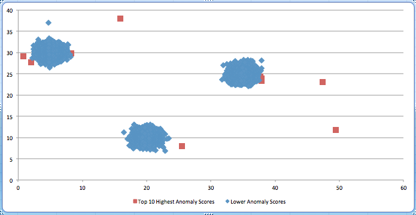
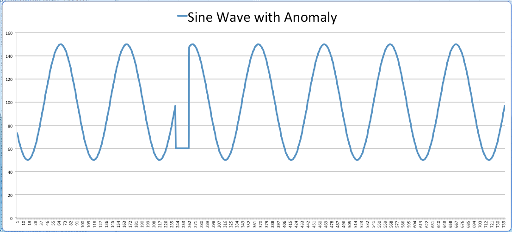
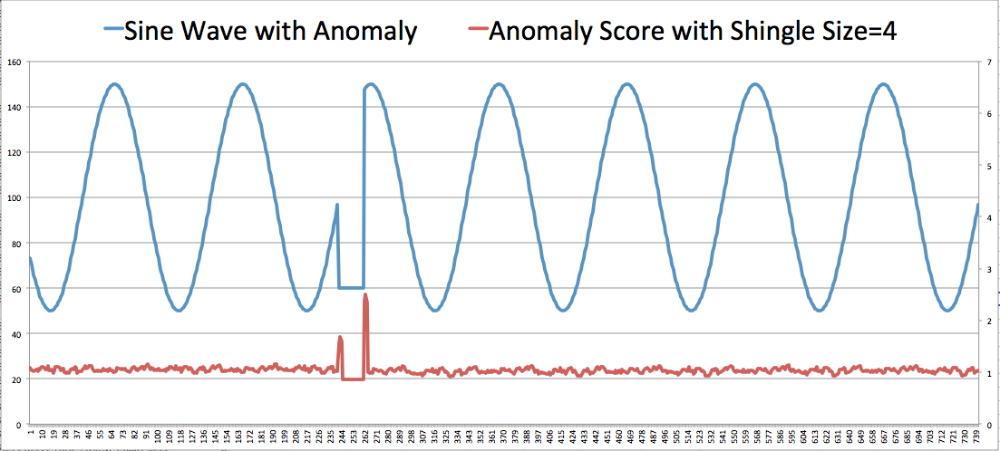

# RANDOM_CUT_FOREST

Detects anomalies in your data stream.  A record is an anomaly if it is distant from other records.  To detect anomalies in individual record columns, see
[RANDOM_CUT_FOREST_WITH_EXPLANATION](sqlrf-random-cut-forest-with-explanation.md "sqlrf-random-cut-forest-with-explanation.md").

###### Note

The `RANDOM_CUT_FOREST` function's ability to detect anomalies is
application-dependent. To cast your business problem so that it can be solved with
this function requires domain expertise. For example, determining which combination
of columns in your input stream to pass to the function and potentially normalize the data.
For more information, see [inputStream](#random-cut-forest-input-view "#random-cut-forest-input-view").

A stream record can have non-numeric columns, but the function uses only numeric
columns to assign an anomaly score. A record can have one or more numeric
columns. The algorithm uses all of the numeric data in computing an anomaly score.  If
a record has **_n_** numeric columns,
the underlying algorithm assumes each record is a
point in **_n_**-dimensional space. A point in
**_n_**-dimensional space that is distant from
other points receives a higher anomaly score.

The algorithm starts developing the machine learning model using current records in the stream when
you start the application.
The algorithm does not use older records in the stream for machine learning, nor does it use
statistics from previous executions of the application.

The algorithm accepts the `DOUBLE`, `INTEGER`, `FLOAT`, `TINYINT`, `SMALLINT`, `REAL`, and
`BIGINT` data types.

###### Note

DECIMAL is not a supported type. Use DOUBLE instead.

The following is an example of anomaly detection. The diagram shows three
clusters and a few anomalies randomly interjected. The red squares show the records
that received the highest anomaly score according to the
`RANDOM_CUT_FOREST` function. The blue diamonds represent the
remaining records.  Note how the highest scoring records tend to be outside the
clusters.


For a sample application with step-by-step instructions, see
[Detect Anomalies](../dev/app-anomaly-detection.md "../dev/app-anomaly-detection.md").

## Syntax

```
RANDOM_CUT_FOREST (inputStream,    
                   numberOfTrees,
                   subSampleSize,
                   timeDecay,
                   shingleSize)
```

## Parameters

The following sections describe the parameters.

### inputStream

Pointer to your input stream. You set a
pointer using the `CURSOR` function. For example, the following statements
sets a pointer to `InputStream`.

```
CURSOR(SELECT STREAM * FROM InputStream)
CURSOR(SELECT STREAM IntegerColumnX, IntegerColumnY FROM InputStream)
-– Perhaps normalize the column X value.
CURSOR(SELECT STREAM IntegerColumnX / 100, IntegerColumnY FROM InputStream)
–- Combine columns before passing to the function.
CURSOR(SELECT STREAM IntegerColumnX - IntegerColumnY FROM InputStream)

```

The `CURSOR` function is the only required parameter for
the `RANDOM_CUT_FOREST` function. The
function assumes the following default values for the other parameters:

numberOfTrees = 100

subSampleSize = 256

timeDecay = 100,000

shingleSize = 1

When using this function, your input stream can have up to 30 numeric columns.

### numberOfTrees

Using this parameter, you specify the number of random cut trees in the
forest. 

###### Note

By default, the algorithm constructs a number of trees, each
constructed using a given number of sample records (see `subSampleSize`
later in this list) from the input stream. The algorithm uses each tree to assign an anomaly
score. The average of all these scores is the final anomaly score.

The default value for `numberOfTrees` is 100. You can set this
value between 1 and 1,000 (inclusive). By increasing the number of trees in
the forest, you can get a better estimate of the anomaly score, but this
also increases the running time.

### subSampleSize

Using this parameter, you can specify the size of the random sample that you want
the algorithm to use when constructing each tree.  Each tree in the forest is constructed
with a (different) random sample of records.  The algorithm uses each tree to assign an
anomaly score. When the sample reaches `subSampleSize` records, records are
removed randomly, with older records having a higher probability of removal than
newer records.

The default value for `subSampleSize` is 256.  You can set this value
between 10 and 1,000 (inclusive).

Note that the `subSampleSize` must be less than the
`timeDecay` parameter (which is set to 100,000 by default). 
Increasing the sample size provides each tree a larger view of the data, but
also increases the running time.

###### Note

The algorithm returns zero for the first `subSampleSize` records while the
machine learning model is trained.

### timeDecay

The `timeDecay` parameter allows you to specify how much of the
recent past to consider when computing an anomaly score. This is because data
streams naturally evolve over time. For example, an eCommerce website’s revenue
may continuously increase, or global temperatures may rise over time.  In such
situations, we want an anomaly to be flagged relative to recent data, as opposed
to data from the distant past.

The default value is 100,000 records (or 100,000 shingles if shingling is
used, as described in the following section).  You can set this value
between 1 and the maximum integer (that is, 2147483647). The algorithm exponentially
decays the importance of older data.

If you choose the `timeDecay` default of 100,000, the
anomaly detection algorithm does the following:

- Uses only the most recent 100,000 records in the calculations (and
  ignores older records).
- Within the most recent 100,000 records, assigns exponentially more
  weight to recent records and less to older records in anomaly
  detection calculations.

If you don't want to use the default value, you can calculate the number of records
to use in the algorithm. To do this, multiply the number of expected records per day by the
number of days you want the algorithm to consider. For example, if you expect 1,000 records
per day, and you want to analyze 7 days of records, set this parameter to 7,000 (1,000 \*
7).

The `timeDecay` parameter determines the maximum quantity of
recent records kept in the working set of the anomaly detection algorithm. 
Smaller `timeDecay` values are desirable if the data is changing
rapidly.  The best `timeDecay` value is application-dependent.

### shingleSize

The
explanation given here is for a one-dimensional stream (that is, a stream with one
numeric column), but it can also be used for multi-dimensional
streams.

A shingle is a consecutive sequence of the most recent records.  For
example, a `shingleSize` of 10 at time _t_
corresponds to a vector of the last 10 records received up
to and including time _t_.  The algorithm
treats this sequence as a vector over the last `shingleSize`
number of records. 

If data is arriving uniformly in time, a shingle of size 10 at time
_t_ corresponds to the data received at
time _t-9, t-8,…,t_.  At time _t+1_,
the shingle slides over one unit and consists of data from time
_t-8,t-7, …, t, t+1_.  These shingled records gathered
over time correspond to a collection of 10-dimensional vectors over which the
anomaly detection algorithm runs. 

The intuition is that a shingle captures the shape of the recent past.  
Your data may have a typical shape.  For example, if your data is collected
hourly, a shingle of size 24 may capture the daily rhythm of your
data.

The default `shingleSize` is one record (because shingle size is data
dependent). You can set this value between 1 and 30 (inclusive).

Note the following about setting the `shingleSize`:

- If you set the `shingleSize` too small, the algorithm
  will be more susceptible to minor fluctuations in the data, leading
  to high-anomaly scores for records that are not anomalous.
- If you set the `shingleSize` too large, it may take
  more time to detect anomalous records because there are more records
  in the shingle that are not anomalous.  It may also take more time
  to determine that the anomaly has ended.
- Identifying the right shingle size is application-dependent. 
  Experiment with different shingle sizes to ascertain the
  effect.

The following example illustrates how you can catch anomalies when you
monitor the records with the highest anomaly score. In this particular example,
the two highest anomaly scores also signal the beginning and end of an
artificially injected anomaly.

Consider this stylized one-dimensional stream represented as a sine wave,
intended to capture a circadian rhythm.  This curve illustrates the typical
number of orders that an eCommerce site receives per hour, the number of
users logged into a server, the number of ad clicks received per hour, etc. 
A severe dip of 20 consecutive records is artificially injected in the
middle of the plot. 



We ran the `RANDOM_CUT_FOREST` function with a shingle size of four records.
The result is shown below. The red line shows the anomaly score.  Note that the
beginning and the end of the anomaly received high scores.



When you use this function, we recommend that you investigate the highest
scoring points as potential anomalies. 

###### Note

The trends that machine learning functions use to determine analysis scores are infrequently reset
when the Kinesis Data Analytics service performs service maintenance. You might unexpectedly see analysis
scores of 0 after service maintenance occurs. We recommend you set up filters or other mechanisms to treat
these values appropriately as they occur.

For more information, see the [Robust Random Cut Forest Based Anomaly Detection On Streams](http://proceedings.mlr.press/v48/guha16.pdf "http://proceedings.mlr.press/v48/guha16.pdf") white paper at the Journal of Machine Learning Research website.
