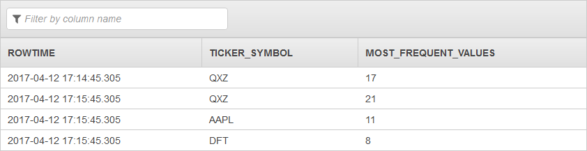

# TOP_K_ITEMS_TUMBLING Function

Returns the most frequently occurring values in the specified
in-application stream column over a tumbling window. This can be used to find
trending (most popular) values in a specified column.

For example, the Getting Started exercise uses a demo stream that provides
continuous stock price updates (ticker_symbol, price, change, and other columns).
Suppose you want to find the three most frequently traded stocks in each 1-minute
tumbling window. You can use this function to find those ticker symbols.

When you use `TOP_K_ITEMS_TUMBLING`, be aware of the following:

- Counting each incoming record on your streaming source is not efficient,
  therefore the function approximates the most frequently occurring values. For
  example, when seeking the three most traded stocks, the function may return
  three of the five most traded stocks.
  The function operates on a [tumbling window](../dev/tumbling-window-concepts.md "../dev/tumbling-window-concepts.md").
  You specify the window size as a parameter.

For a sample application with step-by-step instructions, see
[Most Frequently Occurring Values](../dev/top-k-example.md "../dev/top-k-example.md").

## Syntax

```
TOP_K_ITEMS_TUMBLING (
      in-application-streamPointer,
      '`columnName`',     
      K,
      windowSize,
   )
```

## Parameters

The following sections describe the parameters.

### in-application-streamPointer

Pointer to an
in-application stream. You can set a pointer using the CURSOR function. For
example, the following statement sets a pointer to InputStream.

```
CURSOR(SELECT STREAM * FROM InputStream)
```

### columnName

Column name in your in-application stream that you want to use to compute the
topK values. Note the following about the column name:

###### Note

The column name must appear in single quotation marks ('). For example,
`'column1'`.

### K

Using this parameter, you specify how many of the most frequently
occurring values from a specific column you want returned. The value K
must be greater than or equal to one and cannot exceed 100,000.

### windowSize

Size of the tumbling window in seconds. The size must be greater than or equal to one second and must not exceed 3600 seconds (one hour).

## Examples

### Example Dataset

The examples following are based on the sample stock dataset that is part of [Getting Started](../dev/get-started-exercise.md "../dev/get-started-exercise.md") in the

_Amazon Kinesis Analytics Developer Guide_. To run each example, you
need an Amazon Kinesis Analytics application that has the sample stock ticker input stream. To learn
how to create an Analytics application and configure the sample stock ticker input
stream, see [Getting Started](../dev/get-started-exercise.md "../dev/get-started-exercise.md") in the _Amazon Kinesis Analytics Developer Guide_.

The sample stock dataset has the schema following.

```

(ticker_symbol  VARCHAR(4),
sector          VARCHAR(16),
change          REAL,
price           REAL)

```

### Example 1: Return the Most Frequently Occurring Values

The following example retrieves the most frequently occuring values in the sample stream created in the [Getting Started](../dev/getting-started.md "../dev/getting-started.md") tutorial.

```
CREATE OR REPLACE STREAM DESTINATION_SQL_STREAM (
  "TICKER_SYMBOL" VARCHAR(4),
  "MOST_FREQUENT_VALUES" BIGINT
);

CREATE OR REPLACE PUMP "STREAM_PUMP" AS
    INSERT INTO "DESTINATION_SQL_STREAM"
    SELECT STREAM *
        FROM TABLE (TOP_K_ITEMS_TUMBLING(
            CURSOR(SELECT STREAM * FROM "SOURCE_SQL_STREAM_001"),
            'TICKER_SYMBOL',         -- name of column in single quotes
            5,                       -- number of the most frequently occurring values
            60                       -- tumbling window size in seconds
            )
        );


```

The preceding example outputs a stream similar to the following.


