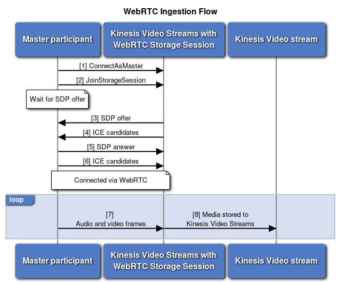
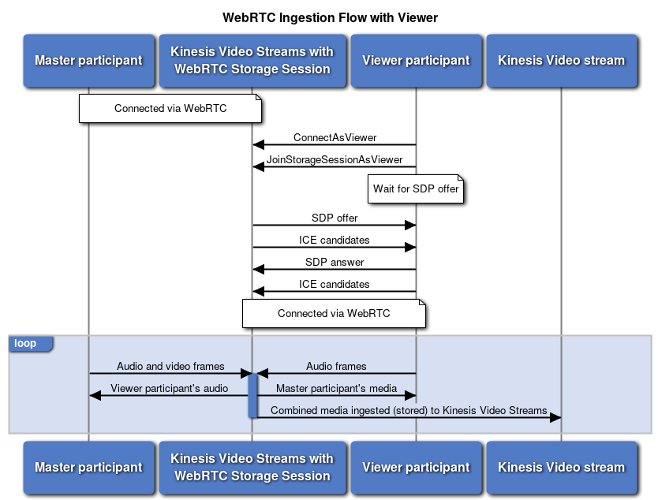

# What is Amazon Kinesis Video Streams with WebRTC ingestion and storage?

Amazon Kinesis Video Streams offers capabilities to stream video and audio in real-time via WebRTC to the
cloud for storage, playback, and analytical processing. This topic will provide
step-by-step instructions to set up and use our WebRTC SDK and cloud APIs to enable both
real-time streaming and media ingestion to the cloud. These instructions include
guidance for using the AWS Command Line Interface and the Kinesis Video Streams
console.

Before you use Amazon Kinesis Video Streams with WebRTC for the first time, see [Set up an AWS account](set-up-account.md "set-up-account.md").

## Understanding WebRTC ingestion and storage

The following sections explain the different ingestion and storage options available in Kinesis Video Streams with WebRTC.

###### Topics

- [Master participant only](#master-ptp-only "#master-ptp-only")
- [Master and viewer participants together](#master-viewer-ptp-together "#master-viewer-ptp-together")

### Master participant only

Master participants first connect to Kinesis Video Streams with WebRTC Signaling via [ConnectAsMaster](ConnectAsMaster.md "ConnectAsMaster.md"). Next, they call the [JoinStorageSession](../../../kinesisvideostreams/latest/dg/API_webrtc_JoinStorageSession.md "../../../kinesisvideostreams/latest/dg/API_webrtc_JoinStorageSession.md") API to have the storage session initiate a WebRTC connection. Once a WebRTC connection is established, media will be ingested to the configured Kinesis video stream.

### Master and viewer participants together

Viewer participants first connect to Kinesis Video Streams with WebRTC Signaling via [ConnectAsViewer](ConnectAsViewer.md "ConnectAsViewer.md"). Next, they call the [JoinStorageSessionAsViewer](../../../kinesisvideostreams/latest/dg/API_webrtc_JoinStorageSessionAsViewer.md "../../../kinesisvideostreams/latest/dg/API_webrtc_JoinStorageSessionAsViewer.md") API to have the storage session initiate a WebRTC connection. Once a WebRTC connection is established, combined media from the master and all viewer participants will be ingested to the configured Kinesis video stream, as long as the master participant is present.

The storage session combines and forwards all viewer participant’s audio to the
master participant. Viewer participants receive combined media from the master
participant and audio from any other viewer participants from the storage
session.

## Establish a WebRTC connection with the storage session

Since the storage session is within the Amazon network, the storage session will only
send `relay` (`TURN`) candidates to participants. If the
participant's network allows, `srflx` (`STUN`) candidates can
be used to connect to the storage session. In other words, from the perspective of
the participant, the local nominated ICE candidate can be `srflx` or
`relay`, while the remote ICE candidate is always
`relay`.

To optimize connection times, don't send `host` candidates to the
storage session. The storage session also requires `Trickle ICE` to be used.

See [Troubleshoot issues connecting with the storage session](troubleshoot-establish-storage.md "troubleshoot-establish-storage.md") to troubleshoot connection
issues to the storage session.
