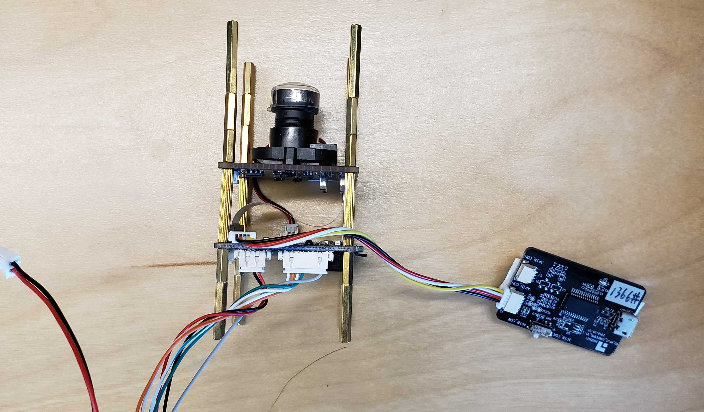

# Integrate with Ingenic T31

###### Note

AWS does not endorse this chipset in any way, nor do we guarantee the integration will work. This guide is based on testing by the Amazon Kinesis Video Streams team and is provided to assist customers in setting up their devices.

Follow these procedures to set up Amazon Kinesis Video Streams with WebRTC on Ingenic T31 hardware.

## Download the code

1. Set up a build directory.

For this tutorial, create a directory called `ingenic` within the
`Downloads` folder.

```
mkdir ~/Downloads/`ingenic`
cd ~/Downloads/`ingenic`
```

2. Clone the following repo into your new directory: [https://github.com/aws-samples/amazon-kinesis-video-streams-media-interface](https://github.com/aws-samples/amazon-kinesis-video-streams-media-interface "https://github.com/aws-samples/amazon-kinesis-video-streams-media-interface").

```
git clone https://github.com/aws-samples/amazon-kinesis-video-streams-media-interface.git
```

## Set up the build environment

1. Obtain the pre-built docker image containing the tool chain and place it in the `ingenic` folder.

###### Important

The tool chain may differ based on the board and CPU types. Check with the vendor for the correct tool chain. 2. Load the `Ingenic-T31-app-build.tar.gz` docker image.

```
docker load --input ./Ingenic-T31-app-build.tar.gz
```

Expected output:

```
580272b5675c: Loading layer [==================================================>]  1.666GB/1.666GB
Loaded image ID: sha256:76d41ef9b2f53ad3f2a33f00ae110df3d1b491378a4005e19ea989ce97e99bc1
```

Make note of the `Image Id`. You'll need this in the next step. 3. Run the following command to mount the current directory (`~/Downloads/ingenic`) on
your host machine to the `/ingenicMappedFolder` directory inside the Docker
container.

This command also runs the container in interactive mode with a terminal session. You'll
be dropped into a Bash shell inside the container, which allows you to execute commands
directly.

```
docker run \
   -v `pwd`:/ingenicMappedFolder \
   -it 76d41ef9b2f53ad3f2a33f00ae110df3d1b491378a4005e19ea989ce97e99bc1 \
   /bin/bash
```

4. Review the contents of the `/ingenicMappedFolder` folder to confirm that the
   bind-mount volume succeeded.

**Prompt:**

```
ls /ingenicMappedFolder
```

**Response:**

```
AWS-Solution-Remote-Diagnostic-Media-Interface Ingenic-T31-app-build.tar.gz
```

5. Verify that the docker container has the environment variables set up:

**Prompt:**

```
env
```

**Response:**

```
CC=mips-linux-gnu-gcc
CXX=mips-linux-gnu-g++
PATH=/mips-gcc540-glibc222-64bit-r3.3.0/bin:/usr/local/sbin:/usr/local/bin:/usr/sbin:/usr/bin:/sbin:/bin
```

6. Verify that the docker container contains the tool chain and Ingenic SDK. It should be
   located at `/ingenic-sdk`.

**Prompt:**

```
ls /
```

**Response:**

```
bin   `ingenic-sdk`          libx32                             proc  sys
boot  `ingenicMappedFolder`  media                              root  tmp
dev   lib                  mips-gcc540-glibc222-64bit-r3.3.0  run   usr
etc   lib32                mnt                                sbin  var
home  lib64                opt                                srv
```

## Build the Amazon Kinesis Video Streams with WebRTC application

1. Type the following:

```
cd /ingenicMappedFolder/AWS-Solution-Remote-Diagnostic-Media-Interface
cp -r /ingenic-sdk/* \
    /ingenicMappedFolder/amazon-kinesis-video-streams-media-interface/3rdparty/T31/
export LDFLAGS=-Wl,--dynamic-linker=/lib/ld.so.1
mkdir build
cmake -B ./build -DBOARD=T31 -DCMAKE_BUILD_TYPE=Release -DBUILD_WEBRTC_SAMPLES=ON \
    -DBUILD_KVS_SAMPLES=ON -DBUILD_SAVE_FRAME_SAMPLES=ON
cmake --build ./build --config Release
```

The `kvswebrtcmaster-static` application is located at
`/ingenicMappedFolder/AWS-Solution-Remote-Diagnostic-Media-Interface/build/samples/webrtc/`. 2. Run the following command to exit the docker container:

```
exit
```

3. On your host machine, verify that the `kvswebrtcmaster-static` application is present.

```
ls ~/Downloads/ingenic/AWS-Solution-Remote-Diagnostic-Media-Interface/build/samples/webrtc/kvswebrtcmaster-static
```

## Upload the application to the device

1. On your host machine, copy the static binary to a micro SD Card.

```
cp ~/Downloads/ingenic/AWS-Solution-Remote-Diagnostic-Media-Interface/build/samples/webrtc/kvswebrtcmaster-static /Volumes/IngenicSDCard
```

2. Download this [.pem file](https://www.amazontrust.com/repository/AmazonRootCA1.pem "https://www.amazontrust.com/repository/AmazonRootCA1.pem") and place it in the micro SD card as `cert.pem`.
3. Put the micro SD card into the micro SD card slot.

## Connect to the device

1. Attach the serial port tool to the board, as shown below.

 2. Plug the ethernet and power cords into the device. A red LED should turn on. 3. Connect your host machine to the micro-usb slot on the serial port tool. 4. Check for the connected devices:

```
ls /dev/tty.*
```

###### Note

If you have multiple TTY devices, determine which TTY device is the Ingenic board. Disconnect the device from your host machine and run `ls` again. Compare the command output and locate the difference. 5. Connect to it using `screen` or another serial port tool (for example, Tera Term).
Set the baud rate to 115200.

```
screen /dev/tty.usbserial-`XXXXXXX` 115200
```

6. Determine the appropriate action, based on the state of your board:
   - If the shell session ends with a `#`, the boot was interrupted. Use
     `boot` command to start the Linux OS, then continue with the rest of this step.
   - If the shell session asks you to log in, type your password.
   - If the screen is blank, press Enter.
   - If the screen shows the error `Cannot exec '/dev/tty.usbserial-XXXXXXX': No such
file or directory`, double-check all of the physical connections between the board and
     your host machine.

## Mount the micro SD card on the board

1. Create a directory:

###### Note

For this example, we're using `sdcard`.

```
mkdir /tmp/sdcard
```

2. Type the following to mount the micro SD card to the folder:

```
mount /dev/mmcblk0p1 /tmp/sdcard
```

3. Review the contents of the folder:

```
ls /tmp/sdcard
```

## Run the application

1. Navigate to the mounted directory:

```
cd /tmp/sdcard
```

2. Export your credentials and other information from the board:

```
export AWS_ACCESS_KEY_ID=`ID`
export AWS_SECRET_ACCESS_KEY=`key`
export AWS_DEFAULT_REGION=us-west-2
export AWS_KVS_CACERT_PATH=`pwd`/cert.pem
```

3. Run the application:

```
./kvswebrtcmaster-static `channel-name`
```

## View the media

To view the media, connect to the signaling channel as a **viewer**. See the following sections for examples:

- [JavaScript](kvswebrtc-sdk-js.md "kvswebrtc-sdk-js.md")
- [AWS Management Console](kvswebrtc-sdk-js.md#sdk-js-stream-console "kvswebrtc-sdk-js.md#sdk-js-stream-console")
- [Android](kvswebrtc-sdk-android.md "kvswebrtc-sdk-android.md")
- [iOS](kvswebrtc-sdk-ios.md "kvswebrtc-sdk-ios.md")

## Troubleshooting

This section contains common questions and issues that we have encountered.

### When I connect the board to my host machine and run `ls /dev/tty.*`, the device doesn't appear.

Verify the connections and all wires are secured, and that the device is powered on. Check that any LED indicators on your USB-to-TTY device are lit. If you’re still having issues, contact the vendor to further diagnose issues connecting to the board.

### The application fails to connect to signaling

If receive one of the following errors:

`SSL error: certificate is not yet valid`

**or**

```
2024-09-19 08:56:34.920 WARN    lwsHttpCallbackRoutine(): Received client http read response:  { "message": "Signature expired: 20240919T085634Z is now earlier than 20240919T155135Z (20240919T155635Z - 5 min.)" }
```

It means the time is not correct on your Ingenic board. Verify this by running the date
command. Set the time according to the vendor’s instructions, then run the application
again.

### The application fails to start, even though the file is there

If the error looks like:

```
-sh ./kvswebrtcmaster-static: not found
```

It means that the operating system wasn't able to find a dependency listed in the
application's ELF header. For example, `libc` on the device.

Usually, this indicates that the toolchain used is not compatible with the board, or that
the linker flags (`LDFLAGS`) don't correctly point to the required library paths,
leading to unresolved dependencies during runtime.

Make sure that the correct toolchain (`uclibc` vs `glibc` and its
version) matches the software on the board and set `LDFLAGS` according to [Build the Amazon Kinesis Video Streams with WebRTC application](#t31-build-app "#t31-build-app").

### How do I unmount the micro SD card?

To unmount the micro SD card, use the command:

```
umount /tmp/sdcard
```
