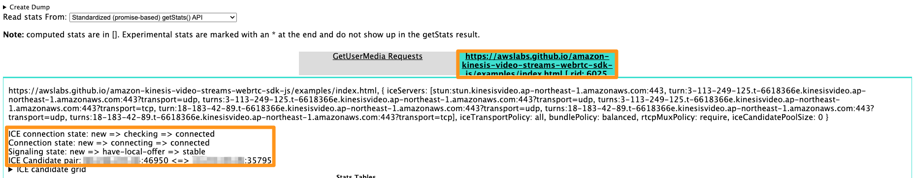
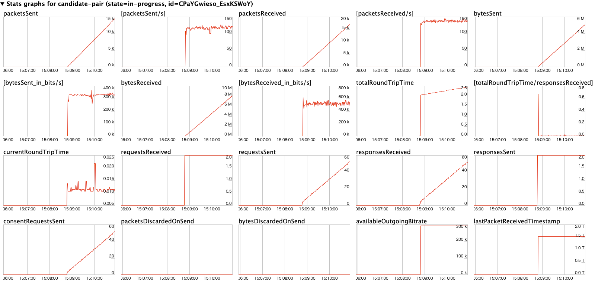

# Troubleshooting Amazon Kinesis Video Streams with WebRTC

Use the following information to troubleshoot common issues that you might encounter with
Amazon Kinesis Video Streams with WebRTC.

## Issues establishing a peer-to-peer session

WebRTC can help alleviate issues that occur due to:

- Network address translation (NAT)
- Firewalls
- Proxies between peers

WebRTC provides a framework to help negotiate and maintain connections for as long as
the peers are connected. It also provides a mechanism for relaying media through a
`TURN` server in case a peer-to-peer connection can't be negotiated.

Given all of the components necessary to establish the connection, it's worth
understanding a few tools that are available to help troubleshoot issues related to
establishing a session.

###### Topics

- [Session Description Protocol (SDP) offers and answers](#sdp "#sdp")
- [Evaluate ICE candidate generation](#ice-candidate "#ice-candidate")
- [Determine which candidates were used to
  establish the connection](#determine-candidate "#determine-candidate")
- [ICE-related timeouts](#troubleshooting-ice-timeouts "#troubleshooting-ice-timeouts")

### Session Description Protocol (SDP) offers and answers

Session Description Protocol (SDP) offers and answers initialize the RTC session
between peers.

To learn more about the SDP protocol, see the [specification](https://www.rfc-editor.org/rfc/rfc4566#section-5 "https://www.rfc-editor.org/rfc/rfc4566#section-5").

- **Offers** are generated by "viewers" who
  want to connect to peers that are connected to the signaling channel as a
  "master" in Kinesis Video Streams with WebRTC.
- **Answers** are generated by the receiver of
  the offer.

Both offers and answers are generated on the client side, although they might
contain ICE candidates that have been gathered up to that point.

The [Kinesis Video Streams WebRTC SDK for C](https://github.com/awslabs/amazon-kinesis-video-streams-webrtc-sdk-c#getting-the-sdps "https://github.com/awslabs/amazon-kinesis-video-streams-webrtc-sdk-c#getting-the-sdps") includes a simple environment variable that you
can set to log the SDP. This is useful to understand both the offers being received
and the answers being generated.

To log SDPs to `stdout` from the SDK, set the following environment
variable: `export DEBUG_LOG_SDP=TRUE`. You can also log SDP offers and
answers in JavaScript-based clients using the `sdpOffer` event. To see
this demonstrated, see [GitHub](https://github.com/awslabs/amazon-kinesis-video-streams-webrtc-sdk-js/blob/983b62f07330e05277fd072f8062fecd8233bce7/examples/master.js#L123 "https://github.com/awslabs/amazon-kinesis-video-streams-webrtc-sdk-js/blob/983b62f07330e05277fd072f8062fecd8233bce7/examples/master.js#L123").

For additional information, see [Monitor Kinesis Video Streams with WebRTC](kvswebrtc-monitoring-cw.md "kvswebrtc-monitoring-cw.md").

If the SDP answer is not returned, it is possible that the peer was unable to
accept the SDP offer, since the offer does not contain any compatible media codecs.
You may see logs similar to the following:

```
I/webrtc_video_engine.cc: (line 808): SetSendParameters: {codecs: [VideoCodec[126:H264]], conference_mode: no, extensions: [], extmap-allow-mixed: false, max_bandwidth_bps: -1, mid: video1}
E/webrtc_video_engine.cc: (line 745): No video codecs supported.
E/peer_connection.cc: (line 6009): Failed to set remote video description send parameters for m-section with mid='video1'. (INVALID_PARAMETER)
E/peer_connection.cc: (line 3097): Failed to set remote offer sdp: Failed to set remote video description send parameters for m-section with mid='video1'.
E/KinesisVideoSdpObserver: onSetFailure(): Error=Failed to set remote offer sdp: Failed to set remote video description send parameters for m-section with mid='video1'.
D/KVSWebRtcActivity: Received SDP offer for client ID: null. Creating answer
E/peer_connection.cc: (line 2373): CreateAnswer: Session error code: ERROR_CONTENT. Session error description: Failed to set remote video description send parameters for m-section with mid='video1'..
E/KinesisVideoSdpObserver: onCreateFailure(): Error=Session error code: ERROR_CONTENT. Session error description: Failed to set remote video description send parameters for m-section with mid='video1'..
```

As you review the SDP offer contents, look for lines starting with
`a=rtpmap` to see which media codecs are being requested.

```
...
a=rtpmap:126 H264/90000
...
a=rtpmap:111 opus/48000/2
...
```

**If you're using Safari as a viewer to connect to a master
sending H.265 media and you encounter the following:**

- `InvalidAccessError: Failed to set remote answer sdp: Called with SDP without DTLS
fingerprint.`
- `InvalidAccessError: Failed to set remote answer sdp: rtcp-mux must be enabled when
BUNDLE is enabled.`

Confirm the issue is with the SDP offer generated by the browser. In the SDP
offer, search for lines starting for `a=rtpmap`, and check if a line for
H.265 is present. It should look like this:

```
a=rtpmap:104 H265/90000
```

If it's not present, enable the H.265 codec for WebRTC in the Safari settings.

In the Safari top navigation, do the following:

- Select **Safari** > **Settings...** >
  **Advanced**. Select the **Show features for
  web developers** box.
- Select **Feature Flags**. Select the **WebRTC
  H265 codec** box.

Restart your browser for the changes to take effect.

### Evaluate ICE candidate generation

ICE candidates are generated by each client that makes calls to the
`STUN` server. For Kinesis Video Streams with WebRTC, the `STUN` server
is `stun:stun.kinesisvideo.{aws-region}.amazonaws.com:443`.

In addition to calling the `STUN` server to obtain candidates, clients
often also call the `TURN` servers. They make this call so that the relay
server can be used as a fallback in case a direct peer-to-peer connection can't be
established.

You can use the following tools to generate ICE candidates:

- A [Trickle ICE WebRTC sample](https://webrtc.github.io/samples/src/content/peerconnection/trickle-ice/ "https://webrtc.github.io/samples/src/content/peerconnection/trickle-ice/"), which uses Trickle ICE to gather
  candidates
- [IceTest.Info](https://icetest.info/ "https://icetest.info/")

With both of these tools. you can enter the `STUN` and
`TURN` server information to gather candidates.

To obtain the `TURN` server information and necessary credentials for
Kinesis Video Streams with WebRTC, you can call the [GetIceServerConfig API operation](../../../kinesisvideostreams/latest/dg/API_AWSAcuitySignalingService_GetIceServerConfig.md "../../../kinesisvideostreams/latest/dg/API_AWSAcuitySignalingService_GetIceServerConfig.md").

The following AWS CLI calls demonstrate how to obtain this information to use in
these two tools.

```
export CHANNEL_ARN="YOUR_CHANNEL_ARN"

aws kinesisvideo get-signaling-channel-endpoint \
    --channel-arn $CHANNEL_ARN \
    --single-master-channel-endpoint-configuration Protocols=WSS,HTTPS,Role=MASTER
```

The output from the [`get-signaling-channel-endpoint`](../../../kinesisvideostreams/latest/dg/API_GetSignalingChannelEndpoint.md "../../../kinesisvideostreams/latest/dg/API_GetSignalingChannelEndpoint.md") command returns a
response that looks like this:

```
{
  "ResourceEndpointList": [
    {
      "Protocol": "HTTPS",
      "ResourceEndpoint": "https://your-endpoint.kinesisvideo.us-east-1.amazonaws.com"
    },
    {
      "Protocol": "WSS",
      "ResourceEndpoint": "wss://your-endpoint.kinesisvideo.us-east-1.amazonaws.com"
    }
  ]
}
```

Use the HTTPS `ResourceEndpoint` value to obtain the list of
`TURN` servers as follows:

```
export ENDPOINT_URL="https://your-endpoint.kinesisvideo.us-east-1.amazonaws.com"

aws kinesis-video-signaling get-ice-server-config \
    --channel-arn $CHANNEL_ARN \
    --service TURN \
    --client-id my-amazing-client \
    --endpoint-url $ENDPOINT_URL
```

The response contains `TURN` server details, including endpoints for
TCP and UDP and the credentials required to access them.

###### Note

The
TTL
value in the response determines the duration, in seconds,
that these credentials are valid for. Use these values in the [Trickle ICE WebRTC sample](https://webrtc.github.io/samples/src/content/peerconnection/trickle-ice/ "https://webrtc.github.io/samples/src/content/peerconnection/trickle-ice/") or in [IceTest.Info](https://icetest.info/ "https://icetest.info/") to generate ICE candidates using the Kinesis Video Streams managed
service endpoints.

### Determine which candidates were used to

establish the connection

It can be helpful to understand which candidates were used to successfully
establish the session. If you have a browser-based client running an established
session, you can determine this information in Google Chrome by using the built-in
webrtc-internals utility.

Open a WebRTC session in one browser tab.

In another tab, open `chrome://webrtc-internals/`. You can view all of
the information about your ongoing session in this tab.

You will see information about the established connection. For example:



You can also confirm metrics like the following for the established
connection.



### ICE-related timeouts

Default timeout values are set for ICE in the [KvsRtcConfiguration](https://awslabs.github.io/amazon-kinesis-video-streams-webrtc-sdk-c/structKvsRtcConfiguration.html "https://awslabs.github.io/amazon-kinesis-video-streams-webrtc-sdk-c/structKvsRtcConfiguration.html"). The defaults should be sufficient for most users,
but you may need to adjust them to improve chances of establishing a connection over
a poor network. You can configure these defaults in the application.

Review the log for the default settings:

```
2024-01-08 19:43:44.433 INFO    iceAgentValidateKvsRtcConfig():
	iceLocalCandidateGatheringTimeout: `10000` ms
	iceConnectionCheckTimeout: `12000` ms
	iceCandidateNominationTimeout: `12000` ms
	iceConnectionCheckPollingInterval: `50` ms
```

If you have poor network quality and want to improve chances of connection, try
adjusting the following values:

- `iceLocalCandidateGatheringTimeout` - Increase this timeout
  limit to gather additional potential candidates to try for connection. The
  goal is to try all possible candidate pairs, so if you're on a poor network,
  increase this limit to give more time to gather.

For example, if the host candidates didn't work and server reflexive
(srflx) or relay candidates need to be tried, you may need to increase this
timeout. Due to poor network, the candidates are gathered slowly and the
application doesn't want to spend more than 20 seconds on this step.
Increasing the timeout provides more time to gather potential candidates to
try for connection.

###### Note

We recommend that this value be less than
`iceCandidateNominationTimeout`, since the nomination
step needs to have time to work with the new candidates.

- `iceConnectionCheckTimeout` - Increase this timeout in unstable
  or slow networks, where the packet exchange and binding request/response
  take time. Increasing this timeout allows at least one candidate pair to be
  tried for nomination by the other peer.
- `iceCandidateNominationTimeout` - Increase this timeout to
  ensure candidate pairs with the local relay candidate are tried.

For example, if it takes about 15 seconds to gather the first local relay
candidate, set the timeout to a value more than 15 seconds to ensure
candidate pairs with the local relay candidate are tried for success. If the
value is set to less than 15 seconds, the SDK would lose out on trying a
potential candidate pair, leading to connection establishment
failure.

###### Note

We recommend that this value be greater than
`iceLocalCandidateGatheringTimeout`, in order for it to
have an effect.

- `iceConnectionCheckPollingInterval` - This value defaults to 50
  milliseconds per [specification](https://datatracker.ietf.org/doc/html/rfc8445#section-14.2 "https://datatracker.ietf.org/doc/html/rfc8445#section-14.2"). Changing this value changes the frequency of
  connectivity checks and, essentially, the ICE state machine
  transitions.

In a reliable, high performance network setting with good system
resources, you can decrease the value to help in faster connection
establishment. Increasing the value could help reduce the network load, but
the connection establishment could slow down.

###### Important

We don't recommend changing this default.
