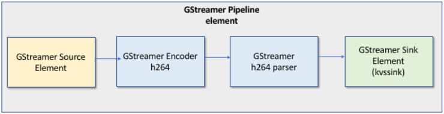

# Example: Kinesis Video Streams producer SDK GStreamer

Plugin - kvssink

This topic describes how to build the Amazon Kinesis Video Streams producer SDK to use as a GStreamer plugin.

###### Topics

- [Download, build, and configure the
  GStreamer element](#examples-gstreamer-plugin-download "#examples-gstreamer-plugin-download")
- [Run the GStreamer element](#examples-gstreamer-plugin-run "#examples-gstreamer-plugin-run")
- [Example GStreamer launch
  commands](#examples-gstreamer-plugin-launch "#examples-gstreamer-plugin-launch")
- [Run the GStreamer element in a
  Docker container](#examples-gstreamer-plugin-docker "#examples-gstreamer-plugin-docker")
- [GStreamer element parameter
  reference](examples-gstreamer-plugin-parameters.md "examples-gstreamer-plugin-parameters.md")
  [GStreamer](https://gstreamer.freedesktop.org/ "https://gstreamer.freedesktop.org/") is a popular media
  framework used by multiple cameras and video sources to create custom media pipelines by
  combining modular plugins. The Kinesis Video Streams GStreamer plugin streamlines the integration of
  your existing GStreamer media pipeline with Kinesis Video Streams. After integrating GStreamer, you can
  stream video from a webcam or Real Time Streaming Protocol (RTSP) camera to Kinesis Video Streams for
  real-time or later playback, storage, and further analysis.

The GStreamer plugin automatically manages the transfer of your video stream to Kinesis Video Streams
by encapsulating the functionality provided by the Kinesis Video Streams producer SDK in a GStreamer
sink element, `kvssink`. The GStreamer framework provides a standard managed
environment for constructing media flow from a device such as a camera or other video
source for further processing, rendering, or storage.

The GStreamer pipeline typically consists of the link between a source (video camera)
and the sink element (either a player to render the video, or storage for offline
retrieval). In this example, you use the Producer SDK element as a
_sink_, or media destination, for your video source (webcam or IP
camera). The plugin element that encapsulates the SDK then sends the video stream to
Kinesis Video Streams.

This topic describes how to construct a GStreamer media pipeline that's capable of
streaming video from a video source, such as a web camera or RTSP stream, typically
connected through intermediate encoding stages (using H.264 encoding) to Kinesis Video Streams. When
your video stream is available as a Kinesis video stream, you can use the [Watch output from cameras using parser library](parser-library.md "parser-library.md") for further processing, playback, storage, or
analysis of your video stream.



## Download, build, and configure the

GStreamer element

The GStreamer Plugin example is included with the Kinesis Video Streams C++ producer SDK. For
information about SDK prerequisites and downloading, see [Download and configure the C++ producer
library code](producersdk-cpp-download.md "producersdk-cpp-download.md").

You can build the producer SDK GStreamer sink as a dynamic library on macOS,
Ubuntu, Raspberry Pi, or Windows. The GStreamer plugin is located in your
`build` directory. To load this plugin, it must be in your
`GST_PLUGIN_PATH`. Run the following command:

```

export GST_PLUGIN_PATH=`pwd`/build
```

###### Note

On macOS, you can only stream video from a network camera when running
GStreamer in a Docker container. Streaming video from a USB camera on macOS in a
Docker container is not supported.

## Run the GStreamer element

To run GStreamer with the Kinesis Video Streams producer SDK element as a sink, use the
`gst-launch-1.0` command. Use upstream elements that are appropriate
for the GStreamer plugin to use. For example, [v4l2src](https://gstreamer.freedesktop.org/documentation/video4linux2/v4l2src.html?gi-language=c#v4l2src-page "https://gstreamer.freedesktop.org/documentation/video4linux2/v4l2src.html?gi-language=c#v4l2src-page") for v4l2 devices on Linux systems, or [rtspsrc](https://gstreamer.freedesktop.org/documentation/rtsp/rtspsrc.html#rtspsrc-page "https://gstreamer.freedesktop.org/documentation/rtsp/rtspsrc.html#rtspsrc-page") for RTSP devices. Specify `kvssink` as the sink
(final destination of the pipeline) to send video to the Producer SDK.

In addition to [providing credentials](examples-gstreamer-plugin-parameters.md#credentials-to-kvssink "examples-gstreamer-plugin-parameters.md#credentials-to-kvssink") and [providing a region](examples-gstreamer-plugin-parameters.md#kvssink-region "examples-gstreamer-plugin-parameters.md#kvssink-region"), the `kvssink`element has the following
required parameter:

- `stream-name` – The name of the destination Kinesis Video Streams.

For information about `kvssink` optional parameters, see [GStreamer element parameter
reference](examples-gstreamer-plugin-parameters.md "examples-gstreamer-plugin-parameters.md").

For the latest information about GStreamer plugins and parameters, see [GStreamer Plugins](https://gstreamer.freedesktop.org/documentation/plugins_doc.html?gi-language=c "https://gstreamer.freedesktop.org/documentation/plugins_doc.html?gi-language=c"). You may also use `gst-inspect-1.0`
followed by the name of a GStreamer element or plugin to print its information and
to verify that it is available on your device:

```
gst-inspect-1.0 kvssink
```

If building `kvssink` failed or GST_PLUGIN_PATH is not properly set, your output will look
similar to this:

```
No such element or plugin 'kvssink'
```

## Example GStreamer launch

commands

The following examples demonstrate how to use the `kvssink` GStreamer plugin to
stream video from different types of devices.

### Example 1: Stream video

from an RTSP camera on Ubuntu

The following command creates a GStreamer pipeline on Ubuntu that streams from
a network RTSP camera, using the [rtspsrc](https://gstreamer.freedesktop.org/documentation/rtsp/rtspsrc.html?gi-language=c "https://gstreamer.freedesktop.org/documentation/rtsp/rtspsrc.html?gi-language=c") GStreamer plugin:

```
gst-launch-1.0 -v rtspsrc location="rtsp://YourCameraRtspUrl" short-header=TRUE ! rtph264depay ! h264parse ! kvssink stream-name="YourStreamName" storage-size=128
```

### Example 2: Encode and

stream video from a USB camera on Ubuntu

The following command creates a GStreamer pipeline on Ubuntu that encodes the
stream from a USB camera in H.264 format, and streams it to Kinesis Video Streams. This example
uses the [v4l2src](https://gstreamer.freedesktop.org/documentation/video4linux2/v4l2src.html?gi-language=c#v4l2src-page "https://gstreamer.freedesktop.org/documentation/video4linux2/v4l2src.html?gi-language=c#v4l2src-page") GStreamer plugin.

```
gst-launch-1.0 v4l2src do-timestamp=TRUE device=/dev/video0 ! videoconvert ! video/x-raw,format=I420,width=640,height=480,framerate=30/1 ! x264enc  bframes=0 key-int-max=45 bitrate=500 ! video/x-h264,stream-format=avc,alignment=au,profile=baseline ! kvssink stream-name="YourStreamName" storage-size=512 access-key="YourAccessKey" secret-key="YourSecretKey" aws-region="YourAWSRegion"
```

### Example 3: Stream

pre-encoded video from a USB camera on Ubuntu

The following command creates a GStreamer pipeline on Ubuntu that streams
video that the camera has already encoded in H.264 format to Kinesis Video Streams. This
example uses the [v4l2src](https://gstreamer.freedesktop.org/documentation/video4linux2/v4l2src.html?gi-language=c#v4l2src-page "https://gstreamer.freedesktop.org/documentation/video4linux2/v4l2src.html?gi-language=c#v4l2src-page") GStreamer plugin.

```
gst-launch-1.0 v4l2src do-timestamp=TRUE device=/dev/video0 ! h264parse ! video/x-h264,stream-format=avc,alignment=au ! kvssink stream-name="plugin" storage-size=512 access-key="YourAccessKey" secret-key="YourSecretKey" aws-region="YourAWSRegion"
```

### Example 4: Stream video

from a network camera on macOS

The following command creates a GStreamer pipeline on macOS that streams video
to Kinesis Video Streams from a network camera. This example uses the [rtspsrc](https://gstreamer.freedesktop.org/documentation/rtsp/rtspsrc.html#rtspsrc-page "https://gstreamer.freedesktop.org/documentation/rtsp/rtspsrc.html#rtspsrc-page") GStreamer plugin.

```
gst-launch-1.0 rtspsrc location="rtsp://YourCameraRtspUrl" short-header=TRUE ! rtph264depay ! h264parse ! video/x-h264, format=avc,alignment=au ! kvssink stream-name="YourStreamName" storage-size=512  access-key="YourAccessKey" secret-key="YourSecretKey" aws-region="YourAWSRegion"
```

### Example 5: Stream video

from a network camera on Windows

The following command creates a GStreamer pipeline on Windows that streams
video to Kinesis Video Streams from a network camera. This example uses the [rtspsrc](https://gstreamer.freedesktop.org/documentation/rtsp/rtspsrc.html#rtspsrc-page "https://gstreamer.freedesktop.org/documentation/rtsp/rtspsrc.html#rtspsrc-page") GStreamer plugin.

```
gst-launch-1.0 rtspsrc location="rtsp://YourCameraRtspUrl" short-header=TRUE ! rtph264depay ! video/x-h264, format=avc,alignment=au ! kvssink stream-name="YourStreamName" storage-size=512  access-key="YourAccessKey" secret-key="YourSecretKey" aws-region="YourAWSRegion"
```

### Example 6: Stream video

from a camera on Raspberry Pi

The following command creates a GStreamer pipeline on Raspberry Pi that
streams video to Kinesis Video Streams. This example uses the [v4l2src](https://gstreamer.freedesktop.org/documentation/video4linux2/v4l2src.html?gi-language=c#v4l2src-page "https://gstreamer.freedesktop.org/documentation/video4linux2/v4l2src.html?gi-language=c#v4l2src-page") GStreamer plugin.

```
gst-launch-1.0 v4l2src do-timestamp=TRUE device=/dev/video0 ! videoconvert ! video/x-raw,format=I420,width=640,height=480,framerate=30/1 ! omxh264enc control-rate=1 target-bitrate=5120000 periodicity-idr=45 inline-header=FALSE ! h264parse ! video/x-h264,stream-format=avc,alignment=au,width=640,height=480,framerate=30/1,profile=baseline ! kvssink stream-name="YourStreamName" access-key="YourAccessKey" secret-key="YourSecretKey" aws-region="YourAWSRegion"
```

### Example 7: Stream both

audio and video in Raspberry Pi and Ubuntu

See how to [run the gst-launch-1.0 command to start streaming both audio and video in
Raspberry-PI and Ubuntu](https://github.com/awslabs/amazon-kinesis-video-streams-producer-sdk-cpp/blob/master/docs/linux.md#running-the-gst-launch-10-command-to-start-streaming-both-audio-and-video-in-raspberry-pi-and-ubuntu "https://github.com/awslabs/amazon-kinesis-video-streams-producer-sdk-cpp/blob/master/docs/linux.md#running-the-gst-launch-10-command-to-start-streaming-both-audio-and-video-in-raspberry-pi-and-ubuntu").

### Example 8: Stream both

audio and video from device sources in macOS

See how to [run the gst-launch-1.0 command to start streaming both audio and video in
MacOS](https://github.com/awslabs/amazon-kinesis-video-streams-producer-sdk-cpp/blob/master/docs/macos.md#running-the-gst-launch-10-command-to-start-streaming-both-audio-and-raw-video-in-mac-os "https://github.com/awslabs/amazon-kinesis-video-streams-producer-sdk-cpp/blob/master/docs/macos.md#running-the-gst-launch-10-command-to-start-streaming-both-audio-and-raw-video-in-mac-os").

### Example 9: Upload MKV

file that contains both audio and video

See how to [run the gst-launch-1.0 command to upload MKV file that contains both audio
and video](https://github.com/awslabs/amazon-kinesis-video-streams-producer-sdk-cpp/blob/master/docs/windows.md#running-the-gst-launch-10-command-to-upload-mkv-file-that-contains-both-audio-and-video "https://github.com/awslabs/amazon-kinesis-video-streams-producer-sdk-cpp/blob/master/docs/windows.md#running-the-gst-launch-10-command-to-upload-mkv-file-that-contains-both-audio-and-video"). You will need an MKV test file with h.264 and AAC encoded
media.

## Run the GStreamer element in a

Docker container

Docker is a platform for developing, deploying, and running applications using
containers. Using Docker to create the GStreamer pipeline standardizes the operating
environment for Kinesis Video Streams, which streamlines building and using the application.

To install and configure Docker, see the following:

- [Docker
  download instructions](https://docs.docker.com/engine/install/ "https://docs.docker.com/engine/install/")
- [Getting started with
  Docker](https://docs.docker.com/guides/getting-started/ "https://docs.docker.com/guides/getting-started/")

After installing Docker, you can download the Kinesis Video Streams C++ Producer SDK (and
GStreamer plugin) from the Amazon Elastic Container Registry using one of the below provided `docker
 pull` commands.

To run GStreamer with the Kinesis Video Streams producer SDK element as a sink in a Docker

container, do the following:

###### Topics

- [Authenticate your
  Docker client](#examples-gstreamer-plugin-docker-authenticate "#examples-gstreamer-plugin-docker-authenticate")
- [Download the Docker
  image for Ubuntu, macOS, Windows, or Raspberry Pi](#examples-gstreamer-plugin-docker-download "#examples-gstreamer-plugin-docker-download")
- [Run the Docker
  image](#examples-gstreamer-plugin-docker-run "#examples-gstreamer-plugin-docker-run")

### Authenticate your

Docker client

Authenticate your Docker client to the Amazon ECR registry that you intend to pull
your image from. You must get authentication tokens for each registry used.
Tokens are valid for 12 hours. For more information, see [Registry
Authentication](../../../AmazonECR/latest/userguide/Registries.md#registry_auth "../../../AmazonECR/latest/userguide/Registries.md#registry_auth") in the _Amazon Elastic Container Registry User Guide_.

###### Example : Authenticate with Amazon

ECR

To authenticate with Amazon ECR, copy and paste the following command as is
shown.

```
sudo aws ecr get-login-password --region us-west-2 | docker login -u AWS --password-stdin https://546150905175.dkr.ecr.us-west-2.amazonaws.com
```

If successful, the output prints `Login Succeeded`.

### Download the Docker

image for Ubuntu, macOS, Windows, or Raspberry Pi

Download the Docker image to your Docker environment using one the following
commands, depending on your operating system:

#### Download

the Docker image for Ubuntu

```
sudo docker pull 546150905175.dkr.ecr.us-west-2.amazonaws.com/kinesis-video-producer-sdk-cpp-amazon-linux:latest
```

#### Download

the Docker image for macOS

```
docker pull 546150905175.dkr.ecr.us-west-2.amazonaws.com/kinesis-video-producer-sdk-cpp-amazon-linux:latest
```

#### Download

the Docker image for Windows

```
docker pull 546150905175.dkr.ecr.us-west-2.amazonaws.com/kinesis-video-producer-sdk-cpp-amazon-windows:latest
```

#### Download the

Docker image for Raspberry Pi

```
sudo docker pull 546150905175.dkr.ecr.us-west-2.amazonaws.com/kinesis-video-producer-sdk-cpp-raspberry-pi:latest
```

To verify that the image was successfully added, use the following
command:

```
docker images
```

### Run the Docker

image

Use one of the following commands to run the Docker image, depending on your
operating system:

#### Run the Docker

image on Ubuntu

```
sudo docker run -it --network="host" --device=/dev/video0 546150905175.dkr.ecr.us-west-2.amazonaws.com/kinesis-video-producer-sdk-cpp-amazon-linux /bin/bash
```

#### Run the Docker

image on macOS

```
sudo docker run -it --network="host" 546150905175.dkr.ecr.us-west-2.amazonaws.com/kinesis-video-producer-sdk-cpp-amazon-linux /bin/bash
```

#### Run the

Docker image on Windows

```
docker run -it 546150905175.dkr.ecr.us-west-2.amazonaws.com/kinesis-video-producer-sdk-cpp-windows `AWS_ACCESS_KEY_ID` `AWS_SECRET_ACCESS_KEY` `RTSP_URL` `STREAM_NAME`
```

#### Run the Docker

image on Raspberry Pi

```
sudo docker run -it --device=/dev/video0 --device=/dev/vchiq -v /opt/vc:/opt/vc 546150905175.dkr.ecr.us-west-2.amazonaws.com/kinesis-video-producer-sdk-cpp-raspberry-pi /bin/bash
```

Docker launches the container and presents you with a command prompt for using
commands within the container.

In the container, set the environment variables using the following
command:

```
export LD_LIBRARY_PATH=/opt/awssdk/amazon-kinesis-video-streams-producer-sdk-cpp/kinesis-video-native-build/downloads/local/lib:$LD_LIBRARY_PATH
export PATH=/opt/awssdk/amazon-kinesis-video-streams-producer-sdk-cpp/kinesis-video-native-build/downloads/local/bin:$PATH
export GST_PLUGIN_PATH=/opt/awssdk/amazon-kinesis-video-streams-producer-sdk-cpp/kinesis-video-native-build/downloads/local/lib:$GST_PLUGIN_PATH
```

Start streaming to `kvssink` using the `gst-launch-1.0` to run a
pipeline appropriate for your device and video source. For example pipelines,
see [Example GStreamer launch
commands](#examples-gstreamer-plugin-launch "#examples-gstreamer-plugin-launch").
