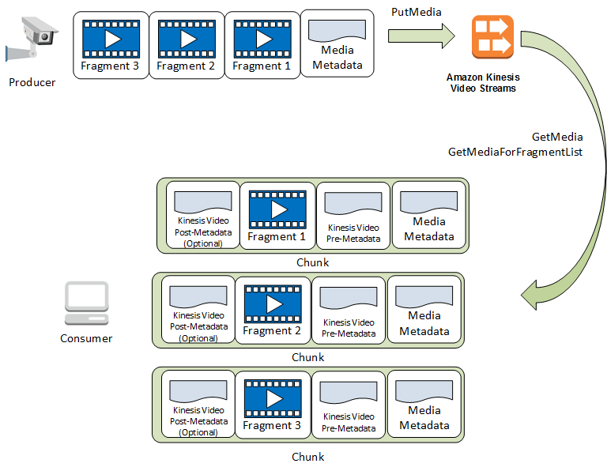

# Kinesis Video Streams API and producer libraries

support

Kinesis Video Streams provides APIs for you to create and manage streams and read or write media data to and from a
stream. The Kinesis Video Streams console, in addition to administration functionality, also supports live and video-on-demand
playback. Kinesis Video Streams also provides a set of producer libraries that you can use in your application code to extract
data from your media sources and upload to your Kinesis video stream.

###### Topics

- [Kinesis Video Streams API](#how-it-works-kinesis-video-api "#how-it-works-kinesis-video-api")
- [Endpoint discovery pattern](#how-it-works-api-pattern "#how-it-works-api-pattern")
- [Producer libraries](#how-it-works-producer-sdk "#how-it-works-producer-sdk")

## Kinesis Video Streams API

Kinesis Video Streams provides APIs for creating and managing Kinesis Video Streams. It also provides APIs for reading and writing
media data to a stream, as follows:

- **Producer API** – Kinesis Video Streams provides a `PutMedia`
  API to write media data to a Kinesis video stream. In a `PutMedia` request, the producer sends a stream of
  media fragments. A _fragment_ is a self-contained sequence of frames. The frames
  belonging to a fragment should have no dependency on any frames from other fragments. For more information,
  see [PutMedia](API_dataplane_PutMedia.md "API_dataplane_PutMedia.md").

As fragments arrive, Kinesis Video Streams assigns a unique fragment number, in increasing order. It also
stores producer-side and server-side timestamps for each fragment, as Kinesis Video Streams-specific metadata.

- **Consumer APIs** – Consumers can use the following APIs to
  get data from a stream:
  - `GetMedia` - When using this API, consumers must
    identify the starting fragment. The API then returns fragments in
    the order in which they were added to the stream (in increasing
    order by fragment number). The media data in the fragments is packed
    into a structured format such as [Matroska (MKV)](https://www.matroska.org/technical/specs/index.html "https://www.matroska.org/technical/specs/index.html"). For more information, see [GetMedia](API_dataplane_GetMedia.md "API_dataplane_GetMedia.md").

  ###### Note

  `GetMedia` knows where the fragments are (archived in the data store or
  available in real time). For example, if `GetMedia` determines that the starting fragment
  is archived, it starts returning fragments from the data store. When it must return newer fragments
  that aren't archived yet, `GetMedia` switches to reading fragments from an in-memory stream
  buffer.

  This is an example of a continuous consumer, which processes
  fragments in the order that they are ingested by the stream.

  `GetMedia` enables video-processing applications to
  fail or fall behind, and then catch up with no additional effort.
  Using `GetMedia`, applications can process data that's
  archived in the data store, and as the application catches up,
  `GetMedia` continues to feed media data in real time
  as it arrives.
  - `GetMediaFromFragmentList` (and
    `ListFragments`) - Batch processing applications are
    considered offline consumers. Offline consumers might choose to
    explicitly fetch particular media fragments or ranges of video by
    combining the `ListFragments` and
    `GetMediaFromFragmentList` APIs.
    `ListFragments` and
    `GetMediaFromFragmentList` enable an application to
    identify segments of video for a particular time range or fragment
    range, and then fetch those fragments either sequentially or in
    parallel for processing. This approach is suitable for
    `MapReduce` application suites, which must quickly
    process large amounts of data in parallel.

  For example, suppose that a consumer wants to process one day's
  worth of video fragments. The consumer would do the
  following:

      1. Get a list of fragments by calling the
       `ListFragments` API and specifying a time
       range to select the desired collection of fragments.

      The API returns metadata from all the fragments in the specified time range.
       The metadata provides information such as fragment number, producer-side and server-side timestamps,
       and so on.
      2. Take the fragment metadata list and retrieve fragments, in any order. For
       example, to process all the fragments for the day, the consumer might choose to split the list into
       sublists and have workers (for example, multiple Amazon EC2 instances) fetch the fragments in parallel
       using the `GetMediaFromFragmentList`, and process them in parallel.

The following diagram shows the data flow for fragments and chunks during these
API calls.

When a producer sends a `PutMedia` request, it sends media metadata in
the payload, and then sends a sequence of media data fragments. Upon receiving the
data, Kinesis Video Streams stores incoming media data as Kinesis Video Streams chunks. Each chunk consists of the
following:

- A copy of the media metadata
- A fragment
- Kinesis Video Streams-specific metadata; for example, the fragment number and server-side and producer-side
  timestamps

When a consumer requests media metadata, Kinesis Video Streams returns a stream of chunks,
starting with the fragment number that you specify in the request.

If you enable data persistence for the stream, after receiving a fragment on the
stream, Kinesis Video Streams also saves a copy of the fragment to the data store.

## Endpoint discovery pattern

**Control Plane REST APIs**

To access the [Kinesis Video Streams Control Plane REST APIs](API_Operations_Amazon_Kinesis_Video_Streams.md "API_Operations_Amazon_Kinesis_Video_Streams.md"), use the [Kinesis Video Streams service
endpoints](../../../general/latest/gr/akv.md#akv_region "../../../general/latest/gr/akv.md#akv_region").

**Data Plane REST APIs**

Kinesis Video Streams is built using a [cellular architecture](../../../wellarchitected/latest/reducing-scope-of-impact-with-cell-based-architecture/what-is-a-cell-based-architecture.md "../../../wellarchitected/latest/reducing-scope-of-impact-with-cell-based-architecture/what-is-a-cell-based-architecture.md") to ensure better scaling and traffic isolation
properties. Because each stream is mapped to a specific cell in a region, your
application must use the correct cell-specific endpoints that your stream has been
mapped to. When accessing the Data Plane REST APIs, you will need to manage and map
the correct endpoints yourself. This process, the endpoint discovery pattern, is
described below:

1. The endpoint discovery pattern starts with a call to one of the
   `GetEndpoints` actions. These actions belong to the Control
   Plane.
   1. If you are retrieving the endpoints for the [Amazon Kinesis Video Streams Media](API_Operations_Amazon_Kinesis_Video_Streams_Media.md "API_Operations_Amazon_Kinesis_Video_Streams_Media.md") or [Amazon Kinesis Video Streams Archived Media](API_Operations_Amazon_Kinesis_Video_Streams_Archived_Media.md "API_Operations_Amazon_Kinesis_Video_Streams_Archived_Media.md") services, use
      [GetDataEndpoint](API_GetDataEndpoint.md "API_GetDataEndpoint.md").
   2. If you are retrieving the endpoints for [Amazon Kinesis Video Signaling Channels](API_Operations_Amazon_Kinesis_Video_Signaling_Channels.md "API_Operations_Amazon_Kinesis_Video_Signaling_Channels.md"), [Amazon Kinesis Video WebRTC Storage](API_Operations_Amazon_Kinesis_Video_WebRTC_Storage.md "API_Operations_Amazon_Kinesis_Video_WebRTC_Storage.md"), or [Kinesis Video Signaling](../../../kinesisvideostreams-webrtc-dg/latest/devguide/kvswebrtc-websocket-apis.md "../../../kinesisvideostreams-webrtc-dg/latest/devguide/kvswebrtc-websocket-apis.md"), use
      [GetSignalingChannelEndpoint](API_GetSignalingChannelEndpoint.md "API_GetSignalingChannelEndpoint.md").

2. Cache and reuse the endpoint.
3. If the cached endpoint no longer works, make a new call to `GetEndpoints` to
   refresh the endpoint.

## Producer libraries

After you create a Kinesis video stream, you can start sending data to the stream. In your application code, you
can use these libraries to extract data from your media sources and upload to your Kinesis video stream. For more
information about the available producer libraries, see [Upload to Kinesis Video Streams](producer-sdk.md "producer-sdk.md").
