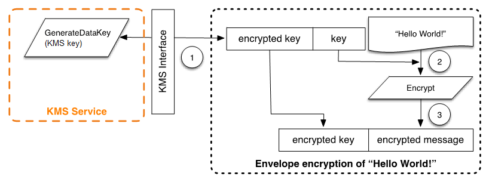
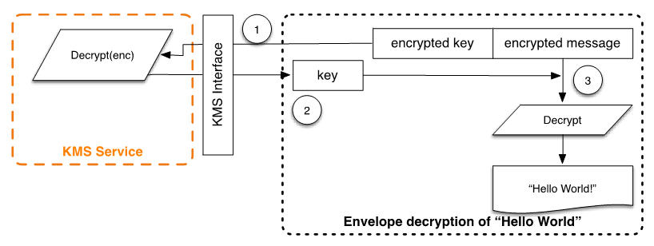

# Client-side encryption

The [AWS Encryption SDK](../../../encryption-sdk/latest/developer-guide/introduction.md "../../../encryption-sdk/latest/developer-guide/introduction.md") includes an API operation for performing envelope encryption
using a KMS key. For complete recommendations and usage details see the [related documentation](../../../encryption-sdk/latest/developer-guide.md "../../../encryption-sdk/latest/developer-guide.md"). Client applications can use the AWS Encryption SDK to
perform envelope encryption using AWS KMS.

```
// Instantiate the SDK
final AwsCrypto crypto = new AwsCrypto();
// Set up the KmsMasterKeyProvider backed by the default credentials
final KmsMasterKeyProvider prov = new KmsMasterKeyProvider(keyId);
// Do the encryption
final byte[] ciphertext = crypto.encryptData(prov, message);
```

The client application can run the following steps:

1. A request is made under a KMS key for a new data key. An encrypted data key and a plaintext version of the data key are returned.
2. Within the AWS Encryption SDK, the plaintext data key is used to encrypt the message. The plaintext data key is then deleted from memory.
3. The encrypted data key and encrypted message are combined into a single ciphertext byte array.


The envelope-encrypted message can be decrypted using the decrypt functionality to obtain the originally encrypted message.

```
final AwsCrypto crypto = new AwsCrypto();
final KmsMasterKeyProvider prov = new KmsMasterKeyProvider(keyId);
// Decrypt the data
final CryptoResult<byte[], KmsMasterKey> res = crypto.decryptData(prov, ciphertext);
// We need to check the KMS key to ensure that the
// assumed key was used
if (!res.getMasterKeyIds().get(0).equals(keyId)) {
     throw new IllegalStateException("Wrong key id!");
}
byte[] plaintext = res.getResult();
```

1. The AWS Encryption SDK parses the envelope-encrypted message to obtain the encrypted data key and make a request to AWS KMS to decrypt the data key.
2. The AWS Encryption SDK receives the plaintext data key from AWS KMS.
3. The data key is then used to decrypt the message, returning the initial plaintext.


