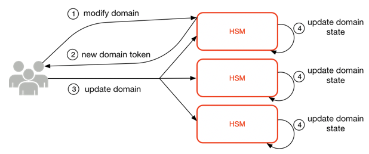

# Domains and domain state

A cooperative collection of trusted internal AWS KMS entities within an AWS Region is
referred to as a domain. A domain includes a set of trusted entities, a set of rules, and a
set of secret keys, called domain keys. The domain keys are shared among HSMs that are members
of the domain. A domain state consists of the following fields.

**Name**

A domain name to identify this domain.

**Members**

A list of HSMs that are members of the domain, including their public signing key
and public agreement keys.

**Operators**

A list of entities, public signing keys, and a role (AWS KMS operator or service host)
that represents the operators of this service.

**Rules**

A list of quorum rules for each command that must be satisfied to run a command on
the HSM.

**Domain keys**

A list of domain keys (symmetric keys) currently in use within the domain.

The full domain state is available only on the HSM. The domain state is synchronized
between HSM domain members as an exported domain token.

## Domain keys

All the HSMs in a domain share a set of domain keys, _{DKr
}_. These keys are shared through a domain state export routine. The exported
domain state can be imported into any HSM that is a member of the domain.

The set of domain keys, _{DKr }_, always
includes one active domain key, and several deactivated domain keys. Domain keys are rotated
daily to ensure that AWS complies with [Recommendation for Key Management - Part 1](https://csrc.nist.gov/publications/detail/sp/800-57-part-1/rev-5/final "https://csrc.nist.gov/publications/detail/sp/800-57-part-1/rev-5/final"). During domain key rotation, all
existing KMS keys encrypted under the outgoing domain key are re-encrypted under the new
active domain key. The active domain key is used to encrypt any new EKTs. The expired domain
keys can be used only to decrypt previously encrypted EKTs for a number of days equivalent
to the number of recently rotated domain keys.

## Exported domain tokens

There is a regular need to synchronize state between domain participants. This is
accomplished through exporting the domain state whenever a change is made to the domain. The
domain state is exported as an exported domain token.

**Name**

A domain name to identify this domain.

**Members**

A list of HSMs that are members of the domain, including their signing and agreement
public keys.

**Operators**

A list of entities, public signing keys, and a role that represents the operators of
this service.

**Rules**

A list of quorum rules for each command that must be satisfied to run a command on
an HSM domain member.

**Encrypted domain keys**

Envelope-encrypted domain keys. The domain keys are encrypted by the signing member
for each of the members listed above, enveloped to their public agreement key.

**Signature**

A signature on the domain state produced by an HSM, necessarily a member of the
domain that exported the domain state.

The exported domain token forms the fundamental source of trust for entities operating
within the domain.

## Managing domain states

The domain state is managed through quorum-authenticated commands. These changes include
modifying the list of trusted participants in the domain, modifying the quorum rules for
running HSM commands, and periodically rotating the domain keys. These commands are
authenticated on a per-command basis as opposed to authenticated session operations, as
shown in the following image.

In its initialized and operational state, an HSM contains a set of self-generated
asymmetric identity keys, a signing key pair, and a key-establishment key pair. Through a
manual process, an AWS KMS operator can establish an initial domain to be created on a first
HSM in a Region. This initial domain consists of a full domain state as defined previously
in this topic. It is installed through a join command to each of the defined HSM members in
the domain.

After an HSM has joined an initial domain, it is bound to the rules that are defined in
that domain. These rules govern the commands that use customer cryptographic keys or make
changes to the host or domain state. The authenticated session API operations that use your
cryptographic keys have been defined earlier.

The foregoing image depicts how a domain state gets modified. The process consists of four
steps:

1. A quorum-based command is sent to an HSM to modify the domain.
2. A new domain state is generated and exported as a new exported domain token. The state
   on the HSM is not modified, meaning that the change is not enacted on the HSM.
3. A second command is sent to each of the HSMs in the newly exported domain token to
   update their domain state with the new domain token.
4. The HSMs listed in the new exported domain token can authenticate the command and the
   domain token. They can also unpack the domain keys to update the domain state on all HSMs
   in the domain.

HSMs do not communicate directly with one another. Instead, a quorum of operators requests
a change to the domain state that results in a new exported domain token. A service host
member of the domain is used to distribute the new domain state to every HSM in the
domain.

The leaving and joining of a domain are done through the HSM management functions. The
modification of the domain state is done through the domain management functions.

**Leave domain**

Causes an HSM to leave a domain, deleting all remnants and keys of that domain from
memory.

**Join domain**

Causes an HSM to join a new domain or update its current domain state to the new
domain state. The existing domain is used as source of the initial set of rules to
authenticate this message.

**Create domain**

Causes a new domain to be created on an HSM. Returns a first domain token that can
be distributed to member HSMs of the domain.

**Modify operators**

Adds or removes operators from the list of authorized operators and their roles in
the domain.

**Modify members**

Adds or removes an HSM from the list of authorized HSMs in the domain.

**Modify rules**

Modifies the set of quorum rules that are required to run commands on an HSM.

**Rotate domain keys**

Causes a new domain key to be created and marked as the active domain key. This
moves the existing active key to a deactivated key and removes the oldest deactivated
key from the domain state.
