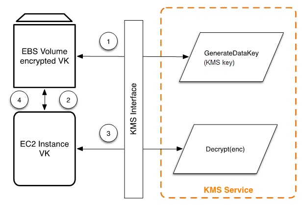

# Amazon EBS volume encryption

Amazon EBS offers volume encryption capability. Each volume is encrypted using [AES-256-XTS](http://csrc.nist.gov/publications/nistpubs/800-38E/nist-sp-800-38E.pdf "http://csrc.nist.gov/publications/nistpubs/800-38E/nist-sp-800-38E.pdf"). This requires two 256-bit volume keys, which you can think of as one 512-bit volume key. The volume key is encrypted under a KMS key in your account. For Amazon EBS to encrypt a volume for you, it must have access to generate a volume key (VK) under a KMS key in the account. You do this by providing a grant for Amazon EBS to the KMS key to create data keys and to encrypt and decrypt these volume keys. Now Amazon EBS uses AWS KMS with a KMS key to generate AWS KMS encrypted volume keys.

The following workflow encrypts data that is being written to an Amazon EBS volume:

1. Amazon EBS obtains an encrypted volume key under a KMS key through AWS KMS over a TLS session and stores the encrypted key with the volume metadata.
2. When the Amazon EBS volume is mounted, the encrypted volume key is retrieved.
3. A call to AWS KMS over TLS is made to decrypt the encrypted volume key. AWS KMS identifies the KMS key and makes an internal request to an HSM in the fleet to decrypt the encrypted volume key. AWS KMS then returns the volume key back to the Amazon Elastic Compute Cloud (Amazon EC2) host that contains your instance over the TLS session.
4. The volume key is used to encrypt and decrypt all data going to and from the attached Amazon EBS volume. Amazon EBS retains the encrypted volume key for later use in case the volume key in memory is no longer available.
   For more information about encrypting Amazon EBS volumes with KMS keys, see [How
   Amazon Elastic Block Store uses AWS KMS](../developerguide/services-ebs.md "../developerguide/services-ebs.md") in the _AWS Key Management Service Developer Guide_
   and **Amazon EBS encryption** in the [Amazon EC2 User Guide](../../../AWSEC2/latest/UserGuide/EBSEncryption.md "../../../AWSEC2/latest/UserGuide/EBSEncryption.md") and [Amazon EC2 User Guide](../../../AWSEC2/latest/WindowsGuide/EBSEncryption.md "../../../AWSEC2/latest/WindowsGuide/EBSEncryption.md").
