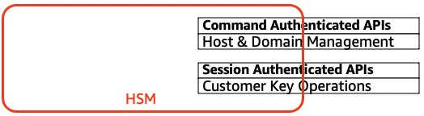
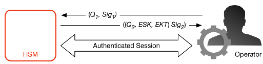

# Internal communication security

Commands between the service hosts or AWS KMS operators and the HSMs are secured through two
mechanisms depicted in [Authenticated sessions](#authenticated-sessions "#authenticated-sessions"): a quorum-signed request method and an authenticated
session using an HSM-service host protocol.

The quorum-signed commands are designed so that no single operator can modify the critical
security protections that the HSMs provide. The commands that run over the authenticated
sessions help ensure that only authorized service operators can perform operations involving
KMS keys. All customer-bound secret information is secured across the AWS infrastructure.

## Key establishment

To secure internal communications, AWS KMS uses two different key establishment methods. The
first is defined as C(1, 2, ECC DH) in [Recommendation for Pair-Wise Key Establishment Schemes Using Discrete Logarithm
Cryptography (Revision 2)](http://nvlpubs.nist.gov/nistpubs/SpecialPublications/NIST.SP.800-56Ar2.pdf "http://nvlpubs.nist.gov/nistpubs/SpecialPublications/NIST.SP.800-56Ar2.pdf"). This scheme has an initiator with a static signing key.
The initiator generates and signs an ephemeral elliptic curve Diffie-Hellman (ECDH) key,
intended for a recipient with a static ECDH agreement key. This method uses one ephemeral key
and two static keys using ECDH. That is the derivation of the label C(1, 2, ECC DH). This
method is sometimes called one-pass ECDH.

The second key establishment method is [C(2, 2,
ECC, DH)](http://nvlpubs.nist.gov/nistpubs/SpecialPublications/NIST.SP.800-56Ar2.pdf "http://nvlpubs.nist.gov/nistpubs/SpecialPublications/NIST.SP.800-56Ar2.pdf"). In this scheme, both parties have a static signing key, and they generate,
sign, and exchange an ephemeral ECDH key. This method uses two static keys and two ephemeral
keys, each using ECDH. That is the derivation of the label C(2, 2, ECC, DH). This method is
sometimes called ECDH ephemeral or ECDHE. All ECDH keys are generated on the curve secp384r1
(NIST-P384).

## HSM security boundary

The inner security boundary of AWS KMS is the HSM. The HSM has a proprietary interface and
no other active physical interfaces in its operational state. An operational HSM is
provisioned during initialization with the necessary cryptographic keys to establish its role
in the domain. Sensitive cryptographic materials of the HSM are only stored in volatile memory
and erased when the HSM moves out of the operational state, including intended or unintended
shutdowns or resets.

The HSM API operations are authenticated either by individual commands or over a mutually
authenticated confidential session established by a service host.

## Quorum-signed commands

Quorum-signed commands are issued by operators to HSMs. This section describes how
quorum-based commands are created, signed, and authenticated. These rules are fairly simple.
For example, command _Foo_ requires two members from role
_Bar_ to be authenticated. There are three steps in the creation and
verification of a quorum-based command. The first step is the initial command creation; the
second is the submission to additional operators to sign; and the third is the verification
and execution.

For the purpose of introducing the concepts, assume that there is an authentic set of
operator’s public keys and roles _{QOSs}_, and a set
of quorum-rules _QR = {Commandi, Rule{i,
t}}_ where each _Rule_ is a set of roles and
minimum number _N {Rolet,
Nt}_. For a command to satisfy the quorum rule, the command
dataset must be signed by a set of operators listed in
_{QOSs}_ such that they meet one of the rules
listed for that command. As mentioned earlier, the set of quorum rules and operators are
stored in the domain state and the exported domain token.

In practice, an initial signer signs the command _Sig1 =
Sign(dOp1, Command)_ . A second operator also signs the
command _Sig2 = Sign(dOp2, Command)_ . The doubly signed message is sent to an HSM for execution. The HSM performs the
following:

1. For each signature, it extracts the signer’s public key from the domain state and
   verifies the signature on the command.
2. It verifies that the set of signers satisfies a rule for the command.

## Authenticated sessions

Your key operations run between the externally facing AWS KMS hosts and the HSMs. These
commands pertain to the creation and use of cryptographic keys and secure random number
generation. The commands run over a session-authenticated channel between the service hosts
and the HSMs. In addition to the need for authenticity, these sessions require
confidentiality. Commands running over these sessions include the returning of cleartext data
keys and decrypted messages intended for you. To ensure that these sessions cannot be
subverted through man-in-the-middle attacks, sessions are authenticated.

This protocol performs a mutually authenticated ECDHE key agreement between the HSM and
the service host. The exchange is initiated by the service host and completed by the HSM. The
HSM also returns a session key (SK) encrypted by the negotiated key and an exported key token
that contains the session key. The exported key token contains a validity period, after which
the service host must renegotiate a session key.

A service host is a member of the domain and has an identity-signing key pair
_(dHOSi, QHOSi)_ and an
authentic copy of the HSMs’ identity public keys. It uses its set of identity-signing keys to
securely negotiate a session key that can be used between the service host and any HSM in the
domain. The exported key tokens have a validity period associated with them, after which a new
key must be negotiated.

The process begins with the service host recognition that it requires a session key to
send and receive sensitive communication flows between itself and an HSM member of the
domain.

1. A service host generates an ECDH ephemeral key pair
   _(d1, Q1)_ and signs
   it with its identity key _Sig1 =
   Sign(dOS,Q1)_.
2. The HSM verifies the signature on the received public key using its current domain
   token and creates an ECDH ephemeral key pair _(d2,
   Q2)_. It then completes the ECDH-key-exchange
   according to [Recommendation for Pair-Wise Key Establishment Schemes Using Discrete Logarithm
   Cryptography (Revised)](http://nvlpubs.nist.gov/nistpubs/SpecialPublications/NIST.SP.800-56Ar2.pdf "http://nvlpubs.nist.gov/nistpubs/SpecialPublications/NIST.SP.800-56Ar2.pdf") to form a negotiated 256-bit AES-GCM key. The HSM
   generates a fresh 256-bit AES-GCM session key. It encrypts the session key with the
   negotiated key to form the encrypted session key (ESK). It also encrypts the session key
   under the domain key as an exported key token _EKT_. Finally, it signs
   a return value with its identity key pair _Sig2 =
   Sign(dHSK, (Q2, ESK, EKT))_.
3. The service host verifies the signature on the received keys using its current domain
   token. The service host then completes the ECDH key exchange according to [Recommendation for Pair-Wise Key Establishment Schemes Using Discrete Logarithm
   Cryptography (Revised)](http://nvlpubs.nist.gov/nistpubs/SpecialPublications/NIST.SP.800-56Ar2.pdf "http://nvlpubs.nist.gov/nistpubs/SpecialPublications/NIST.SP.800-56Ar2.pdf"). It next decrypts the ESK to obtain the session key
   SK.

During the validity period in the _EKT_, the service host can use the
negotiated session key _SK_ to send envelope-encrypted commands to the HSM.
Every service-host-initiated command over this authenticated session includes the
_EKT_. The HSM responds using the same negotiated session key SK.
