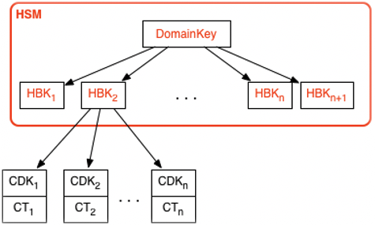

# AWS KMS key hierarchy

Your key hierarchy starts with a top-level logical key, an AWS KMS key. A KMS key
represents a container for top-level key material and is uniquely defined within the AWS
service namespace with an Amazon Resource Name (ARN). The ARN includes a uniquely generated
key identifier, a _key ID._ A KMS key is created based on a
user-initiated request through AWS KMS. Upon reception, AWS KMS requests the creation of an
initial HSM backing key (HBK) to be placed into the KMS key container. The HBK is generated on
an HSM in the domain and is designed never to be exported from the HSM in plaintext.
Instead, the HBK is exported encrypted under HSM-managed domain keys. These exported HBKs
are referred to as exported key tokens (EKTs).

The EKT is exported to a highly durable, low-latency storage. For example, suppose you receive an ARN to the logical KMS key. This represents the top of a key hierarchy, or cryptographic context, for you. You can create multiple KMS keys within your account and set policies on your KMS keys like any other AWS named resource.

Within the hierarchy of a specific KMS key, the HBK can be thought of as a version of the KMS key. When you want to rotate the KMS key through AWS KMS, a new HBK is created and associated with the KMS key as the active HBK for the KMS key. The older HBKs are preserved and can be used to decrypt and verify previously protected data. But only the active cryptographic key can be used to protect new information.

You can make requests through AWS KMS to use your KMS keys to directly protect information or request additional HSM-generated keys that are protected under your KMS key. These keys are called customer data keys, or CDKs. CDKs can be returned encrypted as ciphertext (CT), in plaintext, or both. All objects encrypted under a KMS key (either customer-supplied data or HSM-generated keys) can be decrypted only on an HSM via a call through AWS KMS.

The returned ciphertext, or the decrypted payload, is never stored within AWS KMS. The information is returned to you over your TLS connection to AWS KMS. This also applies to calls made by AWS services on your behalf.

The key hierarchy and the specific key properties appear in the following table.

| Key                        | Description                                                                                                                                                                                                               | Lifecycle                                        |
| -------------------------- | ------------------------------------------------------------------------------------------------------------------------------------------------------------------------------------------------------------------------- | ------------------------------------------------ | -------------------------------------------------------------------------------------------------------------------------------------------------------------------------------------------------------------------------------------------------------- |
| **Domain key**             | A 256-bit AES-GCM key only in memory of an HSM used to wrap versions of the KMS keys, the HSM backing keys.                                                                                                               | Rotated daily1                                   |
| **HSM backing key**        | A 256-bit symmetric key or RSA or elliptic curve private key, used to protect customer data and keys and stored encrypted under domain keys. One or more HSM backing keys comprise the KMS key, represented by the keyId. | Rotated yearly2 (optional config.)               |
| **Derived encryption key** | A 256-bit AES-GCM key only in memory of an HSM used to encrypt customer data and keys. Derived from an HBK for each encryption.                                                                                           | Used once per encrypt and regenerated on decrypt |
| **Customer data key**      | User-defined symmetric or asymmetric key exported from HSM in plaintext and ciphertext. Encrypted under an HSM backing key and returned to authorized users over TLS channel.                                              | Rotation and use controlled by application       | 1 AWS KMS might from time to time relax domain key rotation to at most weekly to account for domain administration and configuration tasks. 2 Default AWS managed keys created and managed by AWS KMS on your behalf are automatically rotated annually. |
