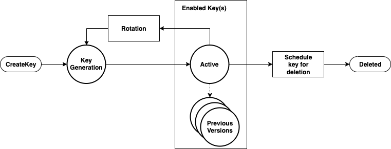

# Working with AWS KMS keys

An AWS KMS key refers to a logical key that might refer to one or more hardware
security module (HSM) backing keys (HBKs). This topic explains how to create a KMS key, import
key material, and how to enable, disable, rotate, and delete KMS keys.

###### Note

AWS KMS is replacing the term _customer master key (CMK)_ with _AWS KMS key_ and _KMS key_. The concept has not changed. To prevent breaking changes, AWS KMS is keeping some variations of this term.

This chapter discusses the lifecycle of a KMS key from creation to deletion, as shown in
the following image.

###### Topics

- [Calling CreateKey](create-key.md "create-key.md")
- [Importing key material](importing-key-material.md "importing-key-material.md")
- [Enabling and disabling keys](enable-and-disable-key.md "enable-and-disable-key.md")
- [Deleting keys](key-deletion.md "key-deletion.md")
- [Rotating key material](rotate-customer-master-key.md "rotate-customer-master-key.md")
