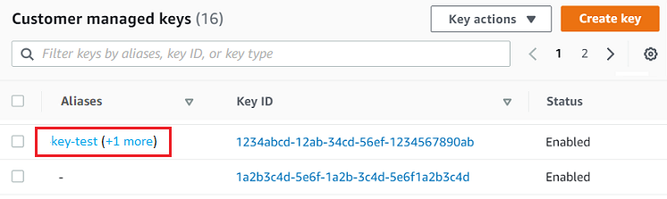
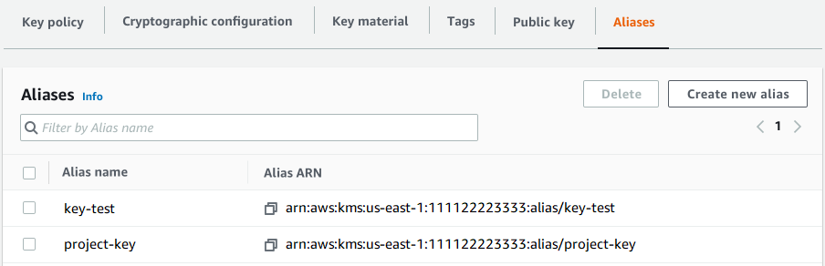
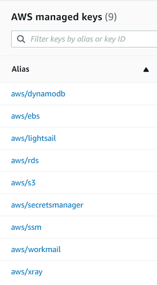

# Find the alias name and alias ARN for a KMS key

Aliases make it easy to recognize KMS keys in the AWS KMS console. You can view the
aliases for a KMS key in the AWS KMS console or by using the [ListAliases](../APIReference/API_ListAliases.md "../APIReference/API_ListAliases.md") operation. The [DescribeKey](../APIReference/API_DescribeKey.md "../APIReference/API_DescribeKey.md") operation, which returns the
properties of a KMS key, does not include aliases.

The following procedures demonstrate how to view and identify the aliases associated with
a KMS key using the AWS KMS console and AWS KMS API. The AWS KMS API examples use the
[AWS Command Line Interface (AWS CLI)](https://aws.amazon.com/cli/ "https://aws.amazon.com/cli/"), but you can use any supported
programming language.

The AWS KMS console displays the aliases associated with the KMS key.

1. Open the AWS KMS console at [https://console.aws.amazon.com/kms](https://console.aws.amazon.com/kms "https://console.aws.amazon.com/kms").
2. To change the AWS Region, use the Region selector in the upper-right corner of the page.
3. To view the keys in your account that you create and manage, in the navigation
   pane choose **Customer managed keys**. To view the keys in your account that AWS creates and manages for you, in the navigation pane, choose **AWS managed keys**.
4. The **Aliases** column displays the alias for each KMS key. If
   a KMS key does not have an alias, a dash (**-**) appears in the
   **Aliases** column.

If a KMS key has multiple aliases, the **Aliases** column also
has an alias summary, such as **(+_n_
more)**. For example, the following KMS key has two aliases, one of which
is `key-test`.

To find the alias name and alias ARN of all aliases for the KMS key, use the
**Aliases** tab.

    * To go directly to the **Aliases** tab, in the
     **Aliases** column, choose the alias summary
     (**+*n* more**). An alias
     summary appears only if the KMS key has more than one alias.
    * Or, choose the alias or key ID of the KMS key (which opens the detail page
     for the KMS key) and then choose the **Aliases** tab. The tabs
     are under the **General configuration** section.

 5. The **Aliases** tab displays the alias name and alias ARN of all
aliases for a KMS key. You can also create and delete aliases for the KMS key on
this tab.



###### AWS managed keys

You can use the alias to recognize an AWS managed key, as shown in this example
**AWS managed keys** page. The aliases for AWS managed keys
always have the format: `aws/`<service-name>``.
 For example, the alias for the AWS managed key for Amazon DynamoDB is
 `aws/dynamodb`.


The [ListAliases](../APIReference/API_ListAliases.md "../APIReference/API_ListAliases.md") operation
returns the alias name and alias ARN of aliases in the account and Region. The output
includes aliases for AWS managed keys and for customer managed keys. The aliases for
AWS managed keys have the format
`aws/`<service-name>``, such as
 `aws/dynamodb`.

The response might also include aliases that have no `TargetKeyId` field.
These are predefined aliases that AWS has created but has not yet associated with a
KMS key.

```
`$` `aws kms list-aliases`
`{
 "Aliases": [
 {
 "AliasName": "alias/access-key",
 "AliasArn": "arn:aws:kms:us-west-2:111122223333:alias/access-key",
 "TargetKeyId": "0987dcba-09fe-87dc-65ba-ab0987654321",
 "CreationDate": 1516435200.399,
 "LastUpdatedDate": 1516435200.399
 },
 {
 "AliasName": "alias/ECC-P521-Sign",
 "AliasArn": "arn:aws:kms:us-west-2:111122223333:alias/ECC-P521-Sign",
 "TargetKeyId": "1234abcd-12ab-34cd-56ef-1234567890ab",
 "CreationDate": 1693622000.704,
 "LastUpdatedDate": 1693622000.704
 },
 {
 "AliasName": "alias/ImportedKey",
 "AliasArn": "arn:aws:kms:us-west-2:111122223333:alias/ImportedKey",
 "TargetKeyId": "1a2b3c4d-5e6f-1a2b-3c4d-5e6f1a2b3c4d",
 "CreationDate": 1493622000.704,
 "LastUpdatedDate": 1521097200.235
 },
 {
 "AliasName": "alias/finance-project",
 "AliasArn": "arn:aws:kms:us-west-2:111122223333:alias/finance-project",
 "TargetKeyId": "0987dcba-09fe-87dc-65ba-ab0987654321",
 "CreationDate": 1604958290.014,
 "LastUpdatedDate": 1604958290.014
 },
 {
 "AliasName": "alias/aws/dynamodb",
 "AliasArn": "arn:aws:kms:us-west-2:111122223333:alias/aws/dynamodb",
 "TargetKeyId": "0987ab65-43cd-21ef-09ab-87654321cdef",
 "CreationDate": 1521097200.454,
 "LastUpdatedDate": 1521097200.454
 },
 {
 "AliasName": "alias/aws/ebs",
 "AliasArn": "arn:aws:kms:us-west-2:111122223333:alias/aws/ebs",
 "TargetKeyId": "abcd1234-09fe-ef90-09fe-ab0987654321",
 "CreationDate": 1466518990.200,
 "LastUpdatedDate": 1466518990.200
 }
 ]
}`
```

To get all aliases that are associated with a particular KMS key, use the optional
`KeyId` parameter of the `ListAliases` operation. The
`KeyId` parameter takes the [key ID](concepts.md#key-id-key-id "concepts.md#key-id-key-id") or
[key ARN](concepts.md#key-id-key-ARN "concepts.md#key-id-key-ARN") of the KMS key.

This example gets all aliases associated with the `0987dcba-09fe-87dc-65ba-ab0987654321`
KMS key.

```
`$` `aws kms list-aliases --key-id 0987dcba-09fe-87dc-65ba-ab0987654321`
`{
 "Aliases": [
 {
 "AliasName": "alias/access-key",
 "AliasArn": "arn:aws:kms:us-west-2:111122223333:alias/access-key",
 "TargetKeyId": "0987dcba-09fe-87dc-65ba-ab0987654321",
 "CreationDate": "2018-01-20T15:23:10.194000-07:00",
 "LastUpdatedDate": "2018-01-20T15:23:10.194000-07:00"
 },
 {
 "AliasName": "alias/finance-project",
 "AliasArn": "arn:aws:kms:us-west-2:111122223333:alias/finance-project",
 "TargetKeyId": "0987dcba-09fe-87dc-65ba-ab0987654321",
 "CreationDate": 1604958290.014,
 "LastUpdatedDate": 1604958290.014
 }
 ]
}`
```

The `KeyId` parameter doesn't take wildcard characters, but you can use the
features of your programming language to filter the response.

For example, the following AWS CLI command gets only the aliases for
AWS managed keys.

```
`$` `aws kms list-aliases --query 'Aliases[?starts_with(AliasName, `alias/aws/`)]'`
```

The following command gets only the `access-key` alias. The alias name is
case-sensitive.

```
`$` `aws kms list-aliases --query 'Aliases[?AliasName==`alias/access-key`]'`
`[
 {
 "AliasName": "alias/access-key",
 "AliasArn": "arn:aws:kms:us-west-2:111122223333:alias/access-key",
 "TargetKeyId": "0987dcba-09fe-87dc-65ba-ab0987654321",
 "CreationDate": "2018-01-20T15:23:10.194000-07:00",
 "LastUpdatedDate": "2018-01-20T15:23:10.194000-07:00"
 }
]`
```
