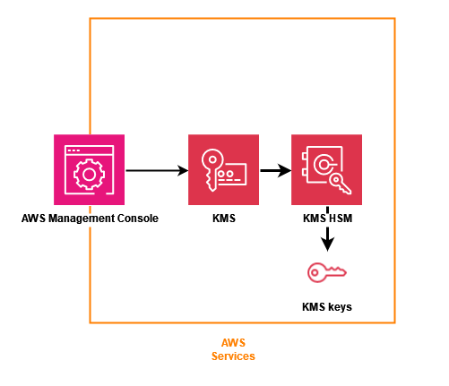

# AWS KMS concepts

Learn the basic terms and concepts used in AWS Key Management Service (AWS KMS) and how they work together to
help protect your data.

## Introduction to AWS KMS

AWS Key Management Service (AWS KMS) provides a web interface to generate and manage cryptographic keys and
operates as a cryptographic service provider for protecting data. AWS KMS offers traditional key
management services integrated with AWS services to provide a consistent view of customers’
keys across AWS, with centralized management and auditing.

AWS KMS includes a web interface through the AWS Management Console, command line interface, and RESTful
API operations to request cryptographic operations of a distributed fleet of FIPS 140-3
validated hardware security modules (HSMs). The AWS KMS HSM is a multichip standalone hardware
cryptographic appliance designed to provide dedicated cryptographic functions to meet the
security and scalability requirements of AWS KMS. You can establish your own HSM-based
cryptographic hierarchy under keys that you manage as AWS KMS keys. These keys are made
available only on the HSMs and only in memory for the necessary time needed to process your
cryptographic request. You can create multiple KMS keys, each represented by its key ID.
Only under AWS IAM roles and accounts administered by each customer can customer managed
KMS keys be created, deleted, or used to encrypt, decrypt, sign, or verify data. You can
define access controls on who can manage and/or use KMS keys by creating a policy that is
attached to the key. Such policies allow you to define application-specific uses for your keys
for each API operation.

In addition, most AWS services support encryption of data at rest using KMS keys. This
capability allows customers to control how and when AWS services can access encrypted data
by controlling how and when KMS keys can be accessed.

AWS KMS is a tiered service consisting of web-facing AWS KMS hosts and a tier of HSMs. The
grouping of these tiered hosts forms the AWS KMS stack. All requests to AWS KMS must be made over
the Transport Layer Security protocol (TLS) and terminate on an AWS KMS host. AWS KMS hosts only
allow TLS with a ciphersuite that provides perfect [forward secrecy](http://dx.doi.org/10.6028/NIST.SP.800-52r2 "http://dx.doi.org/10.6028/NIST.SP.800-52r2"). AWS KMS
authenticates and authorizes your requests using the same credential and policy mechanisms of
AWS Identity and Access Management (IAM) that are available for all other AWS API operations.

### AWS KMS design goals

AWS KMS is designed to meet the following requirements.

**Durability**

The durability of cryptographic keys is designed to equal that of the highest
durability services in AWS. A single cryptographic key can encrypt large volumes of
your data that has accumulated over a long time.

**Trustworthy**

Use of keys is protected by access control policies that you define and manage.
There is no mechanism to export plaintext KMS keys. The confidentiality of your
cryptographic keys is crucial. Multiple Amazon employees with role-specific access to
quorum-based access controls are required to perform administrative actions on the
HSMs.

**Low-latency and high throughput**

AWS KMS provides cryptographic operations at latency and throughput levels suitable
for use by other services in AWS.

**Independent Regions**

AWS provides independent Regions for customers who need to restrict data access
in different Regions. Key usage can be isolated within an AWS Region.

**Secure source of random numbers**

Because strong cryptography depends on truly unpredictable random number
generation, AWS KMS provides a high-quality and validated source of random numbers.

**Audit**

AWS KMS records the use and management of cryptographic keys in AWS CloudTrail logs. You
can use AWS CloudTrail logs to inspect use of your cryptographic keys, including the use of
keys by AWS services on your behalf.

To achieve these goals, the AWS KMS system includes a set of AWS KMS operators and service
host operators (collectively, “operators”) that administer “domains.” A domain is a
Regionally defined set of AWS KMS servers, HSMs, and operators. Each AWS KMS operator has a
hardware token that contains a private and public key pair that is used to authenticate its
actions. The HSMs have an additional private and public key pair to establish encryption
keys that protect HSM state synchronization.
