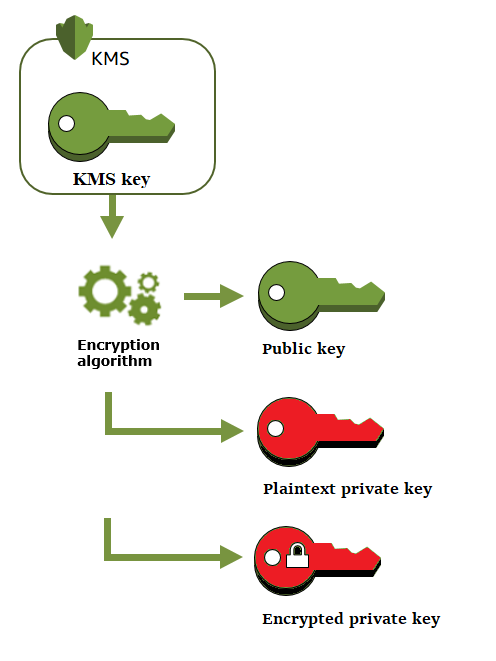
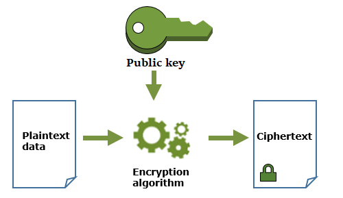
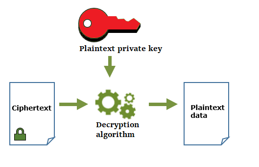
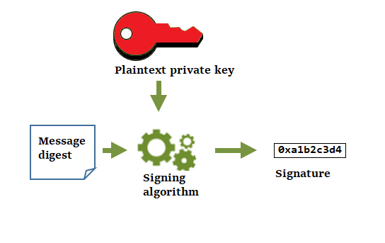
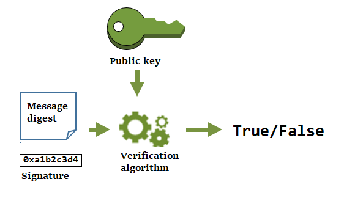

# Generate data key pairs

An asymmetric KMS key represents a _data key pair_.
Data key pairs are asymmetric data keys consisting of a mathematically-related public key and
private key. They are designed for use in client-side encryption and decryption, signing and
verification outside of AWS KMS, or to establish a shared secret between two peers.

Unlike the data key pairs that tools like OpenSSL generate, AWS KMS protects the private key
in each data key pair under a symmetric encryption KMS key in AWS KMS that you specify.
However, AWS KMS does not store, manage, or track your data key pairs, or perform cryptographic
operations with data key pairs. You must use and manage data key pairs outside of
AWS KMS.

###### Topics

- [Create a data key pair](#data-keys-pairs-create "#data-keys-pairs-create")
- [How cryptographic operations with data key pairs work](#use-data-key-pairs "#use-data-key-pairs")

## Create a data key pair

To create a data key pair, call the [GenerateDataKeyPair](../APIReference/API_GenerateDataKeyPair.md "../APIReference/API_GenerateDataKeyPair.md") or [GenerateDataKeyPairWithoutPlaintext](../APIReference/API_GenerateDataKeyPairWithoutPlaintext.md "../APIReference/API_GenerateDataKeyPairWithoutPlaintext.md") operations. Specify the [symmetric encryption KMS key](symm-asymm-choose-key-spec.md#symmetric-cmks "symm-asymm-choose-key-spec.md#symmetric-cmks") you want to use to encrypt
the private key.

`GenerateDataKeyPair` returns a plaintext public key, a plaintext private
key, and an encrypted private key. Use this operation when you need a plaintext private key
immediately, such as to generate a digital signature.

`GenerateDataKeyPairWithoutPlaintext` returns a plaintext public key and an
encrypted private key, but not a plaintext private key. Use this operation when you don't
need a plaintext private key immediately, such as when you're encrypting with a public key.
Later, when you need a plaintext private key to decrypt the data, you can call the [Decrypt](../APIReference/API_Decrypt.md "../APIReference/API_Decrypt.md") operation.

The following image shows the `GenerateDataKeyPair` operation. The
`GenerateDataKeyPairWithoutPlaintext` operation omits the plaintext private
key.

## How cryptographic operations with data key pairs work

The following topics explain what cryptographic operations you can perform with data key pairs generated by a [GenerateDataKeyPair](../APIReference/API_GenerateDataKeyPair.md "../APIReference/API_GenerateDataKeyPair.md") or [GenerateDataKeyPairWithoutPlaintext](../APIReference/API_GenerateDataKeyPairWithoutPlaintext.md "../APIReference/API_GenerateDataKeyPairWithoutPlaintext.md") operation and how they work.

### Encrypt data with a data key pair

When you encrypt with a data key pair, you use the public key of the pair to encrypt the
data and the private key of the same pair to decrypt the data. Typically, you use data key
pairs when many parties need to encrypt data that only the party with the private key can
decrypt.

The parties with the public key use that key to encrypt data, as shown in the following
diagram.

### Decrypt data with a data key pair

To decrypt your data, use the private key in the data key pair. For the operation to
succeed, the public and private keys must be from the same data key pair, and you must use
the same encryption algorithm.

To decrypt the encrypted private key, pass it to the [Decrypt](../APIReference/API_Decrypt.md "../APIReference/API_Decrypt.md") operation. Use the plaintext private
key to decrypt the data. Then remove the plaintext private key from memory as soon as
possible.

The following diagram shows how to use the private key in a data key pair to decrypt
ciphertext.

### Sign messages with a data key pair

To generate a cryptographic signature for a message, use the private key in the data key
pair. Anyone with the public key can use it to verify that the message was signed with your
private key and that it has not changed since it was signed.

If you encrypt your private key, pass the encrypted private key to the [Decrypt](../APIReference/API_Decrypt.md "../APIReference/API_Decrypt.md") operation. AWS KMS uses your KMS key
to decrypt the data key and then it returns the plaintext private key. Use the plaintext
private key to generate the signature. Then remove the plaintext private key from memory as
soon as possible.

To sign a message, create a message digest using a cryptographic hash function, such as
the [`dgst`](https://www.openssl.org/docs/man1.0.2/man1/openssl-dgst.html "https://www.openssl.org/docs/man1.0.2/man1/openssl-dgst.html") command in OpenSSL. Then, pass your plaintext private key to
the signing algorithm. The result is a signature that represents the contents of the
message. (You might be able to sign shorter messages without first creating a digest. The
maximum message size varies with the signing tool you use.)

The following diagram shows how to use the private key in a data key pair to sign a
message.

### Verify a signature with a data key pair

Anyone who has the public key in your data key pair can use it to verify the signature
that you generated with your private key. Verification confirms that an authorized user
signed the message with the specified private key and signing algorithm, and the message
hasn't changed since it was signed.

To be successful, the party verifying the signature must generate the same type of
digest, use the same algorithm, and use the public key that corresponds to the private key
used to sign the message.

The following diagram shows how to use the public key in a data key pair to verify a
message signature.

### Derive a shared secret with data key

pairs

Key agreement enables two peers, each having an elliptic-curve public–private key pair,
to establish a shared secret over an insecure channel. To [derive a shared secret](../APIReference/API_DeriveSharedSecret.md "../APIReference/API_DeriveSharedSecret.md"), the two
peers must exchange their public keys over the insecure communication channel (like the
internet). Then, each party uses their _private key_ and their peer's
_public key_ to calculate the same shared secret using a key agreement
algorithm. You can use the shared secret value to derive a symmetric key that can encrypt
and decrypt data that is sent between the two peers, or that can generate and verify
HMACs.

###### Note

AWS KMS strongly recommends verifying that the public key you receive came from the
expected party before using it to derive a shared secret.
