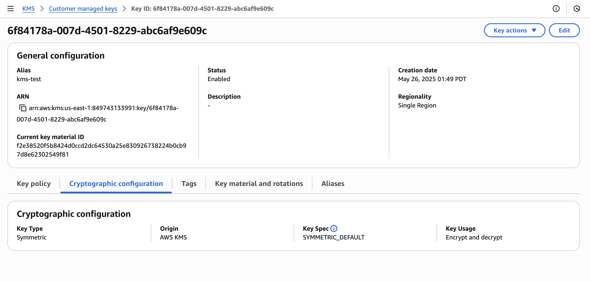

# Access and list KMS key details

You can use the [AWS KMS console](https://console.aws.amazon.com/kms "https://console.aws.amazon.com/kms") or the [DescribeKey](../APIReference/API_DescribeKey.md "../APIReference/API_DescribeKey.md") operation to access and list
detailed information about the KMS keys in the account and Region.

The following procedures demonstrate how to access KMS key details, such as the key ID,
key spec, key usage, and more.

The details page for each KMS key displays the properties of the KMS key. It
differs slightly for the different types of KMS keys.

To display detailed information about a KMS key, on the
**AWS managed keys** or **Customer managed keys**
page, choose the alias or key ID of the KMS key.

The details page for a KMS key includes a **General
Configuration** section that displays the basic properties of the
KMS key. It also includes tabs on which you can view and edit properties of the
KMS key, such as **Key policy**, **Cryptographic
configuration**, **Tags**, **Key
material and rotations** (for KMS keys that support automatic or on-demand rotation),
**Regionality** (for multi-Region keys), and **Public
key** (for asymmetric KMS keys).

###### Note

The AWS KMS console displays the KMS keys that you have [permission to view](customer-managed-policies.md#iam-policy-example-read-only-console "customer-managed-policies.md#iam-policy-example-read-only-console") in
your account and Region. KMS keys in other AWS accounts do not appear in the
console, even if you have permission to view, manage, and use them. To view
KMS keys in other accounts, use the [DescribeKey](../APIReference/API_DescribeKey.md "../APIReference/API_DescribeKey.md")
operation.

To navigate to the key details page for a KMS key.

1. Sign in to the AWS Management Console and open the AWS Key Management Service (AWS KMS) console at [https://console.aws.amazon.com/kms](https://console.aws.amazon.com/kms "https://console.aws.amazon.com/kms").
2. To change the AWS Region, use the Region selector in the upper-right corner of the page.
3. To view the keys in your account that you create and manage, in the navigation
   pane choose **Customer managed keys**. To view the keys in your account that AWS creates and manages for you, in the navigation pane, choose **AWS managed keys**.
4. To open the key details page, in the key table, choose the key ID or alias
   of the KMS key.

If the KMS key has multiple aliases, an alias summary
(**+_n_ more**) appears beside
the name of the one of the aliases. Choosing the alias summary takes you
directly to the **Aliases** tab on the key details
page.


The following list describes the fields in the detailed display, including field
in the tabs. Some of these fields are also available as columns in the table
display.

**Aliases**

Where: Aliases tab

A friendly name for the KMS key. You can use an alias to identify
the KMS key in the console and in some AWS KMS APIs. For details, see
[Aliases in AWS KMS](kms-alias.md "kms-alias.md").

The **Aliases** tab displays all aliases associated
with the KMS key in the AWS account and Region.

**ARN**

Where: General configuration section

The Amazon Resource Name (ARN) of the KMS key. This value uniquely
identifies the KMS key. You can use it to identify the KMS key in
AWS KMS API operations.

**Connection state**

Indicates whether a [custom
key store](key-store-overview.md#custom-key-store-overview "key-store-overview.md#custom-key-store-overview") is connected to its backing key store. This field
appears only when the KMS key is created in a custom key store.

For information about the values in this field, see [ConnectionState](../APIReference/API_CustomKeyStoresListEntry.md#KMS-Type-CustomKeyStoresListEntry-ConnectionState "../APIReference/API_CustomKeyStoresListEntry.md#KMS-Type-CustomKeyStoresListEntry-ConnectionState") in the _AWS KMS API
Reference_.

**Creation date**

Where: General configuration section

The date and time that the KMS key was created. This value is
displayed in local time for the device. The time zone does not depend on
the Region.

Unlike **Expiration**, the creation refers only to
the KMS key, not its key material.

**CloudHSM cluster ID**

Where: Cryptographic configuration tab

The cluster ID of the AWS CloudHSM cluster that contains the key material
for the KMS key. This field appears only when the KMS key is created
in a [custom key
store](key-store-overview.md#custom-key-store-overview "key-store-overview.md#custom-key-store-overview").

If you choose the CloudHSM cluster ID, it opens the
**Clusters** page in the AWS CloudHSM console.

**Current key material**

Where: General configuration section

Symmetric encryption keys with `AWS_KMS` origin support both automatic and
on-demand rotation. Single-Region, symmetric encryption keys with `EXTERNAL`
origin support on-demand rotation. These keys can have multiple key materials associated
with the key. The most recently rotated key material can be used for both encryption
and decryption. This key material is identified as the current key material. Other key
materials can only be used for decryption. Automatic or on-demand key
rotation of a KMS key changes its current key material.

**Custom key store ID**

Where: Cryptographic configuration tab

The ID of the [custom key
store](key-store-overview.md#custom-key-store-overview "key-store-overview.md#custom-key-store-overview") that contains the KMS key. This field appears only
when the KMS key is created in a custom key store.

If you choose the custom key store ID, it opens the **Custom
key stores** page in the AWS KMS console.

**Custom key store name**

Where: Cryptographic configuration tab

The name of the [custom key
store](key-store-overview.md#custom-key-store-overview "key-store-overview.md#custom-key-store-overview") that contains the KMS key. This field appears only
when the KMS key is created in a custom key store.

**Custom key store type**

Where: Cryptographic configuration tab

Indicates whether the custom key store is an [AWS CloudHSM key store](keystore-cloudhsm.md "keystore-cloudhsm.md") or an [external key store](keystore-external.md "keystore-external.md"). This field
appears only when the KMS key is created in a [custom key store](key-store-overview.md#custom-key-store-overview "key-store-overview.md#custom-key-store-overview").

**Description**

Where: General configuration section

A brief, optional description of the KMS key that you can write and
edit. To add or update the description of a customer managed key, above
**General Configuration**, choose
**Edit**.

**Encryption algorithms**

Where: Cryptographic configuration tab

Lists the encryption algorithms that can be used with the KMS key in
AWS KMS. This field appears only when the **Key type** is
**Asymmetric** and the **Key
usage** is **Encrypt and decrypt**. For
information about the encryption algorithms that AWS KMS supports, see
[SYMMETRIC_DEFAULT key spec](symm-asymm-choose-key-spec.md#symmetric-cmks "symm-asymm-choose-key-spec.md#symmetric-cmks") and [RSA key specs for encryption and
decryption](symm-asymm-choose-key-spec.md#key-spec-rsa-encryption "symm-asymm-choose-key-spec.md#key-spec-rsa-encryption").

**Expiration date**

Where: Key material tab

The date and time when the key material for the KMS key expires.
This field appears only for KMS keys with [imported key material](importing-keys.md "importing-keys.md"), that is, when
the **Origin** is **External** and the
KMS key has key material that expires. Single-Region, symmetric encryption
keys can have multiple key materials associated with them. For such keys,
this field indicates the earliest date and time when one of the associated
key materials expires.

**External key ID**

Where: Cryptographic configuration tab

The ID of the [external key](keystore-external.md#concept-external-key "keystore-external.md#concept-external-key")
that is associated with a KMS key in an [external key store](keystore-external.md "keystore-external.md"). This field
appears only for KMS keys in an external key store.

**External key status**

Where: Cryptographic configuration tab

The most recent status that the [external key store proxy](keystore-external.md#concept-xks-proxy "keystore-external.md#concept-xks-proxy") reported for the [external key](keystore-external.md#concept-external-key "keystore-external.md#concept-external-key") associated with
the KMS key. This field appears only for KMS keys in an external key
store.

**External key usage**

Where: Cryptographic configuration tab

The cryptographic operations that are enabled on the [external key](keystore-external.md#concept-external-key "keystore-external.md#concept-external-key") associated with
the KMS key. This field appears only for KMS keys in an external key
store.

**Key policy**

Where: Key policy tab

Controls access to the KMS key along with [IAM policies](iam-policies.md "iam-policies.md") and [grants](grants.md "grants.md"). Every KMS key has one key policy.
It is the only mandatory authorization element. To change the key policy
of a customer managed key, on the **Key policy** tab, choose
**Edit**. For details, see [Key policies in AWS KMS](key-policies.md "key-policies.md").

**Key material and rotations**

Where: Key material and rotations tab

This tab only appears for symmetric encryption keys with `AWS_KMS` origin
(which support both automatic and on-demand rotation) as well as single-Region, symmetric
encryption keys with `EXTERNAL` origin (which support on-demand rotation).

The tab has three panels:

Automatic rotation: Enables and disables [automatic
rotation](rotate-keys.md "rotate-keys.md") of the key material in a [customer
managed KMS key](concepts.md#customer-mgn-key "concepts.md#customer-mgn-key"). To change the key rotation status of a [customer managed key](concepts.md#customer-mgn-key "concepts.md#customer-mgn-key"), use the check box. You can't enable or disable rotation of the key
material in an [AWS managed key](concepts.md#aws-managed-key "concepts.md#aws-managed-key"). AWS managed keys
are automatically rotated every year.

On-demand rotation: Initiate an [on-demand rotation](rotate-keys.md "rotate-keys.md")
of the key material in a [customer managed key](concepts.md#customer-mgn-key "concepts.md#customer-mgn-key"). For
imported keys, there must already be an imported key material in `PENDING_ROTATION`
state for the **Rotate now** option to be available.

Key materials: Lists all of the key materials associated with the KMS key. Each key
material has a unique identifier and its row displays additional information about the
key material such as the rotation date when the key material became available to use in
KMS. For imported keys, each row also has an **Actions** menu that can
be used to delete a specific key material or reimport it into the KMS key.

**Key spec**

Where: Cryptographic configuration tab

The type of key material in the KMS key. AWS KMS supports symmetric
encryption KMS keys (SYMMETRIC_DEFAULT), HMAC KMS keys of different
lengths, KMS keys for RSA keys of different lengths, and elliptic
curve keys with different curves. For details, see [Key spec](create-keys.md#key-spec "create-keys.md#key-spec").

**Key type**

Where: Cryptographic configuration tab

Indicates whether the KMS key is **Symmetric** or
**Asymmetric**.

**Key usage**

Where: Cryptographic configuration tab

Indicates whether a KMS key can be used for **Encrypt and
decrypt**, **Sign and verify** or
**Generate and verify MAC**. For details, see [Key usage](create-keys.md#key-usage "create-keys.md#key-usage").

**Origin**

Where: Cryptographic configuration tab

The source of the key material for the KMS key. Valid values
are:

- **AWS KMS** for key material that AWS KMS
  generates
- **AWS CloudHSM** for KMS keys in [AWS CloudHSM key
  store](keystore-cloudhsm.md "keystore-cloudhsm.md")
- **External** for [imported key material](importing-keys.md "importing-keys.md")
  (BYOK)
- **External key store** for KMS keys in an
  [external key
  store](keystore-external.md "keystore-external.md")

**MAC algorithms**

Where: Cryptographic configuration tab

Lists the MAC algorithms that can be used with an HMAC KMS key in
AWS KMS. This field appears only when the **Key spec** is
an HMAC key spec (HMAC\_\*). For information about the MAC algorithms that
AWS KMS supports, see [Key specs for HMAC KMS keys](symm-asymm-choose-key-spec.md#hmac-key-specs "symm-asymm-choose-key-spec.md#hmac-key-specs").

**Primary key**

Where: Regionality tab

Indicates that this KMS key is a [multi-Region primary key](multi-region-keys-overview.md#mrk-primary-key "multi-region-keys-overview.md#mrk-primary-key"). Authorized users can use this
section to [change the primary
key](multi-region-update.md "multi-region-update.md") to a different related multi-Region key. This field
appears only when the KMS key is a multi-Region primary key.

**Public key**

Where: Public key tab

Displays the public key of an asymmetric KMS key. Authorized users
can use this tab to [copy and
download the public key](download-public-key.md "download-public-key.md").

**Regionality**

Where: General configuration section and Regionality tabs

Indicates whether a KMS key is a single-Region key, a [multi-Region primary key](multi-region-keys-overview.md#mrk-primary-key "multi-region-keys-overview.md#mrk-primary-key"), or a
[multi-Region replica key](multi-region-keys-overview.md#mrk-replica-key "multi-region-keys-overview.md#mrk-replica-key").
This field appears only when the KMS key is a multi-Region key.

**Related multi-Region keys**

Where: Regionality tab

Displays all related [multi-Region primary and replica keys](multi-region-keys-overview.md "multi-region-keys-overview.md"), except for the
current KMS key. This field appears only when the KMS key is a
multi-Region key.

In the **Related multi-Region keys**
section of a primary key, authorized users can [create new replica
keys](multi-region-keys-replicate.md "multi-region-keys-replicate.md").

**Replica key**

Where: Regionality tab

Indicates that this KMS key is a [multi-Region replica key](multi-region-keys-overview.md#mrk-replica-key "multi-region-keys-overview.md#mrk-replica-key"). This field appears only when the
KMS key is a multi-Region replica key.

**Signing algorithms**

Where: Cryptographic configuration tab

Lists the signing algorithms that can be used with the KMS key in
AWS KMS. This field appears only when the **Key type** is
**Asymmetric** and the **Key
usage** is **Sign and verify**. For
information about the signing algorithms that AWS KMS supports, see [RSA key specs for signing and
verification](symm-asymm-choose-key-spec.md#key-spec-rsa-sign "symm-asymm-choose-key-spec.md#key-spec-rsa-sign") and
[Elliptic curve key specs](symm-asymm-choose-key-spec.md#key-spec-ecc "symm-asymm-choose-key-spec.md#key-spec-ecc").

**Status**

Where: General configuration section

The key state of the KMS key. You can use the KMS key in [cryptographic operations](kms-cryptography.md#cryptographic-operations "kms-cryptography.md#cryptographic-operations")
only when the status is **Enabled**. For a detailed
description of each KMS key status and its effect on the operations
that you can run on the KMS key, see [Key states of AWS KMS keys](key-state.md "key-state.md").

**Tags**

Where: Tags tab

Optional key-value pairs that describe the KMS key. To add or change
the tags for a KMS key, on the **Tags** tab, choose
**Edit**.

When you add tags to your AWS resources, AWS generates a cost allocation
report with usage and costs aggregated by tags. Tags can also be used to control access to a KMS key. For information about tagging KMS keys,
see [Tags in AWS KMS](tagging-keys.md "tagging-keys.md") and [ABAC for AWS KMS](abac.md "abac.md").

The [DescribeKey](../APIReference/API_DescribeKey.md "../APIReference/API_DescribeKey.md") operation
returns details about the specified KMS key. To identify the KMS key, use the
[key ID](concepts.md#key-id-key-id "concepts.md#key-id-key-id"), [key
ARN](concepts.md#key-id-key-ARN "concepts.md#key-id-key-ARN"), [alias name](concepts.md#key-id-alias-name "concepts.md#key-id-alias-name"), or [alias ARN](concepts.md#key-id-alias-ARN "concepts.md#key-id-alias-ARN").

Unlike the [ListKeys](../APIReference/API_ListKeys.md "../APIReference/API_ListKeys.md") operation,
which displays only KMS keys in the caller's account and Region, authorized users
can use the `DescribeKey` operation to get details about KMS keys in
other accounts.

###### Note

The `DescribeKey` response includes both `KeySpec` and
`CustomerMasterKeySpec` members with the same values. The
`CustomerMasterKeySpec` member is deprecated.

For example, this call to `DescribeKey` returns information about a
symmetric encryption KMS key. The fields in the response vary with the [AWS KMS key spec](create-keys.md#key-spec "create-keys.md#key-spec"), [key
state](key-state.md "key-state.md"), and the [key material origin](create-keys.md#key-origin "create-keys.md#key-origin"). For
examples in multiple programming languages, see [Use DescribeKey with an AWS SDK or CLI](example_kms_DescribeKey_section.md "example_kms_DescribeKey_section.md").

```
`$` `aws kms describe-key --key-id 1234abcd-12ab-34cd-56ef-1234567890ab``{
 "KeyMetadata": {
 "Origin": "AWS_KMS",
 "KeyId": "1234abcd-12ab-34cd-56ef-1234567890ab",
 "Description": "",
 "KeyManager": "CUSTOMER",
 "Enabled": true,
 "KeySpec": "SYMMETRIC_DEFAULT",
 "CustomerMasterKeySpec": "SYMMETRIC_DEFAULT",
 "KeyUsage": "ENCRYPT_DECRYPT",
 "KeyState": "Enabled",
 "CreationDate": 1499988169.234,
 "MultiRegion": false,
 "Arn": "arn:aws:kms:us-west-2:111122223333:key/1234abcd-12ab-34cd-56ef-1234567890ab",
 "AWSAccountId": "111122223333",
 "EncryptionAlgorithms": [
 "SYMMETRIC_DEFAULT"
 ],
 "CurrentKeyMaterialId": "123456789abcdef0123456789abcdef0123456789abcdef0123456789abcdef0"
 }
}`
```

This example calls `DescribeKey` operation on an asymmetric KMS key
used for signing and verification. The response includes the signing algorithms that
AWS KMS supports for this KMS key.

```
`$` `aws kms describe-key --key-id 0987dcba-09fe-87dc-65ba-ab0987654321``{
 "KeyMetadata": {
 "KeyId": "0987dcba-09fe-87dc-65ba-ab0987654321",
 "Origin": "AWS_KMS",
 "Arn": "arn:aws:kms:us-west-2:111122223333:key/0987dcba-09fe-87dc-65ba-ab0987654321",
 "KeyState": "Enabled",
 "KeyUsage": "SIGN_VERIFY",
 "CreationDate": 1569973196.214,
 "Description": "",
 "KeySpec": "ECC_NIST_P521",
 "CustomerMasterKeySpec": "ECC_NIST_P521",
 "AWSAccountId": "111122223333",
 "Enabled": true,
 "MultiRegion": false,
 "KeyManager": "CUSTOMER",
 "SigningAlgorithms": [
 "ECDSA_SHA_512"
 ]
 }
}`
```
