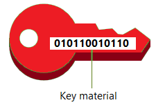

# Importing key material for AWS KMS keys

You can create an AWS KMS keys (KMS key) with key material that you supply.

A KMS key is a logical representation of a data key. The metadata for a KMS key includes
the ID of the key material used to perform cryptographic operations. When you [create a KMS key](create-keys.md "create-keys.md"), by default, AWS KMS generates the key material
for that KMS key. But you can create a KMS key without key material and then import your own
key material into that KMS key, a feature often known as "bring your own key" (BYOK).

###### Note

AWS KMS does not support decrypting any AWS KMS ciphertext encrypted by a symmetric encryption
KMS key outside of AWS KMS, even if the ciphertext was encrypted under a KMS key with
imported key material. AWS KMS does not publish the ciphertext format this task requires, and
the format might change without notice.

When you use imported key material, you remain responsible for the key material while
allowing AWS KMS to use a copy of it. You might choose to do this for one or more of the following
reasons:

- To prove the key material was generated using a source of entropy that meets your
  requirements.
- To use key material from your own infrastructure with AWS services, and to use AWS KMS
  to manage the lifecycle of that key material within AWS.
- To use existing, well-established keys in AWS KMS, such as keys for code signing, PKI
  certificate signing, and certificate pinned applications
- To set an expiration time for the key material in AWS and to [manually delete it](importing-keys-delete-key-material.md "importing-keys-delete-key-material.md"), but to also make
  it available again in the future. In contrast, [scheduling key deletion](deleting-keys.md#deleting-keys-how-it-works "deleting-keys.md#deleting-keys-how-it-works") requires a waiting period of 7 to 30 days, after which you
  cannot recover the deleted KMS key.
- To own the original copy of the key material, and to keep it outside of AWS for
  additional durability and disaster recovery during the complete lifecycle of the key
  material.
- For asymmetric keys and HMAC keys, importing creates compatible and interoperable keys
  that operate within and outside of AWS.
  **Supported KMS key types**

AWS KMS supports imported key material for the following types of KMS keys. You cannot
import key material into KMS keys in [custom key
stores](key-store-overview.md#custom-key-store-overview "key-store-overview.md#custom-key-store-overview").

- [Symmetric encryption KMS keys](symm-asymm-choose-key-spec.md#symmetric-cmks "symm-asymm-choose-key-spec.md#symmetric-cmks")
- [Asymmetric KMS keys (except ML-DSA
  keys)](symmetric-asymmetric.md "symmetric-asymmetric.md")
- [HMAC KMS keys](hmac.md "hmac.md")
- [Multi-Region keys](multi-region-keys-overview.md "multi-region-keys-overview.md") of all supported
  types.
  **Regions**

Imported key material is supported in all AWS Regions that AWS KMS
supports.

In China Regions, the key material requirements for symmetric encryption KMS keys differ
from other Regions. For details, see [Step 3: Encrypt the
key material](importing-keys-encrypt-key-material.md "importing-keys-encrypt-key-material.md").

**Learn more**

- To create KMS keys with imported key material, see [Create a KMS key with imported key
  material](importing-keys-conceptual.md "importing-keys-conceptual.md").
- To create an alarm that notifies you when the imported key material in a KMS key is
  approaching its expiration time, see [Create a CloudWatch alarm for expiration of
  imported key material](imported-key-material-expiration-alarm.md "imported-key-material-expiration-alarm.md").
- To reimport key material into a KMS key, see [Reimport key material](importing-keys-import-key-material.md#reimport-key-material "importing-keys-import-key-material.md#reimport-key-material").
- To import new key material into a KMS key for on-demand rotation, see [Import new key material](importing-keys-import-key-material.md#import-new-key-material "importing-keys-import-key-material.md#import-new-key-material") and [Perform on-demand key
  rotation](rotating-keys-on-demand.md "rotating-keys-on-demand.md").
- To identify and view KMS keys with imported key material, see [Identify KMS keys with imported key
  material](identify-key-types.md#identify-imported-keys "identify-key-types.md#identify-imported-keys").
- To learn about special considerations for deleting KMS keys with imported key
  material, see [Deleting KMS keys with imported key material](deleting-keys.md#import-delete-key "deleting-keys.md#import-delete-key").
