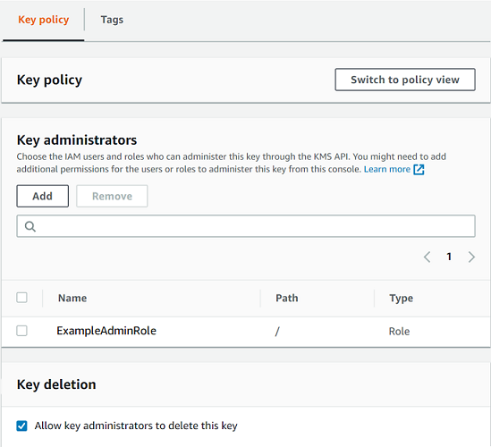
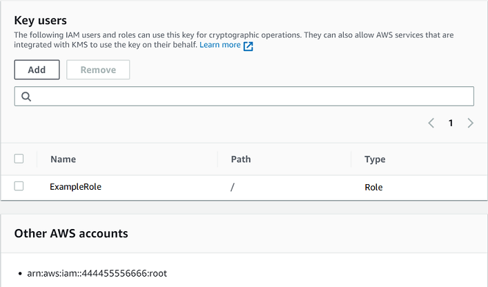

# Default key policy

When you create a KMS key, you can specify the key policy for the new KMS key. If you
don't provide one, AWS KMS creates one for you. The default key policy that AWS KMS uses differs
depending on whether you create the key in the AWS KMS console or you use the AWS KMS API.

**Default key policy when you create a KMS key programmatically**

When you create a KMS key programmatically with the [AWS KMS API](../APIReference.md "../APIReference.md") (including by using the [AWS SDKs](https://aws.amazon.com/tools/#sdk "https://aws.amazon.com/tools/#sdk"),
[AWS Command Line Interface](../../../cli/latest/userguide.md "../../../cli/latest/userguide.md") or [AWS Tools for PowerShell](../../../powershell/latest/userguide.md "../../../powershell/latest/userguide.md")), and you don't specify a key policy, AWS KMS applies a very
simple default key policy. This default key policy has one policy statement that gives
the AWS account that owns the KMS key permission to use IAM policies to allow
access to all AWS KMS operations on the KMS key. For more information about this policy
statement, see [Allows access to the
AWS account and enables IAM policies](#key-policy-default-allow-root-enable-iam "#key-policy-default-allow-root-enable-iam").

**Default key policy when you create a KMS key with the AWS Management Console**

When you [create a KMS key with the AWS Management Console](create-keys.md "create-keys.md"),
the key policy begins with the policy statement that [allows access to the AWS account
and enables IAM policies](#key-policy-default-allow-root-enable-iam "#key-policy-default-allow-root-enable-iam"). The console then adds a [key administrators statement](#key-policy-default-allow-administrators "#key-policy-default-allow-administrators"),
a [key users statement](#key-policy-default-allow-users "#key-policy-default-allow-users"), and (for
most key types) a statement that allows principals to use the KMS key with [other AWS services](#key-policy-service-integration "#key-policy-service-integration"). You can use the
features of the AWS KMS console to specify the IAM users, IAM roles, and
AWS accounts who are key administrators and those who are key users (or both).

**Permissions**

- [Allows access to the
  AWS account and enables IAM policies](#key-policy-default-allow-root-enable-iam "#key-policy-default-allow-root-enable-iam")
- [Allows key administrators to
  administer the KMS key](#key-policy-default-allow-administrators "#key-policy-default-allow-administrators")
- [Allows key users to use the
  KMS key](#key-policy-default-allow-users "#key-policy-default-allow-users")
  - [Allows key users to use a KMS key for
    cryptographic operations](#key-policy-users-crypto "#key-policy-users-crypto")
  - [Allows key users to use the KMS key with
    AWS services](#key-policy-service-integration "#key-policy-service-integration")

## Allows access to the

AWS account and enables IAM policies

The following default key policy statement is critical.

- It gives the AWS account that owns the KMS key full access to the KMS key.

Unlike other AWS resource policies, an AWS KMS key policy does not automatically
give permission to the account or any of its identities. To give permission to account
administrators, the key policy must include an explicit statement that provides this
permission, like this one.

- It allows the account to use IAM policies to allow access to the KMS key, in
  addition to the key policy.

Without this permission, IAM policies that allow access to the key are
ineffective, although IAM policies that deny access to the key are still effective.

- It reduces the risk of the key becoming unmanageable by giving access control
  permission to the account administrators, including the account root user, which cannot be
  deleted.

The following key policy statement is the entire default key policy for KMS keys
created programmatically. It's the first policy statement in the default key policy for
KMS keys created in the AWS KMS console.

```
{
  "Sid": "Enable IAM User Permissions",
  "Effect": "Allow",
  "Principal": {
    "AWS": "arn:aws:iam::`111122223333`:root"
   },
  "Action": "kms:*",
  "Resource": "*"
}
```

**Allows IAM policies to allow access to the KMS key.**

The key policy statement shown above gives the AWS account that owns the key
permission to use IAM policies, as well as key policies, to allow all actions
(`kms:*`) on the KMS key.

The principal in this key policy statement is the [account principal](../../../IAM/latest/UserGuide/reference_policies_elements_principal.md#principal-accounts "../../../IAM/latest/UserGuide/reference_policies_elements_principal.md#principal-accounts"), which is represented by an ARN in this format:
`arn:aws:iam::`account-id`:root`. The account
principal represents the AWS account and its administrators.

When the principal in a key policy statement is the account principal, the policy
statement doesn't give any IAM principal permission to use the KMS key. Instead,
it allows the account to use IAM policies to _delegate_ the permissions specified in the policy statement. This default
key policy statement allows the account to use IAM policies to delegate permission
for all actions (`kms:*`) on the KMS key.

**Reduces the risk of the KMS key becoming
unmanageable.**

Unlike other AWS resource policies, an AWS KMS key policy does not automatically
give permission to the account or any of its principals. To give permission to any
principal, including the [account principal](../../../IAM/latest/UserGuide/reference_policies_elements_principal.md#principal-accounts "../../../IAM/latest/UserGuide/reference_policies_elements_principal.md#principal-accounts"), you must use a key policy statement that provides the
permission explicitly. You are not required to give the account principal, or any
principal, access to the KMS key. However, giving access to the account principal
helps you prevent the key from becoming unmanageable.

For example, suppose you create a key policy that gives only one user access to
the KMS key. If you then delete that user, the key becomes unmanageable and you must
[contact AWS
Support](https://console.aws.amazon.com/support/home#/case/create "https://console.aws.amazon.com/support/home#/case/create") to regain access to the KMS key.

The key policy statement shown above gives the [account principal](../../../IAM/latest/UserGuide/reference_policies_elements_principal.md#principal-accounts "../../../IAM/latest/UserGuide/reference_policies_elements_principal.md#principal-accounts") permission to control the key. The account principal
represents the AWS account and its administrators, including the [account root user](../../../IAM/latest/UserGuide/id_root-user.md "../../../IAM/latest/UserGuide/id_root-user.md"). The account root user is
the only principal that cannot be deleted unless you delete the AWS account. IAM
best practices discourage acting on behalf of the account root user, except in an
emergency. However, you might need to act as the account root user if you delete all
other users and roles with access to the KMS key.

## Allows key administrators to

administer the KMS key

The default key policy created by the console allows you to choose IAM users and roles
in the account and make them _key administrators_. This statement is
called the _key administrators statement_. Key administrators have
permissions to manage the KMS key, but do not have permissions to use the KMS key in
[cryptographic operations](kms-cryptography.md#cryptographic-operations "kms-cryptography.md#cryptographic-operations"). You can add
IAM users and roles to the list of key administrators when you create the KMS key in the
default view or the policy view.

###### Warning

Because key administrators have permission to change the key policy and create grants,
they can give themselves and others AWS KMS permissions not specified in this policy.

Principals who have permission to manage tags and aliases can also control access to a
KMS key. For details, see [ABAC for AWS KMS](abac.md "abac.md").

###### Note

IAM best practices discourage the use of IAM users with long-term credentials. Whenever
possible, use IAM roles, which provide temporary credentials. For details,
see [Security best practices in IAM](../../../IAM/latest/UserGuide/best-practices.md "../../../IAM/latest/UserGuide/best-practices.md") in the _IAM User Guide_.

The following example shows the key administrators statement in the default view of the
AWS KMS console.



The following is an example key administrators statement in the policy view of the AWS KMS
console. This key administrators statement is for a single-Region symmetric encryption
KMS key.

###### Note

The AWS KMS console adds key administrators to the key policy under the statement identifier
`"Allow access for Key Administrators"`. Modifying this statement identifier might
impact how the console displays updates that you make to the statement.

```
{
  "Sid": "Allow access for Key Administrators",
  "Effect": "Allow",
  "Principal": {"AWS":"arn:aws:iam::`111122223333`:role/`ExampleAdminRole`"},
  "Action": [
    "kms:Create*",
    "kms:Describe*",
    "kms:Enable*",
    "kms:List*",
    "kms:Put*",
    "kms:Update*",
    "kms:Revoke*",
    "kms:Disable*",
    "kms:Get*",
    "kms:Delete*",
    "kms:TagResource",
    "kms:UntagResource",
    "kms:ScheduleKeyDeletion",
    "kms:CancelKeyDeletion",
    "kms:RotateKeyOnDemand"
  ],
  "Resource": "*"
}
```

The default key administrators statement for the most common KMS key, a single-Region
symmetric encryption KMS key, allows the following permissions. For detailed information
about each permission, see the [AWS KMS permissions](kms-api-permissions-reference.md "kms-api-permissions-reference.md").

When you use the AWS KMS console to create a KMS key, the console adds the users and
roles you specify to the `Principal` element in the key administrators
statement.

Many of these permissions contain the wildcard character (`*`), which allows
all permissions that begin with the specified verb. As a result, when AWS KMS adds new API
operations, key administrators are automatically allowed to use them. You don't have to
update your key policies to include the new operations. If you prefer to limit your key
administrators to a fixed set of API operations, you can [change your key policy](key-policy-modifying.md "key-policy-modifying.md").

**`kms:Create*`**

Allows [kms:CreateAlias](kms-alias.md "kms-alias.md") and [kms:CreateGrant](grants.md "grants.md"). (The
`kms:CreateKey` permission is valid only in an IAM policy.)

**`kms:Describe*`**

Allows [kms:DescribeKey](viewing-keys.md "viewing-keys.md"). The
`kms:DescribeKey` permission is required to view the key details page for
a KMS key in the AWS Management Console.

**`kms:Enable*`**

Allows [kms:EnableKey](enabling-keys.md "enabling-keys.md"). For
symmetric encryption KMS keys, it also allows [kms:EnableKeyRotation](rotate-keys.md "rotate-keys.md").

**`kms:List*`**

Allows [kms:ListGrants](grants.md "grants.md"), [`kms:ListKeyPolicies`](../APIReference/API_ListKeyPolicies.md "../APIReference/API_ListKeyPolicies.md"), and [kms:ListResourceTags](tagging-keys.md "tagging-keys.md"). (The `kms:ListAliases` and
`kms:ListKeys` permissions, which are required to view KMS keys in the
AWS Management Console, are valid only in IAM policies.)

**`kms:Put*`**

Allows [`kms:PutKeyPolicy`](../APIReference/API_PutKeyPolicy.md "../APIReference/API_PutKeyPolicy.md"). This permission allows key administrators
to change the key policy for this KMS key.

**`kms:Update*`**

Allows [kms:UpdateAlias](alias-update.md "alias-update.md") and [`kms:UpdateKeyDescription`](../APIReference/API_UpdateKeyDescription.md "../APIReference/API_UpdateKeyDescription.md"). For multi-Region keys, it allows
[kms:UpdatePrimaryRegion](multi-region-update.md#update-primary-console "multi-region-update.md#update-primary-console")
on this KMS key.

**`kms:Revoke*`**

Allows [kms:RevokeGrant](grant-delete.md "grant-delete.md"), which
allows key administrators to [delete a grant](grant-delete.md "grant-delete.md") even
if they are not a [retiring principal](grants.md#terms-retiring-principal "grants.md#terms-retiring-principal")
in the grant.

**`kms:Disable*`**

Allows [kms:DisableKey](enabling-keys.md "enabling-keys.md"). For
symmetric encryption KMS keys, it also allows [kms:DisableKeyRotation](rotate-keys.md "rotate-keys.md").

**`kms:Get*`**

Allows [kms:GetKeyPolicy](key-policy-viewing.md "key-policy-viewing.md") and
[kms:GetKeyRotationStatus](rotate-keys.md "rotate-keys.md"). For
KMS keys with imported key material, it allows [`kms:GetParametersForImport`](../APIReference/API_GetParametersForImport.md "../APIReference/API_GetParametersForImport.md"). For asymmetric KMS keys, it
allows [`kms:GetPublicKey`](../APIReference/API_GetPublicKey.md "../APIReference/API_GetPublicKey.md"). The `kms:GetKeyPolicy` permission
is required to view the key policy of a KMS key in the AWS Management Console.

**`kms:Delete*`**

Allows [kms:DeleteAlias](kms-alias.md "kms-alias.md"). For keys
with imported key material, it allows [kms:DeleteImportedKeyMaterial](importing-keys.md "importing-keys.md"). The `kms:Delete*`
permission does not allow key administrators to delete the KMS key
(`ScheduleKeyDeletion`).

**`kms:TagResource`**

Allows [kms:TagResource](tagging-keys.md "tagging-keys.md"), which
allows key administrators to add tags to the KMS key. Because tags can also be used
to control access to the KMS key, this permission can allow administrators to allow
or deny access to the KMS key. For details, see [ABAC for AWS KMS](abac.md "abac.md").

**`kms:UntagResource`**

Allows [kms:UntagResource](tagging-keys.md "tagging-keys.md"), which
allows key administrators to delete tags from the KMS key. Because tags can be used
to control access to the key, this permission can allow administrators to allow or
deny access to the KMS key. For details, see [ABAC for AWS KMS](abac.md "abac.md").

**`kms:ScheduleKeyDeletion`**

Allows [`kms:ScheduleKeyDeletion`](../APIReference/API_ScheduleKeyDeletion.md "../APIReference/API_ScheduleKeyDeletion.md"), which allows key administrators to
[delete this KMS key](deleting-keys.md "deleting-keys.md"). To delete this
permission, clear the **Allow key administrators to delete this key**
option.

**`kms:CancelKeyDeletion`**

Allows [`kms:CancelKeyDeletion`](../APIReference/API_CancelKeyDeletion.md "../APIReference/API_CancelKeyDeletion.md"), which allows key administrators to
[cancel deletion of this KMS key](deleting-keys.md "deleting-keys.md"). To delete
this permission, clear the **Allow key administrators to delete this
key** option.

**`kms:RotateKeyOnDemand`**

Allows [`kms:RotateKeyOnDemand`](../APIReference/API_RotateKeyOnDemand.md "../APIReference/API_RotateKeyOnDemand.md"), which allows key administrators to
[perform on-demand rotation of the key
material in this KMS key](rotating-keys-on-demand.md "rotating-keys-on-demand.md").

 

AWS KMS adds the following permissions to the default key administrators statement when
you create special-purpose keys.

**`kms:ImportKeyMaterial`**

The [`kms:ImportKeyMaterial`](../APIReference/API_ImportKeyMaterial.md "../APIReference/API_ImportKeyMaterial.md") permission allows key administrators
to import key material into the KMS key. This permission is included in the key
policy only when you [create a KMS key with
no key material](importing-keys-create-cmk.md "importing-keys-create-cmk.md").

**`kms:ReplicateKey`**

The [`kms:ReplicateKey`](../APIReference/API_ReplicateKey.md "../APIReference/API_ReplicateKey.md") permission allows key administrators to [create a replica of a multi-Region primary
key](multi-region-keys-replicate.md "multi-region-keys-replicate.md") in a different AWS Region. This permission is included in the key
policy only when you create a multi-Region primary or replica key.

**`kms:UpdatePrimaryRegion`**

The [`kms:UpdatePrimaryRegion`](../APIReference/API_UpdatePrimaryRegion.md "../APIReference/API_UpdatePrimaryRegion.md") permission allows key administrators
to [change a multi-Region replica key to a
multi-Region primary key](multi-region-update.md "multi-region-update.md"). This permission is included in the key policy only
when you create a multi-Region primary or replica key.

## Allows key users to use the

KMS key

The default key policy that the console creates for KMS keys allows you to choose
IAM users and IAM roles in the account, and external AWS accounts, and make them
_key users_.

The console adds two policy statements to the key policy for key users.

- [Use the KMS key directly](#key-policy-users-crypto "#key-policy-users-crypto") —
  The first key policy statement gives key users permission to use the KMS key directly
  for all supported [cryptographic
  operations](kms-cryptography.md#cryptographic-operations "kms-cryptography.md#cryptographic-operations") for that type of KMS key.
- [Use the KMS key with AWS
  services](#key-policy-service-integration "#key-policy-service-integration") — The second policy statement gives key users permission to
  allow AWS services that are integrated with AWS KMS to use the KMS key on their behalf
  to protect resources, such as Amazon S3 buckets and Amazon DynamoDB tables.

You can add IAM users, IAM roles, and other AWS accounts to the list of key users
when you create the KMS key. You can also edit the list with the console's default view
for key policies, as shown in the following image. The default view for key policies is on
the key details page. For more information about allowing users in other AWS accounts to
use the KMS key, see [Allowing users in other accounts to
use a KMS key](key-policy-modifying-external-accounts.md "key-policy-modifying-external-accounts.md").

###### Note

IAM best practices discourage the use of IAM users with long-term credentials. Whenever
possible, use IAM roles, which provide temporary credentials. For details,
see [Security best practices in IAM](../../../IAM/latest/UserGuide/best-practices.md "../../../IAM/latest/UserGuide/best-practices.md") in the _IAM User Guide_.



The default _key users statements_ for a single-Region symmetric
allows the following permissions. For detailed information about each permission, see the
[AWS KMS permissions](kms-api-permissions-reference.md "kms-api-permissions-reference.md").

When you use the AWS KMS console to create a KMS key, the console adds the users and
roles you specify to the `Principal` element in each key users statement.

###### Note

The AWS KMS console adds key users to the key policy under the statement identifiers `"Allow use of the key"` and `"Allow 
 attachment of persistent resources"`. Modifying these statement identifiers might
impact how the console displays updates that you make to the statement.

```
{
  "Sid": "Allow use of the key",
  "Effect": "Allow",
  "Principal": {"AWS": [
    "arn:aws:iam::`111122223333`:role/`ExampleRole`",
    "arn:aws:iam::`444455556666`:root"
  ]},
  "Action": [
    "kms:Encrypt",
    "kms:Decrypt",
    "kms:ReEncrypt*",
    "kms:GenerateDataKey*",
    "kms:DescribeKey"
  ],
  "Resource": "*"
},
{
  "Sid": "Allow attachment of persistent resources",
  "Effect": "Allow",
  "Principal": {"AWS": [
    "arn:aws:iam::`111122223333`:role/`ExampleRole`",
    "arn:aws:iam::`444455556666`:root"
  ]},
  "Action": [
    "kms:CreateGrant",
    "kms:ListGrants",
    "kms:RevokeGrant"
  ],
  "Resource": "*",
  "Condition": {"Bool": {"kms:GrantIsForAWSResource": true}}
}
```

## Allows key users to use a KMS key for

cryptographic operations

Key users have permission to use the KMS key directly in all [cryptographic operations](kms-cryptography.md#cryptographic-operations "kms-cryptography.md#cryptographic-operations") supported on the
KMS key. They can also use the [DescribeKey](../APIReference/API_DescribeKey.md "../APIReference/API_DescribeKey.md") operation to get detailed information about the KMS key in the AWS KMS console or by
using the AWS KMS API operations.

By default, the AWS KMS console adds key users statements like those in the following
examples to the default key policy. Because they support different API operations, the
actions in the policy statements for symmetric encryption KMS keys, HMAC KMS keys,
asymmetric KMS keys for public key encryption, and asymmetric KMS keys for signing and
verification are slightly different.

**Symmetric encryption KMS keys**

The console adds the following statement to the key policy for symmetric
encryption KMS keys.

```
{
  "Sid": "Allow use of the key",
  "Effect": "Allow",
  "Principal": {"AWS": "arn:aws:iam::111122223333:role/`ExampleKeyUserRole`"},
  "Action": [
    "kms:Decrypt",
    "kms:DescribeKey",
    "kms:Encrypt",
    "kms:GenerateDataKey*",
    "kms:ReEncrypt*"
  ],
  "Resource": "*"
}
```

**HMAC KMS keys**

The console adds the following statement to the key policy for HMAC
KMS keys.

```
{
  "Sid": "Allow use of the key",
  "Effect": "Allow",
  "Principal": {"AWS": "arn:aws:iam::111122223333:role/`ExampleKeyUserRole`"},
  "Action": [
    "kms:DescribeKey",
    "kms:GenerateMac",
    "kms:VerifyMac"
  ],
  "Resource": "*"
}
```

**Asymmetric KMS keys for public key encryption**

The console adds the following statement to the key policy for asymmetric
KMS keys with a key usage of **Encrypt and decrypt**.

```
{
  "Sid": "Allow use of the key",
  "Effect": "Allow",
  "Principal": {
    "AWS": "arn:aws:iam::111122223333:role/`ExampleKeyUserRole`"
  },
  "Action": [
    "kms:Encrypt",
    "kms:Decrypt",
    "kms:ReEncrypt*",
    "kms:DescribeKey",
    "kms:GetPublicKey"
  ],
  "Resource": "*"
}
```

**Asymmetric KMS keys for signing and verification**

The console adds the following statement to the key policy for asymmetric
KMS keys with a key usage of **Sign and verify**.

```
{
  "Sid": "Allow use of the key",
  "Effect": "Allow",
  "Principal": {"AWS": "arn:aws:iam::111122223333:role/`ExampleKeyUserRole`"},
  "Action": [
    "kms:DescribeKey",
    "kms:GetPublicKey",
    "kms:Sign",
    "kms:Verify"
  ],
  "Resource": "*"
}
```

**Asymmetric KMS keys for deriving shared secrets**

The console adds the following statement to the key policy for asymmetric
KMS keys with a key usage of **Key agreement**.

```
{
  "Sid": "Allow use of the key",
  "Effect": "Allow",
  "Principal": {"AWS": "arn:aws:iam::111122223333:role/`ExampleKeyUserRole`"},
  "Action": [
    "kms:DescribeKey",
    "kms:GetPublicKey",
    "kms:DeriveSharedSecret"
  ],
  "Resource": "*"
}
```

The actions in these statements give the key users the following permissions.

[`kms:Encrypt`](../APIReference/API_Encrypt.md "../APIReference/API_Encrypt.md")

Allows key users to encrypt data with this KMS key.

[`kms:Decrypt`](../APIReference/API_Decrypt.md "../APIReference/API_Decrypt.md")

Allows key users to decrypt data with this KMS key.

[`kms:DeriveSharedSecret`](../APIReference/API_DeriveSharedSecret.md "../APIReference/API_DeriveSharedSecret.md")

Allows key users to derive shared secrets with this KMS key.

[`kms:DescribeKey`](../APIReference/API_DescribeKey.md "../APIReference/API_DescribeKey.md")

Allows key users to get detailed information about this KMS key including its
identifiers, creation date, and key state. It also allows the key users to display
details about the KMS key in the AWS KMS console.

`**kms:GenerateDataKey\***`

Allows key users to request a symmetric data key or an asymmetric data key pair
for client-side cryptographic operations. The console uses the \* wildcard character to
represent permission for the following API operations: [GenerateDataKey](../APIReference/API_GenerateDataKey.md "../APIReference/API_GenerateDataKey.md"), [GenerateDataKeyWithoutPlaintext](../APIReference/API_GenerateDataKeyWithoutPlaintext.md "../APIReference/API_GenerateDataKeyWithoutPlaintext.md"), [GenerateDataKeyPair](../APIReference/API_GenerateDataKeyPair.md "../APIReference/API_GenerateDataKeyPair.md"), and
[GenerateDataKeyPairWithoutPlaintext](../APIReference/API_GenerateDataKeyPairWithoutPlaintext.md "../APIReference/API_GenerateDataKeyPairWithoutPlaintext.md"). These permissions are valid only on
the symmetric KMS keys that encrypt the data keys.

[kms:GenerateMac](../APIReference/API_GenerateMac.md "../APIReference/API_GenerateMac.md")

Allows key users to use an HMAC KMS key to generate an HMAC tag.

[kms:GetPublicKey](../APIReference/API_GetPublicKey.md "../APIReference/API_GetPublicKey.md")

Allows key users to download the public key of the asymmetric KMS key. Parties
with whom you share this public key can encrypt data outside of AWS KMS. However, those
ciphertexts can be decrypted only by calling the [Decrypt](../APIReference/API_Decrypt.md "../APIReference/API_Decrypt.md") operation in AWS KMS.

[kms:ReEncrypt](../APIReference/API_ReEncrypt.md "../APIReference/API_ReEncrypt.md")\*

Allows key users to re-encrypt data that was originally encrypted with this
KMS key, or to use this KMS key to re-encrypt previously encrypted data. The
[ReEncrypt](../APIReference/API_ReEncrypt.md "../APIReference/API_ReEncrypt.md") operation requires
access to both source and destination KMS keys. To accomplish this, you can allow
the `kms:ReEncryptFrom` permission on the source KMS key and
`kms:ReEncryptTo` permission on the destination KMS key. However, for
simplicity, the console allows `kms:ReEncrypt*` (with the `*`
wildcard character) on both KMS keys.

[kms:Sign](../APIReference/API_Sign.md "../APIReference/API_Sign.md")

Allows key users to sign messages with this KMS key.

[kms:Verify](../APIReference/API_Verify.md "../APIReference/API_Verify.md")

Allows key users to verify signatures with this KMS key.

[kms:VerifyMac](../APIReference/API_VerifyMac.md "../APIReference/API_VerifyMac.md")

Allows key users to use an HMAC KMS key to verify an HMAC tag.

## Allows key users to use the KMS key with

AWS services

The default key policy in the console also gives key users the grant permissions they
need to protect their data in AWS services that use grants. AWS services often use
grants to get specific and limited permission to use a KMS key.

This key policy statement allows the key user to create, view, and revoke grants on the
KMS key, but only when the grant operation request comes from an [AWS service integrated with AWS KMS](https://aws.amazon.com/kms/features/#AWS_Service_Integration "https://aws.amazon.com/kms/features/#AWS_Service_Integration"). The [kms:GrantIsForAWSResource](conditions-kms.md#conditions-kms-grant-is-for-aws-resource "conditions-kms.md#conditions-kms-grant-is-for-aws-resource") policy
condition doesn't allow the user to call these grant operations directly. When the key user
allows it, an AWS service can create a grant on the user's behalf that allows the service
to use the KMS key to protect the user's data.

Key users require these grant permissions to use their KMS key with integrated
services, but these permissions are not sufficient. Key users also need permission to use
the integrated services. For details about giving users access to an AWS service that
integrates with AWS KMS, consult the documentation for the integrated service.

```
{
  "Sid": "Allow attachment of persistent resources",
  "Effect": "Allow",
  "Principal": {"AWS": "arn:aws:iam::111122223333:role/`ExampleKeyUserRole`"},
  "Action": [
    "kms:CreateGrant",
    "kms:ListGrants",
    "kms:RevokeGrant"
  ],
  "Resource": "*",
  "Condition": {"Bool": {"kms:GrantIsForAWSResource": true}}
}
```

For example, key users can use these permissions on the KMS key in the following
ways.

- Use this KMS key with Amazon Elastic Block Store (Amazon EBS) and Amazon Elastic Compute Cloud (Amazon EC2) to attach an
  encrypted EBS volume to an EC2 instance. The key user implicitly gives Amazon EC2 permission
  to use the KMS key to attach the encrypted volume to the instance. For more
  information, see [How Amazon Elastic Block Store (Amazon EBS) uses AWS KMS](services-ebs.md "services-ebs.md").
- Use this KMS key with Amazon Redshift to launch an encrypted cluster. The key user
  implicitly gives Amazon Redshift permission to use the KMS key to launch the encrypted cluster
  and create encrypted snapshots. For more information, see [How Amazon Redshift uses AWS KMS](services-redshift.md "services-redshift.md").
- Use this KMS key with other [AWS services
  integrated with AWS KMS](service-integration.md "service-integration.md") that use grants to create, manage, or use encrypted
  resources with those services.

The default key policy allows key users to delegate their grant permission to
_all_ integrated services that use grants. However, you can create a
custom key policy that restricts the permission to specified AWS services. For more
information, see the [kms:ViaService](conditions-kms.md#conditions-kms-via-service "conditions-kms.md#conditions-kms-via-service") condition key.
