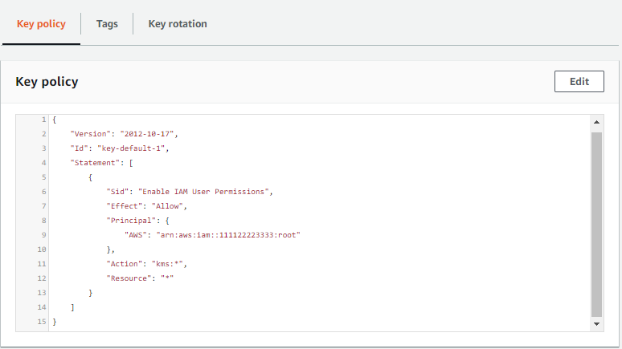
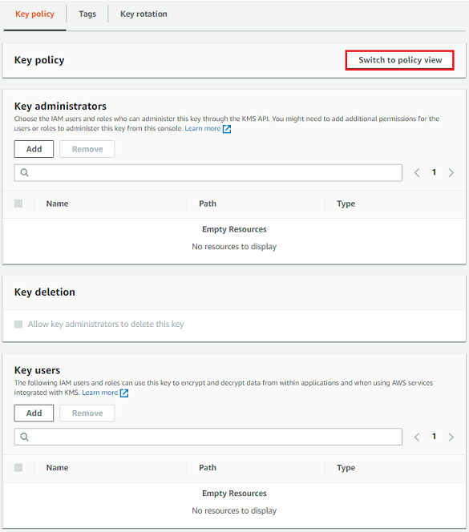

# View a key policies

You can view the key policy for an AWS KMS [customer managed key](concepts.md#customer-mgn-key "concepts.md#customer-mgn-key") or
an [AWS managed key](concepts.md#aws-managed-key "concepts.md#aws-managed-key") in your account by using the
AWS KMS console or the [GetKeyPolicy](../APIReference/API_GetKeyPolicy.md "../APIReference/API_GetKeyPolicy.md")
operation in the AWS KMS API. You cannot use these techniques to view the key policy of a
KMS key in a different AWS account.

To learn more about AWS KMS key policies, see [Key policies in AWS KMS](key-policies.md "key-policies.md"). To learn how to determine which users and roles have
access to a KMS key, see [Determining access to AWS KMS keys](determining-access.md "determining-access.md").

Authorized users can view the key policy for an [AWS managed key](concepts.md#aws-managed-key "concepts.md#aws-managed-key") or a [customer managed key](concepts.md#customer-mgn-key "concepts.md#customer-mgn-key") on the
**Key policy** tab of the AWS Management Console.

To view the key policy for a KMS key in the AWS Management Console, you must have [kms:ListAliases](../APIReference/API_ListAliases.md "../APIReference/API_ListAliases.md"), [kms:DescribeKey](../APIReference/API_DescribeKey.md "../APIReference/API_DescribeKey.md"), and [kms:GetKeyPolicy](../APIReference/API_GetKeyPolicy.md "../APIReference/API_GetKeyPolicy.md")
permissions.

1. Sign in to the AWS Management Console and open the AWS Key Management Service (AWS KMS) console at [https://console.aws.amazon.com/kms](https://console.aws.amazon.com/kms "https://console.aws.amazon.com/kms").
2. To change the AWS Region, use the Region selector in the upper-right corner of the page.
3. To view the keys in your account that AWS creates and manages for you, in the navigation pane, choose **AWS managed keys**. To view the keys in your account that you create and manage, in the navigation
   pane choose **Customer managed keys**.
4. In the list of KMS keys, choose the alias or key ID of the KMS key that
   you want to examine.
5. Choose the **Key policy** tab.

On the **Key policy** tab, you might see the key policy
document. This is _policy view_. In the key policy
statements, you can see the principals who have been given access to the
KMS key by the key policy, and you can see the actions they can
perform.

The following example shows the policy view for the [default key policy](key-policy-default.md "key-policy-default.md").



Or, if you created the KMS key in the AWS Management Console, you will see the
_default view_ with sections for **Key
administrators**, **Key deletion**, and
**Key Users**. To see the key policy document, choose
**Switch to policy view**.

The following example shows the default view for the [default key policy](key-policy-default.md "key-policy-default.md").


To get the key policy for a KMS key in your AWS account, use the [GetKeyPolicy](../APIReference/API_GetKeyPolicy.md "../APIReference/API_GetKeyPolicy.md") operation in the AWS KMS
API. You cannot use this operation to view a key policy in a different account.

The following example uses the [get-key-policy](../../../cli/latest/reference/kms/get-key-policy.md "../../../cli/latest/reference/kms/get-key-policy.md") command in the AWS Command Line Interface (AWS CLI), but you can use any AWS
SDK to make this request.

Note that the `PolicyName` parameter is required even though
`default` is its only valid value. Also, this command requests the output
in text, rather than JSON, to make it easier to view.

Before running this command, replace the example key ID with a valid one from your
account.

```
`$` `aws kms get-key-policy --key-id `1234abcd-12ab-34cd-56ef-1234567890ab` --policy-name default --output text`
```

The response should be similar to the following one, which returns the [default key policy](key-policy-default.md "key-policy-default.md").

JSON

```
`{
 "Version":"2012-10-17",
 "Id" : "key-consolepolicy-3",
 "Statement" : [ {
 "Sid" : "EnableIAMUserPermissions",
 "Effect" : "Allow",
 "Principal" : {
 "AWS" : "arn:aws:iam::`111122223333`:root"
 },
 "Action" : "kms:*",
 "Resource" : "*"
 } ]
}`

```
