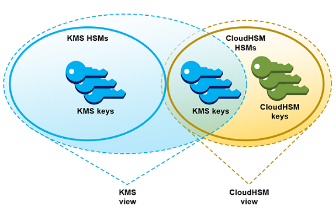

# AWS CloudHSM key stores

An AWS CloudHSM key store is a [custom key store](key-store-overview.md#custom-key-store-overview "key-store-overview.md#custom-key-store-overview")
backed by a [AWS CloudHSM cluster](../../../cloudhsm/latest/userguide.md "../../../cloudhsm/latest/userguide.md"). When you create an AWS KMS key in a custom key store, AWS KMS generates and
stores non-extractable key material for the KMS key in an AWS CloudHSM cluster that you own and
manage. When you use a KMS key in a custom key store, the [cryptographic operations](manage-cmk-keystore.md#use-cmk-keystore "manage-cmk-keystore.md#use-cmk-keystore") are performed in the HSMs in the cluster. This feature
combines the convenience and widespread integration of AWS KMS with the added control of an
AWS CloudHSM cluster in your AWS account.

AWS KMS provides full console and API support for creating, using, and managing your custom
key stores. You can use the KMS keys in your custom key store the same way that you use
any KMS key. For example, you can use the KMS keys to generate data keys and encrypt
data. You can also use the KMS keys in your custom key store with AWS services that
support customer managed keys.

**Do I need a custom key store?**

For most users, the default AWS KMS key store, which is protected by [FIPS 140-3 validated cryptographic modules](https://csrc.nist.gov/projects/cryptographic-module-validation-program/certificate/4884 "https://csrc.nist.gov/projects/cryptographic-module-validation-program/certificate/4884"), fulfills their
security requirements. There is no need to add an extra layer of maintenance responsibility
or a dependency on an additional service.

However, you might consider creating a custom key store if your organization has any of
the following requirements:

- You have keys that are explicitly required to be protected in a single tenant HSM
  or in an HSM that you have direct control over.
- You need the ability to immediately remove key material from AWS KMS.
- You need to be able to audit all use of your keys independently of AWS KMS or
  AWS CloudTrail.
  **How do custom key stores work?**

Each custom key store is associated with an AWS CloudHSM cluster in your AWS account. When you
connect the custom key store to its cluster, AWS KMS creates the network infrastructure to
support the connection. Then it logs into the key AWS CloudHSM client in the cluster using the
credentials of a [dedicated crypto user](#concept-kmsuser "#concept-kmsuser") in the
cluster.

You create and manage your custom key stores in AWS KMS and create and manage your HSM
clusters in AWS CloudHSM. When you create AWS KMS keys in an AWS KMS custom key store, you view
and manage the KMS keys in AWS KMS. But you can also view and manage their key material in
AWS CloudHSM, just as you would do for other keys in the cluster.

You can [create symmetric encryption KMS keys](create-cmk-keystore.md "create-cmk-keystore.md")
with key material generated by AWS KMS in your custom key store. Then use the same techniques
to view and manage the KMS keys in your custom key store that you use for KMS keys in
the AWS KMS key store. You can control access with IAM and key policies, create tags and
aliases, enable and disable the KMS keys, and schedule key deletion. You can use the
KMS keys for [cryptographic operations](manage-cmk-keystore.md#use-cmk-keystore "manage-cmk-keystore.md#use-cmk-keystore") and use them
with AWS services that integrate with AWS KMS.

In addition, you have full control over the AWS CloudHSM cluster, including creating and deleting
HSMs and managing backups. You can use the AWS CloudHSM client and supported software libraries to
view, audit, and manage the key material for your KMS keys. While the custom key store is
disconnected, AWS KMS cannot access it, and users cannot use the KMS keys in the custom key
store for cryptographic operations. This added layer of control makes custom key stores a
powerful solution for organizations that require it.

**Where do I start?**

To create and manage an AWS CloudHSM key store, you use features of AWS KMS and AWS CloudHSM.

1. Start in AWS CloudHSM. [Create an active
   AWS CloudHSM cluster](../../../cloudhsm/latest/userguide/getting-started.md "../../../cloudhsm/latest/userguide/getting-started.md") or select an existing cluster. The cluster must have at
   least two active HSMs in different Availability Zones. Then create a [dedicated crypto user (CU) account](#concept-kmsuser "#concept-kmsuser") in that
   cluster for AWS KMS.
2. In AWS KMS, [create a custom key store](create-keystore.md "create-keystore.md") that is
   associated with your selected AWS CloudHSM cluster. AWS KMS provides a complete management
   interface that lets you create, view, edit, and delete your custom key
   stores.
3. When you're ready to use your custom key store, [connect it to its associated AWS CloudHSM cluster](connect-keystore.md "connect-keystore.md").
   AWS KMS creates the network infrastructure that it needs to support the connection. It
   then logs in to the cluster using the dedicated crypto user account credentials so
   it can generate and manage key material in the cluster.
4. Now, you can [create symmetric encryption
   KMS keys in your custom key store](create-cmk-keystore.md "create-cmk-keystore.md"). Just specify the custom key store
   when you create the KMS key.
   If you get stuck at any point, you can find help in the [Troubleshooting a custom key store](fix-keystore.md "fix-keystore.md") topic. If your question is not answered, use the feedback
   link at the bottom of each page of this guide or post a question on the [AWS Key Management Service Discussion Forum](https://repost.aws/tags/TAMC3vcPOPTF-rPAHZVRj1PQ/aws-key-management-service "https://repost.aws/tags/TAMC3vcPOPTF-rPAHZVRj1PQ/aws-key-management-service").

**Quotas**

AWS KMS allows up to [10 custom key stores](resource-limits.md "resource-limits.md") in each
AWS account and Region, including both [AWS CloudHSM key stores](keystore-cloudhsm.md "keystore-cloudhsm.md") and [external
key stores](keystore-external.md "keystore-external.md"), regardless of their connection state. In addition, there are AWS KMS
request quotas on the [use of KMS keys in an AWS CloudHSM key
store](requests-per-second.md#rps-key-stores "requests-per-second.md#rps-key-stores").

**Pricing**

For information on the cost of AWS KMS custom key stores and customer managed keys in a
custom key store, see [AWS Key Management Service pricing](https://aws.amazon.com/kms/pricing/ "https://aws.amazon.com/kms/pricing/"). For
information about the cost of AWS CloudHSM clusters and HSMs, see [AWS CloudHSM Pricing](https://aws.amazon.com/cloudhsm/pricing/ "https://aws.amazon.com/cloudhsm/pricing/").

**Regions**

AWS KMS supports AWS CloudHSM key stores in all AWS Regions where AWS KMS is supported, except for
Asia Pacific (Melbourne), China (Beijing), China (Ningxia), and
Europe (Spain).

**Unsupported features**

AWS KMS does not support the following features in custom key stores.

- [Asymmetric KMS keys](symmetric-asymmetric.md "symmetric-asymmetric.md")
- [HMAC KMS keys](hmac.md "hmac.md")
- [KMS keys with imported key material](importing-keys.md "importing-keys.md")
- [Automatic key rotation](rotate-keys.md "rotate-keys.md")
- [Multi-Region keys](multi-region-keys-overview.md "multi-region-keys-overview.md")

## AWS CloudHSM key store concepts

This topic explains some of the terms and concepts used in AWS CloudHSM key stores.

### AWS CloudHSM key store

An _AWS CloudHSM key store_ is a [custom key store](key-store-overview.md#custom-key-store-overview "key-store-overview.md#custom-key-store-overview") associated with an AWS CloudHSM
cluster that you own and manage. AWS CloudHSM clusters are backed by hardware security modules
(HSMs) certified at [FIPS 140-2 or FIPS 140-3Level
3](../../../cloudhsm/latest/userguide/compliance.md "../../../cloudhsm/latest/userguide/compliance.md").

When you create a KMS key in your AWS CloudHSM key store, AWS KMS generates a 256-bit,
persistent, non-exportable Advanced Encryption Standard (AES) symmetric key in the
associated AWS CloudHSM cluster. This key material never leaves your HSMs unencrypted. When you
use a KMS key in an AWS CloudHSM key store, the cryptographic operations are performed in the
HSMs in the cluster.

AWS CloudHSM key stores combine the convenient and comprehensive key management interface of
AWS KMS with the additional controls provided by an AWS CloudHSM cluster in your AWS account.
This integrated feature lets you create, manage, and use KMS keys in AWS KMS while
maintaining full control of the HSMs that store their key material, including managing
clusters, HSMs, and backups. You can use the AWS KMS console and APIs to manage the AWS CloudHSM
key store and its KMS keys. You can also use the AWS CloudHSM console, APIs, client software,
and associated software libraries to manage the associated cluster.

You can [view and manage](view-keystore.md "view-keystore.md") your AWS CloudHSM key store,
[edit its properties](update-keystore.md "update-keystore.md"), and [connect](connect-keystore.md "connect-keystore.md") and [disconnect](disconnect-keystore.md "disconnect-keystore.md") it from its associated
AWS CloudHSM cluster. If you need to [delete an AWS CloudHSM
key store](delete-keystore.md#delete-keystore-console "delete-keystore.md#delete-keystore-console"), you must first delete the KMS keys in the AWS CloudHSM key store by
scheduling their deletion and waiting until the grace period expires. Deleting the AWS CloudHSM
key store removes the resource from AWS KMS, but it does not affect your AWS CloudHSM
cluster.

### AWS CloudHSM cluster

Every AWS CloudHSM key store is associated with one _AWS CloudHSM
cluster_. When you create an AWS KMS key in your AWS CloudHSM key store, AWS KMS
creates its key material in the associated cluster. When you use a KMS key in your
AWS CloudHSM key store, the cryptographic operation is performed in the associated
cluster.

Each AWS CloudHSM cluster can be associated with only one AWS CloudHSM key store. The cluster that
you choose cannot be associated with another AWS CloudHSM key store or share a backup history
with a cluster that is associated with another AWS CloudHSM key store. The cluster must be
initialized and active, and it must be in the same AWS account and Region as the AWS CloudHSM
key store. You can create a new cluster or use an existing one. AWS KMS does not need
exclusive use of the cluster. To create KMS keys in the AWS CloudHSM key store, its
associated cluster it must contain at least two active HSMs. All other operations
require only one HSM.

You specify the AWS CloudHSM cluster when you create the AWS CloudHSM key store, and you cannot
change it. However, you can substitute any cluster that shares a backup history with the
original cluster. This lets you delete the cluster, if necessary, and replace it with a
cluster created from one of its backups. You retain full control of the associated AWS CloudHSM
cluster so you can manage users and keys, create and delete HSMs, and use and manage
backups.

When you are ready to use your AWS CloudHSM key store, you connect it to its associated AWS CloudHSM
cluster. You can connect and disconnect your custom
key store at any time. When a custom key store is connected, you can create
and use its KMS keys. When it is disconnected, you can view and manage the AWS CloudHSM key
store and its KMS keys. But you cannot create new KMS keys or use the KMS keys in
the AWS CloudHSM key store for cryptographic operations.

### `kmsuser` Crypto user

To create and manage key material in the associated AWS CloudHSM cluster on your behalf,
AWS KMS uses a dedicated _AWS CloudHSM [crypto user](../../../cloudhsm/latest/userguide/hsm-users.md#crypto-user "../../../cloudhsm/latest/userguide/hsm-users.md#crypto-user") (CU)_
in the cluster named `kmsuser`. The `kmsuser` CU is a standard CU
account that is automatically synchronized to all HSMs in the cluster and is saved in
cluster backups.

Before you create your AWS CloudHSM key store, you [create a
kmsuser CU account](create-keystore.md#before-keystore "create-keystore.md#before-keystore") in your AWS CloudHSM cluster using the [**user create**](../../../cloudhsm/latest/userguide/create-user-cloudhsm-cli.md "../../../cloudhsm/latest/userguide/create-user-cloudhsm-cli.md") command in
CloudHSM CLI. Then when you [create the AWS CloudHSM key
store](create-keystore.md "create-keystore.md"), you provide the `kmsuser` account password to AWS KMS. When
you [connect the custom key store](connect-keystore.md "connect-keystore.md"), AWS KMS logs
into the cluster as the `kmsuser` CU and rotates its password. AWS KMS encrypts
your `kmsuser` password before it stores it securely. When the password is
rotated, the new password is encrypted and stored in the same way.

AWS KMS remains logged in as `kmsuser` as long as the AWS CloudHSM key store is
connected. You should not use this CU account for other purposes. However, you retain
ultimate control of the `kmsuser` CU account. At any time, you can [find the keys](find-key-material.md "find-key-material.md") that
`kmsuser` owns. If necessary, you can [disconnect the custom key store](disconnect-keystore.md "disconnect-keystore.md"), change the `kmsuser` password,
[log into the cluster as
kmsuser](fix-keystore.md#fix-login-as-kmsuser "fix-keystore.md#fix-login-as-kmsuser"), and view and manage the keys that `kmsuser`
owns.

For instructions on creating your `kmsuser` CU account, see [Create the kmsuser Crypto User](create-keystore.md#before-keystore "create-keystore.md#before-keystore").

### KMS keys in an AWS CloudHSM key store

You can use the AWS KMS or AWS KMS API to create a AWS KMS keys in an AWS CloudHSM key store. You use the same technique that you
would use on any KMS key. The only difference is that you must identify the AWS CloudHSM key
store and specify that the origin of the key material is the AWS CloudHSM cluster.

When you [create a KMS key in an AWS CloudHSM key
store](create-cmk-keystore.md "create-cmk-keystore.md"), AWS KMS creates the KMS key in AWS KMS and it generates a 256-bit,
persistent, non-exportable Advanced Encryption Standard (AES) symmetric key material in
its associated cluster. When you use the AWS KMS key in a cryptographic operation, the
operation is performed in the AWS CloudHSM cluster using the cluster-based AES key. Although
AWS CloudHSM supports symmetric and asymmetric keys of different types, AWS CloudHSM key stores
support only AES symmetric encryption keys.

You can view the KMS keys in an AWS CloudHSM key store in the AWS KMS console, and use the
console options to display the custom key store ID. You can also use the [DescribeKey](../APIReference/API_DescribeKey.md "../APIReference/API_DescribeKey.md") operation to find the
AWS CloudHSM key store ID and AWS CloudHSM cluster ID.

The KMS keys in an AWS CloudHSM key store work just like any KMS keys in AWS KMS. Authorized
users need the same permissions to use and manage the KMS keys. You use the same
console procedures and API operations to view and manage the KMS keys in an AWS CloudHSM key
store. These include enabling and disabling KMS keys, creating and using tags and
aliases, and setting and changing IAM and key policies. You can use the KMS keys in
an AWS CloudHSM key store for cryptographic operations, and use them with [integrated AWS services](service-integration.md "service-integration.md") that support the use
of customer managed keys However, you cannot enable [automatic key
rotation](rotate-keys.md "rotate-keys.md") or [import key material](importing-keys.md "importing-keys.md") into a
KMS key in an AWS CloudHSM key store.

You also use the same process to [schedule
deletion](deleting-keys.md#delete-cmk-keystore "deleting-keys.md#delete-cmk-keystore") of a KMS key in an AWS CloudHSM key store. After the waiting period
expires, AWS KMS deletes the KMS key from KMS. Then it makes a best effort to delete the
key material for the KMS key from the associated AWS CloudHSM cluster. However, you might
need to manually [delete the orphaned key
material](fix-keystore.md#fix-keystore-orphaned-key "fix-keystore.md#fix-keystore-orphaned-key") from the cluster and its backups.
