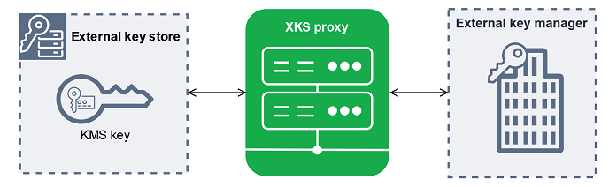
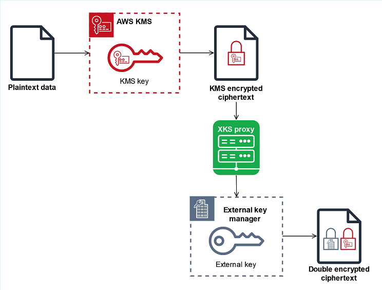
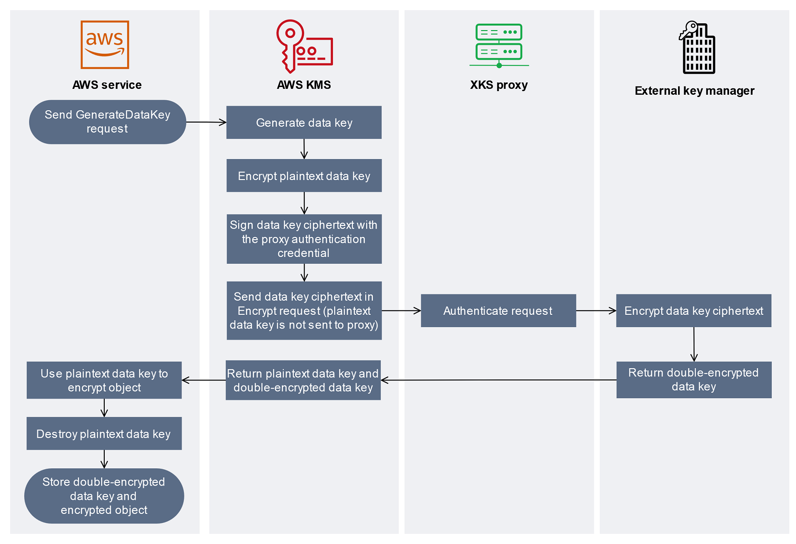

# External key stores

External key stores allow you to protect your AWS resources using cryptographic keys
outside of AWS. This advanced feature is designed for regulated workloads that you must
protect with encryption keys stored in an external key management system that you control.
External key stores support the [AWS digital sovereignty pledge](https://aws.amazon.com/blogs/security/aws-digital-sovereignty-pledge-control-without-compromise/ "https://aws.amazon.com/blogs/security/aws-digital-sovereignty-pledge-control-without-compromise/") to give you sovereign control over your data
in AWS, including the ability to encrypt with key material that you own and control
outside of AWS.

An _external key store_ is a [custom key store](key-store-overview.md#custom-key-store-overview "key-store-overview.md#custom-key-store-overview") backed by an _external key manager_ that you own and manage outside of AWS.
Your external key manager can be a physical or virtual hardware security modules (HSMs), or
any hardware-based or software-based system capable of generating and using cryptographic
keys. Encryption and decryption operations that use a KMS key in an external key store are
performed by your external key manager using your cryptographic key material, a feature
known as _hold your own keys_ (HYOKs).

AWS KMS never interacts directly with your external key manager, and cannot create, view,
manage, or delete your keys. Instead, AWS KMS interacts only with [external key store proxy](#concept-xks-proxy "#concept-xks-proxy") (XKS proxy) software that
you provide. Your external key store proxy mediates all communication between AWS KMS and your
external key manager. It transmits all requests from AWS KMS to your external key manager, and
transmits responses from your external key manager back to AWS KMS. The external key store
proxy also translates generic requests from AWS KMS into a vendor-specific format that your
external key manager can understand, allowing you to use external key stores with key
managers from a variety of vendors.

You can use KMS keys in an external key store for client-side encryption, including with
the [AWS Encryption SDK](../../../encryption-sdk/latest/developer-guide.md "../../../encryption-sdk/latest/developer-guide.md"). But external key stores are an
important resource for server-side encryption, allowing you to protect your AWS resources
in multiple AWS services with your cryptographic keys outside of AWS. AWS services
that support [customer managed keys](concepts.md#customer-mgn-key "concepts.md#customer-mgn-key") for symmetric
encryption also support KMS keys in an external key store. For service support details,
see [AWS Service
Integration](https://aws.amazon.com/kms/features/#AWS_service_integration "https://aws.amazon.com/kms/features/#AWS_service_integration").

External key stores allow you to use AWS KMS for regulated workloads where encryption keys
must be stored and used outside of AWS. But they are a major departure from the standard
shared responsibility model, and require additional operational burdens. The greater risk to
availability and latency will, for most customers, exceed the perceived security benefits of
external key stores.

External key stores let you control the root of trust. Data encrypted under KMS keys in
your external key store can be decrypted only by using the external key manager that you
control. If you temporarily revoke access to your external key manager, such as by
disconnecting the external key store or disconnecting your external key manager from the
external key store proxy, AWS loses all access to your cryptographic keys until you
restore it. During that interval, ciphertext encrypted under your KMS keys can't be
decrypted. If you permanently revoke access to your external key manager, all ciphertext
encrypted under a KMS key in your external key store becomes unrecoverable. The only
exceptions are AWS services that briefly cache the [data
keys](data-keys.md "data-keys.md") protected by your KMS keys. These data keys continue to work until you
deactivate the resource or the cache expires. For details, see [How unusable KMS keys affect data keys](unusable-kms-keys.md "unusable-kms-keys.md").

External key stores unblock the few use cases for regulated workloads where
encryption keys must remain solely under your control and inaccessible to AWS. But
this is a major change in the way you operate cloud-based infrastructure and a
significant shift in the shared responsibility model. For most workloads, the
additional operational burden and greater risks to availability and performance will
exceed the perceived security benefits of external key stores.

**Do I need an external key store?**

For most users, the default AWS KMS key store, which is protected by [FIPS 140-3 Security Level 3 validated hardware security modules](https://csrc.nist.gov/projects/cryptographic-module-validation-program/certificate/4884 "https://csrc.nist.gov/projects/cryptographic-module-validation-program/certificate/4884"), fulfills their security, control,
and regulatory requirements. External key store users incur substantial cost, maintenance,
and troubleshooting burden, and risks to latency, availability and reliability.

When considering an external key store, take some time to understand the alternatives,
including an [AWS CloudHSM key store](keystore-cloudhsm.md "keystore-cloudhsm.md") backed by an AWS CloudHSM
cluster that you own and manage, and KMS keys with [imported
key material](importing-keys.md "importing-keys.md") that you generate in your own HSMs and can delete from KMS keys on
demand. In particular, importing key material with a very brief expiration interval might
provide a similar level of control without the performance or availability risks.

An external key store might be the right solution for your organization if you have the
following requirements:

- You are required to use cryptographic keys in your on-premises key manager or a
  key manager outside of AWS that you control.
- You must demonstrate that your cryptographic keys are retained solely
  under your control outside of the cloud.
- You must encrypt and decrypt using cryptographic keys with independent
  authorization.
- Key material must be subject to a secondary, independent audit path.
  If you choose an external key store, limit its use to workloads that require protection
  with cryptographic keys outside of AWS.

**Shared responsibility model**

Standard KMS keys use key material that is generated and used in HSMs that AWS KMS owns
and manages. You establish the access control policies on your KMS keys and configure
AWS services that use KMS keys to protect your resources. AWS KMS assumes responsibility
for the security, availability, latency, and durability of the key material in your
KMS keys.

KMS keys in external key stores rely on key material and operations in your external key
manager. As such, the balance of responsibility shifts in your direction. You are
responsible for the security, reliability, durability, and performance of the cryptographic
keys in your external key manager. AWS KMS is responsible for responding promptly to requests
and communicating with your external key store proxy, and for maintaining our security
standards. To ensure that every external key store ciphertext at least as strong than
standard AWS KMS ciphertext, AWS KMS first encrypts all plaintext with AWS KMS key material
specific to your KMS key, and then sends it to your external key manager for encryption
with your external key, a procedure known as [double encryption](#concept-double-encryption "#concept-double-encryption"). As a result, neither
AWS KMS nor the owner of the external key material can decrypt double-encrypted ciphertext
alone.

You are responsible for maintaining an external key manager that meet your regulatory and
performance standards, for supplying and maintaining an external key store proxy that
conforms to the [AWS KMS External Key Store Proxy API Specification](https://github.com/aws/aws-kms-xksproxy-api-spec/ "https://github.com/aws/aws-kms-xksproxy-api-spec/"), and for
ensuring the availability and durability of your key material. You must also create,
configure, and maintain an external key store. When errors arise that are caused by
components that you maintain, you must be prepared to identify and resolve the errors so
that AWS services can access your resources without undue disruption. AWS KMS provides [troubleshooting guidance](xks-troubleshooting.md "xks-troubleshooting.md") to help you determine the
cause of problems and the most likely resolutions.

Review the [Amazon CloudWatch metrics and dimensions](monitoring-cloudwatch.md#kms-metrics "monitoring-cloudwatch.md#kms-metrics") that AWS KMS
records for external key stores. AWS KMS strongly recommends that you create CloudWatch alarms to
monitor your external key store so you can detect the early signs of performance and
operational problems before they occur.

**What is changing?**

External key stores support only symmetric encryption KMS keys. Within AWS KMS, you use
and manage KMS keys in an external key store in much the same way that you manage other
[customer managed keys](concepts.md#customer-mgn-key "concepts.md#customer-mgn-key"), including [setting access control policies](authorize-xks-key-store.md "authorize-xks-key-store.md") and [monitoring key use](monitoring-overview.md "monitoring-overview.md"). You use the same APIs with the
same parameters to request a cryptographic operation with a KMS key in an external key
store that you use for any KMS key. Pricing is also the same as for standard KMS keys.
For details, see [KMS keys in external key
stores](keystore-external-key-manage.md "keystore-external-key-manage.md") and [AWS Key Management Service
Pricing](https://aws.amazon.com/kms/pricing/ "https://aws.amazon.com/kms/pricing/").

However, with external key stores the following principles change:

- You are responsible for the availability, durability, and latency of key
  operations.
- You are responsible for all costs for developing, purchasing, operating, and
  licensing your external key manager system.
- You can implement [independent
  authorization](authorize-xks-key-store.md#xks-proxy-authorization "authorize-xks-key-store.md#xks-proxy-authorization") of all requests from AWS KMS to your external key store
  proxy.
- You can monitor, audit, and log all operations of your external key store proxy,
  and all operations of your external key manager related to AWS KMS requests.
  **Where do I start?**

To create and manage an external key store, you need to [choose your external key store proxy connectivity option](choose-xks-connectivity.md "choose-xks-connectivity.md"), [assemble the prerequisites](create-xks-keystore.md#xks-requirements "create-xks-keystore.md#xks-requirements"), and [create and configure your external key store](create-xks-keystore.md "create-xks-keystore.md").

**Quotas**

AWS KMS allows up to [10 custom key stores](resource-limits.md "resource-limits.md") in each
AWS account and Region, including both [AWS CloudHSM key stores](keystore-cloudhsm.md "keystore-cloudhsm.md") and [external
key stores](keystore-external.md "keystore-external.md"), regardless of their connection state. In addition, there are AWS KMS
request quotas on the [use of KMS keys in an external key
store](requests-per-second.md#rps-key-stores "requests-per-second.md#rps-key-stores").

If you choose [VPC proxy connectivity](#concept-xks-connectivity "#concept-xks-connectivity") for
your external key store proxy, there might also be quotas on the required components, such
as VPCs, subnets, and network load balancers. For information about these quotas, use the
[Service Quotas
console](https://console.aws.amazon.com/servicequotas/home "https://console.aws.amazon.com/servicequotas/home").

**Regions**

To minimize network latency, create your external key store components in the AWS Region
closest to your [external key manager](#concept-ekm "#concept-ekm"). If possible, choose
a Region with a network round-trip time (RTT) of 35 milliseconds or less.

External key stores are supported in all AWS Regions in which AWS KMS is supported except
for China (Beijing) and China (Ningxia).

**Unsupported features**

AWS KMS does not support the following features in custom key stores.

- [Asymmetric KMS keys](symmetric-asymmetric.md "symmetric-asymmetric.md")
- [HMAC KMS keys](hmac.md "hmac.md")
- [KMS keys with imported key material](importing-keys.md "importing-keys.md")
- [Automatic key rotation](rotate-keys.md "rotate-keys.md")
- [Multi-Region keys](multi-region-keys-overview.md "multi-region-keys-overview.md")
  **Learn more**:

- [Announcing AWS KMS
  External Key Store](https://aws.amazon.com/blogs/aws/announcing-aws-kms-external-key-store-xks/ "https://aws.amazon.com/blogs/aws/announcing-aws-kms-external-key-store-xks/") in the _AWS News
  Blog_.

## External key store concepts

Learn the basic terms and concepts used in external key stores.

### External key store

An _external key store_ is an AWS KMS [custom key store](key-store-overview.md#custom-key-store-overview "key-store-overview.md#custom-key-store-overview") backed by an external
key manager outside of AWS that you own and manage. Each KMS key in an external key
store is associated with an [external key](#concept-external-key "#concept-external-key") in
your external key manager. When you use a KMS key in an external key store for
encryption or decryption, the operation is performed in your external key manager using
your external key, an arrangement known as _Hold your Own
Keys_ (HYOK). This feature is designed for organizations that are required
to maintain their cryptographic keys in their own external key manager.

External key stores ensure that the cryptographic keys and operations that protect
your AWS resources remain in your external key manager under your control. AWS KMS sends
requests to your external key manager to encrypt and decrypt data, but AWS KMS cannot
create, delete, or manage any external keys. All requests from AWS KMS to your external
key manager are mediated by an [external key store
proxy](#concept-xks-proxy "#concept-xks-proxy") software component that you supply, own, and manage.

AWS services that support AWS KMS [customer managed
keys](concepts.md "concepts.md") can use the KMS keys in your external key store to protect your data.
As a result, your data is ultimately protected by your keys using your encryption
operations in your external key manager.

The KMS keys in an external key store have fundamentally different trust models,
[shared responsibility arrangements](#xks-shared-responsibility "#xks-shared-responsibility"),
and performance expectations than standard KMS keys. With external key stores, you are
responsible for the security and integrity of the key material and the cryptographic
operations. The availability and latency of KMS keys in an external key store are
affected by the hardware, software, networking components, and the distance between
AWS KMS and your external key manager. You are also likely to incur additional costs for
your external key manager and for the networking and load balancing infrastructure you
need for your external key manager to communicate with AWS KMS

You can use your external key store as part of your broader data protection strategy.
For each AWS resource that you protect, you can decide which require a KMS key in an
external key store and which can be protected by a standard KMS key. This gives you
the flexibility to chose KMS keys for specific data classifications, applications, or
projects.

### External key manager

An _external key manager_ is a component outside of
AWS that can generate 256-bit AES symmetric keys and perform symmetric encryption and
decryption. The external key manager for an external key store can be a physical
hardware security module (HSM), a virtual HSM, or a software key manager with or without
an HSM component. It can be located anywhere outside of AWS, including on your
premises, in a local or remote data center, or in any cloud. Your external key store can
be backed by a single external key manager or multiple related key manager instances
that share cryptographic keys, such as an HSM cluster. External key stores are designed
to support a variety of external managers from different vendors. For details about connecting to your external key manager, see [Choose an external key store proxy connectivity
option](choose-xks-connectivity.md "choose-xks-connectivity.md").

### External key

Each KMS key in an external key store is associated with a cryptographic key in your
[external key manager](#concept-ekm "#concept-ekm") known as an _external key_. When you encrypt or decrypt with a KMS key
in your external key store, the cryptographic operation is performed in your [external key manager](#concept-ekm "#concept-ekm") using your external key.

###### Warning

The external key is essential to the operation of the KMS key. If the external key
is lost or deleted, ciphertext encrypted under the associated KMS key is
unrecoverable.

For external key stores, an external key must be a 256-bit AES key that is enabled and
can perform encryption and decryption. For detailed external key requirements, see [Requirements for a KMS key in an external key
store](create-xks-keys.md#xks-key-requirements "create-xks-keys.md#xks-key-requirements").

AWS KMS cannot create, delete, or manage any external keys. Your cryptographic key
material never leaves your external key manager.When you create a KMS key in an
external key store, you provide the ID of an external key (`XksKeyId`). You
cannot change the external key ID associated with a KMS key, although your external
key manager can rotate the key material associated with the external key ID.

In addition to your external key, a KMS key in an external key store also has AWS KMS
key material. Data protected by the KMS key is encrypted first by AWS KMS using the
AWS KMS key material, and then by your external key manager using your external key. This
[double encryption](#concept-double-encryption "#concept-double-encryption") process ensures
that ciphertext protected by your KMS key is always at least as strong as ciphertext
protected only by AWS KMS.

Many cryptographic keys have different types of identifiers. When creating a KMS key
in an external key store, provide the ID of the external key that the [external key store proxy](#concept-xks-proxy "#concept-xks-proxy") uses to refer to the
external key. If you use the wrong identifier, your attempt to create a KMS key in
your external key store fails.

### External key store proxy

The _external key store proxy_ ("XKS proxy") is a
customer-owned and customer-managed software application that mediates all communication
between AWS KMS and your external key manager. It also translates generic AWS KMS requests
into a format that your vendor-specific external key manager understand. An external key
store proxy is required for an external key store. Each external key store is associated
with one external key store proxy.

AWS KMS cannot create, delete, or manage any external keys. Your cryptographic key
material never leaves your external key manager. All communication between AWS KMS and
your external key manager is mediated by your external key store proxy. AWS KMS sends
requests to the external key store proxy and receives responses from the external key
store proxy. The external key store proxy is responsible for transmitting requests from
AWS KMS to your external key manager and transmitting responses from your external key
manager back to AWS KMS

You own and manage the external key store proxy for your external key store, and you
are responsible for its maintenance and operation. You can develop your external key
store proxy based on the open-source [external key
store proxy API specification](https://github.com/aws/aws-kms-xksproxy-api-spec/ "https://github.com/aws/aws-kms-xksproxy-api-spec/") that AWS KMS publishes or purchase a proxy
application from a vendor. Your external key store proxy might be included in your
external key manager. To support proxy development, AWS KMS also provides a sample
external key store proxy ([aws-kms-xks-proxy](https://github.com/aws-samples/aws-kms-xks-proxy "https://github.com/aws-samples/aws-kms-xks-proxy")) and a test client ([xks-kms-xksproxy-test-client](https://github.com/aws-samples/aws-kms-xksproxy-test-client "https://github.com/aws-samples/aws-kms-xksproxy-test-client")) that
verifies that your external key store proxy conforms to the specification.

To authenticate to AWS KMS, the proxy uses server-side TLS certificates. To authenticate
to your proxy, AWS KMS signs all requests to your external key store proxy with a SigV4
[proxy authentication credential](#concept-xks-credential "#concept-xks-credential").
Optionally, your proxy can enable mutual TLS (mTLS) for additional assurance that it
only accepts requests from AWS KMS.

Your external key store proxy must support HTTP/1.1 or later and TLS 1.2 or later with
at least one of the following cipher suites:

- TLS_AES_256_GCM_SHA384 (TLS 1.3)
- TLS_CHACHA20_POLY1305_SHA256 (TLS 1.3)

###### Note

The AWS GovCloud (US) Region does not support TLS_CHACHA20_POLY1305_SHA256.

- TLS_ECDHE_RSA_WITH_AES_256_GCM_SHA384 (TLS 1.2)
- TLS_ECDHE_ECDSA_WITH_AES_256_GCM_SHA384 (TLS 1.2)

To create and use the KMS keys in your external key store, you must first [connect the external key store](xks-connect-disconnect.md "xks-connect-disconnect.md") to its
external key store proxy. You can also disconnect your external key store from its proxy
on demand. When you do, all KMS keys in the external key store become [unavailable](key-state.md "key-state.md"); they cannot be used in any cryptographic
operation.

### External key store proxy connectivity

The external key store proxy connectivity ("XKS proxy connectivity") describes the
method that AWS KMS uses to communicate with your external key store proxy.

You specify your proxy connectivity option when you create your external key store,
and it becomes a property of the external key store. You can change your proxy
connectivity option by updating the custom key store property, but you must be certain
that your external key store proxy can still access the same external keys.

AWS KMS supports the following connectivity options:

- [Public endpoint
  connectivity](choose-xks-connectivity.md#xks-connectivity-public-endpoint "choose-xks-connectivity.md#xks-connectivity-public-endpoint") — AWS KMS sends requests for your external key
  store proxy over the internet to a public endpoint that you control. This option
  is simple to create and maintain, but it might not fulfill the security
  requirements for every installation.
- [VPC endpoint service connectivity](choose-xks-connectivity.md#xks-vpc-connectivity "choose-xks-connectivity.md#xks-vpc-connectivity")
  — AWS KMS sends requests to a Amazon Virtual Private Cloud (Amazon VPC) endpoint service that you
  create and maintain. You can host your external key store proxy inside your
  Amazon VPC, or host your external key store proxy outside of AWS and use the Amazon VPC
  only for communication.

For details about the external key store proxy connectivity options, see [Choose an external key store proxy connectivity
option](choose-xks-connectivity.md "choose-xks-connectivity.md").

### External key store proxy authentication

credential

To authenticate to your external key store proxy, AWS KMS signs all requests to your
external key store proxy with a [Signature V4 (SigV4)](../../../general/latest/gr/signature-version-4.md "../../../general/latest/gr/signature-version-4.md") authentication credential. You establish and maintain
the authentication credential on your proxy, then provide this credential to AWS KMS when
you create your external store.

###### Note

The SigV4 credential that AWS KMS uses to sign requests to the XKS proxy is unrelated to any SigV4 credentials associated with AWS Identity and Access Management principals in your AWS accounts. Do not reuse any IAM SigV4 credentials for your external key store proxy.

Each proxy authentication credential has two parts. You must provide both parts when
creating an external key store or updating the authentication credential for your
external key store.

- Access key ID: Identifies the secret access key. You can provide this ID in
  plaintext.
- Secret access key: The secret part of the credential. AWS KMS encrypts the
  secret access key in the credential before storing it.

You can [edit the credential setting](update-xks-keystore.md "update-xks-keystore.md") at any
time, such as when you enter incorrect values, when you change your credential on the
proxy, or when your proxy rotates the credential. For technical details about AWS KMS
authentication to the external key store proxy, see [Authentication](https://github.com/aws/aws-kms-xksproxy-api-spec/blob/main/xks_proxy_api_spec.md#authentication "https://github.com/aws/aws-kms-xksproxy-api-spec/blob/main/xks_proxy_api_spec.md#authentication") in the AWS KMS External Key Store Proxy API Specification.

To allow you to rotate your credential without disrupting the AWS services that use
KMS keys in your external key store, we recommend that the external key store proxy
support at least two valid authentication credentials for AWS KMS. This ensures that your
previous credential continues to work while you provide your new credential to
AWS KMS.

To help you track the age of your proxy authentication credential, AWS KMS defines an
Amazon CloudWatch metric, [XksProxyCredentialAge](monitoring-cloudwatch.md#metric-xks-proxy-credential-age "monitoring-cloudwatch.md#metric-xks-proxy-credential-age"). You can use this metric to create a CloudWatch alarm that
notifies you when the age of your credential reaches a threshold you establish.

To provide additional assurance that your external key store proxy responds only to
AWS KMS, some external key proxies support mutual Transport Layer Security (mTLS). For
details, see [mTLS authentication (optional)](authorize-xks-key-store.md#xks-mtls "authorize-xks-key-store.md#xks-mtls").

### Proxy APIs

To support an AWS KMS external key store, an [external
key store proxy](#concept-xks-proxy "#concept-xks-proxy") must implement the required proxy APIs as described in the
[AWS KMS External Key Store Proxy API Specification](https://github.com/aws/aws-kms-xksproxy-api-spec/ "https://github.com/aws/aws-kms-xksproxy-api-spec/"). These proxy API requests
are the only requests that AWS KMS sends to the proxy. Although you never send these
requests directly, knowing about them might help you fix any issues that might arise
with your external key store or its proxy. For example, AWS KMS includes information about
the latency and success rates of these API calls in its [Amazon CloudWatch metrics](monitoring-cloudwatch.md "monitoring-cloudwatch.md") for external key stores. For
details, see [Monitor external key stores](xks-monitoring.md "xks-monitoring.md").

The following table lists and describes each of the proxy APIs. It also includes the
AWS KMS operations that trigger a call to the proxy API and any AWS KMS operation exceptions
related to the proxy API.

| Proxy API       | Description                                                                                                                                                                                                                                                                                                       | Related AWS KMS operations                                                                                                                                                                                                                                                                                                                                                                                                                                                                                                                                                                                                                                                                                                                                                             |
| --------------- | ----------------------------------------------------------------------------------------------------------------------------------------------------------------------------------------------------------------------------------------------------------------------------------------------------------------- | -------------------------------------------------------------------------------------------------------------------------------------------------------------------------------------------------------------------------------------------------------------------------------------------------------------------------------------------------------------------------------------------------------------------------------------------------------------------------------------------------------------------------------------------------------------------------------------------------------------------------------------------------------------------------------------------------------------------------------------------------------------------------------------- | ---------------------------------------------------------------------------------------------------------------------------------------------------------------------------------------------------------------------------------------------------------------------------------------------------------------------------------------------------------------------------------------------------------------------------------------------------------------------------------------------------------------------------------------------------------------------------------------------------------------------------------------------------------------------------------------------------------------------------------------------------------------------------------------------------------------------------------------------------------------------------------------------------------------------------------------------------------------------------------------------------------------------------------------------------------------------------------------------------------------------------------------------------------------------------------------------------------------------------------------------------------------------------------------------------------------------------------------------------------------------------------------------------------------------------------------------------------------------------------------------------------------------------------------------------------------------------------------------------------------------------------------------------------------------------------------------------------------------------------------------------------------------------------------------------------------------------------------------------------------------------------------------------------------------------------------------------------------------------------------------------------------------------------------------------------------------------------------------------------------------------------------------------------------------------------------------------------------------------------------------------------------------------------------------------------------------------------------------------------------------------------------------------------------------------------------------------------------------------------------------------------------------------------------------------------------------------------------------------------------------------------------------------------------------------------------------------------------------------------------------------------------------------------------------------------------------------------------------------------------------------------------------------------------------------------------------------------------------------------------------------------------------------------------------------------------------------------------------------------------------------------------------------------------------------------------------------------------------------------------------------------------------------------------------------------------------------------------------------------------------------------------------------------------------------------------------------------------------------------------------------------------------------------------------------------------------------------------------------------------------------------------------------------------------------------------------------------------------------------------------------------------------------------------------------------------------------------------------------------------------------------------------------------------------------------------------------------------------------------------------------------------------------------------------------------------------------------------------------------------------------------------------------------------------------------------------------------------------------------------------------------------------------------------------------------------------------------------------------------------------------------------------------------------------------------------------------------------------------------------------------------------------------------------------------------------------------------------------------------------------------------------------------------------------------------------------------------------------------------------------------------------------------------------------------------------------------------------------------------------------------------------------------------------------------------------------------------------------------------------------------------------------------------------------------------------------------------------------------------------------------------------------------------------------------------------------------------------------------------------------------------------------------------------------------------------------------------------------------------------------------------------------------------------------------------------------------------------------------------------------------------------------------------------------------------------------------------------------------------------------------------------------------------------------------------------------------------------------------------------------------------------------------------------------------------------------------------------------------------------------------------------------------------------------------------------------------------------------------------------------------------------------------------------------------------------------------------------------------------------------------------------------------------------------------------------------------------------------------------------------------------------------------------------------------------------------------------------------------------------------------------------------------------------------------------------------------------------------------------------------------------------------------------------------------------------------------------------------------------------------------------------------------------------------------------------------------------------------- |
| Decrypt         | AWS KMS sends the ciphertext to be decrypted, and the ID of the [external key](#concept-external-key "#concept-external-key") to use. The required encryption algorithm is AES_GCM.                                                                                                                               | [Decrypt](../APIReference/API_Decrypt.md "../APIReference/API_Decrypt.md"), [ReEncrypt](../APIReference/API_ReEncrypt.md "../APIReference/API_ReEncrypt.md")                                                                                                                                                                                                                                                                                                                                                                                                                                                                                                                                                                                                                           |
| Encrypt         | AWS KMS sends data to be encrypted, and the ID of the [external key](#concept-external-key "#concept-external-key") to use. The required encryption algorithm is AES_GCM.                                                                                                                                         | [Encrypt](../APIReference/API_Encrypt.md "../APIReference/API_Encrypt.md"), [GenerateDataKey](../APIReference/API_GenerateDataKey.md "../APIReference/API_GenerateDataKey.md"), [GenerateDataKeyWithoutPlaintext](../APIReference/API_GenerateDataKeyWithoutPlaintext.md "../APIReference/API_GenerateDataKeyWithoutPlaintext.md"), [ReEncrypt](../APIReference/API_ReEncrypt.md "../APIReference/API_ReEncrypt.md")                                                                                                                                                                                                                                                                                                                                                                   |
| GetHealthStatus | AWS KMS requests information about the status of the proxy and your external key manager. The status of each external key manager can be one of the following.  • `Active`: Healthy; can serve traffic  • `Degraded`: Unhealthy, but can serve traffic  • `Unavailable`: Unhealthy; cannot serve traffic | [CreateCustomKeyStore](../APIReference/API_CreateCustomKeyStore.md "../APIReference/API_CreateCustomKeyStore.md") (for [public endpoint connectivity](choose-xks-connectivity.md#xks-connectivity-public-endpoint "choose-xks-connectivity.md#xks-connectivity-public-endpoint")), [ConnectCustomKeyStore](../APIReference/API_ConnectCustomKeyStore.md "../APIReference/API_ConnectCustomKeyStore.md") (for [VPC endpoint service connectivity](choose-xks-connectivity.md#xks-vpc-connectivity "choose-xks-connectivity.md#xks-vpc-connectivity"))If all external key manager instances are `Unavailable`, attempts to create or connect the key store fail with [XksProxyUriUnreachableException](xks-troubleshooting.md#fix-xks-latency "xks-troubleshooting.md#fix-xks-latency"). |
| GetKeyMetadata  | AWS KMS requests information about the [external key](#concept-external-key "#concept-external-key") associated with a KMS key in your external key store. The response includes the key spec (`AES_256`), the key usage (`[ENCRYPT, DECRYPT]`), and the whether the external key is `ENABLED` or `DISABLED`.     | [CreateKey](../APIReference/API_CreateKey.md "../APIReference/API_CreateKey.md")If the key spec is not `AES_256`, or the key usage is not `[ENCRYPT, DECRYPT]`, or the status is `DISABLED`, the `CreateKey` operation fails with `XksKeyInvalidConfigurationException`.                                                                                                                                                                                                                                                                                                                                                                                                                                                                                                               | ### Double encryption Data encrypted by a KMS key in an external key store is encrypted twice. First, AWS KMS encrypts the data with AWS KMS key material specific to the KMS key. Then the AWS KMS-encrypted ciphertext is encrypted by your [external key manager](#concept-ekm "#concept-ekm") using your [external key](#concept-external-key "#concept-external-key"). This process is known as _double encryption_. Double encryption ensures that data encrypted by a KMS key in an external key store is at least as strong as ciphertext encrypted by a standard KMS key. It also protects your plaintext in transit from AWS KMS to your external key store proxy. With double encryption, you retain full control of your ciphertexts. If you permanently revoke AWS access to your external key through your external proxy, any ciphertext remaining in AWS is effectively crypto-shredded.  To enable double encryption, each KMS key in an external key store has _two_ cryptographic backing keys:  • An AWS KMS key material unique to the KMS key. This key material is generated and only used in AWS KMS [FIPS 140-3 Security Level 3](https://csrc.nist.gov/projects/cryptographic-module-validation-program/certificate/4884 "https://csrc.nist.gov/projects/cryptographic-module-validation-program/certificate/4884") certified hardware security modules (HSMs).  • An [external key](#concept-external-key "#concept-external-key") in your external key manager. Double encryption has the following effects:  • AWS KMS cannot decrypt any ciphertext encrypted by a KMS key in an external key store without access to your external keys via your external key store proxy.  • You cannot decrypt any ciphertext encrypted by a KMS key in an external key store outside of AWS, even if you have its external key material.  • You cannot recreate a KMS key that was deleted from an external key store, even if you have its external key material. Each KMS key has unique metadata that it includes in the symmetric ciphertext. A new KMS key would not be able to decrypt ciphertext encrypted by the original key, even if it used the same external key material. For an example of double encryption in practice, see [How external key stores work](#xks-how-it-works "#xks-how-it-works"). ## How external key stores work Your [external key store](#concept-external-key-store "#concept-external-key-store"), [external key store proxy,](#concept-xks-proxy "#concept-xks-proxy") and [external key manager](#concept-ekm "#concept-ekm") work together to protect your AWS resources. The following procedure depicts the encryption workflow of a typical AWS service that encrypts each object under a unique data key protected by a KMS key. In this case, you've chosen a KMS key in an external key store to protect the object. The example shows how AWS KMS uses [double encryption](#concept-double-encryption "#concept-double-encryption") to protect the data key in transit and ensure that ciphertext generated by a KMS key in an external key store is always at least as strong as ciphertext encrypted by a standard symmetric KMS key with key material in AWS KMS. The encryption methods used by each actual AWS service that integrates with AWS KMS vary. For details, see the "Data protection" topic in the Security chapter of the AWS service documentation.  1. You add a new object to your AWS service resource. To encrypt the object, the AWS service sends a [GenerateDataKey](../APIReference/API_GenerateDataKey.md "../APIReference/API_GenerateDataKey.md") request to AWS KMS using a KMS key in your external key store. 2. AWS KMS generates a 256-bit symmetric [data key](data-keys.md "data-keys.md") and prepares to send a copy of the plaintext data key to your external key manager via your external key store proxy. AWS KMS begins the [double encryption](#concept-double-encryption "#concept-double-encryption") process by encrypting the plaintext data key with the [AWS KMS key material](#concept-double-encryption "#concept-double-encryption") associated with the KMS key in the external key store. 3. AWS KMS sends an [encrypt](#concept-proxy-apis "#concept-proxy-apis") request to the external key store proxy associated with the external key store. The request includes the data key ciphertext to be encrypted and the ID of the [external key](#concept-external-key "#concept-external-key") that is associated with the KMS key. AWS KMS signs the request using the [proxy authentication credential](#concept-xks-credential "#concept-xks-credential") for your external key store proxy. The plaintext copy of the data key is not sent to the external key store proxy. 4. The external key store proxy authenticates the request, and then passes the encrypt request to your external key manager. Some external key store proxies also implement an optional [authorization policy](authorize-xks-key-store.md#xks-proxy-authorization "authorize-xks-key-store.md#xks-proxy-authorization") that allows only selected principals to perform operations under specific conditions. 5. Your external key manager encrypts the data key ciphertext using the specified external key. The external key manager returns the double-encrypted data key to your external key store proxy, which returns it to AWS KMS. 6. AWS KMS returns the plaintext data key and the double-encrypted copy of that data key to the AWS service. 7. The AWS service uses the plaintext data key to encrypt the resource object, destroys the plaintext data key, and stores the encrypted data key with the encrypted object. Some AWS services might cache the plaintext data key to use for multiple objects, or to reuse while the resource is in use. For details, see [How unusable KMS keys affect data keys](unusable-kms-keys.md "unusable-kms-keys.md"). To decrypt the encrypted object, the AWS service must send the encrypted data key back to AWS KMS in a [Decrypt](../APIReference/API_Decrypt.md "../APIReference/API_Decrypt.md") request. To decrypt the encrypted data key, AWS KMS must send the encrypted data key back to your external key store proxy with the ID of the external key. If the decrypt request to the external key store proxy fails for any reason, AWS KMS cannot decrypt the encrypted data key, and the AWS service cannot decrypt the encrypted object. |
